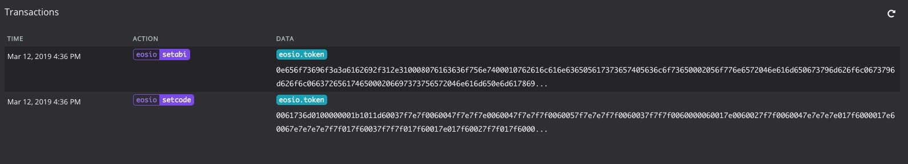

# 十一、.3 使用 EOS.js 发布 EOS 智能合约

# 使用 EOS.js 发布 EOS 智能合约

在之前的 EOS 合约开发文章，你可能学会了如何通过 EOS 系统命令**cleos set contract**的方式进行智能合约的发布与升级。

但在开发过程中，可能有的同学持续在命令容器与开发 IDE 间频繁切换，对开发效率有一定程序的影响，那是否有一种更好的方式帮助我们在一个窗口里快速发布合约呢？

那么本文将带你了解**如何通过 EOS.js 进行智能合约的发布**。

 如上图所示，在进行合约发布时，需要用到 eos 系统合约中的两个方法：setcode、setabi。而这两个方法分别会用到智能合约编译后的两个文件： *.wasm、*.abi。

**注意** ： 本文示例中使用的 eosjs 的版本为`16.0.9 `。

**首先**，需要初始化 EOS-SDK 实例。 事先准备好初始化 SDK 所必需的参数：

*   chainid
    所要发布的目标 EOS 链 chainid. 例如：正式 chainid: aca376f206b8fc25a6ed44dbdc66547c36c6c33e3a119ffbeaef943642f0e906; jungle 测试网 chainid: e70aaab8997e1dfce58fbfac80cbbb8fecec7b99cf982a9444273cbc64c41473 等等
*   httpEndpoint
    EOS 链环境 http 接口地址。 例如: [`localhost:8888`](http://localhost:8888)
*   keyProvider
    合约帐户私钥，主要用于交易签名。

```js
//config.js 
const Eos = require('eosjs')

const eos = Eos({
    chainId: "cf057bbfb72640471fd910bcb67639c22df9f92470936cddc1ade0e2f2e7dc4f",
    httpEndpoint: "http://localhost:8888",
    keyProvider: "5K7mtrinTFrVTduSxizUc5hjXJEtTjVTsqSHeBHes1Viep86FP5",
    broadcast: true,
    sign: true
})

module.exports = {
    eos,
}

//https://gist.github.com/hackdapp/2522411b98b1acdadc0d842f712ca6e0 
```

下一步，需要代码实现对合约文件夹中的.wasm 及.abi 文件的读取；

```js
function getDeployableFilesFromDir(dir) {
    const dirCont = fs.readdirSync(dir)
    const wasmFileName = dirCont.find(filePath => filePath.match(/.*\.(wasm)$/gi))
    const abiFileName = dirCont.find(filePath => filePath.match(/.*\.(abi)$/gi))
    if (!wasmFileName) throw new Error(`Cannot find a ".wasm file" in ${dir}`)
    if (!abiFileName) throw new Error(`Cannot find an ".abi file" in ${dir}`)
    return {
        wasmPath: path.join(dir, wasmFileName),
        abiPath: path.join(dir, abiFileName),
    }
}

//https://gist.github.com/69b29103e5cc114f4478390076d8ad39
```

然后，通过调用 eos 实例，分别执行系统合约的 setcode/setabi 方法，从而达到智能合约的发布；

```js
function deployContract({ account, contractDir }) {
  const { wasmPath, abiPath } = getDeployableFilesFromDir(contractDir)

  const wasm = fs.readFileSync(wasmPath)
  const abi = fs.readFileSync(abiPath)

  const codePromise = eos.setcode(account, 0, 0, wasm)
  const abiPromise = eos.setabi(account, JSON.parse(abi))
  return Promise.all([codePromise, abiPromise])
}

//https://gist.github.com/69b29103e5cc114f4478390076d8ad39
```

最后，调用 deployContract 方法，测试合约发布功能。

```js
deployContract({ account: "eosio.token", contractDir: "./contract" }).then((result) => {
    console.log(`Deployment successful`, JSON.stringify(result, null , 4))
})
.catch(err => {
    console.error(`Deployment failed`, err)
})

//https://gist.github.com/69b29103e5cc114f4478390076d8ad39
```

* * *

**小结**

通过本文我们学习了如何通过 eos 实例的 setcode/setabi 方法将合约编译文件快速发布到指定链环境。

另外，如果为了提高发布合约效率，我们还可以在 package.json 中定义发布合约的运行脚本，并配合 IDE 工具中的快捷键，便可达到开发效率的进一步提升。

* * *

> 在教程中如出现错误🐛或不易理解的知识点，欢迎加我微信指正! Name: zhangliang | WeChat: rushking2009 | Mail: zhangliang@cldy.org


注： 有想了解**愿码全思维 IT 工程师加速器**的朋友，可以扫码加群咨询。

* * *

### **changelog**

2019-03-12 zhangliang

*   初次发稿