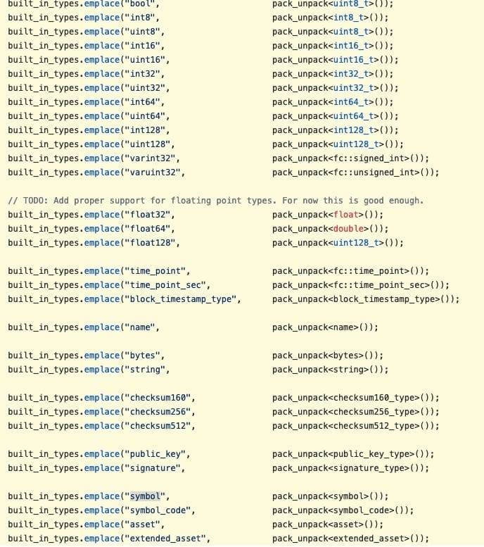

# 十一、.12 剖析 EOS 合约 ABi 文件结构

相信不少开发者朋友在进行 EOS 合约开发时，都看到发布智能合约时的 ABI 文件。那 ABI 文件到底是什么东西？在 EOS 公链环境中到底发挥怎么样的作用呢以及如何解读 ABI 文件内容呢？

那么本章节将带你了解 ABI 文件与智能合约间的关系以及了解并学会 ABI 文件的编写。

**ABI**， 简称(Application Binary Interface), 是一个基于 JSON 语言的接口描述文档，用于描述 EOS 合约以及如何对合约方法进行调用。如果大家曾经接触过 websocket、avro、hession、thrift 等这类技术的化，那么是大体逻辑是相向的。比如 websocket 所提供的 wsdl 其实也是对 websocket 本身对外所提供服务的接口描述。

在 EOS 合约，ABI 文件是由开发组件 eosio.cdt 工具包中的 eosio-cpp 命令执行所生成的文件。但在实际开发时，时常会碰到一些情况无法生成 ABI 文件。因为在合约开发，我们往往会根据业务自定义一些数据结构，或者使用一些第三方方法，而 eosio.cdt 本身对所有特隆并不是支持的很完善，所以时常导致编译失败，这时就需要我们理解 ABI 是如何定义智能合约的，以便于我们定制化修改自己的合约描述。

ABI 文件结构是由什么组成的呢？让我们先看一个示例

```js
{
   "version": "eosio::abi/1.0",
   "types": [],
   "structs": [],
   "actions": [],
   "tables": [],
   "ricardian_clauses": [],
   "abi_extensions": [],
   "___comment" : ""
}
```

上面 json 示例展示了一个标准智能合约所应具备的完整属性定义。

**数据类型(type)**

在项目开发过程，有时为了便于代码的理解，我们会将一些通用数据类型或数据结构进行别名定义，用一个在业务场景中更加贴合业务的名称代替。在`types`数组中便是对这种情况的定义描述。

比如：

```js
{
   "new_type_name": "age",
   "type": "int"
}

或者

{
   "new_type_name": "name",
   "type": "string" //此处 user 为自定义数据结构
}
```

对于合约内嵌类型，是不会在此展示的。诸如： uint64_t、name、asset、symbol 等。下图展示了 EOS 合约所支持的所有内置数据类型 

* * *

**结构体(struct)** 在业务处理逻辑中，为了方便数据的传输与调用，往往我们会对针对业务数据进行建模并以结构体的形式展现。同样，它也需要在 ABI 文件中进行描述。

比如: eosio.token 合约中的 account 结构体定义

*   ABI 文件定义

    ```js
    {
        "name": "account",
        "base": "",
        "fields": [
            {
                "name": "balance",
                "type": "asset"
            }
        ]
    }
    ```

*   eosio.token.hpp 实现

    ```js
    struct account {
        asset    balance;

        uint64_t primary_key()const { 
            return balance.symbol.code().raw(); 
        }
    };
    ```

另外，需要注意的就是除了以上这种结构体定义，其实还存在一种隐性结构体，即：合约方法参数 示例：

*   eosio.token.hpp 中 transfer 方法定义

    ```js
    void transfer( name    from,
                            name    to,
                            asset   quantity,
                            string  memo );
    ```

*   eosin.token 合约中 transfer 方法在 ABI 文件中定义

    ```js
    {
        "name": "transfer",
        "base": "",
        "fields": [
            {
                "name": "from",
                "type": "name"
            },
            {
                "name": "to",
                "type": "name"
            },
            {
                "name": "quantity",
                "type": "asset"
            },
            {
                "name": "memo",
                "type": "string"
            }
        ]
    }
    ```

可以看出，隐性结构体与前面所定义显性结构体定义是并没有什么不同，只是在智能合约业务逻辑中，我们仅用到显性结构体来存储我们的业务数据进行逻辑判断。

* * *

**方法(Action)** ` Action`数组主要用于描述外部可调用的方法列表以及具体的参数列表。在智能合约中，如果需要对外公开合约方法，往往会在合约头文件中进行如下定义：

```js
[[eosio::action]]
void transfer(name from,name to, asset quantity, string memo);
```

而 ABI 的表现形式为：

```js
{
    "name": "transfer",
    "type": "transfer",
    "ricardian_contract": ""
}
```

从上述描述可以看出，在方法的类型定义关联了前面的隐性结构体类型。虽然在此处，方法名与隐性结构体类型命名一致，但实际情况并不一定非要相同。

* * *

**表定义(Table)**

关于表的 ABI 定义，相比其他几种定义要稍复杂一些。具体 JSON 定义如下

```js
{
  "name": "",
  "type": "",
  "index_type": "",
  "key_names" : [],
  "key_types" : []
}
```

JSON 中字段说明如下:

*   name
    合约初始化表时所要使用的名称
*   type
    表对应的数据结构体。也就是前面所说的显性结构体类型
*   index _type
    此类型为表主键类型
*   key _names
    索引字段列表
*   key_types
    索引字段数据类型列表。数据长度与索引字段列表长度一致。需要说明的是索引字段类型，只支持 uint64_t,uint128 _t,uint256 _t,double,long double 五种类型 示例：eosio.token 合约中的 accounts 表
*   ABI 表定义

    ```js
    {
        "name": "accounts",
        "type": "account",
        "index_type": "i64",
        "key_names": ["primary_key"],
        "key_types": ["uint64"]
    }
    ```

*   表合约代码

    ```js
    struct [[eosio::table]] account {
        asset    balance;

        uint64_t primary_key()const { return balance.symbol.code().raw(); }
    };
    ```

    从表合约代码可以看来，只需要在数据结构体代码中添加 eosio-table 标签就可以完成对表的定义操作。

之所以提供多索引的实现，主要还是为了应对业务场景中不同维度的数据查询，而且支持按升序或降序的遍历方式处理业务。

* * *

**ricardian 条款(ricardian_clauses)** 该数组主要用于定义一种基于文本的合约宪法。通过其与智能合约的整合，来解决一些无法通过程序来判定的情况。

示例如下：

```js
"ricardian_clauses": [{
      "id": "Warranty",
      "body": "WARRANTY. The invoker of the contract action shall uphold its Obligations under this Contract in a timely and workmanlike manner, using knowledge and recommendations for performing the services which meet generally acceptable standards set forth by EOS.IO Blockchain Block Producers.\n\n"
    },{
      "id": "Default",
      "body": "DEFAULT. The occurrence of any of the following shall constitute a material default under this Contract: \n\n"
    },{
      "id": "Remedies",
      "body": "REMEDIES. In addition to any and all other rights a party may have available according to law, if a party defaults by failing to substantially perform any provision, term or condition of this Contract, the other party may terminate the Contract by providing written notice to the defaulting party. This notice shall describe with sufficient detail the nature of the default. The party receiving such notice shall promptly be removed from being a Block Producer and this Contract shall be automatically terminated. \n  \n"
    }
  ]
```

我们可以针对智能合约或者具体的合约方法，附加上对应的文本合约描述。比如针对方法的文本合约定义:

*   ABI 定义

    ```js
    "actions": [{
        "name": "hi",
        "type": "hi",
        "ricardian_contract": "# CONTRACT FOR hello::hi## ACTION NAME: hi\n### Parameters### Parameters\nInput parameters:Input parameters:\n\n* `user` (string to include in the output)* `user` (string to include in the output)\n\nImplied parameters: Implied parameters: \n\n* `account_name` (name of the party invoking and signing the contract)* `account_name` (name of the party invoking and signing the contract)\n\n### Intent### Intent\nINTENT. The intention of the author and the invoker of this contract is to print output. It shall have no other effect.INTENT. The intention of the author and the invoker of this contract is to print output. It shall have no other effect.\n\n### Term### Term\nTERM. This Contract expires at the conclusion of code execution.TERM. This Contract expires at the conclusion of code execution.\n"
    }]
    ```

*   代码及文件定义（hello.hi_rc.md）

    ```js
    # CONTRACT FOR hello::hi

    ## ACTION NAME: hi

    ### Parameters
    Input parameters:

    * `user` (string to include in the output)

    Implied parameters: 

    * `account_name` (name of the party invoking and signing the contract)

    ### Intent
    INTENT. The intention of the author and the invoker of this contract is to print output. It shall have no other effect.

    ### Term
    TERM. This Contract expires at the conclusion of code execution.
    ```

* * *

**ABI Extensions** 该功能将允许用户进行自定义区块扩展， 包括对数据的签名、编码等。不过现在该属性暂未被应用支持。

* * *

到此，相信大家对于整个 ABI 文件的结构应该有了大体的认识与理解。这样大家可以在研究其他智能合约时，可以首先阅读对方的 ABI 文件，就可以熟悉对方的整体接口框架。

* * *

> 在教程中如出现错误🐛或不易理解的知识点，欢迎加我微信指正! Name: zhangliang | WeChat: rushking2009 | Mail: zhangliang@cldy.org

* * *

**changelog** 2019-03-07 zhangliang

*   初次发稿