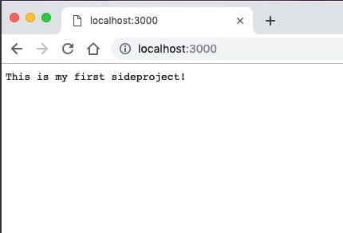
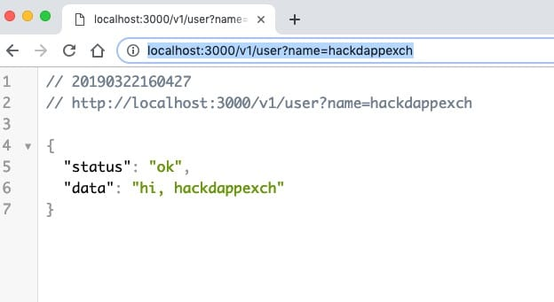
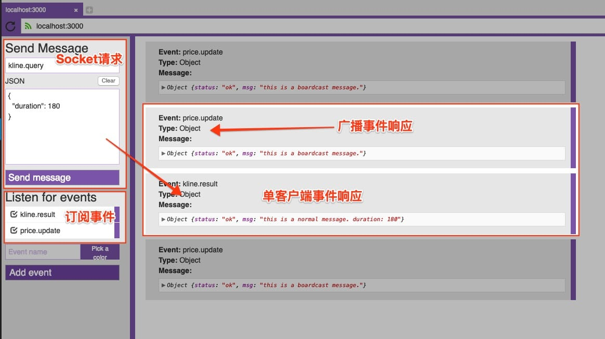
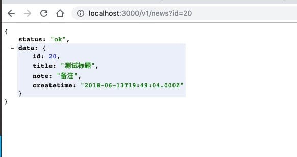

# 十一、.13 动手实践集成七核心组件的完整 Node 工程

# 动手实践集成七核心组件的完整 Node 工程

本文将带领大家从空项目开始，在 NodeExpress 框架基础上，逐个集成以下组件： 多配置切换、Http 组件、Socket 组件、日志组件、mysql/pool、日志组件、调度组件等，并在后续项目业务开发环境中帮助解决对应的技术问题。

通过整个集成过程，你可以了解整个集成过程流程，而且能够熟悉与了解所有组件的具体用法及使用场景，还可以总结在项目过程中可能遇到的各种问题。

* * *

** 在搭建项目开始之前，请先确保本地已经安装 Node 服务。 **

## 一、新建工程目录

在本地新建一个目录文件夹

```js
> mkdir mysideproj;
> cd mysideproj
```

执行**npm init**命令， 对项目进行配置初始化

```js
mysideproject> npm init
```

在命令交互窗口，一路回车，待命令执行完成后，会在本地目录中生成一个**package.json**文件。

```js
//file: package.json
{
  "name": "mysideproject",
  "version": "1.0.0",
  "description": "this is my first sideproject.",
  "main": "index.js",
  "scripts": {
    "test": "echo \"Error: no test specified\" && exit 1"
  },
  "author": "",
  "license": "ISC"
}
```

此时，项目目录结构如下：

```js
.
├── node_modules
├── package-lock.json
└── package.json
```

## 二、 安装与集成 Express

在命令窗口，执行**express**组件安装命令

```js
mysideproject> npm install express@4.15.2
+ express@4.15.2
```

然后，在本地目录，新建系统入口文件**index.js**

```js
mysideproject> touch index.js
```

编辑**index.js**文件，添加如下代码

```js
var express = require('express')
var app = express()

app.get('/', (req, res) => {
    res.send('This is my first sideproject!')
})

app.listen(3000, function () {
    console.log('listening on *:3000')
})
```

启动项目程序

```js
mysideproject> node index.js
listening on *:3000
```

显示**listening on *:3000**，则意味着服务启动成功。打开浏览器，访问 http://localhost:3000 

## 三、安装与集成 Http 服务

在实际业务场景中，往往我们都需要为不同业务模块提供一系统的数据查询及存储接口，而且接口间交易也普遍使用 json 格式进行数据交互。

那么，接下来将会对 Express 进行 http 及 json 解析配置，并且支持丰富的路由功能。

**安装依赖组件**

*   body-parser@ 1.18.3
    该组件主要用于对 http 请求参数进行解析处理

    ```js
    mysideproject> npm install body-parse@1.18.3
    ```

**集成步骤**

1.  在文件头中引入**body-parser**件

    ```js
    var bodyParser = require("body-parser");
    ```

2.  配置 header 参数， 解决前端请求跨域问题

    ```js
    app.all('*', function (req, res, next) {
        res.header('Access-Control-Allow-Origin', '*');
        res.header('Access-Control-Allow-Headers', 'Content-Type, Content-Length, Authorization, Accept, X-Requested-With , yourHeaderFeild');
        res.header('Access-Control-Allow-Methods', 'PUT, POST, GET, DELETE, OPTIONS');

        if (req.method == 'OPTIONS') {
            res.send(200);
        } else {
            next();
        }
    });
    ```

3.  使用 body-parser 组件解决请求参数

    ```js
    app.use(bodyParser.urlencoded({
        extended: false
    }));
    app.use(bodyParser.json());
    ```

4.  定义路由规则及错误响应

    ```js
    var router = express.Router();
    //TODO 实现自定义 http 接口
    app.use('/', router);
    ```

    针对网站响应 400 等异常信息，预先定义异常响应信息

    ```js
    app.use(function (req, res, next) {
        res.status(404).send("Sorry, that route doesn't exist. Have a nice day :)");
    });
    ```

5.  初始化 http 服务并设置监听端口

    ```js
    var http    = require('http').Server(app);
    http.listen(3000, function () {
        console.log('listening on *:3000')
    });
    ```

**编写示例接口**

编写一个测试服务接口，比如: **/v1/user?name=hackdappexch **

```js
//e.g http://localhost:3000/v1/user?name=hackdappexch

router.get('/v1/user', function (req, res) {
    let name = req.query.name

    res.setHeader('Content-Type', 'application/json')
    res.json({
        "status": "ok",
        "data": "hi, " + name
    })
})
```

**req.query.name**为获取当前链接中 name 参数；**res.json**方法则是用以 json 格式响应数据结果。

**效果演示**

启动项目工程

```js
node index.js
```

打开浏览器, 访问[`localhost:3000/v1/user?name=hackdappexch`](http://localhost:3000/v1/user?name=hackdappexch)  如果能正常显示上图结果，则表明验证成功。

到此, Node 项目的 Http 服务配置完成。

* * *

**完整代码**

```js
var express = require('express')
var app = express()
var bodyParser = require("body-parser")

app.all('*', function (req, res, next) {
  res.header('Access-Control-Allow-Origin', '*')
  res.header('Access-Control-Allow-Headers', 'Content-Type, Content-Length, Authorization, Accept, X-Requested-With , yourHeaderFeild')
  res.header('Access-Control-Allow-Methods', 'PUT, POST, GET, DELETE, OPTIONS')

  if (req.method == 'OPTIONS') {
      res.send(200)
  } else {
      next()
  }
})
app.use(bodyParser.urlencoded({
  extended: false
}))
app.use(bodyParser.json())

var router = express.Router();
router.get('/v1/user', function (req, res) {
    let name = req.query.name

    res.setHeader('Content-Type', 'application/json')
    res.json({
        "status": "ok",
        "data": "hi, " + name
    })
})
app.use('/', router)

app.use(function (req, res, next) {
    res.status(404).send("Sorry, that route doesn't exist. Have a nice day :)")
})

var http    = require('http').Server(app);
http.listen(3000, function () {
    console.log('listening on *:3000')
}) 
```

## 四、安装与集成 socket.io 组件

**需求场景** 在交易所 K 线图业务场景中，往往需要实时的对成交数据进行快速的报表数据展示。Http 接口在每次请求之后都需要重新进行连接，相较于 socket 长连接而言，数据及时性要差一些。另外一个问题就是采用 http 方式，后端程序无法异步推送消息数据给前端页面。

**组件依赖**

*   socket.io
    socket.io 是一个在浏览器端与服务器端之间实现基于事件的实时双向服务组件。

    ```js
    sideproj> npm install socket.io@1.7.3
    ```

**集成步骤**

1.  安装 socket.io 组件

    ```js
    sideproj> npm install socket.io@1.7.3
    ```

2.  注册 socket 服务
    编辑**index.js**文件，添加以下代码

    ```js
    var http    = require('http').Server(app)
    var socketsvr  = require('socket.io')(http)
    ```

3.  注册 socket 请求事件

    *   connection
        **系统事件**，当有新客户端连接到服务器后触发此事件。

        ```js
        socketsvr.on('connection',  function (socket) {
        //todo do some stuff
        }
        ```

    *   disconnect
        **系统事件**，当客户端断开连接后，会触发此事件。

        ```js
        socketsvr.on('disconnect', function (socket) {
            //todo do some stuff
        }
        ```

    *   自定义事件
        开发人员可自定义事件及其参数

        ```js
        socket.on(<自定义事件>, function(args) {
            //todo do some stuff
        }
        ```

        **注**：以上代码需在系统事件 connection 方法中定义，也就是需要将事件监听到**具体的连接客户端**上。

4.  注册 socket 响应事件
    响应事件主要用于向客户端发送某一事件的消息数据

    *   响应单个客户端

        ```js
        socket.emit(<自定义事件>, {
 <key>: <value>
        }
        ```

        **注**：需要事先存储该客户端连接实例

    *   广播响应
        向所有连接到服务器客户端基于某一事件进行消息广播

        ```js
        socketsvr.emit(<自定义事件>, {
  <key>: <value>
        }
        ```

        **注**：emit 被调用的实例为服务器 socket 实例

**编写示例**

1.  编写监听事件

    ```js
    socketsvr.on('connection',  function (socket) {
        socket.on('kline.query', function(args) {
            console.log(args)
        })
    })
    ```

2.  编写响应事件

    ```js
    //1\. 单客户响应事件
    socketsvr.on('connection',  function (socket) {
        console.log(args)

        socket.on('kline.query', function(args) {

            socket.emit('kline.result', {
                'status': 'ok',
                'msg': 'this is a normal message. duration: ' + args.duration
            })

        })
    })

    //2\. 广播事件
    socketsvr.emit('price.update', {
        'status': 'ok',
        'msg': 'this is a boardcast message.'
    });

    ```

**示例效果**  **测试工具**： [Socket.io tester | Apps | Electron](http://electronjs.org/apps/socket-io-tester)

* * *

**完整代码**

```js
var express = require('express')
var app = express()
var http    = require('http').Server(app)
var socketsvr  = require('socket.io')(http)
var bodyParser = require("body-parser")

app.all('*', function (req, res, next) {
  res.header('Access-Control-Allow-Origin', '*')
  res.header('Access-Control-Allow-Headers', 'Content-Type, Content-Length, Authorization, Accept, X-Requested-With , yourHeaderFeild')
  res.header('Access-Control-Allow-Methods', 'PUT, POST, GET, DELETE, OPTIONS')

  if (req.method == 'OPTIONS') {
      res.send(200)
  } else {
      next()
  }
})
app.use(bodyParser.urlencoded({
  extended: false
}))
app.use(bodyParser.json())

var router = express.Router()
app.use('/', router)

app.use(function (req, res, next) {
    res.status(404).send("Sorry, that route doesn't exist. Have a nice day :)")
})
router.get('/v1/user', function (req, res) {
    let name = req.query.name

    res.setHeader('Content-Type', 'application/json')
    res.json({
        "status": "ok",
        "data": "hi, " + name
    })
})

socketsvr.on('connection',  function (socket) {

  socket.on('kline.query', function(args) {
        socket.emit('kline.result', {
            'status': 'ok',
            'msg': 'this is a normal message. duration: ' + args.duration
        })
    })
})
//2\. 广播事件

setInterval(function(svr){
  svr.emit('price.update', {
    'status': 'ok',
    'msg': 'this is a boardcast message.'
  })
}, 5000, socketsvr)

http.listen(3000, function () {
    console.log('listening on *:3000')
}) 
```

## 五、安装与集成 Mysql 及连接池

### 需求场景

使用连接池提高频繁的数据库连接操作，从而查询或更新等操作的执行速度；

### 依赖组件

*   mysequel@ 1.0.2
*   mysql2@ 1.1.0

    ### 集成步骤

    1.  安装组件依赖

        ```js
        npm install mysequel@1.0.2
        npm install mysql2@1.1.0
        ```

2.  引入组件

    ```js
    const mysequel = require('mysequel')
    ```

3.  准备 mysql 数据库信息

    *   数据库地址：127.0.0.1:3306
    *   数据库名称：mydb
    *   用户名: root
    *   密码:
4.  实例化连接池

    ```js
    let mysql = mysequel({
        "host":     127.0.0.1
        "port":     3306
        "user":     "root"
        "password": "<pwd>"
        "database": "<mydb>"
        "charset":  "utf8_general_ci"
    })
    ```

5.  配置实例监听事件

    ```js
    this.mysql.on('query-complete', (type, query, duration) => {
        //todo do some stuff
    })
    this.mysql.on('query-error', (err, type, query, duration) => {
        //todo do some stuff
    })
    ```

6.  连接池对象方法

    *   A、添加
        `this.mysql.queryInsert(sql, [values], [options])`, 该方法为一个异步调用方法，返回值为自增序列 id

    *   B、修改
        `this.mysql.queryChanged(sql, [values], [options]) `， 返回对象为 promise 且执行结果为更新成功的条数

    *   C、删除
        `this.mysql.queryChanged(sql, [values], [options]) `， 返回对象为 promise 且执行结果为删除成功的条数

    *   D、查询
        `this.mysql.query(sql, [values], [options]) `，返回对象为 Promise 对象且执行结果为** 符合条件的所有数据集列表数据**；
        `this.mysql.queryRow(sql, [values], [options])`， 返回对象为 Promise 对象且执行结果为** 符合条件的所有数据集列表数据**的**首行数据**；
        `this.mysql.queryCell(sql, [values], [options]) `，返回对象为 Promise 对象且执行结果为：** 符合条件的所有数据集列表数据**的**首行数据**中的**第一个字段**数据。

    * 所有 sql 方法都支持预编译的方式进行数据查询或更新等操作。

    更多方法，可参考官方文档: [mysequel - npm](https://www.npmjs.com/package/mysequel)。

### 编写示例

本地初始化数据库，并执行以下数据表创建脚本:

```js
SET NAMES utf8mb4;
SET FOREIGN_KEY_CHECKS = 0;

-- ----------------------------
-- Table structure for news
-- ----------------------------
DROP TABLE IF EXISTS `news`;
CREATE TABLE `news` (
  `id` bigint(20) NOT NULL AUTO_INCREMENT,
  `title` varchar(255) COLLATE utf8mb4_bin NOT NULL DEFAULT '',
  `note` varchar(255) COLLATE utf8mb4_bin NOT NULL DEFAULT '',
  `createtime` datetime NOT NULL,
  PRIMARY KEY (`id`)
) ENGINE=InnoDB AUTO_INCREMENT=21 DEFAULT CHARSET=utf8mb4 COLLATE=utf8mb4_bin;

-- ----------------------------
-- Records of news
-- ----------------------------
BEGIN;
INSERT INTO `news` VALUES (20, '测试标题', '备注', '2018-06-14 03:49:04');
COMMIT;

SET FOREIGN_KEY_CHECKS = 1; 
```

编写**mysql.js**，该文件用于根据配置的数据库参数实例化 mysql 对象；

```js
var mysequel = require('mysequel');

var cfg = {
  'host': '127.0.0.1',
  'port': '3306',
  'user': 'root',
  'password': 'admin123',
  'database': 'test',
};

var mysql = mysequel(cfg);
mysql.on('query-complete', (type, query, duration) => {
    console.log("%s %s query completed in %d ms", query, type, duration)
});
mysql.on('query-error', (err, type, query, duration) => {
    console.log("%s %s query failed after %d ms", err, query, duration)
});

module.exports = mysql; 
```

编写**news.js**，主要用于集中实现业务逻辑；

```js
var mysql = require('./mysql')

exports.findById = (id) => mysql.queryRow('SELECT * FROM news WHERE id = :id', { id })
```

在**index.js**文件中， 集成**user_service.js**，对外提成查询服务 1) 在头文件中引入`news.js`

```js
var news = require('./news');
```

2) 添加对外接口服务

```js
router.get('/v1/news', async function (req, res) {
    let id = req.query.id

    let result = await news.findById(id)

    res.setHeader('Content-Type', 'application/json')
    res.json({
        "status": "ok",
        "data":  result
    })
})
```

### 效果演示

访问浏览器[`localhost:3000/v1/news?id=20`](http://localhost:3000/v1/news?id=20)， 执行结果如下： 

### 完整代码

**index.js**

```js
var express = require('express')
var app = express()
var http    = require('http').Server(app)
var socketsvr  = require('socket.io')(http)
var bodyParser = require("body-parser")
var news = require('./news');

app.all('*', function (req, res, next) {
  res.header('Access-Control-Allow-Origin', '*')
  res.header('Access-Control-Allow-Headers', 'Content-Type, Content-Length, Authorization, Accept, X-Requested-With , yourHeaderFeild')
  res.header('Access-Control-Allow-Methods', 'PUT, POST, GET, DELETE, OPTIONS')

  if (req.method == 'OPTIONS') {
      res.send(200)
  } else {
      next()
  }
})
app.use(bodyParser.urlencoded({
  extended: false
}))
app.use(bodyParser.json())

var router = express.Router()
app.use('/', router)

app.use(function (req, res, next) {
    res.status(404).send("Sorry, that route doesn't exist. Have a nice day :)")
})
router.get('/v1/user', function (req, res) {
    let name = req.query.name

    res.setHeader('Content-Type', 'application/json')
    res.json({
        "status": "ok",
        "data": "hi, " + name
    })
})

router.get('/v1/news', async function (req, res) {
    let id = req.query.id

  let result = await news.findById(id)

    res.setHeader('Content-Type', 'application/json')
    res.json({
        "status": "ok",
        "data":  result
    })
})

socketsvr.on('connection',  function (socket) {

  socket.on('kline.query', function(args) {
        socket.emit('kline.result', {
            'status': 'ok',
            'msg': 'this is a normal message. duration: ' + args.duration
        })
    })
})
//2\. 广播事件

setInterval(function(svr){
  svr.emit('price.update', {
    'status': 'ok',
    'msg': 'this is a boardcast message.'
  })
}, 5000, socketsvr)

http.listen(3000, function () {
    console.log('listening on *:3000')
}) 
```

* * *

## 六、安装与集成多配置

### 业务场景

在应用系统的整个开发周期来讲，都会面临开发、测试、模拟环境、正式环境等多个环境的部署及功能测试，因为每个环境所需要的参数都不相同。而面对这样的场景，我们就可以使用多配置参数文件，根据不同的环境切换到不同的参数配置上即可，方便产品环境的快速化部署。

### 安装依赖组件

*   nconf@0.10.0
*   js-yaml@3.12.0

```js
npm install nconf@0.10.0
npm install js-yaml@3.12.0
```

关于配置文件的格式其实有很多种，比如: json、xml、toml、yaml 等等。但在此教程中将介绍的是如何集成 yaml 格式文件配置。

### 集成步骤

#### 定义多个配置文件（devtestsimulationprod）

常规情况下，往往都会配置三类环境参数文件：本地开发、测试环境、正式环境，所以分别定义三个文件：app.dev.yaml、app.test.yaml、app.prod.yaml.

三个文件的内容均为以下格式，只是配置参数有所不同。

```js
app:
  server:
    port: 3000
  db:
    mysql:
      host: '127.0.0.1'
      port: 3306
      user: 'test'
      password: 'admin123'
      database: 'test'
      charset: 'utf8_general_ci'
```

#### 定义**config.js**

创建 config.js 文件，引入`nconf`、`fs`、`js-yaml`三个包

```js
const nconf = require("nconf")
const fs = require("fs")
const yaml = require('js-yaml')
```

读取命令运行参数配置，缺省使用 dev 配置

```js
nconf.argv().env();
const env = process.env.NODE_ENV || 'dev' 
```

读取并解析配置文件

```js
var filepath = "src/config/app." + env + ".yaml";
if (!fs.existsSync()) {
    throw {
        name: "FileNotFoundException",
        message: "Unable to find configFile " + filepath
    };
}
nconf.file({
    file: filepath,
    format: {
        parse: yaml.safeLoad,
        stringify: yaml.safeDump,
    }
});
```

读取 nconf 对象实例，获取参数定义

```js
nconf.get()
```

#### 重构代码，提取配置参数至配置文件中

比如：服务启动端口地址；数据库配置参数等。 在**index.js**中，引入配置文件**config.js**

```js
var config = require('./config');
```

替换服务器启动端口地址

```js
http.listen(config.app.server.port, function () {
    console.log('listening on *:%s', config.app.server.port)
})
```

修改**mysql.js** 文件，替换 myql 参数配置,

```js
var mysequel = require('mysequel');
var config = require('./config').load()

var mysql = mysequel(config.app.db.mysql);
mysql.on('query-complete', (type, query, duration) => {
    console.log("%s %s query completed in %d ms", query, type, duration)
});
mysql.on('query-error', (err, type, query, duration) => {
    console.log("%s %s query failed after %d ms", err, query, duration)
});

module.exports = mysql; 
```

### 效果演示

可自行修改相关环境配置参数进行验证。

* * *

## 七、安装与集成日志组件

在日常开发过程，尤其是在线上环境，我们往往需要回溯之前的日志信息进行问题跟踪，这样就需要一个实时记录线上关键结点记录的组件---日志框架。

按照符合常规项目的要求，日志框架往往需要支持以下几个功能：

*   按不同级别进行日志记录。比如: debug、info、warn、error
*   支持按文件、控制台、logstash 进行日志打印
*   支持按天或按大小进行日志压缩与切割

### 安装依赖组件

*   winston@3.1.0
*   winston-daily-rotate-file@3.5.1

```js
npm install winston@3.1.0
npm install winston-daily-rotate-file@3.5.1
```

### 集成步骤

#### 引入组件包

```js
const { createLogger, format, transports } = require('winston');
const { combine, timestamp, label, printf } = format;
const path = require('path');
const fs = require('fs');
require('winston-daily-rotate-file');
```

#### 日志格式化配置

```js
format: combine(
    label({
        label   : 'dexchange#' + path.basename(module.parent.filename)
    }),
    format.splat(),
    format.colorize(),
    timestamp({
        format: 'YYYY-MM-DD HH:mm:ss'
    }),
    printf(info => {
        let msg = info.message;
        try {
            if (info.message instanceof Object) {
                msg = JSON.stringify(info.message);
            } 
        } catch (error) {
            msg = info.message;
        } 
        return `${info.timestamp} [${info.label}] ${info.level}: ${msg}`;
    })
)
```

**label**为日志前缀标签；**printf**方法主要用于定义日志格式排版以及对格式化日志参数对象。

#### 日志级别及切割

```js
transports: [
    new transports.Console({
        level: <日志级别>
    }),
    new(transports.DailyRotateFile)({
            level: <日志级别>,
            filename: path.join('logs', <日志名称>),
            datePattern: <日志格式>,
            zippedArchive: <日志压缩>,
            maxSize: <切割文件大小>,
            maxFiles: <文件保留天数>
    })
]
```

#### 日志组件类**logger.js**

```js
const { createLogger, format, transports } = require('winston')
const { combine, timestamp, label, printf } = format
const path = require('path')
const fs = require('fs')
require('winston-daily-rotate-file')

let config = require('./config').load()

exports.createLogger = () => {
  if (!fs.existsSync('logs')) {
      fs.mkdirSync('logs')
  }

  return createLogger({
      format: combine(
          label({
              label   : 'dexchange#' + path.basename(module.parent.filename)
          }),
          format.splat(),
          format.colorize(),
          timestamp({
              format: 'YYYY-MM-DD HH:mm:ss'
          }),
          printf(info => {
              let msg = info.message
              try {
                  if (info.message instanceof Object) {
                      msg = JSON.stringify(info.message)
                  }
              } catch (error) {
                  msg = info.message
              }
              return `${info.timestamp} [${info.label}] ${info.level}: ${msg}`
          })
      ),
      transports: [
          new transports.Console({
              level: config.app.logger.console.level
          }),
          new(transports.DailyRotateFile)({
                level: config.app.logger.file.level,
                filename: path.join('logs', config.app.logger.file.filename),
                datePattern: config.app.logger.file.datePattern,
                zippedArchive: config.app.logger.file.zippedArchive,
                maxSize: config.app.logger.file.maxsize,
                maxFiles: config.app.logger.file.maxFiles
          })
      ]
  })
} 
```

#### 重构工程源码

将之前使用**console.log**替换为**logger.info**方法

### 编写示例

#### 引用日志组件

```js
var logger = require('./logger').createLogger();
```

#### 打印日志

```js
logger.info('Hello again distributed logs');

logger.info('hello', { message: 'world' });

// info: test message my string {}
logger.log('info', 'test message %s', 'my string');

// info: test message 123 {}
logger.log('info', 'test message %d', 123);

// info: test message first second {number: 123}
logger.log('info', 'test message %s, %s', 'first', 'second', { number: 123 }); 
```

### 效果演示


* * *

## 八、安装与集成 eosjs

### 安装依赖组件

*   eosjs@16.0.9

```js
npm install eosjs@16.0.9
```

### 集成步骤

#### 引用组件包

```js
const eossdk = require('eosjs');
```

#### 实例化

```js
const eos = eossdk({
    chainId: 'cf057bbfb72640471fd910bcb67639c22df9f92470936cddc1ade0e2f2e7dc4f',
    httpEndpoint: 'http://127.0.0.1:7777',
    keyProvider: '<签名交易时才需要>',
    verbose: true,
    authorization: '',
    expireInSeconds: 60,
    broadcast: true,
    sign: true
})
```

#### 触发合约方法

```js
const data = {
    actions: [
        {
            account: <合约名>,
            name: '<合约方法>',
            authorization: [{
                actor: <用户名>,
                permission: 'active'
            }],
            data: {
                <参数名>: <参数值>
            } //合约方法参数。json 或数组格式
        }
    ]
}
eos.transaction(data)
```

#### 查询合约数据

```js
eos.getTableRows({
    json: true,
    code: "hackdappexch",
    scope: "hackdappexch",
    table: 'orderstruct',
    key_type: 'i64',
    index_position: 1,
    limit: 30
}).then((result)=>{
  logger.info(result)
}).catch((err)=>{
  logger.error(err)
})
```

### 编写示例

帐户间转帐。比如：**eosio.testa**帐户向智能合约**hackdappexch**转帐**100 EOS**.

#### 配置 EOS 实例权限

```js
chain:
      chainId: 'cf057bbfb72640471fd910bcb67639c22df9f92470936cddc1ade0e2f2e7dc4f'
      httpEndpoint: 'http://127.0.0.1:7777'
      keyProvider: '5K2jun7wohStgiCDSDYjk3eteRH1KaxUQsZTEmTGPH4GS9vVFb7'
      verbose: true
      authorization: 'eosio.testa@active'
      expireInSeconds: 10
      broadcast: true
      sign: true
```

#### 转帐操作

```js
const data = {
    actions: [
        {
            account: 'eosio.token',
            name: 'transfer',
            authorization: [{
                actor: 'eosio.testa',
                permission: 'active'
            }],
            data: {
                from: 'eosio.testa',
                to: 'hackdappexch',
                quantity: '10 EOS',
                memo: '',
            } //合约方法参数。json 或数组格式
        }
    ]
}
eos.transaction(data)
```

提交转帐操作后，后台显示信息：

```js
2019-03-25 19:38:25 [dexchange#index.js] info: submit transaction. {"broadcast":true,"transaction":{"compression":"none","transaction":{"expiration":"2019-03-25T11:39:25","ref_block_num":56681,"ref_block_prefix":679356506,"max_net_usage_words":0,"max_cpu_usage_ms":0,"delay_sec":0,"context_free_actions":[],"actions":[{"account":"eosio.token","name":"transfer","authorization":[{"actor":"eosio.testa","permission":"active"}],"data":"004cc62a03ea3055d05057b59a049169a08601000000000004454f530000000000"}],"transaction_extensions":[]},"signatures":["SIG_K1_KVFDER38BVE88dyap2C3BS6Fs3gcT73ywXU6qBZW5cuLUhFraPdsEg2EbFz3fKpfEmzh9kwwetfT5YM2t8CG4xvKv7tKQq"]},"transaction_id":"1d8e5f2e9038e64c7ed269003ea9f16fee87afb63c5e80d64c183835ff8e2203","processed":{"id":"1d8e5f2e9038e64c7ed269003ea9f16fee87afb63c5e80d64c183835ff8e2203","block_num":4119916,"block_time":"2019-03-25T11:38:26.000","producer_block_id":null,"receipt":{"status":"executed","cpu_usage_us":709,"net_usage_words":16},"elapsed":709,"net_usage":128,"scheduled":false,"action_traces":[{"receipt":{"receiver":"eosio.token","act_digest":"9a3e9210b94af99de3672b5588008736ac40926d52e1c5b655d967cd4ddf2c27","global_sequence":4350236,"recv_sequence":280,"auth_sequence":[["eosio.testa",70]],"code_sequence":1,"abi_sequence":1},"act":{"account":"eosio.token","name":"transfer","authorization":[{"actor":"eosio.testa","permission":"active"}],"data":{"from":"eosio.testa","to":"hackdappexch","quantity":"10.0000 EOS","memo":""},"hex_data":"004cc62a03ea3055d05057b59a049169a08601000000000004454f530000000000"},"context_free":false,"elapsed":194,"console":"","trx_id":"1d8e5f2e9038e64c7ed269003ea9f16fee87afb63c5e80d64c183835ff8e2203","block_num":4119916,"block_time":"2019-03-25T11:38:26.000","producer_block_id":null,"account_ram_deltas":[],"except":null,"inline_traces":[{"receipt":{"receiver":"eosio.testa","act_digest":"9a3e9210b94af99de3672b5588008736ac40926d52e1c5b655d967cd4ddf2c27","global_sequence":4350237,"recv_sequence":30,"auth_sequence":[["eosio.testa",71]],"code_sequence":1,"abi_sequence":1},"act":{"account":"eosio.token","name":"transfer","authorization":[{"actor":"eosio.testa","permission":"active"}],"data":{"from":"eosio.testa","to":"hackdappexch","quantity":"10.0000 EOS","memo":""},"hex_data":"004cc62a03ea3055d05057b59a049169a08601000000000004454f530000000000"},"context_free":false,"elapsed":4,"console":"","trx_id":"1d8e5f2e9038e64c7ed269003ea9f16fee87afb63c5e80d64c183835ff8e2203","block_num":4119916,"block_time":"2019-03-25T11:38:26.000","producer_block_id":null,"account_ram_deltas":[],"except":null,"inline_traces":[]},{"receipt":{"receiver":"hackdappexch","act_digest":"9a3e9210b94af99de3672b5588008736ac40926d52e1c5b655d967cd4ddf2c27","global_sequence":4350238,"recv_sequence":65,"auth_sequence":[["eosio.testa",72]],"code_sequence":1,"abi_sequence":1},"act":{"account":"eosio.token","name":"transfer","authorization":[{"actor":"eosio.testa","permission":"active"}],"data":{"from":"eosio.testa","to":"hackdappexch","quantity":"10.0000 EOS","memo":""},"hex_data":"004cc62a03ea3055d05057b59a049169a08601000000000004454f530000000000"},"context_free":false,"elapsed":139,"console":"","trx_id":"1d8e5f2e9038e64c7ed269003ea9f16fee87afb63c5e80d64c183835ff8e2203","block_num":4119916,"block_time":"2019-03-25T11:38:26.000","producer_block_id":null,"account_ram_deltas":[],"except":null,"inline_traces":[]}]}],"except":null}}
```

#### 查询数据

```js
await eos.getTableRows({
            json: true,
            code: "eosio.token",
            scope: "hackdappexch",
            table: 'accounts',
            key_type: 'i64',
            index_position: 1,
            limit: 30
  }).then((result)=>{
    logger.info("After the transfer .\n  hackdappexch balance: %s", JSON.stringify(result, null, 4))
  }).catch((err)=>{
    logger.error(err)
  })
```

### 效果演示

转帐前，查询帐户 hackdappexch 余额

```js
2019-03-25 19:38:25 [dexchange#index.js] info: Before the transfer .
  hackdappexch balance: {
    "rows": [
        {
            "balance": "10.4000 EOS"
        }
    ],
    "more": false
}
```

提交转帐操作

```js
2019-03-25 19:38:25 [dexchange#index.js] info: submit transaction. transaction_id: "1d8e5f2e9038e64c7ed269003ea9f16fee87afb63c5e80d64c183835ff8e2203"
```

转帐后，查询余额

```js
2019-03-25 19:38:26 [dexchange#index.js] info: After the transfer .
  hackdappexch balance: {
    "rows": [
        {
            "balance": "20.4000 EOS"
        }
    ],
    "more": false
}
```

* * *

到此，通过我们的学习思考及动手实践，亲自完成了对 Node 项目实战环境过程所必须要的组件整合过程。