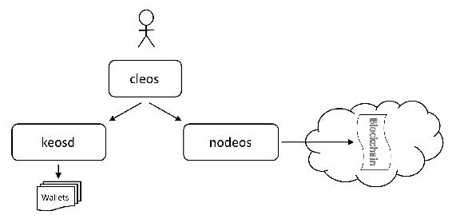

# 第一章 【EOS 钱包开发 一】EOS 不得不说的一些概念

#### EOS 是什么

EOS 是 Enterprise Operation System 的缩写，它是商用分布式应用设计的一款区块链操作系统。EOS 是引入的一种新的区块链架构 EOSIO，用于实现分布式应用的性能扩展。EOS 并不像比特币和以太坊那样是货币，而是基于 EOSIO 软件项目之上发布的代币，被称为区块链 3.0。

#### EOS 的主要特点

*   EOS 有点类似于微软的 windows 平台，通过创建一个对开发者友好的区块链底层平台，支持多个应用同时运行，为开发 dAPP 提供底层的模板。
*   EOS 通过并行链和 DPOS 的方式解决了延迟和数据吞吐量的难题，EOS 是每秒可以上千级别的处理量，而比特币每秒 7 笔左右，以太坊是每秒 30-40 笔。
*   EOS 没有手续费，在 EOS 上开发 dApp，需要用到的网络和计算资源是按照开发者拥有的 EOS 的比例分配的。当你拥有了 EOS 的话，就相当于拥有了计算机资源，随着 DAPP 的开发，你可以将手里的 EOS 租赁给别人使用。简单来说，就是你拥有了 EOS，就相当于拥有了一套房租给别人收房租，或者说拥有了一块地租给别人建房。

#### EOSIO 主要的程序

*   `nodeos`（node + eos = nodeos）：可以使用插件配置以运行节点的核心 EOSIO 节点守护进程。可以生成区块、节点验证、RPC API 接口。
*   `cleos` （cli + eos = cleos）：是一个命令行工具，可以与 nodeos 公开的 REST API 进行交互并管理钱包。
*   `keosd` （key + eos = keosd）：是一个轻客户端钱包，负责管理钱包，以便在广播到网络之前保护密钥和签署交易，在本地计算机上运行并安全地将 EOSIO 密钥存储在钱包的组件中。
*   `Eoscpp`：是一个编译器，将 C++代码编译为 WASM 和 ABI。它生成`.wasm`、`.abi`的文件并上传到区块链。

下图说明了这些组件之间的基本关系。

#### EOS 的账户体系

EOS 的账户体系是 EOS 中的亮点特性之一，实现了基于角色的权限管理和账户恢复功能，使得用户可以灵活地以一种组织化的方式管理账户，并极大程度上保证了资产的安全性。

EOS 账户的特点：

*   EOS 中的账户名是 12 位可读标识符，由用户自定义，在区块链中唯一。它是转账时的标识，而其它区块链账的标识一般是地址。
*   EOS 的一个账户下面可以包含多对公私钥，每对拥有不同的权限，而常见区块链项目的账户只有一对公私钥。
*   EOS 中每个账户刚创建时一般由个体拥有，通过单一公私钥便能进行所有操作，后续可根据需要通过权限配置将该账户扩展成组织账户，由多对公私钥，即多个主体所共同控制，甚至可为组织外部个体或组织分配部分操作权限，从而实现极其灵活的组织管理方式。
*   EOS 上的所有交易行为都是通过账户来完成的，通过账户执行任意操作时，EOSIO 首先会验证操作者是否拥有足够的权限，验证通过该操作才能生效。

#### EOS 账号的权限

EOS 中，每个账户创建时会自带两个原生权限：owner 和 active 权限。这也是默认的账户权限配置，另外还支持自定义权限。

*   owner 权限：代表账户所有权，该权限可进行所有操作，包括更改 owner 权限，可由一对或多对 EOS 公私钥或另一账户的某权限实现权限控制。因此，代表着 owner 权限的 EOS 公私钥是最重要的，必须安全保管好。
*   active 权限：active 即活跃权限，能进行除更改 owner 权限以外的所有操作，比如说转账、投票、购买 ram 等等。也是通过一对或多对 EOS 公私钥或另一账户的某权限实现权限控制。
*   自定义权限：除了两个原生权限以外，EOS 还支持自定义权限。我们可以将 active 的部分权限，比如说投票权，任命给一个自定义权限 voting。那么无须 owner、active 权限所对应的私钥对投票操作进行签名，单单通过 voting 权限所对应的私钥对投票操作进行签名便可完成投票操作。

因此通过权限配置可以将 EOS 账户的部分操作权限分配给第三方进行，避免了直接给出 active 权限的私钥，从而实现极其灵活和安全的组织管理方式。

#### 权重和阈值

每个权限都会有一个阀值，初始时为 1。权限下的每对公私钥都会有一个权重，初始时每个权限只有一对公私钥且权重为 1。后续账户可以修改权限的阀值，可以对每个主体（即每对 EOS 公私钥或账号）分配不同的权重，还可以修改权限由多个主体管理。只有当公私钥的权重大于等于阀值才能拥有该权限进行相应操作。

常见区块链项目的币就放在公钥里，只有一对公私钥，因此知道私钥便可转走，而 EOS 中币是放在账户里的，公钥里面放的是带权重的钥匙，转走账户里面的币需要拥有转账权限的钥匙的权重之和达到阈值才可进行。

#### 创建账号与转账的费用

EOS 主网中，账号的创建需要保存在 EOS 主网中，需要占用区块链生产节点的内存资源，一般为 4K 大小。而内存资源是有限的宝贵资源，因此创建账号是要成本的，一般需要花费 6 美元。而内存价格和 EOS 价格是随市场变动的，因此 EOS 主网账户注册价格也是变动的。因此每创建一个 EOS 新账号都需要其他 EOS 账号消耗一定量的 EOS 来帮忙创建，最初始的 EOS 账号由 EOS 主网在映射阶段创建完成。

而账户进行转账等操作时，是没有手续费的，但是需要用到 EOS 主网的 CPU 和带宽资源。CPU 就像会计的算账能力，带宽则可理解成转账的通道，这个需要通过 EOS 抵押才能换取，但是不会产生消耗，不用了可以赎回。

#### EOS 的资源利用机制

我们知道，比特币和以太坊中的交易手续费机制，其目的就是防止大量交易使系统拥堵。而 EOS 取消了交易手续费，那么如何避免系统资源的滥用？因而 EOS 设计了一种新的资源使用机制：根据账户中 EOS 的数量来分配系统资源，包括：RAM(内存), Network BandWidth (网络带宽) 以及 CPU BandWidth (CPU 带宽）。这些资源需要购买吗？如何交易？接着往下看。

##### RAM(内存)：

在 EOS 中, RAM(内存)的主要特点包括：

*   要将数据存储在区块链中需要消耗 RAM，比如在 EOS 中转账、购买资源、投票等操作的时候，都有可能会消耗 RAM (内存)。
*   如果你的 RAM 消耗殆尽，那么你是无法进行上述这些需要消耗 RAM 的操作的，所以我们需要有足够的 RAM。
*   通过购买获得的 EOS RAM 资源可以买卖，买卖的价格根据市场行情动态调节，这个特点与买卖 EOS 一样。
*   RAM 可以通过 EOS 购买的方式获得也可以通过好友帮你购买，这个特点和通过抵押方式获取 CPU 资源以及 NET 资源不太一样。
*   用户在买卖 RAM 资源的时候，各需要消耗 0.5 % (千分之五) 的手续费，总共是 1% 的手续费。这笔费用被存在 eosio.ramfee 中，由 BP 节点进行管理。
*   内存是消耗资源，不可赎回，只能买卖。

##### CPU 带宽与网络带宽

在 EOS 中，CPU 带宽与网络带宽的特性差不多，它们的主要特点包括：

*   它们采用抵押 EOS 的方式获取。当不再需要 CPU 与带宽时，抵押的 EOS 通证可以赎回，在赎回的时候，存在三天的赎回期。
*   如果你持有全网 1%的 EOS，那就可以抵押这些 EOS 来获得全网 1%的 CPU 和带宽。这样就可以隔离开所有的 DAPP，防止资源竞争和恶意的 DDOS 供给，无论其他的 DAPP 如何拥堵， 你自己的带宽都不受影响。
*   每次使用转账功能时，都会消耗网络带宽资源。
*   网络带宽取决于过去三天消费的平均值，作为你下一次执行操作的费率。
*   如果没有足够的网络带宽资源的话，你是无法使用 EOS 网络转账等基本功能的。
*   带宽资源是可以随着时间的推移，自动释放。

**版权声明：博客中的文章版权归博主所有，未经授权禁止转载，转载请联系作者（微信：lixu1770105）取得同意并注明出处。**