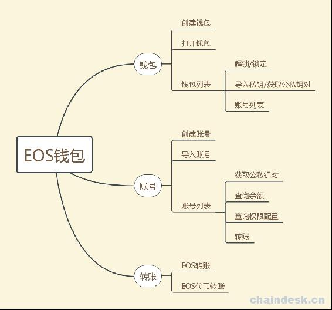
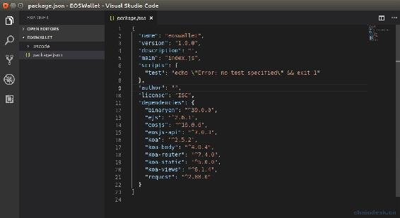
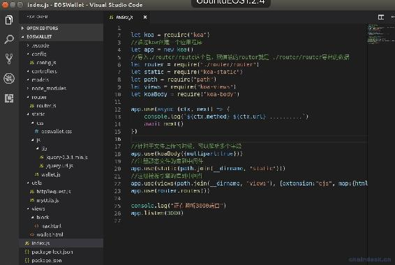
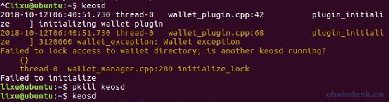
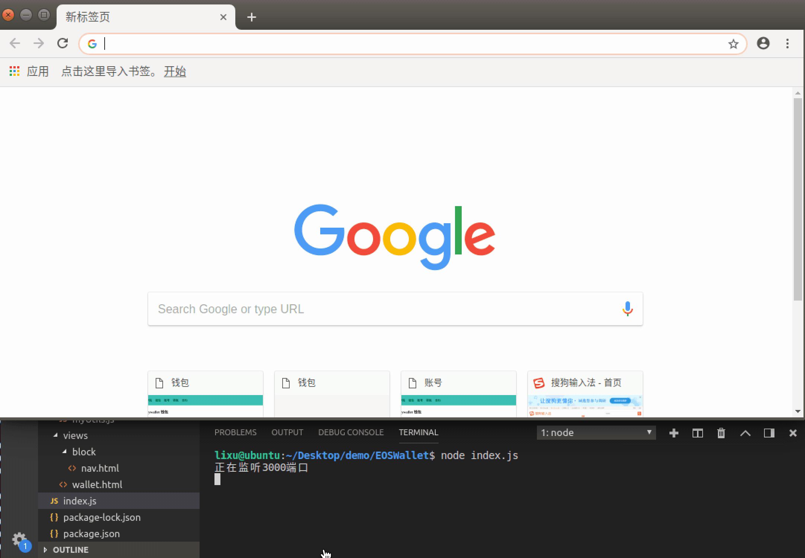

# 第三章 【EOS 钱包开发 三】钱包项目整体架构设计

> 本课程是 EOS 钱包开发，后端使用的 NodeJS 搭建，客户端使用的 web 前端，VSCode 开发工具，Ubuntu16.04 开发环境，node v8.11.3，npm v5.6.0。

## 一、前端架构

咱们的开发重点是在后端实现上，因此为了让大家快速上手，web 客户端没有使用其它流行的框架，这里只使用了 jQuery 框架简化代码，另外还有个 jQuery Validate 插件简化了表单验证。

*   web 前端整体技术：

    **`html + css + javascript + jQuery`**。

*   web 前端功能：

    1.  钱包模块
        *   创建钱包
        *   打开钱包
        *   钱包列表
        *   解锁/锁定
        *   导入私钥/获取公私钥对
    2.  账号模块
        *   创建账号
        *   通过私钥导入账号
        *   账号列表
        *   获取公私钥对
        *   查询余额
        *   查询权限配置
    3.  转账模块
        *   EOS 转账
        *   EOS 代币转账



## 二、后端架构

这个钱包应用程序与 EOS 全节点进行交互，需要搭建 Nodeos 服务与 keosd 应用程序，将使用 RPC 与 EOSJS 库提供的 jsAPI 访问 EOS 区块链数据，因此我们用 NodeJS 搭建后端服务，使用成熟的 MVC 架构，http 框架是 koa，需用到如下第三方库：

*   koa：富有强大功能的 HTTP 中间件框架，使 Web 应用程序和 API 更易于编写。它的特点优雅、简洁、表达力强、自由度高。
*   koa-body：功能齐全的 koa body 解析器中间件。支持`multipart`，`urlencoded`和`json`请求体。
*   koa-router：koa 的路由中间件。
*   koa-static：静态文件服务器中间件。
*   koa-views：是模板渲染中间件，在模版引擎下使用，支持的模版引擎包含：ejs、jazz、haml、react 等。
*   ejs：是一种 JavaScript 模版引擎，可以动态的设置变量值到 html。需要与模板渲染中间件 koa-views 配合使用。
*   eosjs：访问 EOS 区块链的 NodeJS 库。
*   eosjs-api：EOS 区块链节点的应用程序编程接口。
*   binaryen：加载 wast 合约。
*   request：简化的 HTTP 请求客户端。

## 三、项目初始化

新建项目跟文件夹 MyEtherWallet，然后按照如下步骤执行

```js
lixu@ubuntu:~$ cd '/home/lixu/Desktop/demo/EOSWallet' 
lixu@ubuntu:~/Desktop/demo/EOSWallet$ npm init
```

然后不断回车初始化项目。然后后自动生成`package.json`文件，是项目包的配置文件，下面我们引入项目中需要用到的库，拷贝下面 json 到`package.json`文件的最后一个字段。

```js
,
  "dependencies": {
    "binaryen": "³⁹.0.0",
    "ejs": "².6.1",
    "eosjs": "¹⁶.0.6",
    "eosjs-api": "⁷.0.3",
    "koa": "².5.2",
    "koa-body": "⁴.0.4",
    "koa-router": "⁷.4.0",
    "koa-static": "⁵.0.0",
    "koa-views": "⁶.1.4",
    "request": "².88.0"
  }
```

项目的界面如下：



然后运行以下命令按照上面的依赖库。

```js
npm install
```

下载完成后会将所有的依赖库下载到项目根目录自动新建的`node_modules`文件夹。

## 四、项目源码

按照如下结构搭建项目。



### index.js

项目的入口文件。首先实例化 koa 对象，然后将 koaBody、static、views、路由注册到中间件，服务绑定到 3000 端口。

```js
let koa = require("koa")
//通过 koa 创建一个应用程序
let app = new koa()
//导入./router/route 这个包，赋值给的 router 就是 ./router/router 导出的数据
let router = require("./router/router")
let static = require("koa-static")
let path = require("path")
let views = require("koa-views")
let koaBody = require("koa-body")

app.use(async (ctx, next) => {
    console.log(`${ctx.method} ${ctx.url} ..........`)
    await next()
})

//针对于文件上传的时候，可以解析多个字段
app.use(koaBody({multipart:true}))
//注册静态文件的库到中间件
app.use(static(path.join(__dirname, "static")))
//注册模板引擎的库到中间件
app.use(views(path.join(__dirname, "views"), {extension:"ejs", map:{html:"ejs"}}))
app.use(router.routes())

console.log("正在监听 3000 端口")
app.listen(3000)
```

### wallet.html

前端：新建账号的页面。

```js
<html>

<head>
    <title>钱包</title>
    <script src="js/lib/jquery-3.3.1.min.js"></script>
    <script src="/js/lib/jquery.url.js"></script>
    <script src="js/wallet.js"></script>
    <link rel="stylesheet" href="css/eoswallet.css">
</head>

<body>
    <%include block/nav.html%>

    <div id="main">
        <h1>钱包列表</h1>
    </div>
</body>

</html>
```

### nav.html

前端的导航栏，使用 ejs 库的方法`<%include block/nav.html%>`载入。

```js
<div id="nav">
    <div id="nav-center">
        <ul>
            <li><a href="http://www.kongyixueyuan.com">孔壹学院</a></li>
            <li><a href="/wallet.html">钱包</a></li>
            <li><a href="/account.html">账号</a></li>
            <li><a href="/transaction.html">转账</a></li>
        </ul>
    </div>
</div>
```

### httpRequest.js

针对 EOS 提供的 RPC 接口封装的网络请求接口。

```js
 let request = require("request");
let {success, fail} = require("./myUtils")
let config = require("../config/config")

async function httpRequest(method, url, params) {
    console.log("httpRequest:", url, params)
    let promise = new Promise((resolve, reject) => {

        var options = { 
            method: method,
            url: url,
            body: params,
            json: true 
        };
        request(options, function (error, response, body) {

            if (error) {
                reject(error)
            } else {
                resolve(body)
            }
        })
    })

    let result;
    //第一个参数是成功的回调
    //第二个参数是失败的回调
    await promise.then(function (data) {
        if (data.error) {
            result = fail(data.error)
        } else {
            result = success(data)
        }
    }, function(error) {
        result = fail(error)
    })

    console.log(JSON.stringify(result))
    return result
}

function generateURL(path) {
    let domain = ""
    if (path.indexOf("/v1/wallet/") == 0) {
        domain = config.walletAddress
    } else {
        domain = config.eosconfig.httpEndpoint
    }
    return domain + path
}

module.exports = {

    postRequest: async(path, params) => {
        return await httpRequest("POST", generateURL(path), params)
    },

    getRequest: async(path, params) => {
        return await httpRequest("GET", generateURL(path), params)
    },

}
```

### myUtils.js

项目工具类，提供获取 EOSJS 实例、返回给前端成功与失败的基本数据结构。

```js
 Eos = require('eosjs')
let config = require("../config/config")

module.exports = {

    getEOSJS: (keyProvider) => {
        config.eosconfig.keyProvider = keyProvider
        return Eos(config.eosconfig)
    },

    success: (data) => {
        responseData = {
            code: 0,
            status: "success",
            data: data
        }
        return responseData
    },

    fail: (msg) => {
        responseData = {
            code: 1,
            status: "fail",
            data: msg
        }
        return responseData
    },

    doCallback: async (fn, args) => {
        return await fn.apply(this, args);
    },
}
```

### wallet.js

处理钱包模块的 js 文件。

```js
$(document).ready(function () {
    alert("welcome!")
})
```

### eoswallet.css

前端唯一的 css 文件。

```js
#main{
    /*background-color: #8bc34a;*/
    margin: 120px 50px 50px 50px;

}
.error{
    color: red;
}
a{
    color: black;
    text-decoration: none;
}
a:hover{
    color: #666;
}
body{
    margin: 0px;
}
ul>li{
    list-style: none;
    margin: 0px;
}

.global-color{
    color: #0abc9c;
}

ul{
    list-style: none;
    padding: 0px;
}

.row{
    display: inline-block;
    margin-right: 70px;
}
.top{
    vertical-align: top
}
a[class=button]{
    background-color: beige;
    padding: 2px 10px;
    border: 1px solid gray;
}
button{
    background-color: beige;
    border: 1px solid gray;
}

/*导航-------------------------------------------------------------------------------------------------------*/
#nav{
    display: flex;
    justify-content: space-between;
    background-color: #0abc9c;
    position: fixed;
    top: 0px;
    left: 0px;
    right: 0px;
}
#nav li{
    display: inline-block;
    margin: 10px 2px;
}
#nav ul{
    padding: 0px;
}
#nav a{
    padding: 10px;
    font-size: 24px;
}
#nav-left{
    margin-left: 20px;
}
#nav-right{
    margin-right: 20px;
}
```

### router.js

路由文件。

```js
let router = require("koa-router")()

router.get("/", async (ctx) => {
    await ctx.render("wallet.html")
})

module.exports = router
```

## 五、启动项目

使用如下命令分别启动服务

1.  启动 nodeos 服务

    ```js
    nodeos -e -p eosio --plugin eosio::chain_api_plugin --plugin eosio::history_api_plugin
    ```

2.  启动 keosd 服务

    ```js
    keosd
    ```

    若报如下错误`is another keosd running?`，则使用命令`pkill keosd`停止已经启动的 keosd 服务，然后再启动 keosd。

    

3.  启动后端服务

    在项目`EOSWallet`根目录运行命令`node index.js`。

## 六、项目运行效果



**参考资料**

koa 的 github：[`github.com/koajs/koa`](https://github.com/koajs/koa)

koa-views 的 github：[`github.com/queckezz/koa-views`](https://github.com/queckezz/koa-views)

koa-body 的 github：[`github.com/dlau/koa-body`](https://github.com/dlau/koa-body)

koa-router 的 github：[`github.com/alexmingoia/koa-router`](https://github.com/alexmingoia/koa-router)

koa-static 的 github：[`github.com/koajs/static`](https://github.com/koajs/static)

ejs 的 github：[`github.com/tj/ejs`](https://github.com/tj/ejs)

eosjs 的 github：[`github.com/EOSIO/eosjs`](https://github.com/EOSIO/eosjs)

request 的 github：[`github.com/request/request`](https://github.com/request/request)

**[项目源码 Github 地址](https://github.com/lixuCode/EOSWallet)**

**版权声明：博客中的文章版权归博主所有，未经授权禁止转载，转载请联系作者（微信：lixu1770105）取得同意并注明出处。**