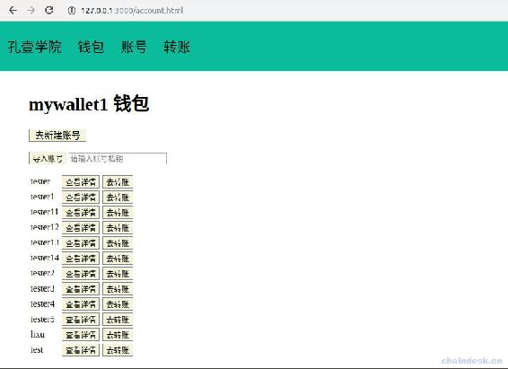

# 第七章 【EOS 钱包开发 七】新建账号：设置多权限配置

> 在上一章中我们学习到了如何创建钱包，以及导入私钥，那么这一章的重点就是管理钱包里的账号。

## 一、介绍说明

在开发账号模块之前，我们需要先用 cleos 工具帮我们创建一个账号，是什么原因需要它去创建和如何创建的请查看“使用 cleos 管理账号权限”章节的内容，这样我们才好使用开发的钱包项目查看账号详情以及创建账号。

创建账号属于一个交易，若使用 RPC 接口是非常的繁琐容易出错，这里我们使用 eosjs 库中封装的交易的接口，使用及其简单，eosjs 的使用说明请查看“深入浅出 EOSJS：连接到主网、测试网、交易”章节的内容。

本项目在配置 eos 对象时，获取了钱包里面所有的私钥进行配置，这样简化了用户每次交易都输入秘钥的操作，只需要输入钱包密码即可。

## 二、项目源码一：获取账号列表

账号模块的主要功能包括：

*   账号列表
*   通过私钥导入账号
*   新建账号
*   查看账号详情
    *   查询余额
    *   获取公私钥对
    *   查询权限配置

这部分源码先介绍获取账号列表的前后端实现。

### 1\. web.js

编辑 controllers 文件夹下的 web.js 文件，实现后端返回给前端账号列表的页面。

```js
module.exports = {
    ......

    getAccountHtml:async(ctx) => {
        await ctx.render("account.html")
    },
}
```

### 2\. account.js

在 controllers 文件夹下新建 account.js 文件，后端实现获取账号列表的功能。

```js
let httpRequest = require("../utils/httpRequest")
let config = require("../config/config")
let {success, fail} = require("../utils/myUtils")
let myUtils = require("../utils/myUtils")

module.exports = {
    //通过钱包名称获取账号列表
    accountListForWallet: async (ctx) => {
        console.log(JSON.stringify(ctx.request.body))
        let { wallet, password } = ctx.request.body
        //获取钱包管理的所有公私钥对
        let res = await httpRequest.postRequest(config.walletGetKeys, [wallet, password])

        let accountList = []
        if (res.code == 0) {
            for (const index in res.data) {
                let keys = res.data[index]
                console.log(keys[0])
                //查询公钥关联的所有账号
                let resData = await httpRequest.postRequest(config.accountListForKey, { "public_key": keys[0] })
                if (resData.code == 0) {
                    resData.data.account_names.forEach(account => {
                        //去重
                        if (accountList.indexOf(account) < 0) {
                            accountList.push(account)
                        }
                    })
                }
            };
        }
        console.log("accountList:", accountList)

        res.data = accountList
        ctx.body = res
    },
}
```

### 3\. router.js

将获取账号列表的接口绑定到路由。

```js
......

let accountController = require("../controllers/account")

//账号
router.post("/account/listforwallet", accountController.accountListForWallet)

//页面
router.get("/account.html", webController.getAccountHtml)
```

### 4\. account.html

在 views 文件夹下新建 account.html 文件，实现前端账号列表的页面。

```js
<html>

<head>
    <title>账号</title>
    <script src="js/lib/jquery-3.3.1.min.js"></script>
    <script src="/js/lib/jquery.url.js"></script>
    <script src="js/account.js"></script>
    <link rel="stylesheet" href="css/eoswallet.css">
</head>

<body>
    <%include block/nav.html%>

    <div id="main">
        <h1></h1>
        <div>
            <a href="/accountnew.html" class="button">去新建账号</a>
        </div>
        <br>

        <form id="account-import-form">
            <button type="submit">导入账号</button>
            <input type="text" name="wallet" hidden="hidden">
            <input type="text" name="privatekey" placeholder="请输入账号私钥">
        </form>

        <table id="account-list-table">
        </table>
    </div>
</body>

</html>
```

### 5\. account.js

在 static/js 文件夹下新建 account.js 文件，前端处理账号列表的网络请求与页面的渲染。

```js
function accountInfo(acocunt) {
    localStorage.setItem("currentAccount", acocunt)
    window.location.href = "/accountinfo.html"
}

function goTransaction(account) {
    localStorage.setItem("currentAccount", account)
    window.location.href = "/transaction.html"
}

$(document).ready(function () {
    let currentwallet = localStorage.getItem("currentwallet")
    $("h1").text(currentwallet+" 钱包")
    if (!currentwallet) {
        return
    }
    let walletPassword = localStorage.getItem(currentwallet)
    $("input[name=wallet][hidden=hidden]").val(currentwallet)

    //获取账号列表
    let params = {"wallet":currentwallet, "password":walletPassword}
    $.post("/account/listforwallet", params, function (res, status) {
        console.log(status + JSON.stringify(res))
        if (res.code == 0) {
            let accountTable = $("#account-list-table")
            res.data.forEach(account => {
                let accountTr = `
                    <tr>
                    <td>${account}</td>
                    <td><button onclick="accountInfo('${account}')">查看详情</button></td>
                    <td><button onclick="goTransaction('${account}')">去转账</button></td>
                </tr>`
                accountTable.append(accountTr)
            });

            sessionStorage.setItem(`wallet-${currentwallet}-accounts`, JSON.stringify(res.data))
        }
    })

    //导入账户
    $("#account-import-form").validate({
        rules: {
            privatekey: {
                required: true,
            },
        },
        messages: {
            privatekey: {
                required: "请输入要导入的账号的私钥",
            },
        },
        submitHandler: function (form) {
            $(form).ajaxSubmit({
                url: "/wallet/importkey",
                type: "post",
                dataType: "json",
                success: function (res, status) {
                    console.log(status + JSON.stringify(res))
                    alert(JSON.stringify(res.data))
                    if (res.code == 0) {
                        window.location.reload()
                    }
                },
                error: function (res, status) {
                    console.log(status + JSON.stringify(res))
                }
            });
        }
    })
})
```

## 三、项目源码二：新建账号

### 1\. web.js

编辑 controllers 文件夹下的 web.js 文件，实现后端返回给前端创建账号的页面。

```js
module.exports = {
    ......

    getAccountCreateHtml:async(ctx) =>　{
        await ctx.render("accountNew.html")
    },
}
```

### 2\. account.js

编辑 controllers 文件夹下的 account.js 文件，后端实现创建账号的功能。

```js
module.exports = {
    ......

    //创建账号
    accountCreate: async (ctx) => {
        console.log(JSON.stringify(ctx.request.body))
        let {account, creator, wallet, password, activepubkey, ownerpubkey} = ctx.request.body

        //１．获取钱包里面所有的私钥
        let privatekeyList = []
        let res = await httpRequest.postRequest(config.walletGetKeys, [wallet, password])
        if (res.code == 0 && res.data.length > 0) {
            for (const index in res.data) {
                let keys = res.data[index]
                privatekeyList.push(keys[1])
            }
            //2.设置创建账号默认的公钥
            let defaultKey = res.data[0][0]

            activepubkey = activepubkey || defaultKey
            ownerpubkey = ownerpubkey || defaultKey
        }

        console.log("privatekeyList:", privatekeyList)
        console.log("activepubkey:", activepubkey,"\n ownerpubkey:", ownerpubkey)

        //3.配置 EOSJS
        eos = myUtils.getEOSJS(privatekeyList)

        //4.交易（创建账号）
        let data = await eos.transaction(tr => {
            tr.newaccount({
                creator: creator,
                name: account,
                owner: ownerpubkey,
                active: activepubkey
            })

            tr.buyrambytes({
                payer: creator,
                receiver: account,
                bytes: 8192
            })

            tr.delegatebw({
                from: creator,
                receiver: account,
                stake_net_quantity: '10.0000 EOS',
                stake_cpu_quantity: '10.0000 EOS',
                transfer: 0
            })
        })
        // console.log(JSON.stringify(data))

        //5.返回给前端执行的状态
        let resData
        if (data) {
            resData = success("创建账号成功")
        } else {
            resData = fail("创建账号失败")
        }
        ctx.body = resData
    },
}
```

### 3\. router.js

将账号模块所有功能的接口绑定到路由。

```js
......

//账号
router.post("/account/create", accountController.accountCreate)

//页面
router.get("/accountnew.html", webController.getAccountCreateHtml)
```

### 4\. accountNew.html

在 views 文件夹下新建 accountNew.html 文件，实现前端创建账号的页面。

```js
<html>

<head>
    <title>新建账号</title>
    <script src="js/lib/jquery-3.3.1.min.js"></script>
    <script src="/js/lib/jquery.url.js"></script>
    <script src="js/accountNew.js"></script>
    <link rel="stylesheet" href="css/eoswallet.css">
</head>

<body>
    <%include block/nav.html%>

    <div id="main">
        <h1></h1>
        <h2>新建账号</h2>

        <form id="account-create-form">
            <input type="text" name="account" placeholder="请输入账号名称">
            <label>账号名称</label>
            <br><br>

            <select name="creator" id="account-create-creator-select">
            </select>
            <label>创建者名称</label>
            <br><br>

            <div>以下内容可以选择填写</div>

            <button type="button" onclick="createKey()">新建公钥私钥</button>
            <br>

            <input type="text" name="activepubkey" placeholder="请输入 active 权限的公钥">
            <label>active 公钥</label>
            <br>

            <input type="text" name="ownerpubkey" placeholder="请输入 owner 权限的公钥">
            <label>owner 公钥</label>
            <br><br>
            <input type="text" name="wallet" hidden="hidden">
            <input type="text" name="password" hidden="hidden">
            <button type="submit">新建账号</button>
        </form>

    </div>
</body>

</html>
```

### 5\. accountNew.js

在 static/js 文件夹下新建 accountNew.js 文件，前端处理新建账号的网络请求与页面的渲染。

```js
function createKey() {
    let currentwallet = localStorage.getItem("currentwallet")
    let params = {"wallet": currentwallet, "type":"k1"}
    $.post("/wallet/createkey", params, function (res, status) {
        console.log(status, JSON.stringify(res))
        alert(res.data)
    })
}

$(document).ready(function () {
    let currentwallet = localStorage.getItem("currentwallet")
    $("h1").text(currentwallet+" 钱包")
    if (!currentwallet) {
        return
    }

    let walletPassword = localStorage.getItem(currentwallet)

    $("input[name=wallet][hidden=hidden]").val(currentwallet)
    $("input[name=password][hidden=hidden]").val(walletPassword)

    //选择新建者账号列表
    let accountList = sessionStorage.getItem(`wallet-${currentwallet}-accounts`)
    accountList = JSON.parse(accountList)
    console.log("accountList",accountList)
    let accountSelectList = $("#account-create-creator-select")
    for(let i = 0; accountList && i < accountList.length; i++) {
        let account = accountList[i]
        let accountOption = `<option value="${account}">${account}</option>`
        accountSelectList.append(accountOption)
    }

    //新建账号
    $("#account-create-form").validate({
        rules: {
            name: {required: true,},
            creator: {required: true,},
        },
        messages: {
            name: {required: "请输入要新建的账号名称",},
            creator: {required: "该钱包没有可供新建账号的创者账号，可将该钱包的任意一个公钥发送给其它钱包新建该账号，或者导入其他账号的私钥到该钱包再进行新建账号"},
        },
        submitHandler: function (form) {
            $(form).ajaxSubmit({
                url: "/account/create",
                type: "post",
                dataType: "json",
                success: function (res, status) {
                    console.log(status + JSON.stringify(res))
                    if (res.code == 0) {
                        alert("账号新建成功")
                        window.location.href = history.go(-1);
                    }　else {
                        alert("账号新建失败")
                    }
                },
                error: function (res, status) {
                    console.log(status + JSON.stringify(res))
                    alert(res.data)
                }
            });
        }
    })
})
```

## 四、项目源码三：查看账号详情

### 1\. web.js

编辑 controllers 文件夹下的 web.js 文件，实现后端返回给前端账号详情的页面。

```js
module.exports = {
    ......

    getAccountInfoHtml:async(ctx) =>　{
        await ctx.render("accountInfo.html")
    },
}
```

### 2\. account.js

编辑 controllers 文件夹下的 account.js 文件，后端实现查看账号详情的功能。

```js
module.exports = {
    ......

    accountBalance: async (ctx) => {
        let {code, account} = ctx.request.body
        let params = {"code":code,"account":account}
        let res = await httpRequest.postRequest(config.accountBalance, params)

        let currencyList = []
        if (res.code == 0) {
            for (const index in res.data) {
                let currency = res.data[index] //"9996.0000 EOS"
                let currencys = currency.split(" ")//currencys[0]=9996.0000, currencys[1]=EOS
                currencyList.push({
                    "symbol":currencys[1], 
                    "amount":currencys[0]
                })
            }
        }
        res.data = currencyList
        console.log("currencyList:", currencyList)
        res.data = currencyList
        ctx.body = res
    },

    accountInfo: async (ctx) =>{
        let {account} = ctx.request.body
        let res = await httpRequest.postRequest(config.accountInfo, {"account_name":account})
        ctx.body = res
    },
}
```

### 3\. router.js

将查看账号详情的接口绑定到路由。

```js
......

//账号
router.post("/account/balance", accountController.accountBalance)
router.post("/account/info", accountController.accountInfo)

//页面
router.get("/accountinfo.html", webController.getAccountInfoHtml)
```

### 4\. accountInfo.html

在 views 文件夹下新建 accountInfo.html 文件，实现前端账号详情的页面。

```js
<html>

<head>
    <title>账号详情</title>
    <script src="js/lib/jquery-3.3.1.min.js"></script>
    <script src="/js/lib/jquery.url.js"></script>
    <script src="js/accountInfo.js"></script>
    <link rel="stylesheet" href="css/eoswallet.css">
</head>

<body>
    <%include block/nav.html%>

    <div id="main">
        <h1></h1>

        <table id="account-balance-table">
            <tr>
                <th>代币</th>
                <th>金额</th>
            </tr>
        </table>

        <table id="account-permission-table">
            <tr>
                <th>权限</th>
                <th>阈值</th>
                <th>公钥</th>
                <th>私钥</th>
                <th>权重</th>
            </tr>
        </table>

    </div>
</body>

</html>
```

### 5\. accountInfo.js

在 static/js 文件夹下新建 accountInfo.js 文件，前端处理查看账号详情的网络请求与页面的渲染。

```js
function getAccountPermissionPrivateKey(publicKey) {
    let currentwallet = localStorage.getItem("currentwallet")
    let currentPassword = localStorage.getItem(currentwallet)
    let params = {"wallet":currentwallet, "password":currentPassword, "publickey":publicKey}
    console.log(params)
    $.post("/wallet/privatekey", params, function (res, status) {
        console.log(status, JSON.stringify(res))
        alert(JSON.stringify(res.data))
    })
}

$(document).ready(function () {
    let currentAccount = localStorage.getItem("currentAccount")
    $("h1").text(currentAccount+" 账号")
    if (!currentAccount) {
        return
    }

    //账号金额
    let params = {"code":"eosio.token","account":currentAccount}
    $.post("/account/balance", params, function (res, status) {
        console.log(status + JSON.stringify(res))
        //后端返回的数据结构如下
        //[{"symbol":"EOS", "amout":100}, {"symbol":"SYS", "amount":200}]
        if (res.code == 0) {
            let balanceTable = $("#account-balance-table")
            res.data.forEach(balanceData => {
                let balanceTr = `<tr>
                    <td>${balanceData.symbol}</td>
                    <td>${balanceData.amount}</td>
                </tr>`
                balanceTable.append(balanceTr)
            });
        }
    })

    //账号权限详情
    $.post("/account/info", {"account":currentAccount}, function (res, status) {
        console.log(status + JSON.stringify(res))
        if (res.code == 0) {
            let permissionTable = $("#account-permission-table")
            for (const index in res.data.permissions) {
                let permission = res.data.permissions[index]
                let publicKey = permission.required_auth.keys[0].key
                let rowTr = `<tr>
                    <td>${permission.perm_name}</td>
                    <td>${permission.required_auth.threshold}</td>
                    <td>${publicKey}</td>
                    <td><button onclick="getAccountPermissionPrivateKey('${publicKey}')">点击查看</button></td>
                    <td>${permission.required_auth.keys[0].weight}</td>
                </tr>`
                permissionTable.append(rowTr)

                for(let i = 1; i < permission.required_auth.keys.length; i++) {
                    let keyData = permission.required_auth.keys[i]
                    let rowTr = `<tr>
                        <td></td>
                        <td></td>
                        <td>${keyData.key}</td>
                        <td><button onclick="getAccountPermissionPrivateKey('${keyData.key}')">点击查看</button></td>
                        <td>${keyData.weight}</td>
                    </tr>`
                    permissionTable.append(rowTr)
                };
            };
        }
    })
})
```

## 五、项目运行效果

1.  获取钱包 mywallet1 的账号列表如下



2.  新建账号的效果如下

    在 mywallet1 钱包中使用账号 lixu 新建账号 account1，控制的权限的两个公钥都是一样的，对应的私钥并且在 mywallet2 钱包中的，所以创建后将会在 mywallet2 钱包中看到该账号。

 15.50.17.gif)

3.  查看账号详情

    我们查看使用 cleos 配置的多个主体共同管理的账号 lixu，为了简化前端的代码量，只显示了主体是公钥的数据，并没有显示主体是账号的数据，其中的一个公私钥主体无权获取私钥，因为它没有到当前钱包中。

     15.58.20.gif)

**[项目源码 Github 地址](https://github.com/lixuCode/EOSWallet)**

**版权声明：博客中的文章版权归博主所有，未经授权禁止转载，转载请联系作者（微信：lixu1770105）取得同意并注明出处。**