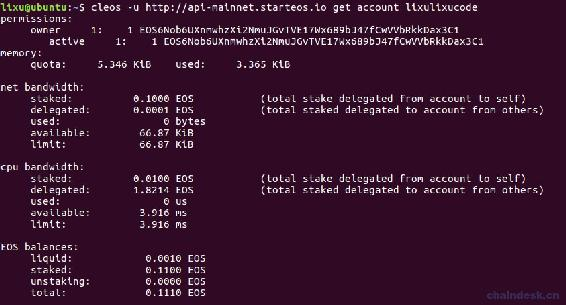
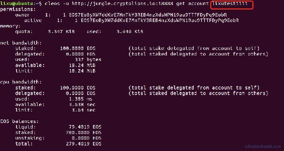
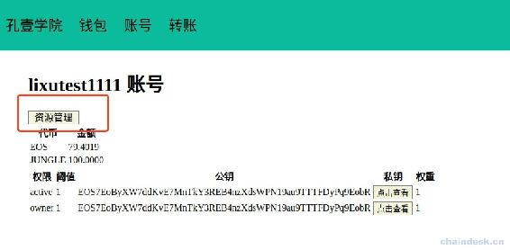
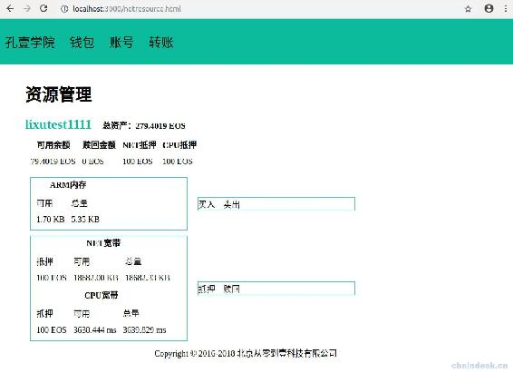

# 第十章 【EOS 钱包开发 十】详解与获取 RAM、NET、CPU 资源数据

## 课程目标

1.  账号在各种网络中的资源的区别
2.  理解 EOS 的网络资源 RAM、NET、CPU
3.  如何获取网络资源相应的数据
4.  详细说明网络资源数据的各项指标

## 前言

基于本地网络与真实的正式网络和测试网络在功能上有一个重要的区别：网络资源的利用机制。前面的课程在本地网络中的交易都是免费、没有限制资源的，但是在正式网络或测试网络中是需要消耗资源的，下面我们将介绍基于测试网络的资源管理。

## 一、账号在各种网络中的资源的区别

### 1\. 账号在本地网络中的资源

先来回顾一下前面章节“使用 cleos 管理账号权限”中查看账号“lixu”的权限分配，即“permissions“字段的内容，如下所示。


后面各项的含义如下：

*   memory: 是 RAM，即内存。
*   net bandwidth: 是 NET 宽带。
*   cpu bandwidth: 是 CPU 宽带。

RAM、NET、CPU 就是 EOS 中的网络资源，上图可以看到各项资源都是 unlimited，即无限制。

### 2\. 账号在正式网络中的资源

我们再来看一下正式网络中的账号“lixulixucode”详情，如下图。



可见在主网中的账号是需要消耗网络资源，并且是有限制的。

### 3\. 账号在测试网络中的资源

我们再来看一下测试网络中的账号详情，如下图。



可见在测试网中的账号是需要消耗网络资源，并且是有限制的。

### 4\. 结论

在实际的正式网络和测试网络中是需要购买或抵押才能获取资源的，并且是有限制的。下面我们基于测试网络来进行开发，它与正式网络一样，只需更换节点地址即可。

解释一下各个字段的含义

*   memory: RAM，即内存

    *   quota: 限使用的界限
    *   used: 用量
*   net bandwidth: 网络宽带

    *   staked: 自己账号购买的总量
    *   delegated: 其它账号购买的总量
    *   used: 已使用的量
    *   available: 剩余可用量
    *   limit: 限使用的界限
*   cpu bandwidth:CPU 宽带，子字段含义与 net bandwidth 一样。

*   EOS balances: EOS 的余额
    ​ liquid: 可用余额
    ​ staked: 购买资源的金额
    ​ total: 所有可用余额

## 二、EOS 的资源利用机制

我们知道，比特币和以太坊中的交易手续费机制，其目的就是防止大量交易使系统拥堵。而 EOS 取消了交易手续费，那么如何避免系统资源的滥用？因而 EOS 设计了一种新的资源使用机制：根据账户中 EOS 的数量来分配系统资源，包括：RAM(内存), Network BandWidth (NET 带宽) 以及 CPU BandWidth (CPU 带宽）。

### 1\. RAM(内存)：

在 EOS 中, RAM(内存)的主要特点包括：

*   要将数据存储在区块链中需要消耗 RAM，比如在 EOS 中转账、购买资源、投票等操作的时候，都有可能会消耗 RAM (内存)。
*   如果你的 RAM 消耗殆尽，那么你是无法进行上述这些需要消耗 RAM 的操作的，所以我们需要有足够的 RAM。
*   通过购买获得的 EOS RAM 资源可以买卖，买卖的价格根据市场行情动态调节，这个特点与买卖 EOS 一样。
*   RAM 可以通过 EOS 购买的方式获得也可以通过好友帮你购买，这个特点和通过抵押方式获取 CPU 资源以及 NET 资源不太一样。
*   用户在买卖 RAM 资源的时候，各需要消耗 0.5 % (千分之五) 的手续费，总共是 1% 的手续费。这笔费用被存在 eosio.ramfee 中，由 BP 节点进行管理。
*   内存是消耗资源，不可赎回，只能买卖。
*   RAM 本质上是为智能合约中调用的每个交易提供资源的 gas。

### 2\. NET 带宽与 CPU 带宽

在 EOS 中，NET 带宽与 CPU 带宽的特性差不多，它们的主要特点包括：

*   它们采用抵押 EOS 的方式获取。当不再需要 CPU 与带宽时，抵押的 EOS 通证可以赎回，在赎回的时候，存在三天的赎回期。
*   如果你持有全网 1%的 EOS，那就可以抵押这些 EOS 来获得全网 1%的 CPU 和带宽。这样就可以隔离开所有的 DAPP，防止资源竞争和恶意的 DDOS 供给，无论其他的 DAPP 如何拥堵， 你自己的带宽都不受影响。
*   每次使用转账功能时，都会消耗网络带宽资源。
*   网络带宽取决于过去三天消费的平均值，作为你下一次执行操作的费率。
*   如果没有足够的网络带宽资源的话，你是无法使用 EOS 网络转账等基本功能的。
*   带宽资源是可以随着时间的推移，自动释放。
*   NET 带宽用于增加算力，CPU 带宽增加网络资源

## 三、项目中获取各种资源数据

通过查看账号“lixulixu1111”，会触发如下方法

```js
accountInfo: async (ctx) =>{
        let {account} = ctx.request.body
        let res = await httpRequest.postRequest(config.accountInfo, {"account_name":account})
        ctx.body = res
    }, 
```

res 是返回给前端的数据，如下

```js
{
    "code": 0,
    "status": "success",
    "data": {
        "account_name": "lixutest1111",
        "head_block_num": 22394902,
        "head_block_time": "2018-11-02T02:19:01.000",
        "privileged": false,
        "last_code_update": "1970-01-01T00:00:00.000",
        "created": "2018-11-01T09:29:34.500",
        "core_liquid_balance": "79.4019 EOS",
        "ram_quota": 5475,
        "net_weight": 1000000,
        "cpu_weight": 1000000,
        "net_limit": {
            "used": 337,
            "available": 19130455,
            "max": 19130792
        },
        "cpu_limit": {
            "used": 1385,
            "available": 3638461,
            "max": 3639846
        },
        "ram_usage": 3734,
        "permissions": [
            {
                "perm_name": "active",
                "parent": "owner",
                "required_auth": {
                    "threshold": 1,
                    "keys": [
                        {
                            "key": "EOS7EoByXW7ddKvE7MnTkY3REB4nzXdsWPN19au9TTTFDyPq9EobR",
                            "weight": 1
                        }
                    ],
                    "accounts": [],
                    "waits": []
                }
            },
            {
                "perm_name": "owner",
                "parent": "",
                "required_auth": {
                    "threshold": 1,
                    "keys": [
                        {
                            "key": "EOS7EoByXW7ddKvE7MnTkY3REB4nzXdsWPN19au9TTTFDyPq9EobR",
                            "weight": 1
                        }
                    ],
                    "accounts": [],
                    "waits": []
                }
            }
        ],
        "total_resources": {
            "owner": "lixutest1111",
            "net_weight": "100.0000 EOS",
            "cpu_weight": "100.0000 EOS",
            "ram_bytes": 4075
        },
        "self_delegated_bandwidth": {
            "from": "lixutest1111",
            "to": "lixutest1111",
            "net_weight": "100.0000 EOS",
            "cpu_weight": "100.0000 EOS"
        },
        "refund_request": null,
        "voter_info": {
            "owner": "lixutest1111",
            "proxy": "",
            "producers": [],
            "staked": 2200000,
            "last_vote_weight": "0.00000000000000000",
            "proxied_vote_weight": "0.00000000000000000",
            "is_proxy": 0,
            "reserved1": 0,
            "reserved2": 0,
            "reserved3": "0 "
        }
    }
} 
```

这样的输出其实和 cleos 命令行加上“-j”一样，`cleos -u http://jungle.cryptolions.io:18888 get account lixutest1111 -j`。

下面获取我们需要的数据：

*   账号名称："account_name": "lixutest1111"。
*   可用余额："core_liquid_balance": "79.4019 EOS"。
*   RAM 总量："ram_quota": 5475，注意单位是 byte，相当于 5475/1024=5.35KB。
*   RAM 已用量："": 3734，注意单位是 byte，相当于 3734/1024=3.65KB。
*   RAM 可卖量：ram_quota - ram_usage = 5475 - 3734 = 1.74KB。
*   NET 宽带抵押金额："net_weight": 1000000，注意是使用的最小单位，其精度是 4 位小数，相当于 1000000/10000=100EOS。
*   NET 宽带总量："net_limit": {"max": 19130792}，相当于 19130792/1024=18682.41KB。
*   NET 宽带已用量："net_limit": {"used": 337}，相当于 337/1024=0.33KB。
*   NET 可赎回量："self_delegated_bandwidth": {"net_weight": "100.0000 EOS",}。
*   CPU 宽带抵押金额："cpu_weight": 1000000，注意是使用的最小单位，其精度是 4 位小数，相当于 1000000/10000=100EOS。
*   CPU 宽带总量："cpu_limit": {"max": 3639846}，注意单位是微妙，换算成毫秒，为 3639846/1000 = 3639.846 ms，它会根据价格变化。
*   CPU 宽带已用量："cpu_limit": {"used": 1385}，注意单位是微妙，换算成毫秒，为 1385/1000 = 1.385 ms，它会根据价格变化。
*   CPU 可赎回量："self_delegated_bandwidth": {"cpu_weight": "100.0000 EOS",}。
*   可抵押金额：相当于就是可用余额，79.4019 EOS。

*   总抵押金额：NET 宽带抵押金额+CPU 宽带抵押金额 = 200EOS。

*   总资产：总抵押金额+可用余额 = 200+79.4019 = 279.4019EOS。

## 四、项目源码

后端无需作更改，只需增加一个资源管理的页面，入口在账号详情里面。

### 1\. views/accountInfo.html

添加一个 a 标签可跳转到资源管理页面。

```js
......
<h1></h1>

<a class=button href="/netresource.html">资源管理</a>

<table id="account-balance-table">
...... 
```

### 2\. router/router.js

将资源管理页面的接口绑定到路由。

```js
......

router.get("/netresource.html", webController.getNetRosourceHtml) 
```

### 3\. controllers/web.js

返回资源管理页面。

```js
......
getNetRosourceHtml:async(ctx) =>　{
    await ctx.render("netResource.html")
}, 
```

### 4\. views/netResource.html

在 views 文件夹下新建 netResource.html 文件，实现资源管理页面的显示。

```js
<html>

<head>
    <title>资源管理</title>
    <script src="js/lib/jquery-3.3.1.min.js"></script>
    <script src="/js/lib/jquery.url.js"></script>
    <script src="js/netResource.js"></script>
    <link rel="stylesheet" href="css/eoswallet.css">
    <style>
        #current-account {
            color:#0abc9c;
            font-size:26px;
        }
        #net-resource-content {
            display: flex;
            flex-wrap: wrap;
            width: 700px;
        }

        #net-resource-content>div {
            margin: 10px 10px 0 10px;
            border: #37cad2 1px solid;
            width: 300px;
        }
        .interactive {
            align-self: center;
        }
    </style>
</head>

<body>
    <%include block/nav.html%>

    <div id="main">
        <h1>资源管理</h1>

        <b id="current-account"></b> <b>　总资产：<span id="my-total-balance"></span></b>
        <table cellspacing="10">
            <tr>
                <th>可用余额</th>
                <th>赎回金额</th>
                <th>NET 抵押</th>
                <th>CPU 抵押</th>
            </tr>
            <tbody id="my-balance-table"></tbody>
        </table>

        <div id="net-resource-content">
            <div>
                <table cellspacing="10">
                    <caption><b>RAM 内存</b></caption>
                    <tr>
                        <td>可用</td>
                        <td>总量</td>
                    </tr>
                    <tbody id="my-ram-table"></tbody>
                </table>
            </div>
            <div class="interactive">
                <div>买入 卖出</div>
            </div>

            <div>
                <table cellspacing="10">
                    <caption><b>NET 宽带</b></caption>
                    <tr>
                        <td>抵押</td>
                        <td>可用</td>
                        <td>总量</td>
                    </tr>
                    <tbody id="my-net-table"></tbody>
                </table>

                <table cellspacing="10">
                    <caption><b>CPU 宽带</b></caption>
                    <tr>
                        <td>抵押</td>
                        <td>可用</td>
                        <td>总量</td>
                    </tr>
                    <tbody id="my-cpu-table"></tbody>
                </table>
            </div>
            <div class="interactive">
                <div>抵押　赎回</div>
            </div>
        </div>

        <div style="position: fixed;left: 30%;bottom:30px;">Copyright © 2016-2018 北京从零到壹科技有限公司</div>
    </div>
</body>

</html> 
```

### 5\. static/js/netResource.js

对资源管理页面进行网络请求处理与页面渲染。

```js
$(document).ready(function () {
    let currentAccount = localStorage.getItem("currentAccount")
    $("#current-account").text(currentAccount)

    //我的网络资源详情 ramAvailable
    $.post("/account/info", { "account": currentAccount }, function (res, status) {
        console.log(status + JSON.stringify(res))
        if (res.code == 0) {
            let data = res.data

            let availableBalance = 0.0
            if (data.core_liquid_balance) {
                availableBalance = parseFloat(data.core_liquid_balance.slice(0,-4))
            }
            let redeemBalance = 0
            let netBalance = data.net_weight / 10000
            let cpuBalance = data.cpu_weight / 10000
            //总资产
            let totalBalance = availableBalance + redeemBalance + netBalance + cpuBalance
            $("#my-total-balance").text(totalBalance + " EOS")

            //余额
            let myBalanceTable = $("#my-balance-table")
            let rowTr = `<tr>
                    <td>${availableBalance} EOS</td>
                    <td>${redeemBalance} EOS</td>
                    <td>${netBalance} EOS</td>
                    <td>${cpuBalance} EOS</td>
                </tr>`
            myBalanceTable.append(rowTr)

            //RAM
            let ramAvailable = (data.ram_quota - data.ram_usage) / 1024
            let ramTotal = data.ram_quota / 1024
            let myramTable = $("#my-ram-table")
            rowTr = `<tr>
                    <td>${ramAvailable.toFixed(2)} KB</td>
                    <td>${ramTotal.toFixed(2)} KB</td>
                </tr>`
            myramTable.append(rowTr)

            //NET
            let netAvailable = (data.net_limit.max - data.net_limit.used)/1024           
            let netTotla = data.net_limit.max/1024            
            let myNetTable = $("#my-net-table")
            rowTr = `<tr>
                    <td>${netBalance} EOS</td>
                    <td>${netAvailable.toFixed(2)} KB</td>
                    <td>${netTotla.toFixed(2)} KB</td>
                </tr>`
            myNetTable.append(rowTr)

            //CPU
            let cpuAvailable = (data.cpu_limit.max - data.cpu_limit.used) / 1000     
            let cpuTotla = data.cpu_limit.max / 1000        
            let myCpuTable = $("#my-cpu-table")
            rowTr = `<tr>
                    <td>${cpuBalance} EOS</td>
                    <td>${cpuAvailable} ms</td>
                    <td>${cpuTotla} ms</td>
                </tr>`
            myCpuTable.append(rowTr)   
        }
    })

}) 
```

## 五、项目效果

这是入口位置



网络资源管理页面如下



## 六、小结

现在我们获取了基于测试网络的账号的网络资源数据，并且进行了显示，剩下的买入、卖出、抵押、赎回将在下一章介绍。

至此，我们已经掌握在本地网络、测试网络创建自己的第一个账号的方法，在主网中如何拥有自己的第一个账号呢？如果没有账号的，可以加孔壹学院莉莉微信：`kongyixueyuan`，或者博主微信：`lixu1770105`代替创建，若在 imToken 等平台创建需要花费 20EOS 左右，不建议委托其它第三方网站创建。我们使用现在开发的 EOS 钱包应用程序进行创建，将使用最低昂的费用创建。

**[项目源码 Github 地址](https://github.com/lixuCode/EOSWallet)**

**版权声明：博客中的文章版权归博主所有，未经授权禁止转载，转载请联系作者（微信：lixu1770105）取得同意并注明出处。**