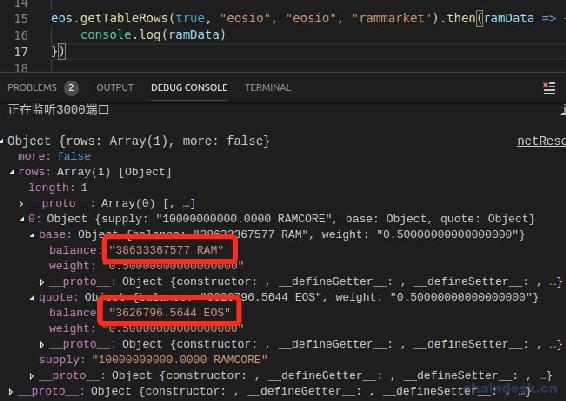
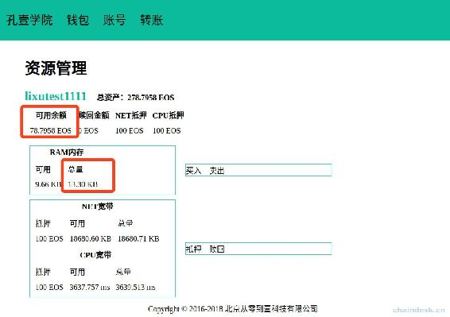
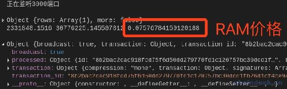
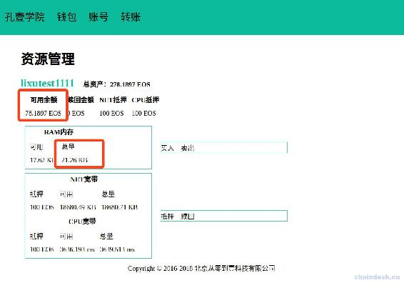
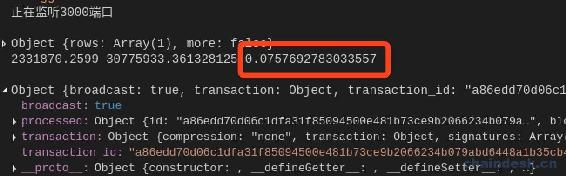
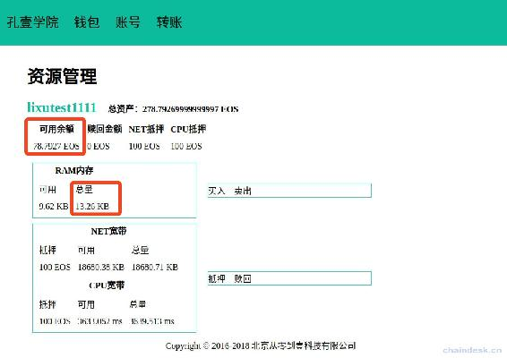
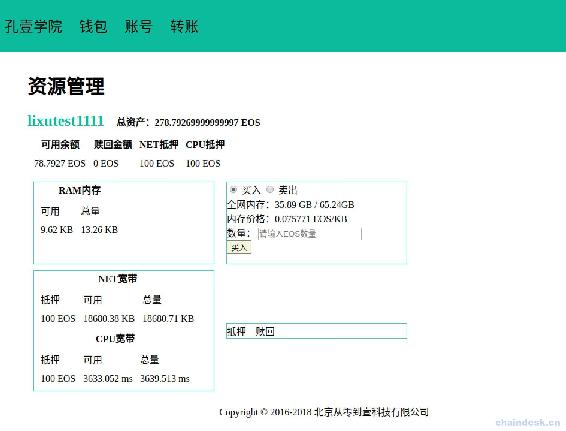

# 第十一章 【EOS 钱包开发 十一】买入卖出 RAM

## 课程目标

1.  如何获取全网 RAM 相关的公共数据
2.  如何使用 Bancor 算法计算实时的 RAM 价格
3.  如何购买 RAM
4.  如何卖出 RAM

## 前言

现在我们能获取到了基于测试网络的账号的网络资源数据，现在我们就介绍如何交易 RAM。

交易 RAM 的前提是我们需要知道它的价格，即买 1KB 内存需要花费多少 EOS，卖 1 个 EOS 能获取多少内存。这就需要我们去链上查询数据库获取相应的实时的数据，再进行计算拿到单价。下面我们来一步步实现，最后展示在项目中的相应源码。

## 一、获取全网 RAM 数量

全网 RAM 数量的数据是存在数据库中的，需要使用 eosjs 库的 getTableRows 方法获取，或者 RPC 的 chain/get_table_rows 接口获取。下面会有 eosjs 进行交易，所以本章我们统一使用 eosjs 访问数据，可以到官网查看[eosjs-api 接口文档](https://github.com/EOSIO/eosjs-api/blob/f0077306c7bbde4dd4e1ebaa7de52d5827613842/docs/api.md#getTableRowsResult)。

首先访问主网中 RAM 的数量。

```js
Eos = require('eosjs')

eosconfig = {
    httpEndpoint: 'https://node1.zbeos.com',
    chainId: 'aca376f206b8fc25a6ed44dbdc66547c36c6c33e3a119ffbeaef943642f0e906',

    // keyProvider: privatekeyList, // WIF string or array of keys..
    expireInSeconds: 60,
    broadcast: true,
    verbose: false, // API activity
    sign: true
},
eos = Eos(eosconfig)

eos.getTableRows(true,"eosio","eosio","global").then(result => {
    console.log(result)
}) 
```

输出如下

```js
{ rows:
   [ { max_block_net_usage: 1048576,
       target_block_net_usage_pct: 1000,
       max_transaction_net_usage: 524288,
       base_per_transaction_net_usage: 12,
       net_usage_leeway: 500,
       context_free_discount_net_usage_num: 20,
       context_free_discount_net_usage_den: 100,
       max_block_cpu_usage: 200000,
       target_block_cpu_usage_pct: 2000,
       max_transaction_cpu_usage: 150000,
       min_transaction_cpu_usage: 100,
       max_transaction_lifetime: 3600,
       deferred_trx_expiration_window: 600,
       max_transaction_delay: 3888000,
       max_inline_action_size: 4096,
       max_inline_action_depth: 4,
       max_authority_depth: 6,
       max_ram_size: '88414727168',
       total_ram_bytes_reserved: '49777052734',
       total_ram_stake: '26261375993',
       last_producer_schedule_update: '2018-11-05T06:57:51.000',
       last_pervote_bucket_fill: '1541399606000000',
       pervote_bucket: 219209992,
       perblock_bucket: 36804696,
       total_unpaid_blocks: 95761,
       total_activated_stake: '4035546740321',
       thresh_activated_stake_time: '1529505892000000',
       last_producer_schedule_size: 21,
       total_producer_vote_weight: '24124687214114213888.00000000000000000',
       last_name_close: '2018-11-05T02:08:26.000' } ],
  more: false } 
```

其中“max_ram_size“字段的数据就是全网 RAM 的数量，单位是 bytes，那么转换为 G，则结果为：`88402589696/(1024*1024*1024)=82.34263134002686 G`。获取方式如下：

```js
eos.getTableRows(true,"eosio","eosio","global").then(result => {
    //ram 总量，bytes 转为 G
    let ramTotal = result.rows[0].max_ram_size / (1024*1024*1024)  
}) 
```

## 二、获取 RAM 使用量、计算 RAM 价格

与获取 RAM 总量一样，我们使用 eosjs 库的 getTableRows 方法获取主网中 RAM 的使用量、消耗 RAM 的 EOS 数量，最后通过 Bancor 算法计算 RAM 价格。

```js
eosconfig = {
    httpEndpoint: 'https://node1.zbeos.com',
    chainId: 'aca376f206b8fc25a6ed44dbdc66547c36c6c33e3a119ffbeaef943642f0e906',

    // keyProvider: privatekeyList, // WIF string or array of keys..
    expireInSeconds: 60,
    broadcast: true,
    verbose: false, // API activity
    sign: true
},
eos = Eos(eosconfig)

eos.getTableRows(true, "eosio", "eosio", "rammarket").then(ramData => {
    console.log(ramData)
}) 
```

输出如下



*   其中“base“字段里的“balance”数据就是全网 RAM 的使用量，单位是 bytes。
*   “quote“字段里的“balance”数据就是消耗 RAM 的 EOS 数量。

下面根据 Bancor 算法算出 RAM 的价格

```js
ramPrice = quote.balance / (base.balance / 1024) 
```

Bancor 协议是底层货币协议，通过区块链技术和智能合约为加密数字货币提供连续流动性和实现异步价格。

所以 ramPrice 的获取方式如下：

```js
eos.getTableRows(true, "eosio", "eosio", "rammarket").then(ramData => {
    console.log(ramData)
    //RAM 消耗的 EOS 数量
    let eosAmount = ramData.rows[0].quote.balance.split(" ")[0];
    //RAM 使用量
    let ramAmount = ramData.rows[0].base.balance.split(" ")[0] / 1024;
    //RAM 价格
    let ramPriceWithEOS = eosAmount / ramAmount
    console.log(eosAmount, ramAmount, ramPriceWithEOS);
}) 
```

## 三、买入 RAM

买入 RAM 的 API 其实我们已经使用过了，在创建账号的时候我们为别人创建的账号就需要为它购买一定的 RAM，现在我们在来单独调用购买的 API。由于现在需要交易，所以会使用资源，因此我们重新配置一下 eosconfig 切换到测试网络进行测试。

```js
eosconfig = {
    httpEndpoint:"http://jungle.cryptolions.io:18888",
    chainId: "038f4b0fc8ff18a4f0842a8f0564611f6e96e8535901dd45e43ac8691a1c4dca", // 32 byte (64 char) hex string
    keyProvider: ["5HqCj7sg4K2xZ1KD5sSH38kuJkKGqfE1wSGiLL3M599ajacVmTs"], 
    expireInSeconds: 60,
    broadcast: true,
    verbose: false, // API activity
    sign: true
},

eos = Eos(eosconfig)

eos.getTableRows(true, "eosio", "eosio", "rammarket").then(ramData => {
    console.log(ramData)
    //RAM 消耗的 EOS 数量
    let eosAmount = ramData.rows[0].quote.balance.split(" ")[0];
    //RAM 使用量
    let ramAmount = ramData.rows[0].base.balance.split(" ")[0] / 1024;
    //RAM 价格
    let ramPriceWithEOS = eosAmount / ramAmount
    console.log(eosAmount, ramAmount, ramPriceWithEOS);
})

let account = "lixutest1111"
let ramAmount = 8*1024
async function buyRAM() {
    result = await eos.transaction(tr => {
        tr.buyrambytes({
            payer: account,
            receiver: account,
            bytes: ramAmount
        })
    })
    console.log(result)
}
buyRAM() 
```

在运行之前先记录下来账号“lixutest1111”的网络资源数据。



运行后看到价格是 0.07576784159120188 EOS/KB



代码中是买了 8KB 的 RAM，那我们计算一下，需要花费多少 EOS，其实很简单

```js
8KB * 0.07576784159120188 EOS/KB = 0.6061EOS 
```

那我们再计算一下账号“lixutest1111”现在的 EOS 可用余额和 RAM 总量是多少

```js
78.7959 - 0.6061 = 78.1898EOS
13.30 + 8 = 21.30KB 
```

计算好以后我们再看看现在账号“lixutest1111”的在链上的资源数据是多少。



可以发现计算的结果和链上的结果有了一定的偏差，这是因为 RAM 价格会随着市场波动而变化，所以导致结果有一点点偏差，这是不可避免的。另外我们在购买 RAM 的时候，需要输入的是 EOS 数量，然后根据 RAM 价格转换成需要购买的 RAM 大小，再进行交易。

## 四、卖出 RAM

卖出 RAM 需要用到另外一个方法 `sellram`

```js
eosconfig = {
    httpEndpoint: "http://jungle.cryptolions.io:18888",
    chainId: "038f4b0fc8ff18a4f0842a8f0564611f6e96e8535901dd45e43ac8691a1c4dca", // 32 byte (64 char) hex string
    keyProvider: ["5HqCj7sg4K2xZ1KD5sSH38kuJkKGqfE1wSGiLL3M599ajacVmTs"],
    expireInSeconds: 60,
    broadcast: true,
    verbose: false, // API activity
    sign: true
},

    eos = Eos(eosconfig)

eos.getTableRows(true, "eosio", "eosio", "rammarket").then(ramData => {
    console.log(ramData)
    //RAM 消耗的 EOS 数量
    let eosAmount = ramData.rows[0].quote.balance.split(" ")[0];
    //RAM 使用量
    let ramAmount = ramData.rows[0].base.balance.split(" ")[0] / 1024;
    //RAM 价格
    let ramPriceWithEOS = eosAmount / ramAmount
    console.log(eosAmount, ramAmount, ramPriceWithEOS);
})

let account = "lixutest1111"
let ramAmount = 8*1024
async function sellRAM() {
    result = await eos.transaction(tr => {
        tr.sellram({
            account: account,
            bytes: ramAmount
        })
    })
    console.log(result)
}
sellRAM() 
```

运行后看到价格是 0.0757692783033557 EOS/KB，确实与上一次获取到的价格有点偏差。



这里就不花时间作计算了，大家可以在根据价格与出售量计算在做比较。重新查看账号“lixutest1111”的 EOS 数量多了 0.6，RAM 内存减少了 8KB。



## 五、项目源码

### 1\. controllers/netResource.js

在 controllers 文件夹下新建 netResource.js 文件，实现获取全局 RAM 数据与买入卖出 RAM 的功能。

```js
let { success, fail } = require("../utils/myUtils")
let myUtils = require("../utils/myUtils")
let walletModel = require("../models/wallet")

async function getRamInfo() {
    ramData = await eos.getTableRows(true, "eosio", "eosio", "rammarket")
    //RAM 消耗的 EOS 数量
    let eosAmount = ramData.rows[0].quote.balance.split(" ")[0];
    //RAM 使用量
    let ramAmount = ramData.rows[0].base.balance.split(" ")[0] / 1024;
    //RAM 价格
    let ramPriceWithEOS = eosAmount / ramAmount
    console.log(eosAmount, ramAmount, ramPriceWithEOS);
    return {
        ramUsed: ramAmount / (1024 * 1024),
        ramPrice: ramPriceWithEOS,
    }
}

module.exports = {
    netResourceGetRAMInfo: async (ctx) => {
        console.log(ctx.request.body)
        let { wallet, password } = ctx.request.body
        //获取钱包里面所有的私钥配置 EOSJS
        let privatekeyList = await walletModel.getWalletPrivatekeyList(wallet, password)
        eos = myUtils.getEOSJS(privatekeyList)

        let ramData = await eos.getTableRows(true, "eosio", "eosio", "global")
        //ram 总量，bytes 转为 G
        let ramTotal = ramData.rows[0].max_ram_size / (1024 * 1024 * 1024)
        console.log(ramTotal);

        let ramInfo = await getRamInfo()
        ctx.body = success({
            ramPrice: ramInfo.ramPrice,
            ramTotal: ramTotal,
            ramAvailable: ramTotal - ramInfo.ramUsed,
        })
    },

    netResourceTransactionRAM: async (ctx) => {
        console.log(ctx.request.body)
        let { amount, transaction_type, account, wallet, password } = ctx.request.body
        //获取钱包里面所有的私钥配置 EOSJS
        let privatekeyList = await walletModel.getWalletPrivatekeyList(wallet, password)
        eos = myUtils.getEOSJS(privatekeyList)

        let result
        if (transaction_type == '1') {
            //买 RAM
            console.log("买 RAM")
            let ramInfo = await getRamInfo()
            let ramAmount = parseInt((amount / ramInfo.ramPrice) * 1024)
            console.log("ramAmount:", ramAmount)
            result = await eos.transaction(tr => {
                tr.buyrambytes({
                    payer: account,
                    receiver: account,
                    bytes: ramAmount
                })
            })
        } else {
            //卖 RAM
            console.log("卖 RAM")
            let ramAmount = parseInt(amount*1024)
            result = await eos.transaction(tr => {
                tr.sellram({
                    account: account,
                    bytes: ramAmount 
                })
            })
        }

        console.log("data:", result)
        if (result.broadcast) {
            ctx.body = success("ok")
        } else {
            ctx.body = fail("error")
        }
    }

} 
```

### 2\. router/router.js

将获取全局 RAM 数据与买入卖出 RAM 的接口绑定到路由。

```js
......
let netresourceController = require("../controllers/netResource")

//网络资源
router.post("/net_resource/ram/info", netresourceController.netResourceGetRAMInfo)
router.post("/net_resource/ram/transaction", netresourceController.netResourceTransactionRAM) 
```

### 3\. views/netResource.html

编辑 views 文件夹下的 netResource.html 文件，实现 RAM 交易的表单显示。

```js
......

<div class="interactive">
    <form id="ram-transaction">
        <input type="radio" id="ram-transaction-buy" name="transaction_type" value="1" checked="checked">
        <label for="ram-transaction-buy">买入</label>

        <input type="radio" id="ram-transaction-sell" name="transaction_type" value="2" 　checked>
        <label for="ram-transaction-sell">卖出</label>
        <br>

        <div>全网内存：<span id="ram-total"></span></div>
        <div>内存价格：<span id="ram-price"></span> EOS/KB</div>

        <label>数量：</label>
        <input type="text" name="amount" placeholder="请输入 EOS 数量"><br>

        <input type="text" name="account" hidden="hidden">
        <input type="text" name="wallet" hidden="hidden">
        <input type="text" name="password" hidden="hidden">
        <button type="submit" id="ram-transaction-button">买入</button>
    </form>
</div>

...... 
```

### 4\. static/js/netResource.js

对全局 RAM 数据与买入卖出 RAM 的表单进行网络请求处理与页面渲染。

```js
$(document).ready(function () {
    ......

    $("input[name=account][hidden=hidden]").val(currentAccount)
    let currentwallet = localStorage.getItem("currentwallet")
    let walletPassword = localStorage.getItem(currentwallet)
    $("input[name=wallet][hidden=hidden]").val(currentwallet)
    $("input[name=password][hidden=hidden]").val(walletPassword)

    $("input[name=transaction_type]").change(function () {
        if (this.value == 1) {
            $("#ram-transaction-button").text("买入")
            $("input[name=amount]").attr({"placeholder":"请输入 EOS 数量"})
        } else {
            $("#ram-transaction-button").text("卖出")
            $("input[name=amount]").attr({"placeholder":"请输入 RAM(KB)数量"})

        }
    })

    //ram 全局数据
    $.post("/net_resource/ram/info", { "account": currentAccount }, function (res, status) {
        console.log(status + JSON.stringify(res))
        if (res.code == 0) {
            $("#ram-total").text(res.data.ramAvailable.toFixed(2) + " GB / " + res.data.ramTotal.toFixed(2) + "GB")
            $("#ram-price").text(res.data.ramPrice.toFixed(6))
        }
    })

    //交易 RAM
    $("#ram-transaction").validate({
        rules: {
            amount: {required: true,},
        },
        messages: {
            name: {required: "请输入要交易的数量",},
        },
        submitHandler: function (form) {
            $(form).ajaxSubmit({
                url: "/net_resource/ram/transaction",
                type: "post",
                dataType: "json",
                success: function (res, status) {
                    console.log(status + JSON.stringify(res))
                    if (res.code == 0) {
                        alert("交易成功")
                        location.reload() 
                    }　else {
                        alert("交易失败")
                    }
                },
                error: function (res, status) {
                    console.log(status + JSON.stringify(res))
                    alert(res.data)
                }
            });
        }
    })
}) 
```

## 六、项目效果



**[项目源码 Github 地址](https://github.com/lixuCode/EOSWallet)**

**版权声明：博客中的文章版权归博主所有，未经授权禁止转载，转载请联系作者（微信：lixu1770105）取得同意并注明出处。**