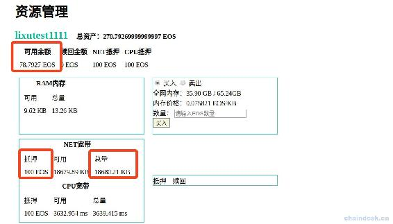
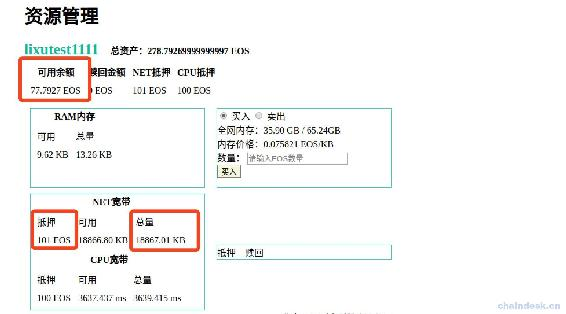
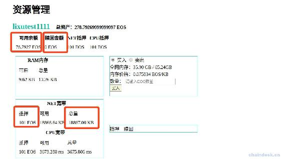
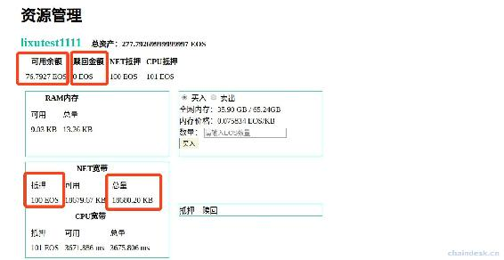
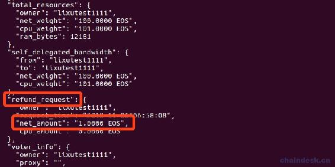
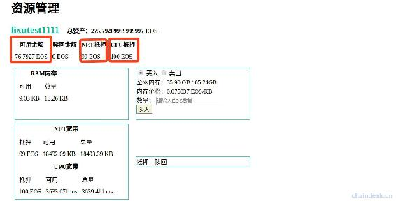
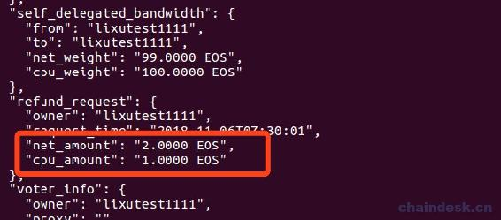
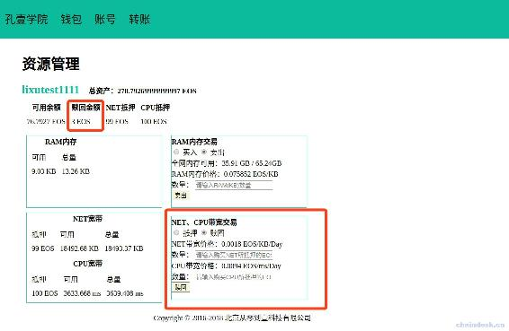

# 第十二章 【EOS 钱包开发 十二】抵押和赎回 NET 与 CPU 带宽

## 课程目标

1.  计算 NET 带宽价格
2.  计算 CPU 带宽价格
3.  抵押 EOS 获取 NET 带宽
4.  抵押 EOS 获取 CPU 带宽
5.  赎回 NET 带宽与获取赎回金额
6.  赎回 CPU 带宽

## 前言

现在我们能对 RAM 进行交易了，还差的 NET、CPU 交易将是本章重点。

同样，交易 NET、CPU 贷款的前提是我们需要知道它的价格，即买 1KB NET 带宽和 1ms CPU 带宽需要抵押多少 EOS，赎回 1 个 EOS 能获得多少 NET、CPU 带宽。这就需要我们去链上查询数据库获取相应的实时的数据，再进行计算拿到价格。下面我们来一步步实现，最后展示在项目中的相应源码。

## 一、计算 NET、CPU 带宽价格

RPC 和 eosjs 都没有提供 API 直接获取价格，那我们如何获取带宽的价格呢？我们可以通过特定的规则去计算 NET、CPU 带宽的价格。

### 1\. 计算 NET 带宽价格

在前面“详解与获取 RAM、NET、CPU 资源数据”章节的学习中我们已经可以获取账号的网络资源详情了，包含 NET 宽带抵押金额和 NET 宽带总量。通过这个算法`（NET 宽带抵押金额 / NET 宽带总量）/ 3`即可获取到 NET 宽带价格了。

```js
let httpRequest = require("../utils/httpRequest")
let config = require("../config/config")

async function testGetNetPrice() {
    let account = "lixutest1111"
    let res = await httpRequest.postRequest(config.accountInfo, { "account_name": account })
    if (res.code == 0) {
        data = res.data
        //抵押 NET 的 EOS 数量
        var netBalance = data.net_weight / 10000
        //NET 贷款的总量
        var netTotal = data.net_limit.max / 1024
        //(netBalance / netTotal)获取到的是过去 3 天内的平均消耗量，除以３获取每天的平均消耗量，即价格
        netPrice = ((netBalance / netTotal) / 3).toFixed(4)
        console.log(netBalance, netTotal, netPrice)
    }
}
testGetNetPrice() 
```

输出如下

```js
100 18680.2177734375 '0.00178442' 
```

可以看到连接到的测试网络计算得到的 NET 价格为 0.00178442，单位是 EOS/KB/Day。

另外，修改 config 配置连接到主网后计算的价格是“0.0004887”左右。所以测试网络和主网的 NET 带宽价格相差很大。

### 2\. 计算 CPU 带宽价格

计算 CPU 带宽价格的方式与 NET 带宽类似，我们直接看测代码。

```js
let httpRequest = require("../utils/httpRequest")
let config = require("../config/config")

async function testGetCpuPrice() {
    let account = "lixutest1111"
    let res = await httpRequest.postRequest(config.accountInfo, { "account_name": account })
    if (res.code == 0) {
        data = res.data
        //抵押 CPU 的 EOS 数量
        var cpuBalance = data.cpu_weight / 10000
        //CPU 贷款的总量
        var cpuTotal = data.cpu_limit.max / 1024
        //(cpuBalance / cpuTotal)获取到的是过去 3 天内的平均消耗量，除以３获取每天的平均消耗量，即价格
        cpuPrice = ((cpuBalance / cpuTotal) / 3).toFixed(4)
        console.log(cpuBalance, cpuTotal, cpuPrice)
    }
}
testGetCpuPrice() 
```

输出如下

```js
100 3554.1171875 '0.0094' 
```

可以看到连接到的测试网络计算得到的 CPU 价格为 0.0094，单位是 EOS/ms/Day。

另外，修改 config 配置连接到主网后计算的价格是“0.2148”左右。所以测试网络和主网的 CPU 带宽价格相差很大。

## 二、抵押 EOS 获取 NET、CPU 带宽

### 1\. 抵押 EOS 获取 NET 带宽

抵押 EOS 获取 NET 带宽的 API 我们已经使用过了，在创建账号的时候我们为别人创建的账号就需要为它购买一定的 NET 带宽，现在我们在来单独调用抵押的 API。由于现在需要交易，所以会使用资源，因此我们切换到测试网络进行测试。

```js
let myUtils = require("../utils/myUtils")

async function testBuyNet() {
    eos = myUtils.getEOSJS(["5HqCj7sg4K2xZ1KD5sSH38kuJkKGqfE1wSGiLL3M599ajacVmTs"])
    let account = "lixutest1111"

    let data = await eos.transaction(tr => {
        tr.delegatebw({
            from: account,
            receiver: account, 
            stake_net_quantity: "1.0000 EOS",
            stake_cpu_quantity: "0.0000 EOS",
            transfer: 0
        })
    })
    console.log(data)
}
testBuyNet() 
```

**特别注意：**

*   若只买 NET 带宽，那么“stake_cpu_quantity”该字段必须设置，且一样须带有四个小数位，即“0.0000 EOS”。
*   若只买 CPU 带宽，那么“stake_net_quantity”该字段也必须设置，且一样须带有四个小数位，即“0.0000 EOS”。

在运行之前先记录下来账号“lixutest1111”的网络资源数据。



运行测试代码后查看 NET 带宽数据如下



可以看到 EOS 可用余额减少了一个，NET 带宽抵押的 EOS 多了一个，总量从 18280KB 增加到了 18867KB，增量是 587KB。

刚才计算的每 KB NET 大约花费 0.00178442 个 EOS，所以 1 个 EOS 大概能买到 NET 1/0.00178442 = 560KB。这个计算的结果和链上获取的结果 587KB 相差无几。因为 NET 价格会随着市场波动而变化，所以导致结果有一点点偏差，这是不可避免的。另外我们在购买 NET 的时候，需要输入的是 EOS 数量，然后根据 NET 价格转换成他当前能购买到多少 KB RAM，再进行交易。

### 2\. 抵押 EOS 获取 CPU 带宽

抵押 EOS 获取 CPU 带宽的方式与抵押 EOS 获取 NET 带宽一样，下面我只给出代码，它的原理与获取 NET 带宽一样。

```js
let myUtils = require("../utils/myUtils")

async function testBuyCpu() {
    eos = myUtils.getEOSJS(["5HqCj7sg4K2xZ1KD5sSH38kuJkKGqfE1wSGiLL3M599ajacVmTs"])
    let account = "lixutest1111"

    let data = await eos.transaction(tr => {
        tr.delegatebw({
            from: account,
            receiver: account, 
            stake_net_quantity: "0.0000 EOS",
            stake_cpu_quantity: "1.0000 EOS",
            transfer: 0
        })
    })
    console.log(data)
}
testBuyCpu() 
```

### 3\. 抵押 EOS 同时获取 NET 与 CPU 带宽

正常情况下我们都是一起购买 NET 与 CPU 带宽的，需要前端同时传来抵押 EOS 购买 NET 的量，与抵押 EOS 购买 CPU 的量，然后设置上 stake_net_quantity 与 stake_cpu_quantity 相应的值。

## 三、赎回 NET 带宽与获取赎回金额

### 1\. 赎回 NET 带宽

赎回需要用到另外一个 API `undelegatebw`，它与抵押的 API `delegatebw` 相对应。传递的数据结构一样。

```js
async function testSellNet() {
    eos = myUtils.getEOSJS(["5HqCj7sg4K2xZ1KD5sSH38kuJkKGqfE1wSGiLL3M599ajacVmTs"])
    let account = "lixutest1111"

    let data = await eos.transaction(tr => {
        tr.undelegatebw({
            from: account,
            receiver: account,
            unstake_net_quantity: "1.0000 EOS", 
            unstake_cpu_quantity: "0.0000 EOS"
        })
    })
    console.log(data)
}
testSellNet() 
```

在运行之前先记录下来账号“lixutest1111”的网络资源数据。



运行测试代码后查看 NET 带宽数据如下



可以看到赎回 NET 带宽后 EOS 可用余额并没有增加，而用于 NET 带宽抵押的 EOS 的数量由 101 减少到了 100，总量也由 18877KB 减少到了 18680KB。那么问题来了，NET 宽带资源已经被扣了，但是赎回的 EOS 没有到账，这是为什么呢？

### 2\. 获取赎回期中的赎回金额

之前已经说过了，在赎回宽带资源的时候，存在三天的赎回期，因此我们的赎回交易已经完成了，但是需要三天后 EOS 才会到账。那么我们需要将此数据显示给用户查看。如何获取赎回的金额数据呢？

再使用 cleos 工具查看账号“lixutest1111”的账号信息，如下



可以看到“refund_request”字段数据中包含了“net_amount”字段的数据有“1.0000 EOS”，这正是我们赎回的 EOS。之前没有赎回金额的时候，该字段为 null。


因此我们获取该字段数据返回给前端，用于显示赎回金额。

```js
let redeemBalance = 0
if (data.refund_request) {
    refundNetBalance = data.refund_request.net_amount.split(" ")[0]
    refundCpuBalance = data.refund_request.cpu_amount.split(" ")[0]
    redeemBalance = parseFloat(refundNetBalance) + parseFloat(refundCpuBalance)
} 
```

## 四、同时赎回 NET 与 CPU 带宽

单独赎回 CPU 带宽也是可以的，与单独赎回 NET 带宽一样。下面我们看看同时赎回 NET 与 CPU 带宽的方式。

```js
async function testSellNetAndCpu() {
    eos = myUtils.getEOSJS(["5HqCj7sg4K2xZ1KD5sSH38kuJkKGqfE1wSGiLL3M599ajacVmTs"])
    let account = "lixutest1111"

    let data = await eos.transaction(tr => {
        tr.undelegatebw({
            from: account,
            receiver: account,
            unstake_net_quantity: "1.0000 EOS", 
            unstake_cpu_quantity: "1.0000 EOS"
        })
    })
    console.log(data)
}
testSellNetAndCpu() 
```

运行测试代码后查看宽带资源数据如下



可以看到赎回 NET、CPU 带宽后 EOS 可用余额并没有增加，而用于 NET 带宽抵押的 EOS 的数量都减少了一个，宽带资源也相应地减少了。

再来看看账号“lixutest1111”赎回期中的赎回金额



## 五、项目源码

### 1\. controllers/netResource.js

在 controllers 文件夹下编辑 netResource.js 文件，实现获取 NET 与 CPU 的价格、抵押和赎回 NET 与 CPU 带宽的功能。

```js
......

let httpRequest = require("../utils/httpRequest")
let config = require("../config/config")

module.exports = {
    ......

    netResourceGetBandwidthPrice: async (ctx) => {
        console.log(ctx.request.body)
        let { account } = ctx.request.body

        let res = await httpRequest.postRequest(config.accountInfo, { "account_name": account })
        if (res.code == 0) {
            data = res.data
            //1\. 计算 NET 价格
            //抵押 NET 的 EOS 数量
            var netBalance = data.net_weight / 10000
            //NET 贷款的总量
            var netTotal = data.net_limit.max / 1024
            //(netBalance / netTotal)获取到的是过去 3 天内的平均消耗量，除以３获取每天的平均消耗量，即价格
            netPrice = ((netBalance / netTotal) / 3).toFixed(4)
            console.log(netBalance, netTotal, netPrice)

            //1\. 计算 CPU 价格
            //抵押 CPU 的 EOS 数量
            var cpuBalance = data.cpu_weight / 10000
            //CPU 贷款的总量
            var cpuTotal = data.cpu_limit.max / 1024
            //(cpuBalance / cpuTotal)获取到的是过去 3 天内的平均消耗量，除以３获取每天的平均消耗量，即价格
            cpuPrice = ((cpuBalance / cpuTotal) / 3).toFixed(4)

            ctx.body = success({
                netPrice: netPrice,
                cpuPrice: cpuPrice,
            })
        } else {
            ctx.body = res
        }
    },

    netResourceTransactionBandwidth: async (ctx) => {
        console.log(ctx.request.body)
        let { net_amount, cpu_amount, bandwidth_transaction_type, account, wallet, password } = ctx.request.body

        //获取钱包里面所有的私钥配置 EOSJS
        let privatekeyList = await walletModel.getWalletPrivatekeyList(wallet, password)
        eos = myUtils.getEOSJS(privatekeyList)

        let result
        if (bandwidth_transaction_type == '1') {
            //抵押 EOS 购买 NET、CPU
            result = await eos.transaction(tr => {
                tr.delegatebw({
                    from: account,
                    receiver: account,
                    stake_net_quantity: parseFloat(net_amount).toFixed(4) + " EOS",
                    stake_cpu_quantity: parseFloat(cpu_amount).toFixed(4) + " EOS",
                    transfer: 0
                })
            })
        } else {
            //从 NET、CPU 资源中赎回 EOS
            result = await eos.transaction(tr => {
                tr.undelegatebw({
                    from: account,
                    receiver: account,
                    unstake_net_quantity: parseFloat(net_amount).toFixed(4) + " EOS",
                    unstake_cpu_quantity: parseFloat(cpu_amount).toFixed(4) + " EOS",
                })
            })
        }

        console.log("data:", result)
        if (result.broadcast) {
            ctx.body = success("ok")
        } else {
            ctx.body = fail("error")
        }
    },
} 
```

### 2\. router/router.js

将获取 NET 与 CPU 的价格、抵押和赎回 NET 与 CPU 带宽的接口绑定到路由。

```js
//网络资源
router.post("/net_resource/bandwidth/price", netresourceController.netResourceGetBandwidthPrice)
router.post("/net_resource/bandwidth/transaction", netresourceController.netResourceTransactionBandwidth) 
```

### 3\. views/netResource.html

编辑 views 文件夹下的 netResource.html 文件，实现 NET 与 CPU 抵押和赎回的表单显示。

```js
......

<div class="interactive">
                <b>NET、CPU 带宽交易</b>
                <form id="bandwidth-transaction">
                    <input type="radio" id="bandwidth-transaction-buy" name="bandwidth_transaction_type" value="1"
                        checked="checked">
                    <label for="bandwidth-transaction-buy">抵押</label>

                    <input type="radio" id="bandwidth-transaction-sell" name="bandwidth_transaction_type" value="2"
                        　checked>
                    <label for="bandwidth-transaction-sell">赎回</label>
                    <br>

                    <div>NET 带宽价格：<span id="net-price"></span> EOS/KB/Day</div>
                    <label>数量：</label>
                    <input type="text" name="net_amount" placeholder="请输入购买 NET 所抵押的 EOS 数量"><br>

                    <div>CPU 带宽价格：<span id="cpu-price"></span> EOS/ms/Day</div>
                    <label>数量：</label>
                    <input type="text" name="cpu_amount" placeholder="请输入购买 CPU 所抵押的 EOS 数量"><br>

                    <input type="text" name="account" hidden="hidden">
                    <input type="text" name="wallet" hidden="hidden">
                    <input type="text" name="password" hidden="hidden">
                    <button type="submit" id="bandwidth-transaction-button">抵押</button>
                </form>
            </div>

...... 
```

### 4\. static/js/netResource.js

对 NET 与 CPU 的价格、抵押和赎回 NET 与 CPU 带宽的表单进行网络请求处理与页面渲染。

```js
$(document).ready(function () {
    ......

    $("input[name=bandwidth_transaction_type]").change(function () {
        if (this.value == 1) {
            $("#bandwidth-transaction-button").text("抵押")
        } else {
            $("#bandwidth-transaction-button").text("赎回")
        }
    })

    //NET、CPU 价格
    $.post("/net_resource/bandwidth/price", { "account": currentAccount }, function (res, status) {
        console.log(status + JSON.stringify(res))
        if (res.code == 0) {
            $("#net-price").text(res.data.netPrice)
            $("#cpu-price").text(res.data.cpuPrice)
        }
    })

    //交易 NET、CPU
    $("#bandwidth-transaction").validate({
        rules: {
            net_amount: {required: true,},
            cpu_amount: {required: true,},
        },
        messages: {
            net_amount: {required: "请输入购买 NET 所抵押的 EOS 数量",},
            cpu_amount: {required: "请输入购买 CPU 所抵押的 EOS 数量",},
        },
        submitHandler: function (form) {
            $(form).ajaxSubmit({
                url: "/net_resource/bandwidth/transaction",
                type: "post",
                dataType: "json",
                success: function (res, status) {
                    console.log(status + JSON.stringify(res))
                    if (res.code == 0) {
                        alert("交易成功")
                        location.reload() 
                    }　else {
                        alert("交易失败")
                    }
                },
                error: function (res, status) {
                    console.log(status + JSON.stringify(res))
                    alert(res.data)
                }
            });
        }
    })
}) 
```

## 六、项目效果



**[项目源码 Github 地址](https://github.com/lixuCode/EOSWallet)**

**版权声明：博客中的文章版权归博主所有，未经授权禁止转载，转载请联系作者（微信：lixu1770105）取得同意并注明出处。**