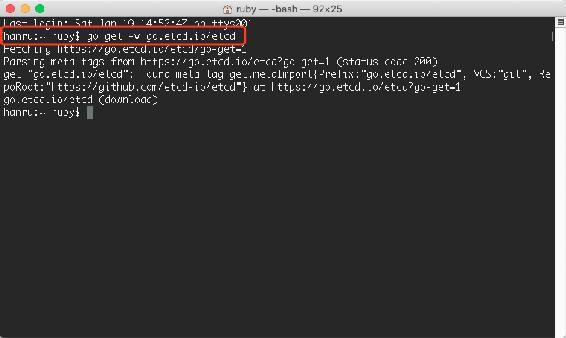
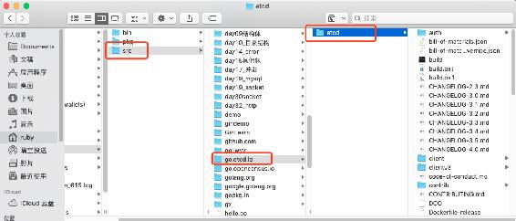
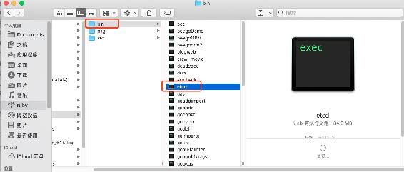
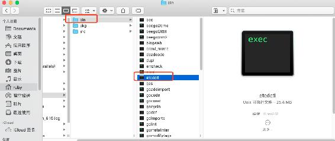
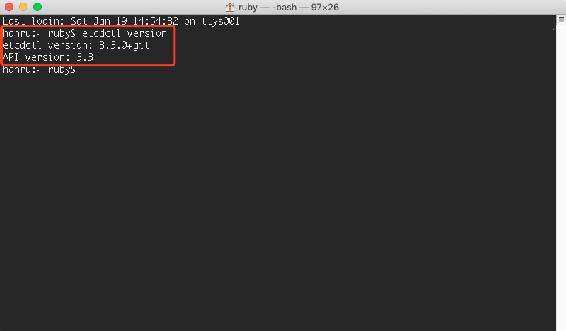
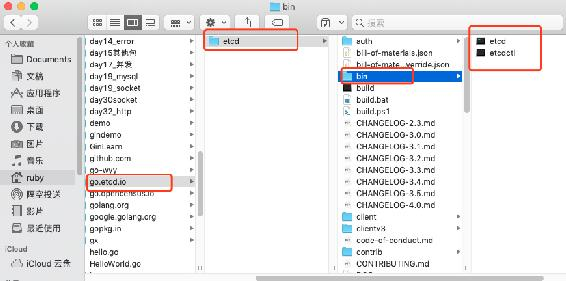
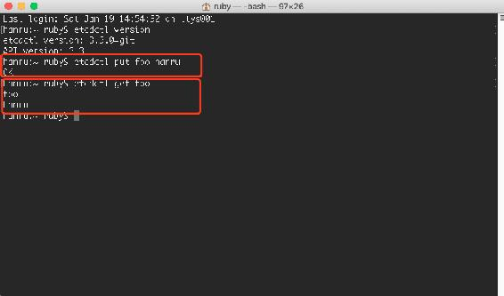

# 第一章 【分布式存储系统 etcd】etcd 的安装与配置

# etcd

## 一、什么是 etcd

**Etcd** 按照官方介绍

> Etcd is a distributed, consistent **key-value** store for **shared configuration** and **service discovery**

是一个分布式的，一致的 key-value 存储，主要用途是共享配置和服务发现。

etcd 是 CoreOS 团队于 2013 年 6 月发起的开源项目，它的目标是构建一个高可用的分布式键值（key-value）数据库，基于 Go 语言实现。我们知道，在分布式系统中，各种服务的配置信息的管理分享，服务的发现是一个很基本同时也是很重要的问题。CoreOS 项目就希望基于 etcd 来解决这一问题。

etcd 目前在 [github.com/coreos/etcd](https://github.com/coreos/etcd) 进行维护。

受到 [Apache ZooKeeper](http://zookeeper.apache.org/) 项目和 [doozer](https://github.com/ha/doozerd) 项目的启发，etcd 在设计的时候重点考虑了下面四个要素：

*   简单：良好的定义，面向用户的 API (gRPC)
*   安全：带有可选客户端证书认证的自动 TLS
*   快速：支持并发 1k/s 的写操作
*   可靠：支持分布式结构，基于 Raft 的一致性算法

etcd 是一个高可用的键值存储系统，主要用于共享配置和服务发现。etcd 是由 CoreOS 开发并维护的，灵感来自于 ZooKeeper 和 Doozer，它使用 Go 语言编写，并通过 Raft 一致性算法处理日志复制以保证强一致性。Raft 是一个来自 Stanford 的新的一致性算法，适用于分布式系统的日志复制，Raft 通过选举的方式来实现一致性，在 Raft 中，任何一个节点都可能成为 Leader。Google 的容器集群管理系统 Kubernetes、开源 PaaS 平台 Cloud Foundry 和 CoreOS 的 Fleet 都广泛使用了 etcd。

etcd 集群的工作原理基于 raft 共识算法 (The Raft Consensus Algorithm)。etcd 在 0.5.0 版本中重新实现了 raft 算法，而非像之前那样依赖于第三方库 go-raft 。raft 共识算法的优点在于可以在高效的解决分布式系统中各个节点日志内容一致性问题的同时，也使得集群具备一定的容错能力。即使集群中出现部分节点故障、网络故障等问题，仍可保证其余大多数节点正确的步进。甚至当更多的节点（一般来说超过集群节点总数的一半）出现故障而导致集群不可用时，依然可以保证节点中的数据不会出现错误的结果。

一般情况下，用户使用 etcd 可以在多个节点上启动多个实例，并添加它们为一个集群。同一个集群中的 etcd 实例将会保持彼此信息的一致性。

> 注：
> 
> 1.  Apache ZooKeeper 是一套知名的分布式系统中进行同步和一致性管理的工具。
> 2.  doozer 则是一个一致性分布式数据库。
> 3.  Raft 是一套通过选举主节点来实现分布式系统一致性的算法，相比于大名鼎鼎的 Paxos 算法，它的过程更容易被人理解，由 Stanford 大学的 Diego Ongaro 和 John Ousterhout 提出。更多细节可以参考 raftconsensus.github.io。

## 二、etcd 的安装

### 2.1 下载 etcd 安装包安装

打开终端，输入以下命令：

```go
// 因为包比较大，需要耐心等待一会儿，而且此处需要翻墙
hanru:~ ruby$ go get -v go.etcd.io/etcd
```



下载成功后，可以在 src 目录下看到一个 go.etcd.io 目录：



此时在 bin 目录下已经有了 etcd 命令：



其实 etcd 支持多种交互方式，包括 etcdctl，http 和客户端连接等等。

etcd 对外通过 HTTP API 对外提供服务，这种方式方便测试（通过 curl 或者其他工具就能和 etcd 交互），也很容易集成到各种语言中（每个语言封装 HTTP API 实现自己的 client 就行）。

etcdctl 是一个命令行客户端，它能提供一些简洁的命令，供用户直接跟 etcd 服务打交道，而无需基于 HTTP API 方式。这在某些情况下将很方便，例如用户对服务进行测试或者手动修改数据库内容。我们也推荐在刚接触 etcd 时通过 etcdctl 命令来熟悉相关的操作，这些操作跟 HTTP API 实际上是对应的。

接下来我们就安装 etcdctl( a simple command line client.)：

```go
hanru:~ ruby$ go get -v go.etcd.io/etcd/etcdctl 
```

然后我们可以在 bin 目录下看见 etcdctl 命令：



然后输入命令查看一下安装的版本：

```go
hanru:~ ruby$ etcdctl version
```



> etcd 是服务主文件，etcdctl 是提供给用户的命令客户端

也可以使用以下方式进行安装 etcd，现在 GOPATH/src 目录下创建文件夹：go.etcd.io：

然后通过 cd 命令进入该目录：

```go
localhost:~ ruby$ cd $GOPATH/src/go.etcd.io
```

然后执行以下命令，从 github 上拷贝 etcd 的安装包到该目录下：

```go
localhost:go.etcd.io ruby$ git clone https://github.com/coreos/etcd.git
```

拷贝好后在 go.etcd.io 目录下有个子目录 etcd，进入该子目录：

```go
localhost:go.etcd.io ruby$ cd etcd
```

然后执行 build 方法，生成 etcd 和 etcdctl 命令：

```go
localhost:etcd ruby$ ./build
```

还有另外一种下载安装的方法：

直接下载 etcd 二进制 （包含 etcd、etcdctl） [`github.com/coreos/etcd/releases`](https://github.com/coreos/etcd/releases)

### 2.2 启动 etcd

要想启动 etcd 服务很简单，执行 etcd 命令即可：

```go
hanru:~ ruby$ etcd
```

当然你也可以自己 build 生成 etcd 和 etcdctl 命令：

首先进入 etcd 目录：

```go
localhost:~ ruby$ cd $GOPATH/src/go.etcd.io/etcd
```

然后执行 build 命令：

```go
localhost:etcd ruby$ ./build
```

此时就会在 etcd 中生成一个 bin 目录，里面有刚刚 build 出来的 etcd 和 etcdctl 命令：



然后我们同样也可以通过执行 etcd 命令来启动：

```go
localhost:etcd ruby$ ./bin/etcd
```

运行 etcd，将默认组建一个两个节点的集群。然后我们可以看到启动信息：

```go
2019-01-19 15:30:43.733378 I | etcdmain: etcd Version: 3.3.0+git
2019-01-19 15:30:43.733413 I | etcdmain: Git SHA: Not provided (use ./build instead of go build)
2019-01-19 15:30:43.733419 I | etcdmain: Go Version: go1.11.4
2019-01-19 15:30:43.733427 I | etcdmain: Go OS/Arch: darwin/amd64
2019-01-19 15:30:43.733433 I | etcdmain: setting maximum number of CPUs to 4, total number of available CPUs is 4
2019-01-19 15:30:43.733442 N | etcdmain: failed to detect default host (default host not supported on darwin_amd64)
2019-01-19 15:30:43.733448 W | etcdmain: no data-dir provided, using default data-dir ./default.etcd
2019-01-19 15:30:43.733636 N | etcdmain: the server is already initialized as member before, starting as etcd member...
2019-01-19 15:30:43.737595 I | embed: name = default
2019-01-19 15:30:43.737619 I | embed: data dir = default.etcd
2019-01-19 15:30:43.737634 I | embed: member dir = default.etcd/member
2019-01-19 15:30:43.737642 I | embed: heartbeat = 100ms
2019-01-19 15:30:43.737650 I | embed: election = 1000ms
2019-01-19 15:30:43.737658 I | embed: snapshot count = 100000
2019-01-19 15:30:43.737676 I | embed: advertise client URLs = http://localhost:2379
2019-01-19 15:30:43.737687 I | embed: initial advertise peer URLs = http://localhost:2380
2019-01-19 15:30:43.737698 I | embed: initial cluster = 
2019-01-19 15:30:43.746310 I | etcdserver: restarting member 8e9e05c52164694d in cluster cdf818194e3a8c32 at commit index 4
{"level":"info","ts":1547883043.746382,"caller":"raft/raft.go:712","msg":"8e9e05c52164694d became follower at term 2"}
{"level":"info","ts":1547883043.7464802,"caller":"raft/raft.go:389","msg":"newRaft 8e9e05c52164694d [peers: [], term: 2, commit: 4, applied: 0, lastindex: 4, lastterm: 2]"}
2019-01-19 15:30:43.748731 W | auth: simple token is not cryptographically signed
2019-01-19 15:30:43.749897 I | etcdserver: starting server... [version: 3.3.0+git, cluster version: to_be_decided]
2019-01-19 15:30:43.751005 I | etcdserver/membership: added member 8e9e05c52164694d [http://localhost:2380] to cluster cdf818194e3a8c32
2019-01-19 15:30:43.751042 E | etcdserver: cannot monitor file descriptor usage (cannot get FDUsage on darwin)
2019-01-19 15:30:43.751306 N | etcdserver/membership: set the initial cluster version to 3.3
2019-01-19 15:30:43.751366 I | etcdserver/api: enabled capabilities for version 3.3
2019-01-19 15:30:43.753705 I | embed: listening for peers on 127.0.0.1:2380
{"level":"info","ts":1547883044.747759,"caller":"raft/raft.go:922","msg":"8e9e05c52164694d is starting a new election at term 2"}
{"level":"info","ts":1547883044.74794,"caller":"raft/raft.go:725","msg":"8e9e05c52164694d became candidate at term 3"}
{"level":"info","ts":1547883044.7480068,"caller":"raft/raft.go:820","msg":"8e9e05c52164694d received MsgVoteResp from 8e9e05c52164694d at term 3"}
{"level":"info","ts":1547883044.7481081,"caller":"raft/raft.go:777","msg":"8e9e05c52164694d became leader at term 3"}
{"level":"info","ts":1547883044.74815,"caller":"raft/node.go:330","msg":"raft.node: 8e9e05c52164694d elected leader 8e9e05c52164694d at term 3"}
2019-01-19 15:30:44.748717 I | etcdserver: published {Name:default ClientURLs:[http://localhost:2379]} to cluster cdf818194e3a8c32
2019-01-19 15:30:44.748753 I | embed: ready to serve client requests
2019-01-19 15:30:44.749650 N | embed: serving insecure client requests on 127.0.0.1:2379, this is strongly discouraged! 
```

默认 `2379` 端口处理客户端的请求，`2380` 端口用于集群各成员间的通信。

说明：

| 名称 | 说明 |
| --- | --- |
| name = default | name 表示节点名称，默认为 default |
| data dir = default.etcd | 指定节点的数据存储目录，保存日志和快照等，默认为当前工作目录 default.etcd/ |
| heartbeat = 100ms | leader 发送心跳到 followers 的间隔时间 |
| election = 1000ms | 重新投票的超时时间，如果 follow 在该时间间隔没有收到心跳包，会触发重新投票，默认为 1000ms |
| advertise client URLs = [`localhost:2379`](http://localhost:2379) | 对外提供服务的地址：比如 [`ip:2379,http://127.0.0.1:2379`](http://ip:2379,http://127.0.0.1:2379) ，客户端会连接到这里和 etcd 交互 |
| initial advertise peer URLs = [`localhost:2380`](http://localhost:2380) | 和集群中其他节点通信 |

### 2.3 测试一下

既然 etcd 是一个分布式的存储系统，我们先简单测试一下，存储一个 key-value：

```go
hanru:~ ruby$ etcdctl put foo hanru
```

打印出 ok，就表示存储成功，要注意先启动 etcd 服务：



当然我们还可以 get 出来。