# 第二章 【分布式存储系统 etcd】etcd 集群的静态搭建

# etcd

## 一、集群

分布式与集群 分布式（distributed）是指在多台不同的服务器中部署不同的服务模块，通过远程调用协同工作，对外提供服务。

集群（cluster）是指在多台不同的服务器中部署相同应用或服务模块，构成一个集群，通过负载均衡设备对外提供服务。

ETCD 使用 RAFT 协议保证各个节点之间的状态一致。根据 RAFT 算法原理，节点数目越多，会降低集群的写性能。这是因为每一次写操作，需要集群中大多数节点将日志落盘成功后，Leader 节点才能将修改内部状态机，并返回将结果返回给客户端。

也就是说在等同配置下，节点数越少，集群性能越好。显然，只部署 1 个节点是没什么意义的。通常，按照需求将集群节点部署为 3，5，7，9 个节点。

这里能选择偶数个节点吗？ 最好不要这样。原因有二：

*   偶数个节点集群不可用风险更高，表现在选主过程中，有较大概率或等额选票，从而触发下一轮选举。
*   偶数个节点集群在某些网络分割的场景下无法正常工作。试想，当网络分割发生后，将集群节点对半分割开。此时集群将无法工作。按照 RAFT 协议，此时集群写操作无法使得大多数节点同意，从而导致写失败，集群无法正常工作。

在安装和启动 etcd 服务的时候，各个节点需要知道集群中其他节点的信息（一般是 ip 和 port 信息）。根据你是否可以提前知道每个节点的 ip，有几种不同的启动方案：

*   Static/静态：适用于有固定 IP 的主机节点

    (静态配置 ：在启动 etcd server 的时候，通过 `--initial-cluster` 参数配置好所有的节点信息)

*   etcd Discovery/etcd 发现：适用于 DHCP 环境

    (使用已有的 etcd cluster 来注册和启动，比如官方提供的 `discovery.etcd.io`)

*   DNS Discovery/DNS 发现：依赖 DNS SRV 记录

    (使用 DNS 启动)

每个 etcd cluster 都是有若干个 member 组成的，每个 member 是一个独立运行的 etcd 实例，单台机器上可以运行多个 member。

在正常运行的状态下，集群中会有一个 leader，其余的 member 都是 followers。leader 向 followers 同步日志，保证数据在各个 member 都有副本。leader 还会定时向所有的 member 发送心跳报文，如果在规定的时间里 follower 没有收到心跳，就会重新进行选举。

客户端所有的请求都会先发送给 leader，leader 向所有的 followers 同步日志，等收到超过半数的确认后就把该日志存储到磁盘，并返回响应客户端。

每个 etcd 服务有三大主要部分组成：raft 实现、WAL 日志存储、数据的存储和索引。WAL 会在本地磁盘（就是之前提到的 `--data-dir`）上存储日志内容（wal file）和快照（snapshot）。

> 官方提供了一个工具 goreman，提供了 Profile 文件方式配置集群，简化部署。
> 
> 实际使用时，考虑服务的可用性，一般采用多机集群。本地集群可用于测试时快速搭建服务，具体操作参考[官方文档](https://github.com/coreos/etcd/blob/master/Documentation/dev-guide/local_cluster.md)，个人推荐测试时也是用多机集群部署方案。
> 
> 在官网上有搭建本地集群的介绍，但是意义不大，此处略过，感兴趣的话可以直接去官网查阅资料即可。
> 
> 首先安装 goreman：
> 
> ```go
> hanru:~ ruby$ go get github.com/mattn/goreman
> ```
> 
> 在 etcd git 存储库的基础上提供了一个 procfile，以便轻松配置本地多成员集群。要启动多成员群集，请导航到 etcd 源树的根目录，然后执行以下操作：
> 
> ```go
> goreman start
> ```

## 二、静态配置

这里的集群模式是指完全集群模式，当然也可以在单机上通过不同的端口，部署伪集群模式，只是那样做只适合测试环境，生产环境考虑到可用性的话需要将 etcd 实例分布到不同的主机上，这里集群搭建有三种方式，分布是静态配置，etcd 发现，dns 发现。默认配置运行 etcd，监听本地的 2379 端口，用于与 client 端交互，监听 2380 用于 etcd 内部交互。etcd 启动时，集群模式下会用到的参数如下：

```go
--name
etcd 集群中的节点名，这里可以随意，可区分且不重复就行
--listen-peer-urls
监听的用于节点之间通信的 url，可监听多个，集群内部将通过这些 url 进行数据交互(如选举，数据同步等)
--initial-advertise-peer-urls
建议用于节点之间通信的 url，节点间将以该值进行通信。
--listen-client-urls
监听的用于客户端通信的 url,同样可以监听多个。
--advertise-client-urls
建议使用的客户端通信 url,该值用于 etcd 代理或 etcd 成员与 etcd 节点通信。
--initial-cluster-token etcd-cluster-1
节点的 token 值，设置该值后集群将生成唯一 id,并为每个节点也生成唯一 id,当使用相同配置文件再启动一个集群时，只要该 token 值不一样，etcd 集群就不会相互影响。
--initial-cluster
也就是集群中所有的 initial-advertise-peer-urls 的合集
--initial-cluster-state new
新建集群的标志，初始化状态使用 new，建立之后改此值为 existing
```

你可以使用 3 台真实的机器，也可以使用模拟机，此处我用的是一台宿主机(Mac 系统)，以及两台虚拟机(Ubuntu16.04)，golang 的版本为 go1.11。

主机规划如下：

| name | IP |
| --- | --- |
| etcd01 | 192.168.10.112 |
| etcd02 | 192.168.10.115 |
| etcd03 | 192.168.10.117 |

注意，这里的 name 是 etcd 集群里使用的名字，不是主机名，当然和主机名一致也是没关系的。

### 2.1 搭建方式一

我们可以通过设置`initial-cluster`标志来使用脱机引导程序配置。每台机器都将获得以下环境变量或命令行：

```go
ETCD_INITIAL_CLUSTER =“infra0 = http：//192.168.10.112：2380，infra1 = http：//192.168.10.115：2380，infra2 = http：//192.168.10.117：2380”ETCD_INITIAL_CLUSTER_STATE = new 
```

```go
--initial-cluster infra0 = http：//192.168.10.112：2380，infra1 = http：//192.168.10.115：2380，infra2 = http：//192.168.10.117：2380 \ 
--initial-cluster-state new
```

请注意，指定的 URL `initial-cluster`是*公布的对等 URL*，即它们应与`initial-advertise-peer-urls`相应节点上的值匹配。

如果为了测试目的而使用相同的配置启动多个集群（或创建并销毁单个集群），强烈建议为每个集群提供唯一的集群`initial-cluster-token`。通过这样做，etcd 可以为集群生成唯一的集群 ID 和成员 ID，即使它们具有完全相同的配置也是如此。这可以保护 etcd 免受跨群集交互的影响，这可能会破坏群集。

etcd 侦听[`listen-client-urls`](https://gitee.com/mirrors/etcd/blob/master/Documentation/op-guide/configuration.md#--listen-client-urls)接受客户端流量。etcd 成员将指定的 URL 通告[`advertise-client-urls`](https://gitee.com/mirrors/etcd/blob/master/Documentation/op-guide/configuration.md#--advertise-client-urls)给其他成员，代理，客户端。请确保`advertise-client-urls`可以从预期的客户访问。`advertise-client-urls`如果远程客户端应该到达 etcd，则常见错误是设置为 localhost 或将其保留为默认值。

如果只是测试，这里建议使用二进制包进行测试。因为源码包编译的，使用 etcd 命令执行时加上的参数会被配置文件/etc/etcd/etcd.conf 覆盖。直接二进制包的不会，如果是现网使用 yum 包就比较推荐了。分别在三个节点上使用如下命令启动：

```go
#节点 1：
./etcd --name etcd01 --initial-advertise-peer-urls http://192.168.10.112:2380 \
  --listen-peer-urls http://0.0.0.0:2380 \
  --listen-client-urls http://0.0.0.0:2379 \
  --advertise-client-urls http://192.168.10.112:2379 \
  --initial-cluster-token etcd-cluster-1 \
  --initial-cluster etcd01=http://192.168.10.112:2380,etcd02=http://192.168.10.115:2380,etcd03=http://192.168.10.117:2380 \
  --initial-cluster-state new

#节点 2
./etcd --name etcd02 --initial-advertise-peer-urls http://192.168.10.115:2380 \
--listen-peer-urls http://0.0.0.0:2380 \
--listen-client-urls http://0.0.0.0:2379 \
--advertise-client-urls http://192.168.10.115:2379 \
--initial-cluster-token etcd-cluster-1 \
--initial-cluster etcd01=http://192.168.10.112:2380,etcd02=http://192.168.10.115:2380,etcd03=http://192.168.10.117:2380 \
--initial-cluster-state new

#节点 3
./etcd --name etcd03 --initial-advertise-peer-urls http://192.168.10.117:2380 \
--listen-peer-urls http://0.0.0.0:2380 \
--listen-client-urls http://0.0.0.0:2379 \
--advertise-client-urls http://192.168.10.117:2379 \
--initial-cluster-token etcd-cluster-1 \
--initial-cluster etcd01=http://192.168.10.112:2380,etcd02=http://192.168.10.115:2380,etcd03=http://192.168.10.117:2380 \
--initial-cluster-state new
```

`--initial-cluster`在随后的 etcd 运行中将忽略以命令行开头的命令行参数。

我们在 Mac 上打开一个终端，把 Mac 机器作为节点 1，执行节点 1 的脚本内容，

首先通过 cd 命令进入 bin 目录：

```go
localhost:~ ruby$ cd /Users/ruby/go/src/go.etcd.io/etcd/bin
```

因为之前 build 过，所以在 etcd 目录下生成了 bin 目录，里面有 etcd 和 etcdctl 两个命令，Ubuntu 虚拟机中也是同样的操作设置：

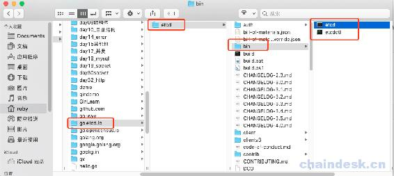

然后执行以下内容：

```go
#节点 1：
./etcd --name etcd01 --initial-advertise-peer-urls http://192.168.10.112:2380 \
  --listen-peer-urls http://0.0.0.0:2380 \
  --listen-client-urls http://0.0.0.0:2379 \
  --advertise-client-urls http://192.168.10.112:2379 \
  --initial-cluster-token etcd-cluster-1 \
  --initial-cluster etcd01=http://192.168.10.112:2380,etcd02=http://192.168.10.115:2380,etcd03=http://192.168.10.117:2380 \
  --initial-cluster-state new
```

启动了节点 1：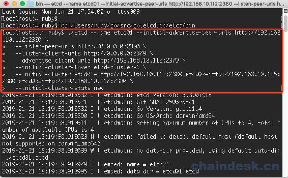

然后在 Ubuntu 虚拟机 1 上打开一个终端，把它作为第二个节点，

首先进入 bin 目录：

```go
ruby@hanru:~$ cd go/src/go.etcd.io/etcd/bin
```

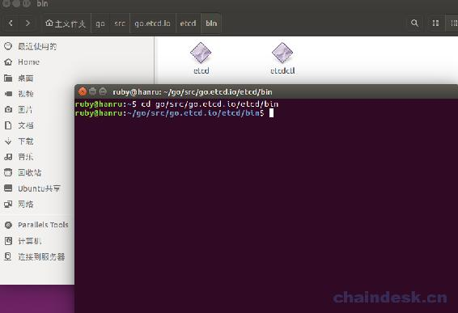

然后输入节点 2 的脚本内容如下：

```go
#节点 2
./etcd --name etcd02 --initial-advertise-peer-urls http://192.168.10.115:2380 \
--listen-peer-urls http://0.0.0.0:2380 \
--listen-client-urls http://0.0.0.0:2379 \
--advertise-client-urls http://192.168.10.115:2379 \
--initial-cluster-token etcd-cluster-1 \
--initial-cluster etcd01=http://192.168.10.112:2380,etcd02=http://192.168.10.115:2380,etcd03=http://192.168.10.117:2380 \
--initial-cluster-state new
```

启动效果如下：

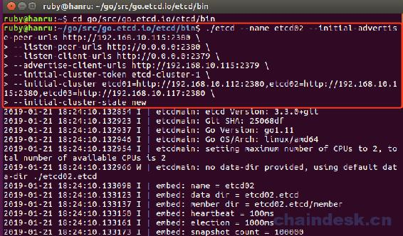

再启动另一个虚拟机，作为第三个节点，打开终端进入 bin 目录，并执行以下脚本内容：

```go
#节点 3
./etcd --name etcd03 --initial-advertise-peer-urls http://192.168.10.117:2380 \
--listen-peer-urls http://0.0.0.0:2380 \
--listen-client-urls http://0.0.0.0:2379 \
--advertise-client-urls http://192.168.10.117:2379 \
--initial-cluster-token etcd-cluster-1 \
--initial-cluster etcd01=http://192.168.10.112:2380,etcd02=http://192.168.10.115:2380,etcd03=http://192.168.10.117:2380 \
--initial-cluster-state new
```

然后我们可以在 Mac 下再打开一个终端进入 bin 目录后：然后输入以下命令可以查看这个集群的 member：

```go
localhost:~ ruby$ cd /Users/ruby/go/src/go.etcd.io/etcd/bin
localhost:bin ruby$ ./etcdctl member list
```

我们可以看到有个 member：

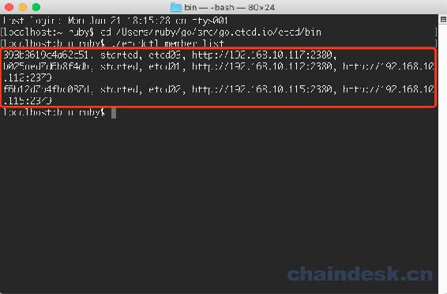

也可以按照表格形式展示：

```go
localhost:bin ruby$ ./etcdctl --write-out=table member list
+------------------+---------+--------+----------------------------+----------------------------+
|        ID        | STATUS  |  NAME  |         PEER ADDRS         |        CLIENT ADDRS        |
+------------------+---------+--------+----------------------------+----------------------------+
| 238906d2949aadeb | started | etcd01 | http://192.168.10.112:2380 | http://192.168.10.112:2379 |
| 4c2e39c28a58c9a7 | started | etcd03 | http://192.168.10.117:2380 | http://192.168.10.117:2379 |
| e90298bdbb087f01 | started | etcd02 | http://192.168.10.115:2380 | http://192.168.10.115:2379 |
+------------------+---------+--------+----------------------------+----------------------------+
```

然后我们在 mac 下再打开一个终端进入 bin 目录后，我们可以 put 一个 key：

```go
localhost:bin ruby$ ./etcdctl put web1 value1
```

我们可以成功存储一个 key：

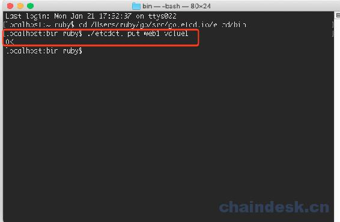

然后我们在另外两个 Ubuntu 中分别再打开一个终端，可以查看这个 key 的值：

```go
ruby@hanru:~/go/src/go.etcd.io/etcd/bin$ ./etcdctl get web1
```

我们可以看到查询结果：

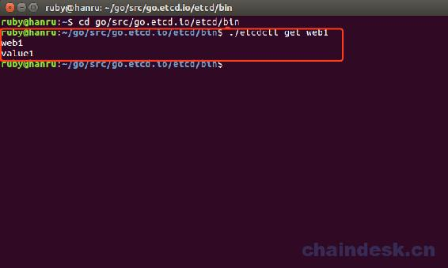

到此我们搭建的静态集群，可以实现数据存储的共享。

如果本地连接报错，内容如下：

```go
Error: client: etcd cluster is unavailable or misconfigurederror #0: dial tcp 127.0.0.1:2379: getsockopt: connection refusederror #1: dial tcp 127.0.0.1:4001: getsockopt: connection refused
```

如果出现如上的错误，是因为 ETCD_LISTEN_CLIENT_URLS 参数没有配置 http://127.0.0.1:2379 而导致的，所以这里我使用了 0.0.0.0 代表了监控所有地址。

### 2.2 搭建方式二

我们可以通过环境变量的方式

首先每个节点都要执行以下配置，HOST_1、HOST_2、HOST_3 分别设置为多台服务器的 IP。

```go
TOKEN=token-03
CLUSTER_STATE=new
NAME_1=machine-1
NAME_2=machine-2
NAME_3=machine-3
HOST_1=192.168.10.109
HOST_2=192.168.10.110
HOST_3=192.168.10.114
CLUSTER=${NAME_1}=http://${HOST_1}:2380,${NAME_2}=http://${HOST_2}:2380,${NAME_3}=http://${HOST_3}:2380
```

然后我们以 3 台机器来搭建集群。一台是 Mac 系统的宿主机，另外两个可以使用 Ubuntu 系统的虚拟机。

**machine1**执行如下命令：

```go
localhost:~ ruby$ cd /Users/ruby/go/src/go.etcd.io/etcd/bin

# For machine 1
THIS_NAME=${NAME_1}
THIS_IP=${HOST_1}
./etcd --data-dir=data.etcd --name ${THIS_NAME} --initial-advertise-peer-urls http://${THIS_IP}:2380 --listen-peer-urls http://${THIS_IP}:2380 --advertise-client-urls http://${THIS_IP}:2379 --listen-client-urls http://${THIS_IP}:2379 --initial-cluster ${CLUSTER} --initial-cluster-state ${CLUSTER_STATE} --initial-cluster-token ${TOKEN}
```

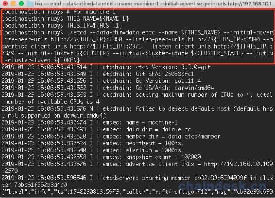

**machine 2** 执行如下命令：这是个 Ubuntu 系统：

```go
ruby@hanru:~$ cd go/src/go.etcd.io/etcd/bin

# For machine 2
THIS_NAME=${NAME_2}
THIS_IP=${HOST_2}
./etcd --data-dir=data.etcd --name ${THIS_NAME} --initial-advertise-peer-urls http://${THIS_IP}:2380 --listen-peer-urls http://${THIS_IP}:2380 --advertise-client-urls http://${THIS_IP}:2379 --listen-client-urls http://${THIS_IP}:2379 --initial-cluster ${CLUSTER} --initial-cluster-state ${CLUSTER_STATE} --initial-cluster-token ${TOKEN}
```

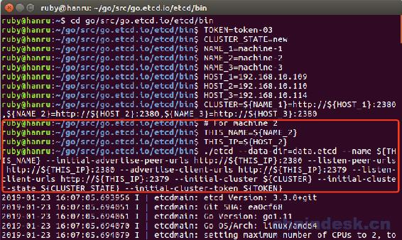

**machine 3** 执行如下命令，这也是一个 Ubuntu 系统：

```go
ruby@hanru:~$ cd go/src/go.etcd.io/etcd/bin

# For machine 3
THIS_NAME=${NAME_3}
THIS_IP=${HOST_3}
./etcd --data-dir=data.etcd --name ${THIS_NAME} --initial-advertise-peer-urls http://${THIS_IP}:2380 --listen-peer-urls http://${THIS_IP}:2380 --advertise-client-urls http://${THIS_IP}:2379 --listen-client-urls http://${THIS_IP}:2379 --initial-cluster ${CLUSTER} --initial-cluster-state ${CLUSTER_STATE} --initial-cluster-token ${TOKEN}
```

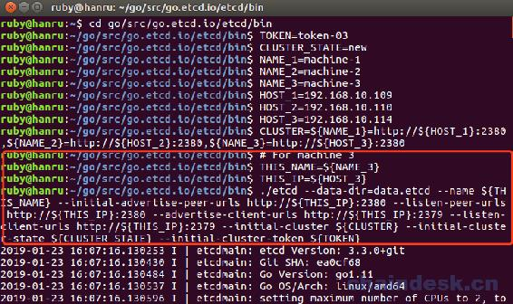

检测服务器运行是否正常，以及集群成员：

在 Mac 电脑再重新打开一个终端：

```go
localhost:~ ruby$ cd /Users/ruby/go/src/go.etcd.io/etcd/bin

HOST_1=192.168.10.109
HOST_2=192.168.10.110
HOST_3=192.168.10.114
ENDPOINTS=$HOST_1:2379,$HOST_2:2379,$HOST_3:2379

localhost:bin ruby$ ./etcdctl --endpoints=$ENDPOINTS --write-out=table member list
```

我们可以看到集群中的 3 个 member：

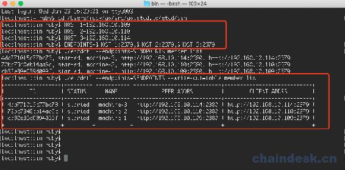

还可以查看 status：

```go
localhost:bin ruby$ ./etcdctl --write-out=table --endpoints=$ENDPOINTS endpoint status 
```

我们可以看到谁是 leader：

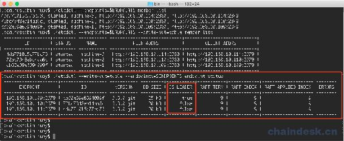