# 第三章 【分布式存储系统 etcd】etcd 集群的动态搭建

# etcd 集群的动态搭建

## 一、什么是集群的 Discovery

静态配置前提是在搭建集群之前已经提前知道各节点的信息，而实际应用中可能存在预先并不知道各节点 ip 的情况，不过很多时候，你只知道你要搭建一个多大(包含多少节点)的集群，但是并不能事先知道这几个节点的 ip，从而无法使用`--initial-cluster`参数。

这个时候，你就需要使用 discovery 的方式来搭建 etcd 集群。discovery 方式有两种：`etcd discovery`和`DNS discovery`。

> 在一些案例中，集群伙伴的 IP 可能无法提前知道。当使用云提供商或者网络使用 DHCP 时比较常见。在这些情况下，相比指定静态配置，使用使用已经存在的 etcd 集群来启动一个新的。我们称这个过程为"发现"。

## 二、etcd Discovery

这里我们先介绍下`etcd discovery`方式。通过已有的 etcd 集群作为数据交互点，然后在扩展新的集群时实现通过已有集群进行服务发现的机制。比如官方提供的：[discovery.etcd.io](http://discovery.etcd.io/)。

这种启动方式依赖另外一个 etcd 集群，在该集群中创建一个目录，并在该目录中创建一个 _config 的子目录，并且在该子目录中增加一个 size 节点，指定集群的节点数目。在这种情况下，将该目录在 etcd 中的 URL 作为节点的启动参数，即可完成集群启动。

`etcd discovery`集群方式分为两种：自定义的 etcd discovery 和公共 etcd discovery。

### 2.1 公共 etcd discovery 服务

公共的 discovery 就是通过 CoreOS 提供的公共 discovery 服务申请 token。

此处我们还是以一台 Mac 机器，再启动两个 Ubuntu 系统虚拟机来搭建集群。

**获取集群标识**

集群标识可以从已有的 etcd 集群中创建，这里通过 CoreOS 提供的公共 discovery 服务申请 token

```go
localhost:~ ruby$ curl -w "\n" 'https://discovery.etcd.io/new?size=3' 
```

运行结果：

```go
https://discovery.etcd.io/998463e3d4e745ff0f515a57d2e0fb68
```

以上命令会生成一个链接样式的 token，参数 size 代表要创建的集群大小，即: 有多少集群节点。

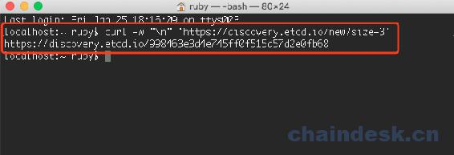

接下来我们在每个 etcd 成员使用下面参数进行启动。首先在 mac(主机 IP 为：192.168.1.19)的终端下，进入 etcd 的 bin 目录：

```go
localhost:~ ruby$ cd /Users/ruby/go/src/go.etcd.io/etcd/bin 
```

然后执行以下参数设置并回车启动：

```go
节点 1：
./etcd --name detcd1 --initial-advertise-peer-urls http://192.168.1.19:2380 \
  --listen-peer-urls http://0.0.0.0:2380 \
  --listen-client-urls http://0.0.0.0:2379 \
  --advertise-client-urls http://192.168.1.19:2379 \
  --discovery="https://discovery.etcd.io/998463e3d4e745ff0f515a57d2e0fb68"
```

这个内容其实就是上一个小节中静态搭建的命令，但是需要稍作修改：删除`initial-cluster`、`initial-cluster-state`、`initial-cluster-token`配置参数并加上`discovery`参数为获取的集群标识即可。

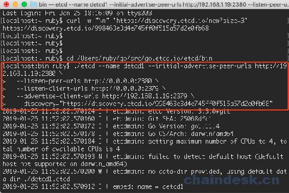

然后打开一个 Ubuntu 系统(ip 为 192.168.1.26)的终端，进入到 etcd 的 bin 目录：

```go
节点 2：
./etcd --name detcd2 --initial-advertise-peer-urls http://192.168.1.26:2380 \
  --listen-peer-urls http://0.0.0.0:2380 \
  --listen-client-urls http://0.0.0.0:2379 \
  --advertise-client-urls http://192.168.1.26:2379 \
  --discovery="https://discovery.etcd.io/998463e3d4e745ff0f515a57d2e0fb68"
```

运行结果如下：

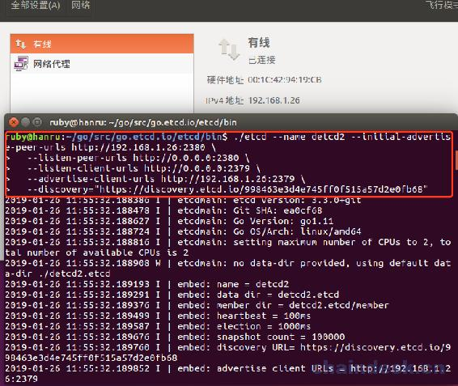

然后再启动一个 Ubuntu 虚拟机(ip:192.168.1.27)，打开终端进入 etcd 的 bin 目录：

```go
 节点 3：
./etcd --name detcd3 --initial-advertise-peer-urls http://192.168.1.27:2380 \
  --listen-peer-urls http://0.0.0.0:2380 \
  --listen-client-urls http://0.0.0.0:2379 \
  --advertise-client-urls http://192.168.1.27:2379 \
  --discovery="https://discovery.etcd.io/998463e3d4e745ff0f515a57d2e0fb68" 
```

运行结果如下：

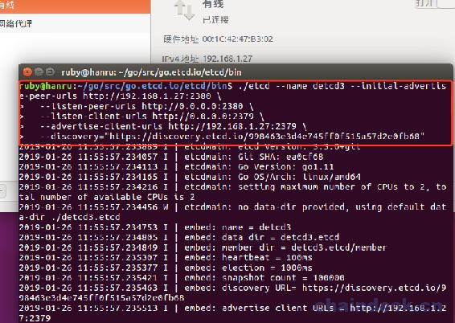

到此我们搭建的这个集群就可以正常使用了。

接下来，我们可以测试一下，我们在 Mac 系统再打开一个终端，进入 etcd 的 bin 目录，然后 put 一个 key-value：

```go
localhost:~ ruby$ cd /Users/ruby/go/src/go.etcd.io/etcd/bin
localhost:bin ruby$ ./etcdctl put foo hanru
```

运行结果：

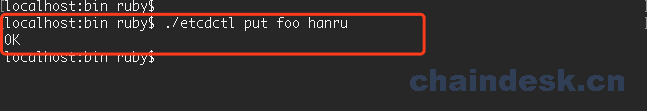

然后再 Ubuntu 系统中，也打开一个新的终端，进入 etcd 的 bin 目录，我们查看一下这个 key：

```go
ruby@hanru:~/go/src/go.etcd.io/etcd/bin$ ./etcdctl get foo
foo
hanru 
```

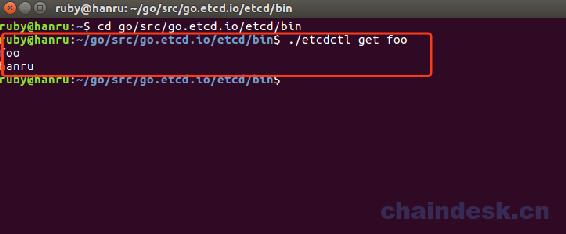

假如你启动 etcd 集群使用 discovery 服务大于预期的 etcd 成员数量, 扩展 etcd 进程将会失败。

我们再打开一个 Ubuntu 虚拟机，ip 地址为：192.168.1.28，打开终端进入 etcd 的 bin 目录，执行以下内容，这个 etcd 的节点确实无法启动：

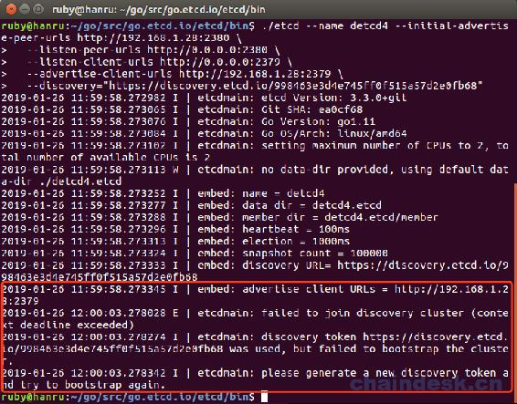

### 2.2 自定义的 etcd discovery 服务

这种方式就是利用一个已有的`etcd`集群来提供 discovery 服务，从而搭建一个新的`etcd`集群。

假设已有的`etcd`集群的一个访问地址是：192.168.2.210，首先需要在已经搭建的 etcd 中创建用于发现的 url，命令如下：

```go
localhost:bin ruby$ curl -X PUT http://192.168.1.19:2379/v2/keys/discovery/6c007a14875d53d9bf0ef5a6fc0257c817f0fb83/_config/size -d value=3
{"action":"set","node":{"key":"/discovery/6c007a14875d53d9bf0ef5a6fc0257c817f0fb83/_config/size","value":"3","modifiedIndex":6,"createdIndex":6}}
```

运行结果如下：

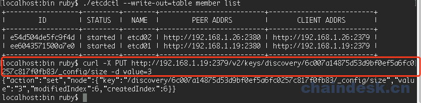

其中`value=3`表示本集群的大小，即: 有多少集群节点。而 6c007a14875d53d9bf0ef5a6fc0257c817f0fb83 就是用来做 discovery 的 token。

值得注意的是：如果实际启动的 etcd 节点个数大于 discovery token 创建时指定的 size，多余的节点会自动变为 proxy 节点。

> etcd proxy 模式简介：
> 
> 作为反向代理把客户的请求转发给可用的 etcd 集群，新节点加入集群如果核心节点数已满足要求，则自动转化为 proxy 模式，此项不会在节点不足时逆向转化为实际节点。

接下来的配置就和公共`etcd discovery`服务中的方法类似。

首先我们打开 Mac 的终端，并进入到 etcd 的 bin 目录下，启动节点 1：

```go
节点 1：
./etcd --name detcd1 --initial-advertise-peer-urls http://192.168.1.19:2380 \
  --listen-peer-urls http://0.0.0.0:2380 \
  --listen-client-urls http://0.0.0.0:2379 \
  --advertise-client-urls http://192.168.1.19:2379 \
  --discovery http://192.168.1.19:2379/v2/keys/discovery/6c007a14875d53d9bf0ef5a6fc0257c817f0fb83
```

效果如下：

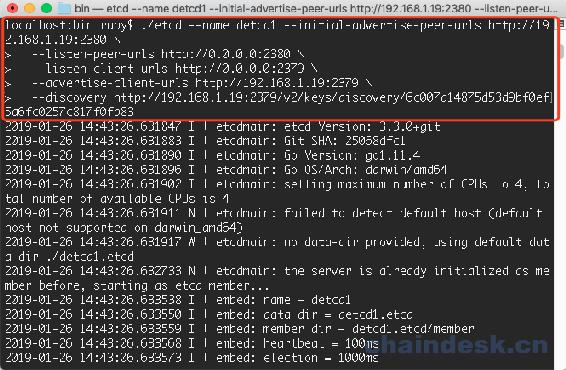

然后我们再打开一个 Ubuntu 系统的终端，进入 etcd 的 bin 目录下：

```go
节点 2：
./etcd --name detcd2 --initial-advertise-peer-urls http://192.168.1.26:2380 \
  --listen-peer-urls http://0.0.0.0:2380 \
  --listen-client-urls http://0.0.0.0:2379 \
  --advertise-client-urls http://192.168.1.26:2379 \
  --discovery http://192.168.1.19:2379/v2/keys/discovery/6c007a14875d53d9bf0ef5a6fc0257c817f0fb83
```

效果如下：

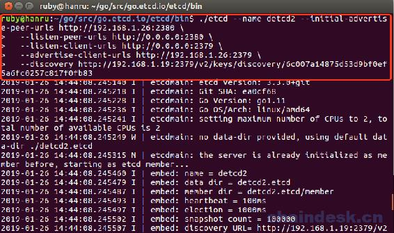

再打开一个 Ubuntu 系统的终端，进入到 etcd 的 bin 目录下：

```go
 节点 3：
./etcd --name detcd3 --initial-advertise-peer-urls http://192.168.1.27:2380 \
  --listen-peer-urls http://0.0.0.0:2380 \
  --listen-client-urls http://0.0.0.0:2379 \
  --advertise-client-urls http://192.168.1.27:2379 \
  --discovery http://192.168.1.19:2379/v2/keys/discovery/6c007a14875d53d9bf0ef5a6fc0257c817f0fb83
```

效果如下：

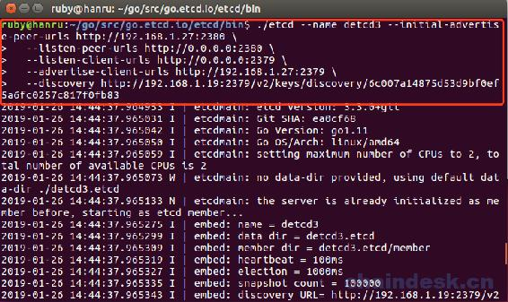

接下来我们在 mac 下查看一下集群信息：

```go
localhost:bin ruby$ ./etcdctl --write-out=table member list
+------------------+---------+--------+--------------------------+--------------------------+
|        ID        | STATUS  |  NAME  |        PEER ADDRS        |       CLIENT ADDRS       |
+------------------+---------+--------+--------------------------+--------------------------+
| 97cc95667ea6577b | started | detcd3 | http://192.168.1.27:2380 | http://192.168.1.27:2379 |
| ba69f02d027d9630 | started | detcd1 | http://192.168.1.19:2380 | http://192.168.1.19:2379 |
| d44e6aa446ce52ad | started | detcd2 | http://192.168.1.26:2380 | http://192.168.1.26:2379 |
+------------------+---------+--------+--------------------------+--------------------------+
```

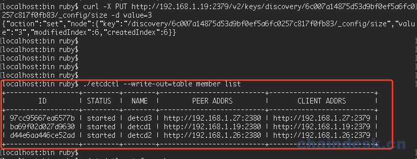

然后我们测试一下，put 一个 key-value 键值对：

```go
localhost:bin ruby$ ./etcdctl put foo ruby
OK
```

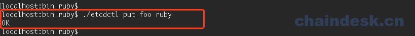

然后在 Ubuntu 的终端，查看结果：

```go
ruby@hanru:~/go/src/go.etcd.io/etcd/bin$ ./etcdctl get foo
foo
ruby
```

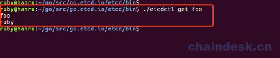

## 三、DNS Discovery

这个方式没有实践，而且对于一般团队实用性也不高。

这个配置方法我没测试过，这里直接拿官方给的样例列出如下。

dns 发现主要通过 dns 服务来记录集群中各节点的域名信息，各节点到 dns 服务中获取相互的地址信息，从而建立集群。etcd 各节点通过--discovery-serv 配置来获取域名信息，节点间将获取以下域名下的各节点域名。

> `-discovery-srv` 标记可以用于设置 DNS domain name ，在这里可以找到发现 SRV 记录。

下列 DNS SRV 记录将以列出的顺序查找：

*   `_etcd-erver-ssl._tcp.example.com`

*   `_etcd-server._tcp.example.com`

如果`_etcd-server-ssl._tcp.example.com`下有值表示节点间将使用 ssl 协议，相反则使用非 ssl。

为了帮助客户端发现 etcd 集群，下列 DNS SRV 记录将以列出的顺序查找：

*   `_etcd-client._tcp.example.com`

*   `_etcd-client-ssl._tcp.example.com`

另一方面，client 端将获取以上域名下的节点域名，用于 client 端与 etcd 通信，ssl 与非 ssl 的使用取决于以上那个域名下有值。

创建 dns 记录

```go
# 增加 DNS SRV 记录
$ dig +noall +answer SRV _etcd-server._tcp.example.com \
_etcd-server._tcp.example.com. 300 IN  SRV  0 0 2380 infra0.example.com. \
_etcd-server._tcp.example.com. 300 IN  SRV  0 0 2380 infra1.example.com. \
_etcd-server._tcp.example.com. 300 IN  SRV  0 0 2380 infra2.example.com.

$ dig +noall +answer SRV _etcd-client._tcp.example.com \
_etcd-client._tcp.example.com. 300 IN SRV 0 0 2379 infra0.example.com. \
_etcd-client._tcp.example.com. 300 IN SRV 0 0 2379 infra1.example.com. \
_etcd-client._tcp.example.com. 300 IN SRV 0 0 2379 infra2.example.com.

# 增加对应的域名解析
$ dig +noall +answer infra0.example.com infra1.example.com infra2.example.com \
infra0.example.com.  300  IN  A  192.168.1.19 \
infra1.example.com.  300  IN  A  192.168.1.26 \
infra2.example.com.  300  IN  A  192.168.1.27 
```

然后启动各个节点：

```go
# 节点 1
$ etcd --name infra0 \
--discovery-srv example.com \
--initial-advertise-peer-urls http://infra0.example.com:2380 \
--initial-cluster-token etcd-cluster-1 \
--initial-cluster-state new \
--advertise-client-urls http://infra0.example.com:2379 \
--listen-client-urls http://infra0.example.com:2379 \
--listen-peer-urls http://infra0.example.com:2380

# 节点 2
$ etcd --name infra1 \
--discovery-srv example.com \
--initial-advertise-peer-urls http://infra1.example.com:2380 \
--initial-cluster-token etcd-cluster-1 \
--initial-cluster-state new \
--advertise-client-urls http://infra1.example.com:2379 \
--listen-client-urls http://infra1.example.com:2379 \
--listen-peer-urls http://infra1.example.com:2380

# 节点 3
$ etcd --name infra2 \
--discovery-srv example.com \
--initial-advertise-peer-urls http://infra2.example.com:2380 \
--initial-cluster-token etcd-cluster-1 \
--initial-cluster-state new \
--advertise-client-urls http://infra2.example.com:2379 \
--listen-client-urls http://infra2.example.com:2379 \
--listen-peer-urls http://infra2.example.com:2380
```