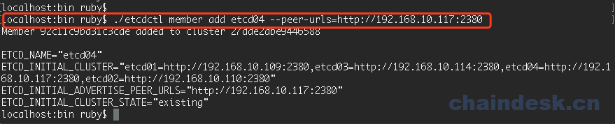
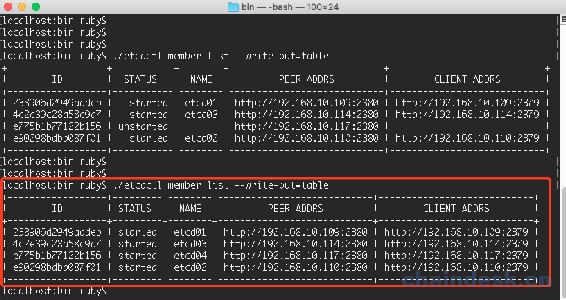

# 第四章 【分布式存储系统 etcd】etcd 集群的 member 操作

## etcd 的 member 操作

## 一、集群搭建

如果已经创建好集群，可以跳过此操作：

之前已经学过几种搭建集群的方式，此处我们还是由一个 mac 系统和两个 Ubuntu 虚拟机：

分别在 3 台机器下输入对应的命令：

```go
#节点 1：
./etcd --name etcd01 --initial-advertise-peer-urls http://192.168.10.109:2380 \
  --listen-peer-urls http://0.0.0.0:2380 \
  --listen-client-urls http://0.0.0.0:2379 \
  --advertise-client-urls http://192.168.10.109:2379 \
  --initial-cluster-token etcd-cluster-1 \
  --initial-cluster etcd01=http://192.168.10.109:2380,etcd02=http://192.168.10.110:2380,etcd03=http://192.168.10.114:2380 \
  --initial-cluster-state new

#节点 2
./etcd --name etcd02 --initial-advertise-peer-urls http://192.168.10.110:2380 \
--listen-peer-urls http://0.0.0.0:2380 \
--listen-client-urls http://0.0.0.0:2379 \
--advertise-client-urls http://192.168.10.110:2379 \
--initial-cluster-token etcd-cluster-1 \
--initial-cluster etcd01=http://192.168.10.109:2380,etcd02=http://192.168.10.110:2380,etcd03=http://192.168.10.114:2380 \
--initial-cluster-state new

#节点 3
./etcd --name etcd03 --initial-advertise-peer-urls http://192.168.10.114:2380 \
--listen-peer-urls http://0.0.0.0:2380 \
--listen-client-urls http://0.0.0.0:2379 \
--advertise-client-urls http://192.168.10.114:2379 \
--initial-cluster-token etcd-cluster-1 \
--initial-cluster etcd01=http://192.168.10.109:2380,etcd02=http://192.168.10.110:2380,etcd03=http://192.168.10.114:2380 \
--initial-cluster-state new 
```

## 二、查询 member 列表

我们创建好集群后，再 mac 系统重新打开一个新的窗口：

```go
localhost:bin ruby$ ./etcdctl --write-out=table member list
+------------------+---------+--------+----------------------------+----------------------------+
|        ID        | STATUS  |  NAME  |         PEER ADDRS         |        CLIENT ADDRS        |
+------------------+---------+--------+----------------------------+----------------------------+
| 238906d2949aadeb | started | etcd01 | http://192.168.10.109:2380 | http://192.168.10.109:2379 |
| 4c2e39c28a58c9a7 | started | etcd03 | http://192.168.10.114:2380 | http://192.168.10.114:2379 |
| e90298bdbb087f01 | started | etcd02 | http://192.168.10.110:2380 | http://192.168.10.110:2379 |
+------------------+---------+--------+----------------------------+----------------------------+
localhost:bin ruby$ 
```

## 三、添加 member 节点

我们在开一个 Ubuntu 虚拟机，ip 地址为 192.168.10.117，

在 mac 系统的终端使用 add 表示添加节点：

```go
localhost:bin ruby$ ./etcdctl member add etcd04 --peer-urls=http://192.168.10.117:2380

Member 92c11c9bd31c3cde added to cluster 27dde2dbe9446588

ETCD_NAME="etcd04"
ETCD_INITIAL_CLUSTER="etcd01=http://192.168.10.109:2380,etcd03=http://192.168.10.114:2380,etcd04=http://192.168.10.117:2380,etcd02=http://192.168.10.110:2380"
ETCD_INITIAL_ADVERTISE_PEER_URLS="http://192.168.10.117:2380"
ETCD_INITIAL_CLUSTER_STATE="existing"
```



然后我们先查看一下集群的 member：

```go
localhost:bin ruby$ ./etcdctl --write-out=table member list
```


虽然添加了一个 member，但是它的状态并没有启动，所以我们在第 3 个 Ubuntu 系统，打开终端：

```go
ruby@hanru:~$ cd go/src/go.etcd.io/etcd/bin

./etcd --name etcd04 --initial-advertise-peer-urls http://192.168.10.117:2380 \
--listen-peer-urls http://0.0.0.0:2380 \
--listen-client-urls http://0.0.0.0:2379 \
--advertise-client-urls http://192.168.10.117:2379 \
--initial-cluster-token etcd-cluster-1 \
--initial-cluster-state existing \
--initial-cluster etcd01=http://192.168.10.109:2380,etcd02=http://192.168.10.110:2380,etcd03=http://192.168.10.114:2380,etcd04=http://192.168.10.117:2380
```

我们又开启了一个节点：


然后切换回到 Mac 系统重新再查看一下 member list：

```go
localhost:bin ruby$ ./etcdctl member list --write-out=table
+------------------+---------+--------+----------------------------+----------------------------+
|        ID        | STATUS  |  NAME  |         PEER ADDRS         |        CLIENT ADDRS        |
+------------------+---------+--------+----------------------------+----------------------------+
| 238906d2949aadeb | started | etcd01 | http://192.168.10.109:2380 | http://192.168.10.109:2379 |
| 4c2e39c28a58c9a7 | started | etcd03 | http://192.168.10.114:2380 | http://192.168.10.114:2379 |
| e775b1b77122b156 | started | etcd04 | http://192.168.10.117:2380 | http://192.168.10.117:2379 |
| e90298bdbb087f01 | started | etcd02 | http://192.168.10.110:2380 | http://192.168.10.110:2379 |
+------------------+---------+--------+----------------------------+----------------------------+
localhost:bin ruby$ 
```

我们可以看到新加入的节点已经启动了：



## 四、删除 member

```go
localhost:bin ruby$ ./etcdctl member remove e775b1b77122b156
```

运行结果：

```go
Member e775b1b77122b156 removed from cluster 27dde2dbe9446588
```

查询 member 节点列表信息：

```go
localhost:bin ruby$ ./etcdctl member list --write-out=table
+------------------+---------+--------+----------------------------+----------------------------+
|        ID        | STATUS  |  NAME  |         PEER ADDRS         |        CLIENT ADDRS        |
+------------------+---------+--------+----------------------------+----------------------------+
| 238906d2949aadeb | started | etcd01 | http://192.168.10.109:2380 | http://192.168.10.109:2379 |
| 4c2e39c28a58c9a7 | started | etcd03 | http://192.168.10.114:2380 | http://192.168.10.114:2379 |
| e90298bdbb087f01 | started | etcd02 | http://192.168.10.110:2380 | http://192.168.10.110:2379 |
+------------------+---------+--------+----------------------------+----------------------------+
localhost:bin ruby$ 
```

我们可以看到集群中刚刚添加的 etcd04 节点已经移除掉了：


## 五、代码实现 member 的管理

### 5.1 代码操作集群

我们先新建一个工程 etcddemo，然后新建一个 go 文件：etcd_cluster.go

```go
package main

import (
    "go.etcd.io/etcd/clientv3"
    "log"
    "fmt"
    "context"
    "time"
)
var (
    dialTimeout    = 5 * time.Second
    requestTimeout = 2 * time.Second
    endpoints      = []string{"127.0.0.1:2379"}
)

func main()  {

    cli, err := clientv3.New(clientv3.Config{
        Endpoints:   endpoints,
        DialTimeout: dialTimeout,
    })
    if err != nil {
        log.Fatal(err)
    }
    defer cli.Close()

    resp, err := cli.MemberList(context.Background())
    if err != nil {
        log.Fatal(err)
    }
    fmt.Println("members:", resp.Members)

}
```

运行结果：

```go
members: [ID:2560585364642901483 name:"etcd01" peerURLs:"http://192.168.10.109:2380" clientURLs:"http://192.168.10.109:2379"  ID:5489388503518726567 name:"etcd03" peerURLs:"http://192.168.10.114:2380" clientURLs:"http://192.168.10.114:2379"  ID:16790150301444767489 name:"etcd02" peerURLs:"http://192.168.10.110:2380" clientURLs:"http://192.168.10.110:2379" ]

Process finished with exit code 0
```

> 我们也可以从终端通过命令来查看

### 5.2 添加 member

然后我们添加一个节点：

```go
func addMember(cli *clientv3.Client)  {
    peerURLs := []string{"http://192.168.10.117:2380"}

    mresp, err := cli.MemberAdd(context.Background(), peerURLs)
    if err != nil {
        log.Fatal(err)
    }
    fmt.Println("added member.PeerURLs:", mresp.Member.PeerURLs)
    resp, err := cli.MemberList(context.Background())
    if err != nil {
        log.Fatal(err)
    }
    fmt.Println("添加后 members:", resp.Members)
}
```

添加后：

```go
members: [ID:2560585364642901483 name:"etcd01" peerURLs:"http://192.168.10.109:2380" clientURLs:"http://192.168.10.109:2379"  ID:5489388503518726567 name:"etcd03" peerURLs:"http://192.168.10.114:2380" clientURLs:"http://192.168.10.114:2379"  ID:16790150301444767489 name:"etcd02" peerURLs:"http://192.168.10.110:2380" clientURLs:"http://192.168.10.110:2379" ]
added member.PeerURLs: [http://192.168.10.117:2380]
添加后 members: [ID:2560585364642901483 name:"etcd01" peerURLs:"http://192.168.10.109:2380" clientURLs:"http://192.168.10.109:2379"  ID:5489388503518726567 name:"etcd03" peerURLs:"http://192.168.10.114:2380" clientURLs:"http://192.168.10.114:2379"  ID:15313760910125797440 peerURLs:"http://192.168.10.117:2380"  ID:16790150301444767489 name:"etcd02" peerURLs:"http://192.168.10.110:2380" clientURLs:"http://192.168.10.110:2379" ] 
```

然后打开新添加节点的终端，手动的启动该节点：

```go
#节点 4
./etcd --name etcd04 --initial-advertise-peer-urls http://192.168.10.117:2380 \
--listen-peer-urls http://0.0.0.0:2380 \
--listen-client-urls http://0.0.0.0:2379 \
--advertise-client-urls http://192.168.10.117:2379 \
--initial-cluster-token etcd-cluster-1 \
--initial-cluster-state existing \
--initial-cluster etcd01=http://192.168.10.109:2380,etcd02=http://192.168.10.110:2380,etcd03=http://192.168.10.114:2380,etcd04=http://192.168.10.117:2380
```

添加后我们再查看一下集群信息：

```go
members: [ID:2560585364642901483 name:"etcd01" peerURLs:"http://192.168.10.109:2380" clientURLs:"http://192.168.10.109:2379"  ID:5489388503518726567 name:"etcd03" peerURLs:"http://192.168.10.114:2380" clientURLs:"http://192.168.10.114:2379"  ID:15313760910125797440 name:"etcd04" peerURLs:"http://192.168.10.117:2380" clientURLs:"http://192.168.10.117:2379"  ID:16790150301444767489 name:"etcd02" peerURLs:"http://192.168.10.110:2380" clientURLs:"http://192.168.10.110:2379" ]

Process finished with exit code 0
```

### 5.3 删除 member

删除刚刚删除的节点 4，我们需要先知道该 member 的 ID，从前面的打印信息就能够的到：

```go
 // 删除节点
func delMember (cli *clientv3.Client, memberId uint64) {

    resp, err := cli.MemberList(context.Background())
    if err != nil {
        log.Fatal(err)
    }

    _, err = cli.MemberRemove(context.Background(), memberId)
    if err != nil {
        log.Fatal(err)
    }

    resp, err = cli.MemberList(context.Background())
    if err != nil {
        log.Fatal(err)
    }
    fmt.Println("删除后 members:", resp.Members)
} 
```

然后我们需要在 main 中调用的时候传入 ID：

```go
func main()  {

    cli, err := clientv3.New(clientv3.Config{
        Endpoints:   endpoints,
        DialTimeout: dialTimeout,
    })
    if err != nil {
        log.Fatal(err)
    }
    defer cli.Close()

    resp, err := cli.MemberList(context.Background())
    if err != nil {
        log.Fatal(err)
    }
    fmt.Println("members:", resp.Members)

    //添加 member
    //addMember(cli)

    // 删除节点
    delMember(cli,uint64(15313760910125797440))

}
```

运行结果：

```go
members: [ID:2560585364642901483 name:"etcd01" peerURLs:"http://192.168.10.109:2380" clientURLs:"http://192.168.10.109:2379"  ID:5489388503518726567 name:"etcd03" peerURLs:"http://192.168.10.114:2380" clientURLs:"http://192.168.10.114:2379"  ID:15313760910125797440 name:"etcd04" peerURLs:"http://192.168.10.117:2380" clientURLs:"http://192.168.10.117:2379"  ID:16790150301444767489 name:"etcd02" peerURLs:"http://192.168.10.110:2380" clientURLs:"http://192.168.10.110:2379" ]
删除后 members: [ID:2560585364642901483 name:"etcd01" peerURLs:"http://192.168.10.109:2380" clientURLs:"http://192.168.10.109:2379"  ID:5489388503518726567 name:"etcd03" peerURLs:"http://192.168.10.114:2380" clientURLs:"http://192.168.10.114:2379"  ID:16790150301444767489 name:"etcd02" peerURLs:"http://192.168.10.110:2380" clientURLs:"http://192.168.10.110:2379" ]

Process finished with exit code 0
```

可以通过终端查看更直观一些：

