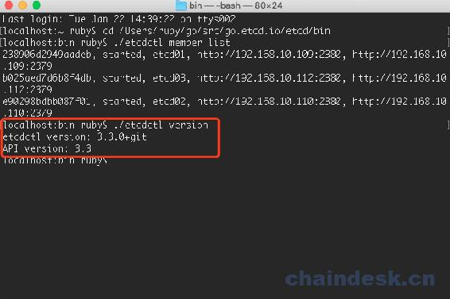
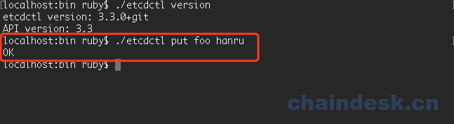

# 第五章 【分布式存储系统 etcd】etcd 操作

## 一、etcd 操作

用户主要通过输入或获取密钥的值与 etcd 进行交互。本节介绍如何使用 etcdctl（一个用于与 etcd 服务器交互的命令行工具）来完成此操作。这里描述的概念应该适用于 gRPC API 或客户端库 API。

我们就用之前搭建的集群中的任意一台主机，打开一个终端，然后进入到 bin 目录下，进行 etcd 的操作即可。

我们可以通过 etcdctl 配合 help 参数查看，可以使用的操作：

```go
localhost:bin ruby$ ./etcdctl help
NAME:
    etcdctl - A simple command line client for etcd3.

USAGE:
    etcdctl [flags]

VERSION:
    3.3.0+git

API VERSION:
    3.3

COMMANDS:
    alarm disarm        Disarms all alarms
    alarm list      Lists all alarms
    auth disable        Disables authentication
    auth enable     Enables authentication
    check datascale     Check the memory usage of holding data for different workloads on a given server endpoint.
    check perf      Check the performance of the etcd cluster
    compaction      Compacts the event history in etcd
    defrag          Defragments the storage of the etcd members with given endpoints
    del         Removes the specified key or range of keys [key, range_end)
    elect           Observes and participates in leader election
    endpoint hashkv     Prints the KV history hash for each endpoint in --endpoints
    endpoint health     Checks the healthiness of endpoints specified in `--endpoints` flag
    endpoint status     Prints out the status of endpoints specified in `--endpoints` flag
    get         Gets the key or a range of keys
    help            Help about any command
    lease grant     Creates leases
    lease keep-alive    Keeps leases alive (renew)
    lease list      List all active leases
    lease revoke        Revokes leases
    lease timetolive    Get lease information
    lock            Acquires a named lock
    make-mirror     Makes a mirror at the destination etcd cluster
    member add      Adds a member into the cluster
    member list     Lists all members in the cluster
    member remove       Removes a member from the cluster
    member update       Updates a member in the cluster
    migrate         Migrates keys in a v2 store to a mvcc store
    move-leader     Transfers leadership to another etcd cluster member.
    put         Puts the given key into the store
    role add        Adds a new role
    role delete     Deletes a role
    role get        Gets detailed information of a role
    role grant-permission   Grants a key to a role
    role list       Lists all roles
    role revoke-permission  Revokes a key from a role
    snapshot restore    Restores an etcd member snapshot to an etcd directory
    snapshot save       Stores an etcd node backend snapshot to a given file
    snapshot status     Gets backend snapshot status of a given file
    txn         Txn processes all the requests in one transaction
    user add        Adds a new user
    user delete     Deletes a user
    user get        Gets detailed information of a user
    user grant-role     Grants a role to a user
    user list       Lists all users
    user passwd     Changes password of user
    user revoke-role    Revokes a role from a user
    version         Prints the version of etcdctl
    watch           Watches events stream on keys or prefixes

OPTIONS:
      --cacert=""               verify certificates of TLS-enabled secure servers using this CA bundle
      --cert=""                 identify secure client using this TLS certificate file
      --command-timeout=5s          timeout for short running command (excluding dial timeout)
      --debug[=false]               enable client-side debug logging
      --dial-timeout=2s             dial timeout for client connections
  -d, --discovery-srv=""            domain name to query for SRV records describing cluster endpoints
      --discovery-srv-name=""           service name to query when using DNS discovery
      --endpoints=[127.0.0.1:2379]      gRPC endpoints
  -h, --help[=false]                help for etcdctl
      --hex[=false]             print byte strings as hex encoded strings
      --insecure-discovery[=true]       accept insecure SRV records describing cluster endpoints
      --insecure-skip-tls-verify[=false]    skip server certificate verification
      --insecure-transport[=true]       disable transport security for client connections
      --keepalive-time=2s           keepalive time for client connections
      --keepalive-timeout=6s            keepalive timeout for client connections
      --key=""                  identify secure client using this TLS key file
      --password=""             password for authentication (if this option is used, --user option shouldn't include password)
      --user=""                 username[:password] for authentication (prompt if password is not supplied)
  -w, --write-out="simple"          set the output format (fields, json, protobuf, simple, table)

localhost:bin ruby$ 
```

### 1.1 查找版本

etcdctl 版本和 Server API 版本可以用于查找用于在 etcd 上执行各种操作的适当命令。

以下是查找版本的命令：

```go
localhost:bin ruby$ ./etcdctl version
```



### 1.2 存储数据

etcd 的数据按照树形的结构组织，类似于 linux 的文件系统，也有目录和文件的区别，不过一般被称为 nodes。数据的 endpoint 都是以 `/v3/keys` 开头（v3 表示当前 API 的版本），比如 `/v3/keys/names/cizixs`。

要创建一个值，只要使用 `PUT` 方法在对应的 url endpoint 设置就行。如果对应的 key 已经存在， `PUT` 也会对 key 进行更新。

etcd 中的数据，都是通过 key-value 进行存储，所以存储数据也理解为是存储一个秘钥。应用程序通过写入密钥将密钥存储到 etcd 集群中。每个存储的密钥都通过 Raft 协议复制到所有 etcd 集群成员，以实现一致性和可靠性。

存储一个 key-value：

```go
localhost:bin ruby$ ./etcdctl put foo hanru
```

返回 OK 就是存储成功：



### 1.3 查询数据

我们已经搭建了集群，有三台主机，之前的存储都是用主机 1 进行存储，但实际上可以分别从主机 1、2、3 中分别获取数据。

假设 etcd 集群已经存储了以下密钥：

```go
foo hanru
foo1 bar1
foo2 bar2
foo3 bar3
```

#### 1.3.1 查询

既然存储的时候是按照 key-value 的格式，那么查询的时候也是根据 key 进行查询数据。最简单的查询方式：

```go
localhost:bin ruby$ ./etcdctl get foo
```

通过主机 1(Mac 系统)进行查询，返回的结果就是 key 和 value：


也可以通过另外两台虚拟机(Ubuntu 系统)进行查询：


#### 1.3.2 按照 16 进制读取：

```go
localhost:bin ruby$ ./etcdctl get foo --hex
\x66\x6f\x6f            # Key
\x68\x61\x6e\x72\x75    # Value 
```


#### 1.3.3 只查询 value

以下是只读取密钥值的命令`foo`：

```go
localhost:bin ruby$ ./etcdctl get foo --print-value-only
hanru
```


#### 1.3.4 查询指定范围的 key

这里是命令范围从键 foo 到 foo3：

```go
localhost:bin ruby$ ./etcdctl get foo foo3
foo
hanru
foo1
bar1
foo2
bar2
```


#### 1.3.5 按照前缀查询

这里是命令范围的所有键前缀`foo`，将结果数量限制为 2：

```go
localhost:bin ruby$ ./etcdctl get --prefix --limit=2 foo
foo
hanru
foo1
bar1
```


#### 1.3.6 大于等于

假设一个 etcd 集群已经有以下密钥：

```go
a = 123
b = 456
z = 789
```

这里是读取大于或等于键的字节值的键的命令`b`：

```go
localhost:bin ruby$ etcdctl get --from-key b
b
456
z
789
```

#### 1.3.7 以 json 格式返回查询数据

以 json 格式返回数据：

```go
localhost:bin ruby$ ./etcdctl --write-out="json" get foo
{"header":{"cluster_id":7724518373506302929,"member_id":2560585364642901483,"revision":5,"raft_term":11},"kvs":[{"key":"Zm9v","create_revision":2,"mod_revision":2,"version":1,"value":"aGFucnU="}],"count":1} 
```


我们可以把这段 json 字符串格式化一下方便查看：

```go
{
    "header":{
        "cluster_id":7724518373506302929,
        "member_id":2560585364642901483,
        "revision":5,
        "raft_term":11
    },
    "kvs":[
        {
            "key":"Zm9v",
            "create_revision":2,
            "mod_revision":2,
            "version":1,
            "value":"aGFucnU="
        }
    ],
    "count":1
}
```

我们可以看到这里的关于 key-value 的信息。

#### 1.3.8 阅读过去版本的 key

应用程序可能想要读取密钥的替代版本。例如，应用程序可能希望通过访问早期版本的密钥来回滚到旧配置。或者，应用程序可能希望通过访问关键历史记录通过多个请求对多个键进行一致的查看。由于对 etcd 集群键值存储区的每次修改都会增加一个 etcd 集群的全局修订版本，因此应用程序可以通过提供较旧的 etcd 修订版来读取被取代的键。

现在一个 etcd 集群 put 以下数据：

```go
localhost:bin ruby$ ./etcdctl put key1 v1
OK
localhost:bin ruby$ ./etcdctl put key2 v2
OK
localhost:bin ruby$ ./etcdctl put key1 v11
OK
localhost:bin ruby$ ./etcdctl put key2 v22
OK 
```

这里

```go
foo = bar         # revision = 2
foo1 = bar1       # revision = 3
foo = bar_new     # revision = 4
foo1 = bar1_new   # revision = 5
```

我们先获取 json 信息：

```go
localhost:bin ruby$ ./etcdctl get --write-out="json" --prefix key
{"header":{"cluster_id":14841639068965178418,"member_id":10276657743932975437,"revision":5,"raft_term":2},"kvs":[{"key":"a2V5MQ==","create_revision":2,"mod_revision":4,"version":2,"value":"djEx"},{"key":"a2V5Mg==","create_revision":3,"mod_revision":5,"version":2,"value":"djIy"}],"count":2}
```

可以得到以下信息：


我们默认的查询是最新版本：

```go
localhost:bin ruby$ ./etcdctl get --prefix key    # access the most recent versions of keys
key1
v11
key2
v22
```


接下来我们可以按照版本查询：

```go
# access the versions of keys at revision 4
localhost:bin ruby$ ./etcdctl get --prefix --rev=4 key      
key1
v11
key2
v2
# access the versions of keys at revision 3
localhost:bin ruby$ ./etcdctl get --prefix --rev=3 key
key1
v1
key2
v2
# access the versions of keys at revision 2
localhost:bin ruby$ ./etcdctl get --prefix --rev=2 key
key1
v1
# access the versions of keys at revision 1
localhost:bin ruby$ ./etcdctl get --prefix --rev=1 key
```


### 1.4 删除数据

应用程序可以从一个 etcd 集群中删除一个密钥或一系列密钥。

#### 1.4.1 删除指定 key-value

假设我们有以下数据：

```go
foo
hanru
foo1
bar1
foo2
bar2
```

这是删除密钥的命令 foo，返回值是成功删除 key-value 的个数：

```go
localhost:bin ruby$ ./etcdctl del foo
1           # one key is deleted 
```


#### 1.4.2 删除指定范围的 key

这里是删除键，从命令 foo 到 foo3：

```go
localhost:bin ruby$ ./etcdctl del foo foo3
2           # two keys are deleted
```


我们这条命令是要删除 foo，foo1，foo2，foo3 的数据，但是 foo 已经被删除了，foo3 根本就没有存储过，所以只成功删除了 foo1 和 foo2。

#### 1.4.3 删除指定 key 返回键值对信息

我们接下来再存储几个键值对：

```go
zoo1 val1
zoo2 val2
zoo3 val3
```

以下是删除键值 zoo1 与删除的键值对的命令：

```go
localhost:bin ruby$ ./etcdctl del --prev-kv zoo1
1       # one key is deleted
zoo1    # deleted key
val1    # the value of the deleted key
```


#### 1.4.4 按照前缀删除

以下是删除具有前缀的键的命令`zoo`：

```go
localhost:bin ruby$ ./etcdctl del --prefix zoo
2 # two keys are deleted
```


#### 1.4.5 删除大于等于指定 key

再存储一组数据：

```go
a 123
b 456
c 789
```

以下是删除大于或等于键的字节值的键的命令`b`：

```go
localhost:bin ruby$ ./etcdctl del --from-key b
2 # two keys are deleted
```

### 1.5 事务写入

txn 从标准输入中读取多个请求，将它们看做一个原子性的事务执行。事务是由条件列表，条件判断成功时的执行列表（条件列表中全部条件为真表示成功）和条件判断失败时的执行列表（条件列表中有一个为假即为失败）组成的。

```go
localhost:bin ruby$ ./etcdctl put flag 1
OK
localhost:bin ruby$ ./etcdctl txn -i 

compares:
# 输入以下内容，输入结束后，按两次回车
value("flag") = "1"

# 如果 flag = 1，则执行 put result true，当然你也可以执行 get flag 等操作。。
success requests (get, put, del):
put result true

# 如果 flag != 1，则执行 put result flase
failure requests (get, put, del):
put result false

# 运行结果，执行 success
SUCCESS

OK

# 最后我们可以 get 一下 result 的值
localhost:bin ruby$ ./etcdctl get result
result
true
```

解释一下：

1.  etcdctl put flag 1 设置 flag 为 1
2.  etcdctl txn -i 开启事务（-i 表示交互模式：也可以使用 --interactive）
3.  第 2 步输入命令后回车，终端显示出 compares：
4.  输入 value("flag") = "1"，此命令是比较 flag 的值与 1 是否相等
5.  第 4 步完成后输入回车，终端会换行显示，此时可以继续输入判断条件（前面说过事务由条件列表组成），再次输入回车表示判断条件输入完毕
6.  第 5 步连续输入两个回车后，终端显示出 success requests (get, put, delete):，表示下面输入判断条件为真时要执行的命令
7.  与输入判断条件相同，连续两个回车表示成功时的执行列表输入完成
8.  终端显示 failure requests (get, put, delete):后输入条件判断失败时的执行列表
9.  为了看起来简洁，此实例中条件列表和执行列表只写了一行命令，实际可以输入多行
10.  总结上面的事务，要做的事情就是 flag 为 1 时设置 result 为 true，否则设置 result 为 false
11.  事务执行完成后查看 result 值为 true

### 1.6 查看键更改 watch

应用程序可以观察一个键或一系列键来监视任何更新。

当 foo 的数值改变（ put 方法）的时候，watch 会收到通知

```go
localhost:bin ruby$ ./etcdctl watch foo
# in another terminal: localhost:bin ruby$ ./etcdctl put foo hanru2
PUT
foo
hanru2
```


我们也可以在另外的集群主机上 put 数据：

比如我们在 Ubuntu 虚拟机上 put 一个 foo 的 key-value，那么 Mac 的主机也能 watch 到：


watch 的结果：


以下是在具有前缀的键上观看的命令 foo：

```go
localhost:bin ruby$ ./etcdctl watch --prefix foo
# in another terminal: localhost:bin ruby$ ./etcdctl put foo1 kongyixueyuan
PUT
foo1
kongyixueyuan
# in another terminal: ruby@hanru:~/go/src/go.etcd.io/etcd/bin$ ./etcdctl put foo2 wangergou
PUT
foo2
wangergou
PUT
```

然后我们先在 Mac 机器上 put 数据：


然后在 Ubuntu 虚拟机上的终端 put 数据：


然后可以观察到 watch 的监听：


以下是在多个键上观看的命令 foo 和 zoo：

```go
localhost:bin ruby$ ./etcdctl watch -i
watch foo
watch zoo

# in another terminal: localhost:bin ruby$ ./etcdctl put foo hanru

PUT
foo
hanru

# in another terminal: ruby@hanru:~/go/src/go.etcd.io/etcd/bin$ ./etcdctl put foo kongyixueyuan

PUT
zoo
kongyixueyuan
```

然后可以观察到 watch 的监听：


### 1.7 租约 lease

#### 1.7.1 赠与租约

应用程序可以为 etcd 集群中的密钥授予租约。当一个密钥附加到租约中时，其生命周期必然与租期的生命周期相关，后者又由生存时间（TTL）管理。每个租约都有一个在授予时间由应用程序指定的最小生存时间（TTL）值。租约的实际 TTL 值至少是最小 TTL，由 etcd 集群选择。租约的 TTL 过期后，租约到期并删除所有连接的密钥。

以下是授予租约的命令：

```go
# grant a lease with 300 second TTL
localhost:bin ruby$ ./etcdctl lease grant 300
lease 2deb68788ab64ebd granted with TTL(300s)

# 查看 lease list
localhost:bin ruby$ ./etcdctl lease list
found 1 leases
2deb68788ab64ebd

# attach key foo to lease 2deb68788ab64ebd
localhost:bin ruby$ ./etcdctl put name hanru --lease=2deb68788ab64ebd
OK 
```

#### 1.7.2 撤销租约

应用程序通过租赁 ID 撤销租赁。撤销租约将删除其所有连接的密钥。


注意这个租约的时间是自己设置，秒为单位，时间到了自动就销毁了。所以 300s 后，这个租约就不在了。。

当然你也可以在合约有效时长内手动撤销：

```go
localhost:bin ruby$ ./etcdctl lease revoke 2deb68788ab64ebd
lease 2deb68788ab64ebd revoked

localhost:bin ruby$ ./etcdctl lease list
found 0 leases
localhost:bin ruby$ ./etcdctl get name
localhost:bin ruby$ 
# empty response since foo is deleted due to lease revocation
```


撤销租约后，key-value 也随之没有了。

#### 1.7.3 保持租约活着

应用程序可以通过刷新其 TTL 来保持租约活着，因此不会过期。

假设我们完成了以下一系列操作：

```go
$ etcdctl lease grant 50
lease 2deb68788ab64ec4 granted with TTL(50s)
```

以下是保持同一租约有效的命令：

```go
$ etcdctl lease keep-alive 2deb68788ab64ec4
lease 2deb68788ab64ec4 keepalived with TTL(50)
lease 2deb68788ab64ec4 keepalived with TTL(50)
lease 2deb68788ab64ec4 keepalived with TTL(50)
...
```

#### 1.7.4 获取租赁信息

应用程序可能想要了解租赁信息，以便它们可以续订或检查租赁是否仍然存在或已过期。应用程序也可能想知道特定租约所附的密钥。

假设我们完成了以下一系列操作：

```go
# grant a lease with 500 second TTL
localhost:bin ruby$ ./etcdctl lease grant 500
lease 2deb68788ab64ec6 granted with TTL(500s)

# 查看 lease list
localhost:bin ruby$ ./etcdctl lease list
found 1 leases
2deb68788ab64ec6

# attach key name to lease 2deb68788ab64ec6
localhost:bin ruby$ ./etcdctl put name hanru --lease=2deb68788ab64ec6
OK

# attach key name2 to lease 2deb68788ab64ec6
localhost:bin ruby$ ./etcdctl put name2 wangergou  --lease=2deb68788ab64ec6
OK
```


以下是获取有关租赁信息的命令：

```go
localhost:bin ruby$ ./etcdctl lease timetolive 2deb68788ab64ec6
lease 2deb68788ab64ec6 granted with TTL(500s), remaining(417s)
```


以下是获取有关租赁信息的命令以及租赁附带的密钥：

```go
localhost:bin ruby$ ./etcdctl lease timetolive --keys 2deb68788ab64ec6
lease 2deb68788ab64ec6 granted with TTL(500s), remaining(215s), attached keys([name name2])

# if the lease has expired  it will give the below response:
lease 2deb68788ab64ec6 already expired
```

