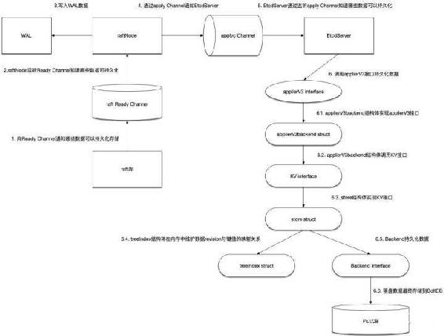

# 第八章 【分布式存储系统 etcd】解析 etcd 设计原理

# 解析 etcd 的设计原理

前面已经介绍过了 etcd 中的两大核心模块：raft 和存储。现在我们来系统的介绍一下 etcd 的设计原理。

etcd 是一个存储更新频率不高的 kv 存储库并能提供查询服务，其数据只有一个层级，数据模型采用 MVCC，每个 key 创建时其实 version 是 1，每次更新操作增一。实际 etcd 底层的 boltdb 采用 B+树形式存储 kv 的 MVCC 数据，每次修改的数据只存储增量版本，所以创建 snapshot 的成本也是挺高的。kv 中的 key 是一个三元组(major, sub, type)，Major 存储了 key 的 revision，Sub 则存储了同样 revision 下的差异，type 则是一个后缀，用于指明一些特殊 value 的类型，如果当前 value 中有 tombstone 则 type 为 t。B+树的 key 按照词典顺序进行排序。etcd 在内存中对 key 的 revision 也是以 B+树组织起来形成一个索引，value 指针指向磁盘中相应地增量值，这种组织形式便于进行 iteration。

etcd 提供了 leader 选举、分布式时钟、分布式锁、持续监控（watch）和集群内各个成员的 liveness 监控等功能。zookeer 虽然也实现了类似的功能，但是不方便易用，还需借助 Netflix 提供的 Apache Curator 库。

etcd 目前主要有 v2 和 v3 两个版本，但 v3 比 v2 在 API 层做了大幅度的优化，且 etcd2 客户端经过解析优化后与 etcd3 的消息处理性能仍然有 2 倍的差距，而 v2 的 JSON 外部协议和集群内部协议在 v3 中同样支持，所以本文以 v3 为主。个人使用 etcd 的体会：etcd 与其说是一个提供一致性服务的分布式系统，不如说是一个分布式 kv 数据库。

etcd 名字的由来：unix 系统的目录/etc 是存储配置文件的地方，后来再加上一个代表 distributed systems 的”d”就组成了 etcd。所以说 etcd 可以被认识是一个分布式 kv 配置项数据库。

> 为分布式集群提供一致性服务的组件，先有 google 内部的 Chubby，后有 hadoop 生态的 zookeeper。基于 Java 的 zookeeper 保证 CP，但是廉颇老矣，以往曾有同事曾经测试过在三千左右的客户端的频繁读写情况下 zookeeper 会频繁死掉。和 zookeeper 等同类产品相比，coreos 开发的同样保证 CP 的 etcd 与其功能几乎雷同，但是 zookeeper 的设计和实现都很繁琐，而采用了 gRPC 作为底层通信框架的 etcd 几乎有所有直流语言的客户端支持。zookeeper 的通信协议是自定制的 Jute RPC 协议，而 etcd 使用的 gRPC 可以接收通过 HTTP 发来的 JSON 请求，通过 curl 工具就可以对 etcd 进行测试。容器时代的王者 kubuernets 依赖它可实现上万个容器的管理。

## 一、模块和流程

下图中展示了 etcd 如何处理一个客户端请求的涉及到的模块和流程。图中淡紫色的矩形表示 etcd，它包括如下几个模块：

*   etcd server：对外接收客户端的请求，对应 etcd 代码中的 etcdserver 目录，其中还有一个 raft.go 的模块与 etcd-raft 库进行通信。etcdserver 中与存储相关的模块是 applierV3，这里封装了 V3 版本的数据存储，WAL（write ahead log），用于写数据日志，etcd 启动时会根据这部分内容进行恢复。
*   etcd raft：etcd 的 raft 库。除了与本节点的 etcd server 通信之外，还与集群中的其他 etcd server 进行交互做一致性数据同步的工作（在图中集群中其他 etcd 服务用橙色的椭圆表示）。


在上图中，一个请求与一个 etcd 集群交互的主要流程分为两大部分：

1.  写数据到某个 etcd server 中。
2.  该 etcd server 与集群中的其他 etcd 节点进行交互，当确保数据已经被存储之后应答客户端。

请求流程划分为了以下的子步骤：

*   1.1：etcd server 收到客户端请求。
*   1.2：etcd server 将请求发送给本模块中的 raft.go，这里负责与 etcd raft 模块进行通信。
*   1.3：raft.go 将数据封装成 raft 日志的形式提交给 raft 模块。
*   1.4：raft 模块会首先保存到 raftLog 的 unstable 存储部分。
*   1.5：raft 模块通过 raft 协议与集群中其他 etcd 节点进行交互。

注意在以上流程中，假设这里写入数据的 etcd 是 leader 节点，因为在 raft 协议中，如果提交数据到非 leader 节点的话需要路由到 etcd leader 节点去。

而应答步骤如下：

*   2.1：集群中其他节点向 leader 节点应答接收这条日志数据。
*   2.2：当超过集群半数以上节点应答接收这条日志数据时，etcd raft 通过 Ready 结构体通知 etcd server 中的 raft 该日志数据已经 commit。
*   2.3：raft.go 收到 Ready 数据将首先将这条日志写入到 WAL 模块中。
*   2.4：通知最上层的 etcd server 该日志已经 commit。
*   2.5：etcd server 调用 applierV3 模块将日志写入持久化存储中。
*   2.6：etcd server 应答客户端该数据写入成功。
*   2.7：最后 etcd server 调用 etcd raft，修改其 raftLog 模块的数据，将这条日志写入到 raftLog 的 storage 中。

从上面的流程可以看到：

*   etcd raft 模块在应答某条日志数据已经 commit 之后，是首先写入到 WAL 模块中的，因为这个模块只是添加一条日志，所以速度会很快，即使在后面 applierV3 写入失败，重启的时候也可以根据 WAL 模块中的日志数据进行恢复。
*   etcd raft 中的 raftLog，按照前面文章的分析，其中的数据是保存到内存中的，重启即失效，上层应用真实的数据是持久化保存到 WAL 和 applierV3 中的。

## 二、etcd server

以下就来分析 etcd server 与这部分相关的几个模块。

**etcd server 与 raft 的交互**

EtcdServer 结构体，负责对外与客户端进行通信。内部有一个 raftNode 结构的成员，负责与 etcd 的 raft 库进行交互。

etcd V3 版本的 API，通过 GRPC 协议与客户端进行交互，其相关代码在 etcdserver/v3_server.go 中。以一次 Put 请求为例，最后将会调用的代码在函数 EtcdServer::processInternalRaftRequestOnce 中，代码的主要流程分析如下。


1.  拿到当前 raft 中的 apply 和 commit 索引，如果 commit 索引比 apply 索引超出太多，说明当前有很多数据都没有 apply，返回 ErrTooManyRequests 错误。

2.  调用 s.reqIDGen.Next()函数生成一个针对当前请求的 ID，注意这个 ID 并不是一个随机数而是一个严格递增的整数。同时将请求序列化为 byte 数据，这会做为 raft 的数据进行存储。

3.  根据第 2 步中的 ID，调用 Wait.Register 函数进行注册，这会返回一个用于通知结果的 channel，后续就通过监听该 channel 来确定是否成功储存了提交的值。

4.  调用 Raft.Process 函数提交数据，这里传入的参数除了前面序列化的数据之外，还有使用超时时间创建的 Context。

5.  监听前面的 Channel 以及 Context 对象： a. 如果 context.Done 返回，说明数据提交超时，使用 s.parseProposeCtxErr 函数返回具体的错误。 b. 如果 channel 返回，说明已经提交成功。

从以上的流程可以看出，在调用 Raft.Process 函数向 Raft 库提交数据之后，等待被唤醒的 Channel 才是正常提交数据成功的路径。

在 EtcdServer.run 函数中，最终会进入一个死循环中，等待 raftNode.apply 返回的 channel 被唤醒，而 raftNode 继承了 raft.Node 的实现，从前面分析 etcd raft 的流程中可以明白，EtcdServer 就是在向 raft 库提交了数据之后，做为其上层消费 Ready 数据的应用层。

自此，整体的流程大体已经清晰：

1.  EtcdServer 对外通过 GRPC 协议接收客户端请求，对内有一个 raftNode 类型的成员，该类型继承了 raft.Node 的实现。
2.  客户端通过 EtcdServer 提交的数据修改都会通过 raftNode 来提交，而 EtcdServer 本身通过监听 channel 与 raft 库进行通信，由 Ready 结构体来通过 EtcdServer 哪些数据已经提交成功。
3.  由于每个请求都会一个对应的 ID，ID 绑定了 Channel，所以提交成功的请求通过 ID 找到对应的 Channel 来唤醒提交流程，最后通知客户端提交数据成功。

## 三、WAL

Write Ahead Log（预写式日志），以上介绍了 EtcdServer 的大体流程，接下来看 WAL 的实现。

前面已经分析过了，etcd raft 提交数据成功之后，将通知上面的应用层（在这里就是 EtcdServer），然后再进行持久化数据存储。而数据的持久化可能会花费一些时间，因此在应答应用层之前，EtcdServer 中的 raftNode 会首先将这些数据写入 WAL 日志中。这样即使在做持久化的时候数据丢失了，启动恢复的时候也可以根据 WAL 的日志进行数据恢复。

etcdserver 模块中，给 raftNode 用于写 WAL 日志的工作，交给了接口 Storage 来完成，而这个接口由 storage 来具体实现：

```go
type storage struct {
    *wal.WAL
    *snap.Snapshotter
}
```

可以看到，这个结构体组合了 WAL 和 snap.Snapshotter 结构，Snapshotter 负责的是存储快照数据。

WAL 日志文件中，每条日志记录有以下的类型：

1.  Type：日志记录类型，下面详细解释都有哪些类型。
2.  Crc：这一条日志记录的校验数据。
3.  Data：真正的数据，根据类型不同存储的数据也不同。

日志记录又有如下的类型：

1.  metadataType：存储的是元数据（metadata），每个 WAL 文件开头都有这类型的一条记录数据。
2.  entryType：保存的是 raft 的数据，也就是客户端提交上来并且已经 commit 的数据。
3.  stateType：保存的是当前集群的状态信息，即前面提到的 HardState。
4.  crcType：校验数据。
5.  snapshotType：快照数据。

etcd 使用两个目录分别存放 WAL 文件以及快照文件。其中，WAL 文件的文件名格式是“16 位的 WAL 文件编号-该 WAL 第一条 entry 数据的 index 号.wal”，这样就能从 WAL 文件名知道该 WAL 文件中保存的 entry 数据至少大于什么索引号。而快照文件名的格式则是“16 位的快照数据最后一条日志记录任期号-16 位的快照数据最后一条记录的索引号.snap”。

Etcd 会管理 WAL 目录中的所有 WAL 文件，但是在生成快照文件之后，在快照数据之前的 WAL 文件将被清除掉，保证磁盘不会一直增长。

比如当前 etcd 中有三个 WAL 文件，可以从这些文件的文件名知道其中存放数据的索引范围。


在生成快照文件之后，此时就只剩一个 WAL 文件和一个快照文件了：


那么，又是在什么情况下生成快照文件呢？Etcdserver 在主循环中通过监听 channel 获知当前 raft 协议返回的 Ready 数据，此时会做判断如果当前保存的快照数据索引距离上一次已经超过一个阈值（EtcdServer.snapCount），此时就从 raft 的存储中生成一份当前的快照数据，写入快照文件成功之后，就可以将这之前的 WAL 文件释放了。

以上流程和对应的具体函数见下面的流程图。


**backend store 的实现**

**revision 概念** Etcd 存储数据时，并不是像其他的 KV 存储那样，存放数据的键做为 key，而是以数据的 revision 做为 key，键值做为数据来存放。如何理解 revision 这个概念，以下面的例子来说明。

比如通过批量接口两次更新两对键值，第一次写入数据时，写入<key1,value1>和<key2,value2>，在 Etcd 这边的存储看来，存放的数据就是这样的：

```go
revision={1,0},key=key1,value=value1
revision={1,1},key=key2,value=value2
```

而在第二次更新写入数据<key1,update1>和<key2,update2>后，存储中又记录（注意不是覆盖前面的数据）了以下数据：

```go
revision={2,0},key=key1,value=update1
revision={2,1},key=key2,value=update2
```

其中 revision 有两部分组成，第一部分成为 main revision，每次事务递增 1；第二部分称为 sub revision，一个事务内的一次操作递增 1。 两者结合，就能保证每次 key 唯一而且是递增的。


但是，就客户端看来，每次操作的时候是根据 Key 来进行操作的，所以这里就需要一个 Key 映射到当前 revision 的操作了，为了做到这个映射关系，Etcd 引入了一个内存中的 Btree 索引，整个操作过程如下面的流程所示。


查询时，先通过内存中的 btree 索引来查询该 key 对应的 keyIndex 结构体，然后再根据这个结构体才能去 boltdb 中查询真实的数据返回。

所以，下面先展开讨论这个 keyIndex 结构体和 btree 索引。

## 四、keyIndex 结构

keyIndex 结构体有以下成员：

*   key：存储数据真实的键。
*   modified：最后一次修改该键对应的 revision。
*   generations：generation 数组。

如何理解 generation 结构呢，可以认为每个 generation 对应一个数据从创建到删除的过程。每次删除 key 的操作，都会导致一个 generation 最后添加一个 tombstone 记录，然后创建一个新的空 generation 记录添加到 generations 数组中。

generation 结构体存放以下数据：

*   ver：当前 generation 中存放了多少次修改，其实就是 revs 数组的大小-1（因为需要去掉 tombstone）。
*   created：创建该 generation 时的 revision。
*   revs：存放该 generation 中存放的 revision 数组。

以下图来说明 keyIndex 结构体：


如上图所示，存放的键为 test 的 keyIndex 结构。

它的 generations 数组有两条记录，其中 generations[0]在 revision 1.0 时创建，当 revision2.1 的时候进行 tombstone 操作，因此该 generation 的 created 是 1.0；对应的 generations[1]在 revision3.3 时创建，紧跟着就做了 tombstone 操作。

所以该 keyIndex.modifiled 成员存放的是 3.3，因为这是这条数据最后一次被修改的 revision。

一个已经被 tombstone 的 generation 是可以被删除的，如果整个 generations 数组都已经被删除空了，那么整个 keyIndex 记录也可以被删除了。


如上图所示，keyIndex.compact(n)函数可以对 keyIndex 数据进行压缩操作，将删除满足 main revision < n 的数据。

*   compact(2)：找到了 generations[0]的 1.0 revision 的数据进行了删除。
*   compact(3)：找到了 generations[0]的 2.1 revision 的数据进行了删除，此时由于 generations[0]已经没有数据了，所以这一整个 generation 被删除，原先的 generations[1]变成了 generations[0]。
*   compact(4)：找到了 generations[0]的 3.3 revision 的数据进行了删除。由于所有的 generation 数据都被删除了，此时这个 keyIndex 数据可以删除了。

## 五、treeIndex 结构

Etcd 中使用 treeIndex 来在内存中存放 keyIndex 数据信息，这样就可以快速的根据输入的 key 定位到对应的 keyIndex。

treeIndex 使用开源的[`github.com/google/btree`](http://link.zhihu.com/?target=http%3A//github.com/google/btree)来在内存中存储 btree 索引信息，因为用的是外部库，所以不打算就这部分做解释。而如果很清楚了前面 keyIndex 结构，其实这部分很好理解。

所有的操作都以 key 做为参数进行操作，treeIndex 使用 btree 根据 key 查找到对应的 keyIndex，再进行相关的操作，最后重新写入到 btree 中。

## 六、store

前面说到了 WAL 数据的存储、内存索引数据的存储，这部分讨论持久化存储数据的模块。

etcd V3 版本中，使用 BoltDB 来持久化存储数据（etcd V2 版本的实现不做讨论）。所以这里先简单解释一下 BoltDB 中的相关概念。

**BoltDB 相关概念**

BoltDB 中涉及到的几个数据结构，分别为 DB、Bucket、Tx、Cursor、Tx 等。

其中：

*   DB：表示数据库，类比于 Mysql。
*   Bucket：数据库中的键值集合，类比于 Mysql 中的一张数据表。
*   键值对：BoltDB 中实际存储的数据，类比于 Mysql 中的一行数据。
*   Cursor：迭代器，用于按顺序遍历 Bucket 中的键值对。
*   Tx：表示数据库操作中的一次只读或者读写事务。

**Backend 与 BackendTx 接口**

Backend 和 BackendTx 内部的实现，封装了 BoltDB，这部分就很简单了。

## 七、Lessor 接口

etcd 中没有提供针对数据设置过期时间的操作，通过租约（Lease）来实现数据过期的效果。而 Lessor 接口就提供了管理租约的相关接口。

比如，使用 etcdctl 命令可以创建一个 lease：

etcdctl lease grant 10 lease 694d67ed2bfbea03 granted with TTL(10s)

这样就创建了一个 ID 为 694d67ed2bfbea03 的 Lease，此时可以将键值与这个 lease 进行绑定：

etcdctl put --lease=694d67ed2bfbea03 a b

当时间还没超过过期时间 10S 时，能通过 etcd 拿到这对键值的数据。如果超时了就获取不到数据了。

从上面的命令可以看出，一个 Lease 可以与多个键值对应，由这个 Lease 通过管理与其绑定的键值数据的生命周期。

etcd 中，将 Lease ID 存放在名为“lease”的 Bucket 中，注意在这里只存放 Lease 相关的数据，其键值为：<Lease ID，序列化后的 Lease 数据包括 TTL、ID>，之所以不存放与 Lease 绑定的键值，是因为这些键值已经存放到另外的 Bucket 里了，写入数据的时候也会将这些键值绑定的 Lease ID 写入，这样在恢复数据的时候就可以将键值与 Lease ID 绑定的关系写入内存中。

即：Lease 这边需要持久化的数据只有 Lease ID 与 TTL 值，而键值对这边会持久化所绑定的 Lease ID，这样在启动恢复的时候可以将两者对应的关系恢复到内存中。


明白了以上关系再来理解 Lessor 的实现就很简单了。

lessor 中主要包括以下的成员：

*   leaseMap map[LeaseID]*Lease：存储 LeaseID 与 Lease 实例之间的对应关系。
*   itemMap map[LeaseItem]LeaseID：leaseItem 实际存放的是键值，所以这个 map 管理的就是键值与 Lease ID 之间的对应关系。
*   b backend.Backend：持久化存储，每个 Lease 的持久化数据会写入名为“lease”的 Bucket 中。
*   minLeaseTTL int64：最小过期时间，设置给每个 lease 的过期时间不得小于这个数据。
*   expiredC chan []*Lease：通过这个 channel 通知外部有哪些 Lease 过期了。

其他的就很简单了:

1.  lessor 启动之后会运行一个 goroutine 协程，在这个协程里定期查询哪些 Lease 超时，超时的 Lease 将通过 expiredC channel 通知外部。
2.  而针对 Lease 的 CRUD 操作，都需要进行加锁才能操作。

## 八、KV 接口

有了以上的准备，可以开始分析数据存储相关的内容了。在 etcd V3 中，所有涉及到数据的存储，都会通过 KV 接口。

store 结构体实现了 KV 接口，其中最重要的就是封装了前面提到的几个数据结构：

*   b backend.Backend：用于将持久化数据写入 BoltDB 中。
*   kvindex index：保存 key 索引。
*   changes []mvccpb.KeyValue：保存每次写操作之后进行了修改的数据，用于通知 watch 了这些数据变更的客户端。

在 store 结构体初始化时，根据传入的 backend.Backend，初始化 backend.BatchTx 结构，后面的任何涉及到事务的操作，都可以通过这个 backend.BatchTx 来进行。

其实有了前面的准备，理解 store 结构做的事情已经不难，以一次 Put 操作为例，其流程主要如下图所示：


**applierV3**

EtcdServer 内部实现中，实际使用的是 applierV3 接口来进行持久化数据的操作。

这个接口有以下几个实现，但是其中 applierV3backend 的实现是最重要的，其内部使用了前面提到的 KV 接口来进行数据的处理。

另外，applierV3 接口还有其他几个实现，这里分别列举一下。

*   applierV3backend：基础的 applierV3 接口实现，其他几个实现都在此实现上做功能扩展。内部调用 EtcdServer 中的 KV 接口进行持久化数据读写操作。
*   applierV3Capped：磁盘空间不足的情况下，EtcdServer 中的 applierV3 切换到这个实现里面来，这个实现的任何写入操作都会失败，这样保证底层存储的数据量不再增加。
*   authApplierV3：在 applierV3backend 的基础上扩展出权限控制的功能。
*   quotaApplierV3：在 applierV3backend 的基础上加上了限流功能，即底层的存储到了上限的话，会触发限流操作。

## 九、综述

下图将上面涉及到的关键数据结构串联在一起，看看 EtcdServer 在收到 Raft 库通过 Ready channel 通知的可以持久化数据之后，都做了什么操作。



1.  raft 库通过 Ready Channel 通知上层的 raftNode 哪些数据可以进行持久化。
2.  raftNode 启动之后也是会启动一个 Goroutine 来一直监听这个 Ready Channel，以便收到可以持久化数据的通知。
3.  raftNode 在收到 Ready 数据之后，将首先写入 WAL 日志中。这里的 WAL 日志由 storage 结构体来管理，分为两大部分：WAL 日志以及 WAL 快照文件数据 Snapshotter，后者用来避免 WAL 文件一直增大。
4.  raftNode 在写 WAL 数据完成之后，通过 apply Channel 通知 EtcdServer。
5.  EtcdServer 启动之后也是启动一个 Goroutine 来监听这个 channel，以便收到可以持久化数据的通知。
6.  EtcdServer 通过调用 applierV3 接口来持久化数据。applierV3backend 结构体实现 applierV3 接口, applierV3backend 结构体实现 applierV3 接口，内部通过调用 KV 接口进行持久化操作。而在实现 KV 接口的 store 结构体中，treeIndex 负责在内存中维护数据键值与 revision 的对应关系即 keyIndex 数据，Backend 接口负责持久化数据，最后持久化的数据将落盘到 BoltDB 中。

最后，etcd 默认只保存 1000 个历史事件，所以不适合有大量更新操作的场景，这样会导致数据的丢失。 etcd 典型的应用场景是配置管理和服务发现，这些场景都是读多写少的。

相比于 zookeeper，etcd 使用起来要简单很多。不过要实现真正的服务发现功能，etcd 还需要和其他工具（比如 registrator、confd 等）一起使用来实现服务的自动注册和更新。

目前 etcd 还没有图形化的工具。