# 第九章 【分布式存储系统 etcd】etcd-manage 项目介绍

# etcd-manage 项目

本项目受到[e3w](https://github.com/soyking/e3w)启发

项目旨在于方便开发者简单明了的查看、添加、修改和删除存储于 etcd 中的配置。

相比于 e3w 本程序运行简单，已将 ui 静态文件打包到了可执行文件中只需在终端运行此程序即可自动打开浏览器访问子集的 etcd。

**与 e3w 好的地方**

1.  支持多 etcd 服务，更适用于开发者日常开发场景，一般都会有开发环境、测试环境和线上环境的不同切换 etcd 服务端。
2.  支持 Basic Auth 用户验证登录，可以通过配置文件添加用户并设置用户角色实现用户可访问 etcd server 的空。

**Demo**

demo 地址： [Demo](http://140.143.234.132:10280/ui/#/keys)

用户名：admin

密码：123456

## 项目效果图

首先先启动一个集群，还是像之前一样，一个 Mac 系统，以及两个 Ubuntu 虚拟机。如下图：

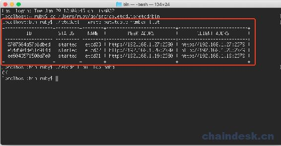

然后再 mac 下，打开 goland 的终端，编译并运行程序：

```go
localhost:etcd-manage ruby$ go build -o etcd-manage ./
localhost:etcd-manage ruby$ ./etcd-manage 
```

启动程序：

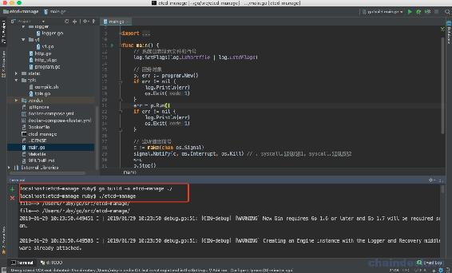

然后会自动的打开浏览器：

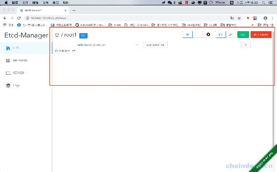

可以点开看看，我们启动了 3 个客户端：

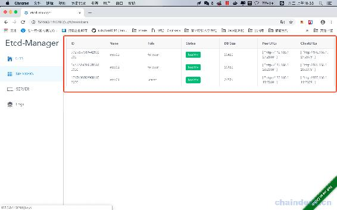

也有三个服务：

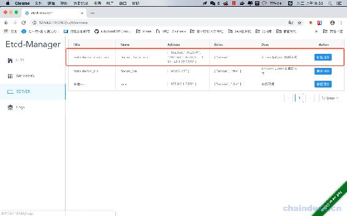

先不急着操作，可以在 Ubuntu 中也运行这个程序：

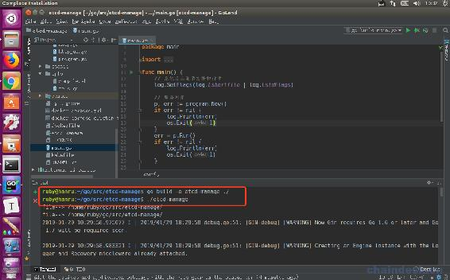

也会打开浏览器，接着我们在 mac 下的浏览器上进行操作，先点击 Add 按钮：

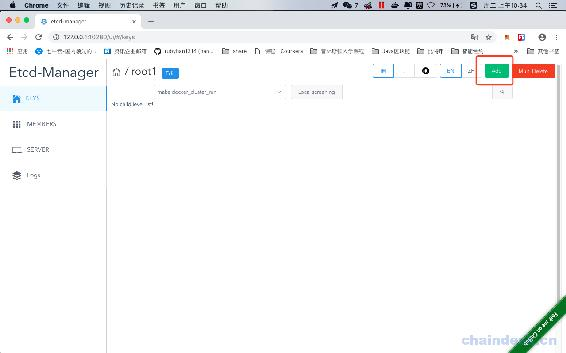

我们先添加一个 dir：

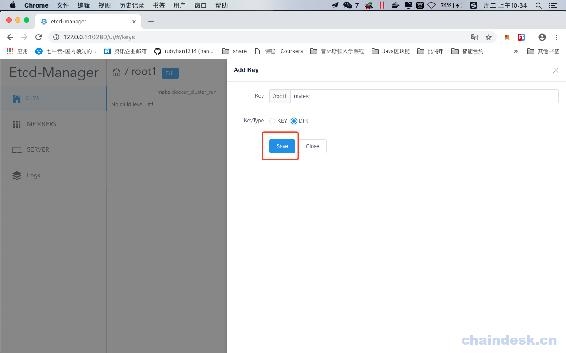

然后再添加一个 key：

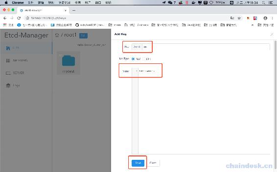

mac 下效果如下：

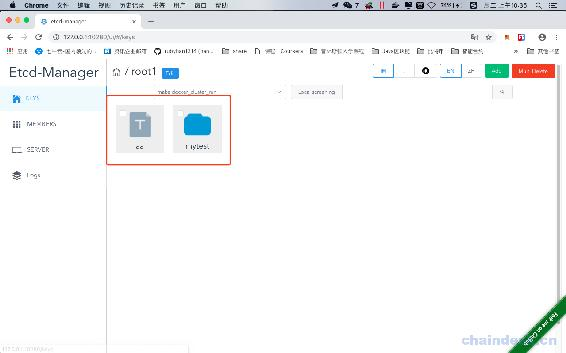

然后我么在 Ubuntu 下刷新浏览器：

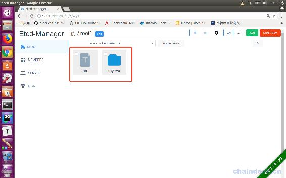

然后在 Ubuntu 中选中这两个文件，点击删除按钮：

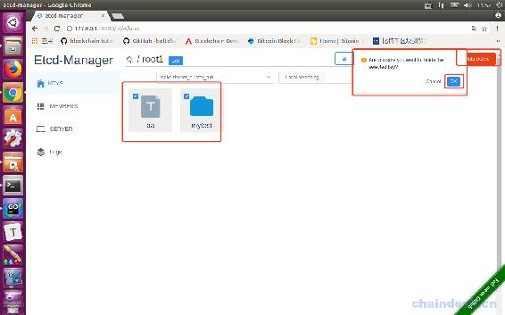

删除后效果如下：

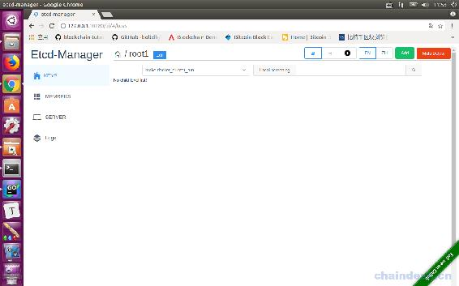

然后我们回到 Mac 下，刷新浏览器：

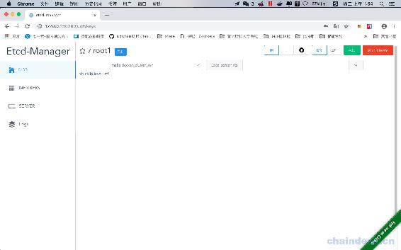

可以点开看一下日志：

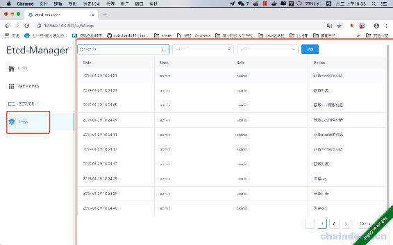

[源代码](https://github.com/rubyhan1314/myetcd-manage)