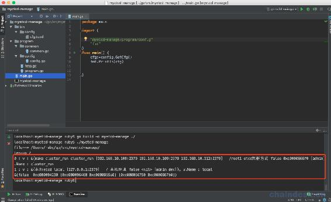

# 第十章 【分布式存储系统 etcd】etcd-manage 项目 _ 读取配置文件

# etcd-manage 项目——读取配置文件

首先我们打开 Goland 开发工具，创建一个项目 myetcd-manage。

## 一、创建 toml 配置文件

我们先新建一个 bin 目录，里面创建一个子目录 config，新建 toml 文件，cfg.toml：

```go
# debug 模式
debug = false
# 日志文件路径
log_path = ""

# http 监听端口
[http]
# 监听地址
address = "0.0.0.0"
# 监听端口
port = 10280

# 使用 Let's Encrypt 证书 - tls_enable 为 true 优先使用本地证书模式
tls_encrypt_enable = false
# 域名列表
tls_encrypt_domain_names = ["shiguanghuxian.com"]

# 是否启用 tls
tls_enable = false
# tls 证书文件
[http.tls_config]
cert_file = "cert_file"
key_file = "key_file"

## 一下每一个 server 为一个 etcd 服务 ##
[[server]]
# 显示名称
title = "make cluster_run"
# 标识名 - 只能是字母数字或下划线
name = "cluster_run"
# etcd 连接地址 如果为集群请填写全部地址
address = ["192.168.10.108:2379","192.168.10.109:2379","192.168.10.112:2379"]
# 查看的 key 前缀
key_prefix = "/root1"
# 简述信息
desc = "etcd 集群方式"
# 可访问服务器角色列表 - 不写则为所有用户可访问
roles = ["admin"]
# 是否启用 tls 连接
tls_enable = false
# tls 证书配置
[server.tls_config]
cert_file = "/etc/etcd/etcdSSL/etcd.pem"
key_file = "/etc/etcd/etcdSSL/etcd-key.pem"
ca_file = "/etc/etcd/etcdSSL/etcd-root-ca.pem"

[[server]]
title = "本地 etcd"
name = "local"
address = ["127.0.0.1:2379"]
key_prefix = "/"
desc = "本机环境"
roles = ["admin","dev"]

## 以下为用户列表 ##
[[user]]
username = "admin"
password = "123456"
role = "admin"

[[user]]
username = "dev_user"
password = "123456"
role = "dev" 
```

这个就是整个项目的配置文件了。

配置文件的使用由来已久，从.ini、XML、JSON、YAML 再到 TOML，语言的表达能力越来越强，同时书写便捷性也在不断提升。 TOML 是前 GitHub CEO， Tom Preston-Werner，于 2013 年创建的语言，其目标是成为一个小规模的易于使用的语义化配置文件格式。

**规范**

*   TOML 是大小写敏感的
*   TOML 文件必须是 UTF8 编码的
*   空白符可以是制表符(0x09)或空格(0x20)
*   换行符可以是 LF (0x0A) 或 CRLF (0x0D0A)

TOML 仍在不断完善，目前的版本 0.4.0。

## 二、读取配置文件

### 2.1 获取配置文件路径

我们创建一个目录 program，并创建子目录 common，里面新建 go 文件，common.go：

```go
package common

import (
    "path/filepath"
    "os"
    "fmt"
)

// GetRootDir 获取执行路径
func GetRootDir() string {
    // 文件不存在获取执行路径

    file, err := filepath.Abs(filepath.Dir(os.Args[0]))

    if err != nil {
        file = fmt.Sprintf(".%s", string(os.PathSeparator))
    } else {
        file = fmt.Sprintf("%s%s", file, string(os.PathSeparator))
    }
    fmt.Println("file-->",file)
    return file

}
```

我们先提供一个函数用于获取执行路径。

### 2.2 加载配置文件

接下来我们在 program 目录下,再创建子目录 config，里面新建 go 文件：config.go

首先我们先定义一些结构体：

```go
//Config 配置
type Config struct {
    Debug bool `toml:"debug"`
    LogPath string        `toml:"log_path"`
    HTTP    *HTTP         `toml:"http"`
    Server  []*EtcdServer `toml:"server"`
    Users   []*User       `toml:"user"`
}
```

定义 HTTP 以及 Tls 配置：

```go
 // HTTP http 件套配置
type HTTP struct {
    Address               string   `toml:"address"`
    Port                  int      `toml:"port"`
    TLSEnable             bool     `toml:"tls_enable"`               // 是否启用 tls 连接
    TLSConfig             *HTTPTls `toml:"tls_config"`               // 启用 tls 时必须配置此内容
    TLSEncryptEnable      bool     `toml:"tls_encrypt_enable"`       // 是否启用 Let's Encrypt tls
    TLSEncryptDomainNames []string `toml:"tls_encrypt_domain_names"` // 启用 Let's Encrypt 时的域名列表
}

// HTTPTls http tls 配置
type HTTPTls struct {
    CertFile string `toml:"cert_file"`
    KeyFile  string `toml:"key_file"`
} 
```

EtcdServer etcd 服务：

```go
 // EtcdServer etcd 服务
type EtcdServer struct {
    Title     string         `toml:"title"`
    Name      string         `toml:"name"`
    Address   []string       `toml:"address"`
    Username  string         `toml:"username"`
    Password  string         `toml:"password"`
    KeyPrefix string         `toml:"key_prefix"`
    Desc      string         `toml:"desc"`
    TLSEnable bool           `toml:"tls_enable"` // 是否启用 tls 连接
    TLSConfig *EtcdTLSConfig `toml:"tls_config"` // 启用 tls 时必须配置此内容
    Roles     []string       `toml:"roles"`      // 可访问此 etcd 服务的角色列表
} 
```

EtcdTLSConfig etcd tls 配置：

```go
 // EtcdTLSConfig etcd tls 配置
type EtcdTLSConfig struct {
    CertFile string `toml:"cert_file"`
    KeyFile  string `toml:"key_file"`
    CAFile   string `toml:"ca_file"`
} 
```

最后一个是用户信息：

```go
// User 用户
type User struct {
    Username string `toml:"username"`
    Password string `toml:"password"`
    Role     string `toml:"role"`
}
```

因为服务名称我们限制为大小写字母以及下划线组成，所以设计一个函数先来验证一下：

```go
// 判断 etcd 服务名是否包含非字母和数字
func chackEtcdServerName(name string) bool {
    if name == "" {
        return false
    }
    reg := regexp.MustCompile("[⁰-9A-Za-z_]+")
    return !reg.MatchString(name)
}
```

因为我们把 cfg.toml 定义在 bin/config 目录下，所以先定义一个函数用于获取该配置文件的目录：

```go
 // 获取配置文件的目录
func getCfgPath(cfgPath string) string {

    if cfgPath == "" {
        cfgPath = common.GetRootDir() + "bin/config/cfg.toml"
    }
    return cfgPath
} 
```

然后定义一个 Config 变量：

```go
var (
    cfg *Config
)
```

然后我们来读取配置文件：

```go
 // LoadConfig 读取配置
func LoadConfig(cfgPath string) (*Config, error) {
    cfgPath = getCfgPath(cfgPath)
    f, err := os.Open(cfgPath)
    if err != nil {
        return nil, err
    }
    defer f.Close()
    cfg = new(Config)
    if err := toml.NewDecoder(f).Decode(cfg); err != nil {
        return nil, err
    }

    fmt.Println("len-->",len(cfg.Server))
    // 验证服务 name 是否非字母和数字
    for i, v := range cfg.Server {
        if chackEtcdServerName(v.Name) == false {
            return nil, errors.New("etcd server name can only be letters or numbers or '_'")
        }
        fmt.Printf("%d : v : %v, v.Name : %v\n",i,v,v.Name)
    }

    return cfg, nil
} 
```

在这里我们使用的 toml 包下的函数，toml.NewDecoder(f).Decode(cfg)来加载。

最后我们获取一个配置对象：

```go
// GetCfg 获取配置
func GetCfg() *Config {
    if cfg == nil {
        LoadConfig("")
    }
    return cfg
}
```

在 main()中调用这个方法，观察打印出的结果：

```go
package main

import (
    "myetcd-manage/program/config"
    "fmt"
)
func main() {
    cfg :=config.GetCfg()
    fmt.Println(cfg)
} 
```

然后打开 Goland 的终端，输入以下命令：

```go
# 编译程序，并制定命令行参数是./
localhost:myetcd-manage ruby$ go build -o myetcd-manage ./
# 运行程序
localhost:myetcd-manage ruby$ ./myetcd-manage 
```

运行结果如下：

```go
localhost:myetcd-manage ruby$ go build -o myetcd-manage ./
localhost:myetcd-manage ruby$ ./myetcd-manage 
file--> /Users/ruby/go/src/myetcd-manage/
len--> 2
0 : v : &{make cluster_run cluster_run [192.168.10.108:2379 192.168.10.109:2379 192.168.10.112:2379]   /root1 etcd 集群方式 false 0xc0000666f0 [admin].Name : cluster_run
1 : v : &{本地 etcd local [127.0.0.1:2379]   / 本机环境 false <nil> [admin dev]}, v.Name : local
&{false  0xc000094230 [0xc000096460 0xc0000965a0] [0xc000066750 0xc0000667b0]}
localhost:myetcd-manage ruby$ 
```

运行结果截图：



[源代码](https://github.com/rubyhan1314/myetcd-manage)