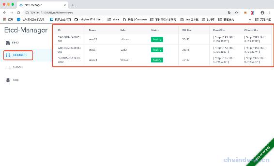

# 第十二章 【分布式存储系统 etcd】etcd-manage 项目——获取 etcd 的节点 member

# etcd-manage 项目——获取 etcd 的节点 member

我们要获取 etcd 的节点中的 member 的信息，展示到前端页面上。

首先在 etcdv3 目录下新建一个 model.go 文件：

里面新建结构体：

```go
// Member 节点信息
type Member struct {
    *etcdserverpb.Member
    Role   string `json:"role"`
    Status string `json:"status"`
    DbSize int64  `json:"db_size"`
}
```

然后再同一个目录下，新建 go 文件：member.go：

```go
 // Members 获取节点列表
func (c *Etcd3Client) Members() ([]*Member, error) {
    ctx, cancel := context.WithTimeout(context.Background(), 5*time.Second)
    defer cancel()

    resp, err := c.Client.MemberList(ctx)
    if err != nil {
        return nil, err
    }

    members := make([]*Member, 0)
    for _, member := range resp.Members {
        if len(member.ClientURLs) > 0 {
            m := &Member{Member: member, Role: ROLE_FOLLOWER, Status: STATUS_UNHEALTHY}
            ctx, cancel := context.WithTimeout(context.Background(), 5*time.Second)
            defer cancel()
            resp, err := c.Client.Status(ctx, m.ClientURLs[0])
            if err == nil {
                m.Status = STATUS_HEALTHY
                m.DbSize = resp.DbSize
                if resp.Leader == resp.Header.MemberId {
                    m.Role = ROLE_LEADER
                }
            }
            members = append(members, m)
        }
    }

    return members, nil
}
```

当然，我们还需要在 model.go 文件中，创建几个常量值：

```go
 const (
    ROLE_LEADER   = "leader"
    ROLE_FOLLOWER = "follower"

    STATUS_HEALTHY   = "healthy"
    STATUS_UNHEALTHY = "unhealthy"
)
```

然后我们打开 v1.go 文件，添加一个方法 getEtcdMembers()，用于获取 etcd 的成员：

```go
 // 获取服务节点
func getEtcdMembers(c *gin.Context) {
    var err error
    defer func() {
        if err != nil {
            c.JSON(http.StatusBadRequest, gin.H{
                "msg": err.Error(),
            })
        }
    }()

    etcdCli, exists := c.Get("EtcdServer")
    if exists == false {
        fmt.Println("-->Etcd client is empty")
        c.JSON(http.StatusBadRequest, gin.H{
            "msg": "Etcd client is empty",
        })
        return
    }
    cli := etcdCli.(*etcdv3.Etcd3Client)

    members, err := cli.Members()
    fmt.Println("---->>>,len:",len(members))
    if err != nil {
        return
    }

    c.JSON(http.StatusOK, members)
}
```

然后在 v1()函数中，添加一个路由：

```go
func V1(v1 *gin.RouterGroup){
    v1.GET("/members", getEtcdMembers) // 获取节点列表
}
```

因为我换了 ip 地址，所以修改一下配置文件：

```go
# etcd 连接地址 如果为集群请填写全部地址
address = ["192.168.10.108:2379","192.168.10.109:2379","192.168.10.110:2379"]
```

启动 3 个节点：

```go
localhost:bin ruby$ ./etcdctl --write-out=table member list

+------------------+---------+--------+----------------------------+----------------------------+
|        ID        | STATUS  |  NAME  |         PEER ADDRS         |        CLIENT ADDRS        |
+------------------+---------+--------+----------------------------+----------------------------+
| 238906d2949aadeb | started | etcd02 | http://192.168.10.109:2380 | http://192.168.10.109:2379 |
| 491b2354e9222f7b | started | etcd01 | http://192.168.10.108:2380 | http://192.168.10.108:2379 |
| e90298bdbb087f01 | started | etcd03 | http://192.168.10.110:2380 | http://192.168.10.110:2379 |
+------------------+---------+--------+----------------------------+----------------------------+

localhost:bin ruby$ 
```

然后打开终端，重新编译程序，并且运行：

```go
localhost:myetcd-manage ruby$ go build -o myetcd-manage ./
localhost:myetcd-manage ruby$ ./myetcd-manage 
```

可以看到自动打开了一个浏览器，我们点击侧边栏的 members：



可以看到已经可以显示 etcd 的集群节点了。

[源代码](https://github.com/rubyhan1314/myetcd-manage)