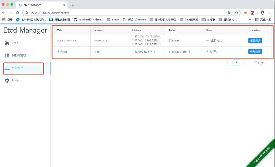

# 第十三章 【分布式存储系统 etcd】etcd-manage 项目——获取 etcd 的 server 信息

# etcd-manage 项目——获取 etcd 的 server 信息

我们要获取 etcd 的节点的 server 信息，展示到前端页面上。其实就是读取配置文件中写好的 server 的信息。

我们在 v1.go 文件中添加一个函数：

```go
 // 获取 etcd 服务列表
func getEtcdServerList(c *gin.Context) {

    cfg := config.GetCfg()
    if cfg == nil {
        c.JSON(http.StatusBadRequest, gin.H{
            "msg": "配置为 nil",
        })
        return
    }
    list := cfg.Server
    if list == nil {
        list = make([]*config.EtcdServer, 0)
        c.JSON(http.StatusOK, list)
        return
    }
    // 当前用户角色
    userRole := ""
    userRoleIn, exists := c.Get("userRole")
    if exists == true {
        userRole = userRoleIn.(string)
    }

    // log.Println(userRole)

    // 只返回有权限服务列表
    list1 := make([]*config.EtcdServer, 0)
    for _, s := range list {
        if s.Roles == nil || len(s.Roles) == 0 {
            list1 = append(list1, s)
        } else {
            for _, r := range s.Roles {
                if r == userRole {
                    list1 = append(list1, s)
                    break
                }
            }
        }
    }

    c.JSON(http.StatusOK, list1)
} 
```

然后再 v1()函数中，再注册一个路由：

```go
func V1(v1 *gin.RouterGroup){
    v1.GET("/members", getEtcdMembers) // 获取节点列表

    v1.GET("/server", getEtcdServerList) // 获取 etcd 服务列表
}
```

然后重新编译程序，并启动，点击 server，可以看到：



[源代码](https://github.com/rubyhan1314/myetcd-manage)