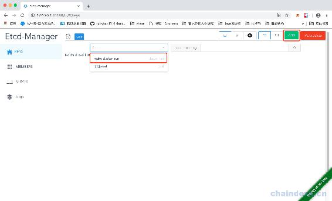
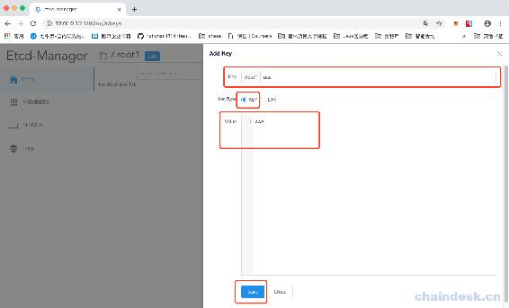
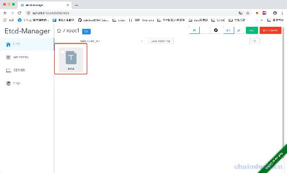
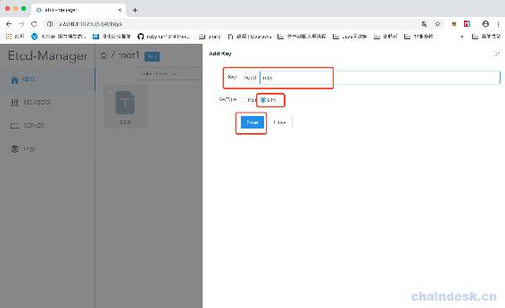
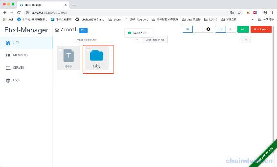
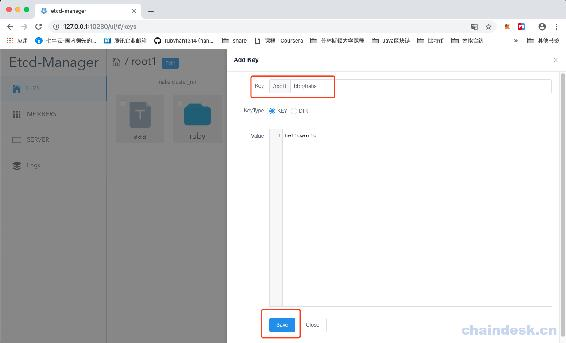
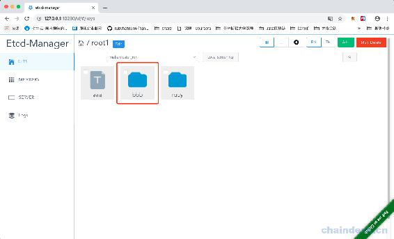
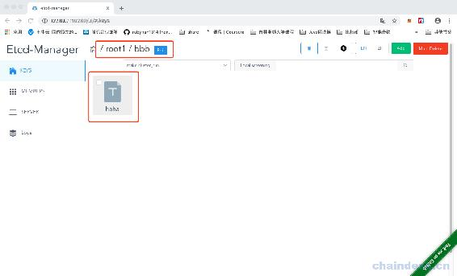
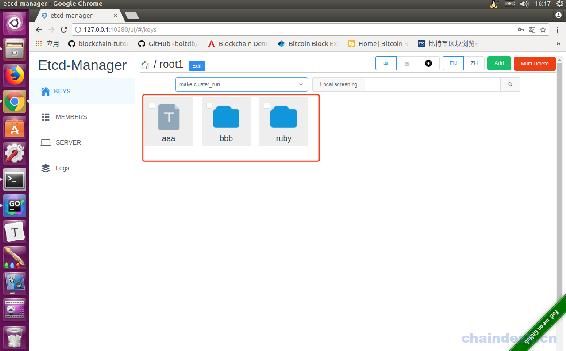

# 第十五章 【分布式存储系统 etcd】etcd-manage 项目——显示 key 数据

# etcd-manage 项目——显示 key 数据

之前我们已经通过页面上的 Add 按钮，进行添加 key 了，可以添加 key-value 数值，也可以新建 dir 目录，现在我们要将这些数据展示出来。

首先在 keys.go 文件中，添加 List()方法，用于获取 Node 对象：

```go
// List 获取目录下列表
func (c *Etcd3Client) List(key string) (nodes []*Node, err error) {
    if key == "" {
        return make([]*Node, 0), errors.New("key is empty")
    }
    // 兼容 key 前缀设置为 /
    dir := key
    if key != "/" {
        key = strings.TrimRight(key, "/")
        dir = key + "/"
    }

    ctx, cancel := context.WithTimeout(context.Background(), 5*time.Second)
    defer cancel()

    txn := c.Client.Txn(ctx)
    txn.If(
        clientv3.Compare(
            clientv3.Value(key),
            "=",
            DEFAULT_DIR_VALUE,
        ),
    ).Then(
        clientv3.OpGet(dir, clientv3.WithPrefix()),
    )

    txnResp, err := txn.Commit()
    if err != nil {
        return nil, err
    }

    if !txnResp.Succeeded {
        return nil, ErrorListKey
    } else {
        if len(txnResp.Responses) > 0 {
            rangeResp := txnResp.Responses[0].GetResponseRange()
            return c.list(dir, rangeResp.Kvs)
        } else {
            // empty directory
            return []*Node{}, nil
        }
    }

    return []*Node{}, nil
} 
```

继续添加，这里我们只是包装一下，新建 Node 对象：

```go
 func (c *Etcd3Client) list(dir string, kvs []*mvccpb.KeyValue) ([]*Node, error) {
    nodes := []*Node{}
    for _, kv := range kvs {
        name := strings.TrimPrefix(string(kv.Key), dir)
        if strings.Contains(name, "/") {
            // secondary directory
            continue
        }
        nodes = append(nodes, NewNode(dir, kv))
    }
    return nodes, nil
}
```

model.go 文件中：

```go
// NewNode 创建节点
func NewNode(dir string, kv *mvccpb.KeyValue) *Node {
    return &Node{
        IsDir:   string(kv.Value) == DEFAULT_DIR_VALUE,
        Value:   strings.TrimPrefix(string(kv.Key), dir),
        FullDir: string(kv.Key),
        Version: kv.Version,
    }
}
```

然后在 v1.go 中：

```go
// 获取 etcd key 列表
func getEtcdKeyList(c *gin.Context) {

    key := c.Query("key")

    var err error
    defer func() {
        if err != nil {

            c.JSON(http.StatusBadRequest, gin.H{
                "msg": err.Error(),
            })
        }
    }()

    // log.Println(key)
    etcdCli, exists := c.Get("EtcdServer")
    fmt.Println("etcdCli,",etcdCli)
    if exists == false {
        c.JSON(http.StatusBadRequest, gin.H{
            "msg": "Etcd client is empty",
        })
        return
    }
    cli := etcdCli.(*etcdv3.Etcd3Client)

    resp, err := cli.List(key)
    if err != nil {
        return
    }

    list := make([]*etcdv3.Node, 0)
    for _, v := range resp {
        if v.FullDir != "/" {
            list = append(list, v)
        }
    }

    c.JSON(http.StatusOK, list)
} 
```

最后注册路由：

```go
func V1(v1 *gin.RouterGroup){
    v1.GET("/members", getEtcdMembers) // 获取节点列表

    v1.GET("/server", getEtcdServerList) // 获取 etcd 服务列表

    v1.POST("/key", postEtcdKey)       // 添加 key
    v1.GET("/list", getEtcdKeyList)    // 获取目录下列表

}
```

现在我们将程序重新编译，并运行：



首先点击下拉列表，选择我们的 etcd 集群，然后点击 Add 按钮，可以进行添加，此处我们可以添加 key-value，也可以添加 dir 目录，我们先选择 key-value：



然后点击保存，那么显示如下：



然后我们再尝试添加 dir 目录：



效果如下：



接下来我们尝试添加一个带父目录的 key-value 数据：



然后我们可以看见，先创建了 bbb 目录：



在 bbb 目录下，存在这 haha 数据：



此时，我们可以在另外的节点机器上，执行该程序，此处我们是使用的 Ubuntu 虚拟机，可以看见数据是分布式存储的：



[源代码](https://github.com/rubyhan1314/myetcd-manage)