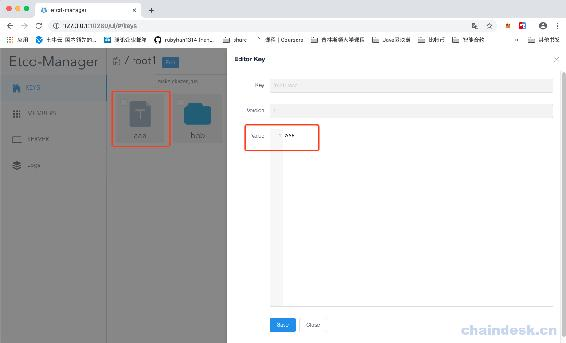
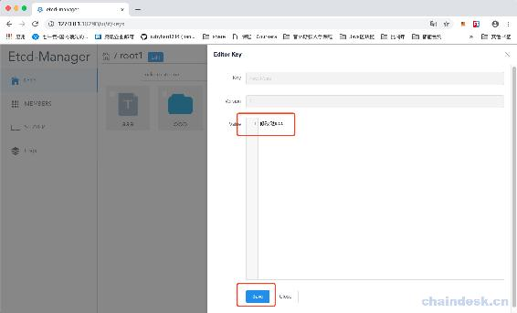

# 第十六章 【分布式存储系统 etcd】etcd-manage 项目——修改 key 数据

# etcd-manage 项目——修改 key 数据

我们要想修改数据，首先应该是点击要修改的 key，那么会显示原始的 value 数值，然后我们再进行修改。

## 一、获取一个 key 的具体值

我们首先获取一个 key 的具体数值，并显示：

在 v1.go 中，添加一个 getEtcdKeyValue()函数：

```go
// 获取 key 的值
func getEtcdKeyValue(c *gin.Context) {

    key := c.Query("key")
    var err error
    defer func() {
        if err != nil {
            c.JSON(http.StatusBadRequest, gin.H{
                "msg": err.Error(),
            })
        }
    }()

    etcdCli, exists := c.Get("EtcdServer")
    if exists == false {
        c.JSON(http.StatusBadRequest, gin.H{
            "msg": "Etcd client is empty",
        })
        return
    }
    cli := etcdCli.(*etcdv3.Etcd3Client)

    val, err := cli.Value(key)
    if err != nil {
        return
    }

    c.JSON(http.StatusOK, val)
}
```

我们直接根据 key 进行获取即可。

然后注册路由：

```go
// V1 v1 版接口
func V1(v1 *gin.RouterGroup){
    v1.GET("/members", getEtcdMembers) // 获取节点列表

    v1.GET("/server", getEtcdServerList) // 获取 etcd 服务列表

    v1.POST("/key", postEtcdKey)       // 添加 key
    v1.GET("/list", getEtcdKeyList)    // 获取目录下列表
    v1.GET("/key", getEtcdKeyValue)    // 获取一个 key 的具体值

}
```

现在可以重新编译程序，并运行了：



点击 aaa，可以看到能够显示 AAA 这个数值了。

## 二、修改 key

因为之前已经实现了保存 key 这个函数，此处我们只要传入参数 isPut 为 true，就可以表示是修改，因为之前已经设定为 Post 请求为添加 key，而 Put 为修改 key：

```go
// 保存 key
func saveEtcdKey(c *gin.Context, isPut bool){
    ...
}
```

然后在 v1.go 文件中，添加一个函数：

```go
// 修改 key
func putEtcdKey(c *gin.Context) {
    saveEtcdKey(c, true)
}
```

注册路由：

```go
// V1 v1 版接口
func V1(v1 *gin.RouterGroup){
    v1.GET("/members", getEtcdMembers) // 获取节点列表

    v1.GET("/server", getEtcdServerList) // 获取 etcd 服务列表

    v1.POST("/key", postEtcdKey)       // 添加 key
    v1.GET("/list", getEtcdKeyList)    // 获取目录下列表
    v1.GET("/key", getEtcdKeyValue)    // 获取一个 key 的具体值
    v1.PUT("/key", putEtcdKey)         // 修改 key

}
```

然后重新编译项目，并运行：



然后我们修改 Value 数值，并点击 Save 保存按钮，数据就改好了。

[源代码](https://github.com/rubyhan1314/myetcd-manage)