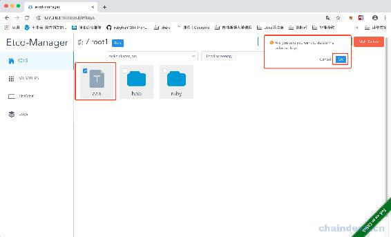
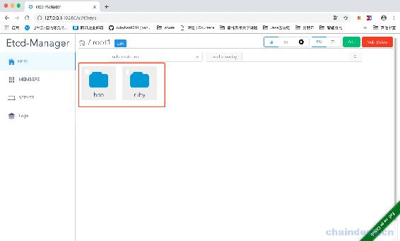
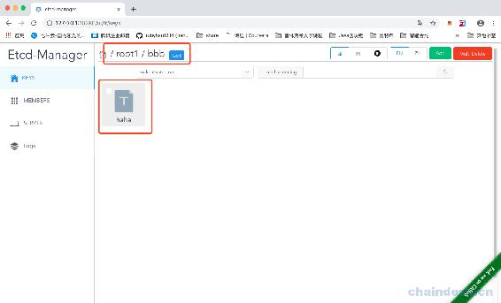
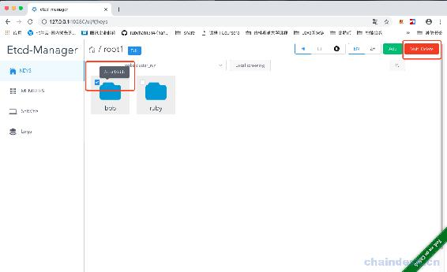
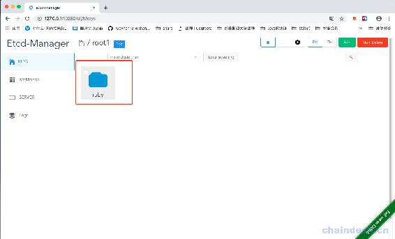

# 第十七章 【分布式存储系统 etcd】etcd-manage 项目——删除 key 数据

# etcd-manage 项目——删除 key 数据

之前已经实现了 key 的添加，显示和修改，现在我们实现删除功能。

首先在 keys.go 文件中，添加删除的方法：

```go
 // Delete 删除 key
func (c *Etcd3Client) Delete(key string) error {
    key = strings.TrimRight(key, "/")
    dir := key + "/"

    ctx, cancel := context.WithTimeout(context.Background(), 5*time.Second)
    defer cancel()

    txn := c.Client.Txn(ctx)
    // 如果是目录，删除整个目录
    txn.If(
        clientv3.Compare(
            clientv3.Value(key),
            "=",
            DEFAULT_DIR_VALUE,
        ),
    ).Then(
        clientv3.OpDelete(key),
        clientv3.OpDelete(dir, clientv3.WithPrefix()),
    ).Else(
        clientv3.OpDelete(key),
    )

    _, err := txn.Commit()
    return err
} 
```

这里注意一下， 如果要删除的是目录，那么整个目录都删除，也包含了该目录下的 key。

然后再 v1.go 文件中，调用这个删除的方法：

```go
 // 删除 key
func delEtcdKey(c *gin.Context) {
    key := c.Query("key")

    var err error
    defer func() {
        if err != nil {
            c.JSON(http.StatusBadRequest, gin.H{
                "msg": err.Error(),
            })
        }
    }()

    etcdCli, exists := c.Get("EtcdServer")
    if exists == false {
        c.JSON(http.StatusBadRequest, gin.H{
            "msg": "Etcd client is empty",
        })
        return
    }
    cli := etcdCli.(*etcdv3.Etcd3Client)

    err = cli.Delete(key)
    if err != nil {
        return
    }

    c.JSON(http.StatusOK, "ok")
} 
```

最后注册路由：

```go
func V1(v1 *gin.RouterGroup){
    v1.GET("/members", getEtcdMembers) // 获取节点列表

    v1.GET("/server", getEtcdServerList) // 获取 etcd 服务列表

    v1.POST("/key", postEtcdKey)       // 添加 key
    v1.GET("/list", getEtcdKeyList)    // 获取目录下列表
    v1.GET("/key", getEtcdKeyValue)    // 获取一个 key 的具体值
    v1.PUT("/key", putEtcdKey)         // 修改 key
    v1.DELETE("/key", delEtcdKey)      // 删除 key

}
```

将程序重新编译并运行，我们尝试删除数据：



这里是之前添加的数据，我们先点击 aaa 上面的复选框，然后点击右上角红色的 Mutil Delete 按钮，然后会弹出确认框，我们点击 ok 就表示删除。



可以看到数据已经被删除了。

接下来我们可以删除 bbb 目录，这个目录下还有一个 haha 的 key：



现在我们勾选住 bbb 目录，也可以看到提示，然后点击删除按钮：



最后只剩下一个 ruby 目录了：



[源代码](https://github.com/rubyhan1314/myetcd-manage)