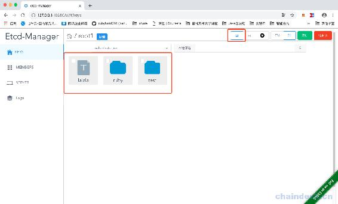
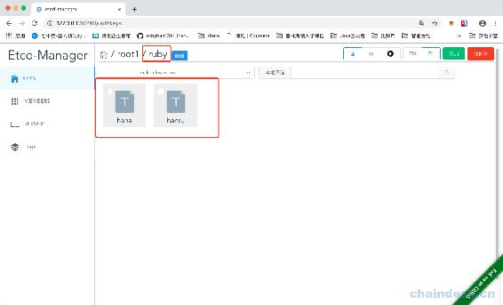
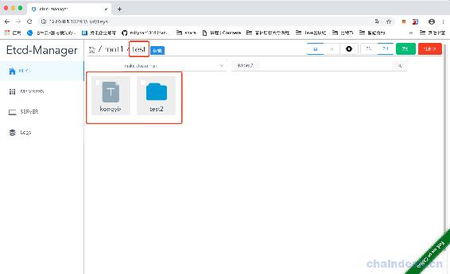
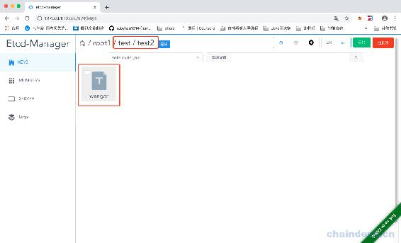
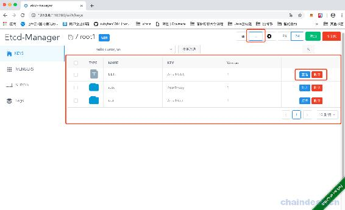
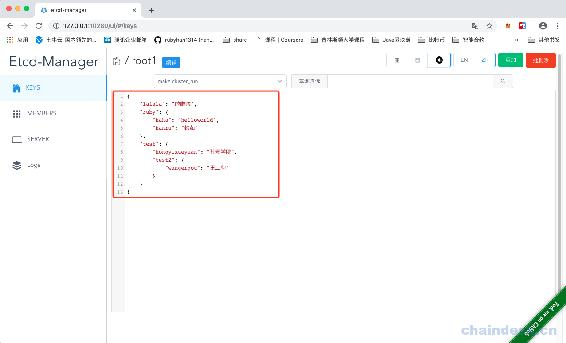
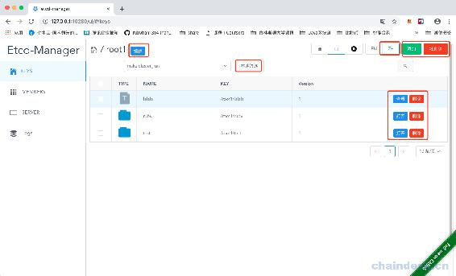
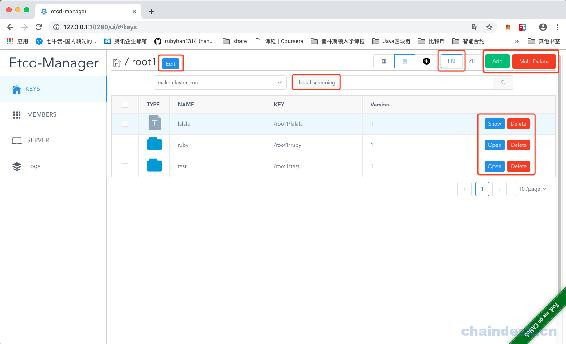

# 第十八章 【分布式存储系统 etcd】etcd-manage 项目——key 的展示形式

# etcd-manage 项目——key 的展示形式

目前我们能够实现 key 的增删改查了，现在我们查询所有的 key 后，可以按照网格还是列表或者 json 等格式显示，网格还是列表可以在前端完成，但是 json 格式需要我们来实现。

我们现在 keys.go 文件中添加一个方法，用于获取前缀下的所有 key：

```go
 // GetRecursiveValue 获取前缀下的所有 key
func (c *Etcd3Client) GetRecursiveValue(key string) (list []*Node, err error) {
    list = make([]*Node, 0)

    ctx, cancel := context.WithTimeout(context.Background(), 5*time.Second)
    defer cancel()
    resp, err := c.Client.KV.Get(ctx, key, clientv3.WithPrefix(), clientv3.WithSort(clientv3.SortByKey, clientv3.SortAscend))
    if err != nil {
        return nil, err
    }
    for _, kv := range resp.Kvs {
        list = append(list, &Node{
            Value:   string(kv.Value),
            FullDir: string(kv.Key),
            Version: kv.Version,
        })
    }

    for _,node:=range list{
        fmt.Printf("node:%v\n",node)
    }
    return
} 
```

然后我们在 etcdv3.go 中，添加函数：

```go
 // node 列表格式化成 json
func NodeJsonFormat(prefix string, list []*Node) (interface{}, error) {
    resp := make(map[string]interface{}, 0)
    if len(list) == 0 {
        return resp, nil
    }
    for _, v := range list {
        key := strings.TrimPrefix(v.FullDir, prefix)
        key = strings.TrimLeft(key, "/")
        strs := strings.Split(key, "/")
        // if len(strs) > 0 {
        //  for _, val := range strs {
        //      log.Println(val)
        //      js, _ := json.Marshal(resp)
        //      log.Println(string(js))
        //      if _, ok := resp[val]; ok == false {
        //          if v.Value == DEFAULT_DIR_VALUE {
        //              resp[val] = make(map[string]interface{}, 0)
        //          } else {
        //              resp[val] = formatValue(v.Value) // 这里应该做个类型预判
        //          }
        //      }
        //      _, ok := resp[val].(map[string]interface{})
        //      if ok == false {
        //          break
        //      }
        //  }
        // }
        // log.Println("---------------------")
        // log.Println(v.FullDir)
        // log.Println(strs)
        // log.Println(v.Value)

        recursiveJsonMap(strs, v, resp)
        // jjj, _ := json.Marshal(resp)
        // log.Println(string(jjj))

    }
    // jjj, _ := json.Marshal(resp)
    // log.Println(string(jjj))
    return resp, nil
} 
```

这里就是遍历 Node 的列表，然后获取 key 的内容，处理后转为 map。然后我们实现 recursiveJsonMap()函数：

```go
 // 递归的将一个值赋值到 map 中
func recursiveJsonMap(strs []string, node *Node, parent map[string]interface{}) interface{} {
    if len(strs) == 0 || strs[0] == "" || node == nil || parent == nil {
        return nil
    }
    if _, ok := parent[strs[0]]; ok == false {
        if node.Value == DEFAULT_DIR_VALUE {
            parent[strs[0]] = make(map[string]interface{}, 0)
        } else {
            parent[strs[0]] = formatValue(node.Value)
        }
    }
    val, ok := parent[strs[0]].(map[string]interface{})
    if ok == false {
        return val
    }
    return recursiveJsonMap(strs[1:], node, val)
}
```

这里涉及到一个转换：

```go
 // Format 时获取值，转为指定类型
func formatValue(v string) interface{} {
    if v == "true" {
        return true
    } else if v == "false" {
        return false
    }
    // 尝试转浮点数
    vf, err := strconv.ParseFloat(v, 64)
    if err == nil {
        return vf
    }
    // 尝试转整数
    vi, err := strconv.ParseInt(v, 10, 64)
    if err == nil {
        return vi
    }
    return v
} 
```

然后就可以在 v1.go 文件中进行调用了：

```go
 //--------------------json 格式展示-------------------

// 获取 key 前缀，下的值为指定格式 josn toml
func getValueToFormat(c *gin.Context) {
    //go saveLog(c, "格式化显示 key")

    format := c.Query("format")
    key := c.Query("key")

    var err error
    defer func() {
        if err != nil {
            //logger.Log.Errorw("保存 key 错误", "err", err)
            c.JSON(http.StatusBadRequest, gin.H{
                "msg": err.Error(),
            })
        }
    }()

    etcdCli, exists := c.Get("EtcdServer")
    if exists == false {
        err = errors.New("Etcd client is empty")
        return
    }
    cli := etcdCli.(*etcdv3.Etcd3Client)

    list, err := cli.GetRecursiveValue(key)
    if err != nil {
        return
    }

    // js, _ := json.Marshal(list)
    // log.Println(string(js))

    switch format {
    case "json":
        resp, err := etcdv3.NodeJsonFormat(key, list)
        if err != nil {
            return
        }
        respJs, _ := json.MarshalIndent(resp, "", "    ")
        c.JSON(http.StatusOK, string(respJs))
        return
    case "toml":

    default:
        err = errors.New("不支持的格式")
    }
} 
```

最后注册路由：

```go
//展示形式
v1.GET("/key/format", getValueToFormat) // 格式化为 json 或 toml
```

现在可以重新编译，并运行项目了，默认是按照图标平铺的形式显示：



这里的结构是 lalala 对应 value 是啦啦啦。ruby 是一个目录，目录下是 haha 的 value 值是 helloworld，hanru 的 value 值是韩茹：



test 目录下的 kongyixueyuan 的 value 值是孔壹学院，还有 test2 目录：



test2 目录下 wangergou 的 value 值是王二狗：



点击旁边的列表按钮：



后面的查看按钮和删除按钮，也是实现了的，直接调用修改和删除的函数即可。

点击旁边的 json 格式显示：



这里在 static 静态文件中，还做了国际化的处理，点击中文：



也可以选择英文：



[源代码](https://github.com/rubyhan1314/myetcd-manage)