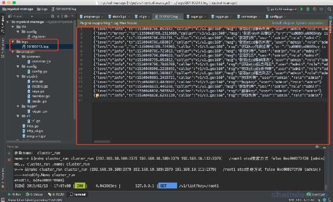
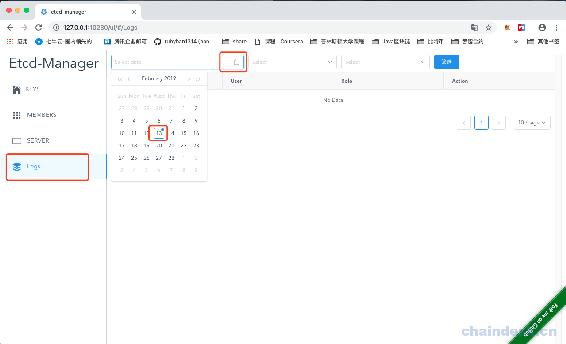
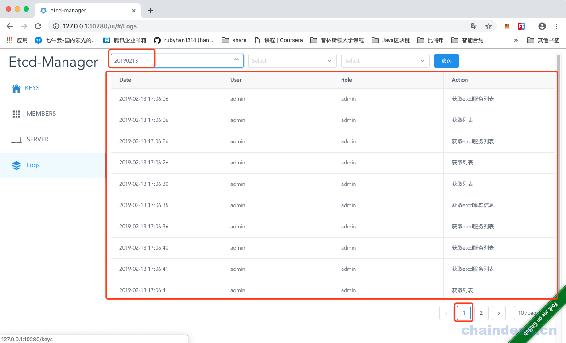
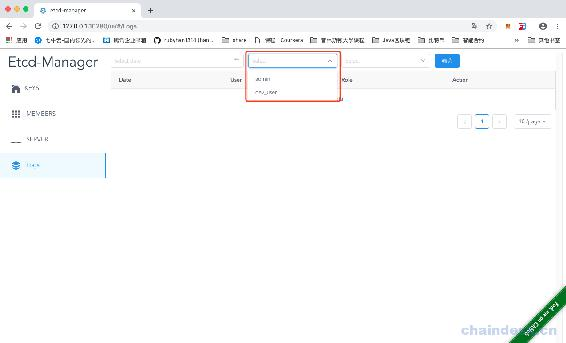
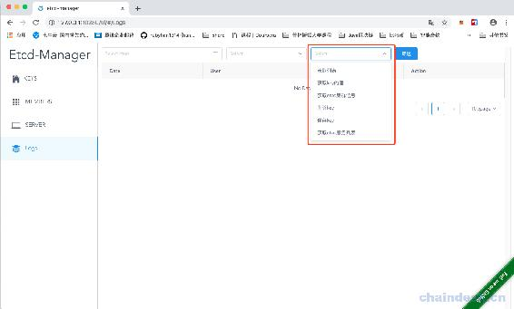

# 第二十章 【分布式存储系统 etcd】etcd-manage 项目——查询日志等信息

# etcd-manage 项目——查询日志等信息

接下来我们加入查询的操作，有三种查询操作。第一，可以查询日志，但是需要按照日期进行操作，第二，可以查看有哪些用户，第三，可以查看有哪些日志操作类型。

## 一、按照日期查询日志

按照日期查询：

在 v1.go 文件中，先定义结构体，用于显示每一条日志信息：

```go
//日志信息
type LogLine struct {
    Date  string  `json:"date"`
    User  string  `json:"user"`
    Role  string  `json:"role"`
    Msg   string  `json:"msg"`
    Ts    float64 `json:"ts"`
    Level string  `json:"level"`
}
```

然后添加一个方法用于按照日期查询日志：

```go
 // 查看日志
func getLogsList(c *gin.Context) {
    page := c.Query("page")
    pageSize := c.Query("page_size")
    dateStr := c.Query("date")
    querUser := c.Query("user")
    queryLogType := c.Query("log_type")

    var err error
    defer func() {
        if err != nil {
            logger.Log.Errorw("查看日志错误", "err", err)
            c.JSON(http.StatusBadRequest, gin.H{
                "msg": err.Error(),
            })
        }
    }()

    // 计算开始和结束行
    pageNum, _ := strconv.Atoi(page)
    if pageNum <= 0 {
        pageNum = 1
    }
    pageSizeNum, _ := strconv.Atoi(pageSize)
    if pageSizeNum <= 0 {
        pageSizeNum = 10
    }
    startLine := (pageNum - 1) * pageSizeNum
    endLine := pageNum * pageSizeNum

    fileName := fmt.Sprintf("%slogs/%s.log", common.GetRootDir(), dateStr)
    // fmt.Println(fileName)
    // 判断文件是否存在
    if exists, err := common.PathExists(fileName); exists == false || err != nil {
        c.JSON(http.StatusBadRequest, gin.H{
            "msg": fmt.Sprintf("[%s]没有日志", dateStr),
        })
        return
    }
    // 读取指定行
    file, err := os.Open(fileName)
    if err != nil {
        c.JSON(http.StatusBadRequest, gin.H{
            "msg": "读取日志文件错误",
        })
        return
    }
    defer file.Close()
    fileScanner := bufio.NewScanner(file)
    lineCount := 1
    list := make([]*LogLine, 0) // 最终数组
    for fileScanner.Scan() {
        logTxt := fileScanner.Text()
        if logTxt == "" {
            continue
        }
        // 解析日志
        oneLog := new(LogLine)
        err = json.Unmarshal([]byte(logTxt), oneLog)
        if err != nil {
            logger.Log.Errorw("解析日志文件错误", "err", err)
            continue
        }
        // 只看 info 类型日志
        if oneLog.Level != "info" {
            continue
        }

        if lineCount > startLine && lineCount <= endLine {
            // 判断用户和日志类型参数
            if querUser != "" && oneLog.User != querUser {
                continue
            }
            if queryLogType != "" && oneLog.Msg != queryLogType {
                continue
            }

            oneLog.Date = time.Unix(int64(oneLog.Ts), 0).In(time.Local).Format("2006-01-02 15:04:05")
            list = append(list, oneLog)
        }

        lineCount++
    }
    err = nil

    c.JSON(http.StatusOK, gin.H{
        "list":  list,
        "total": lineCount - 1,
    })
} 
```

先从页面获取要查询的日期等信息，然后查找指定日期的日志文件，读取该文件的内容，因为读取到的是 json 数据，所以需要解析，然后生成每条的日志数据对象。这里我们还直接实现了分页。

最后注册路由：

```go
//日志
v1.GET("/logs", getLogsList) // 查询日志
```

接下来，我们重新编译项目，并且运行，然后可以执行一些操作，比如查询 server，添加 key，修改 key，删除 key 等等。。



然后我们就发现在项目下，会先新建一个 logs 的目录，里面按照今天的日期命名的 log 日志文件，存储的都是刚刚的那些操作。

然后，我们点击 logs，按照日期进行查询：



查询结果如下：



可以看见因为日志数据比较多，还可以点击第二页，第三页。。。

## 二、查询用户列表

这里我们可以查询用户的列表，在 v1.go 文件中添加函数：

```go
// 获取用户列表
func getUserList(c *gin.Context) {
    us := make([]map[string]string, 0)
    cfg := config.GetCfg()
    if cfg != nil {
        for _, v := range cfg.Users {
            us = append(us, map[string]string{
                "name": v.Username,
                "role": v.Role,
            })
        }
    }

    c.JSON(http.StatusOK, us)
} 
```

注册路由：

```go
v1.GET("/users", getUserList)       // 获取用户列表
```

然后重新编译程序，并启动：



我们以下拉的形式，展示用户的信息。

## 三、获取日志操作类型

我们还可以查询用户的有哪些类型的日志操作。

在 v1.go 文件中，继续添加函数：

```go
// 获取操作类型列表
func getLogTypeList(c *gin.Context) {
    c.JSON(http.StatusOK, []string{
        "获取列表",
        "获取 key 的值",
        "获取 etcd 集群信息",
        "删除 key",
        "保存 key",
        "获取 etcd 服务列表",
    })
}
```

注册路由：

```go
v1.GET("/logtypes", getLogTypeList) // 获取日志类型列表
```

重新编译程序，并启动：



这里也是下拉的形式来展示日志类型。

[源代码](https://github.com/rubyhan1314/myetcd-manage)