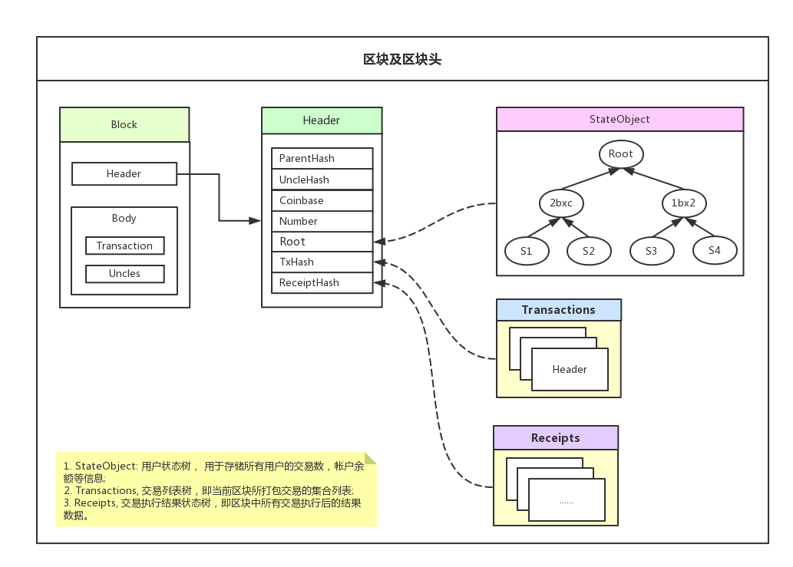

# 第三章 区块及区块头

Block 以作为区块链交易的数据载体，不仅包含了共识过程的工作量证明，而且记录着区块防篡改所依据哈希数据。

Block 主要由 header 和 body 构成, header 主要用于存储挖矿过程所必须的一些参数；而 body 用于存储交易所始数据等。

关于 header 数据，有三个不得不提重要数据:

1.  StateObject, 用户状态树， 用于存储所有用户的交易数，帐户余额等信息;
2.  transaction，交易列表树，即当前区块所打包交易的集合列表;
3.  receipt， 交易执行结果状态树，即区块中所有交易执行后的结果数据。
    以上三个数据类型在链中均以 trie 树结构存储，在后续的交易处理流程以及虚拟机运行均有关联。

下面将对这两种数据结构进行字段详细说明. 另外，你也可从文中提供的源码路径阅读其代码实现:

### Block

| 字段 | 说明 |
| --- | --- |
| **header** | 区块头 |
| **uncles** | 叔块列表，叔块并不是不合法区块。而是落后与最长链的分叉区块，系统允许打包六个区块以内的叔块信息并会给予一定奖励 |
| **transactions** | 交易列表。即本身打包确认的转帐或合约交易 |
| **size** | 当前区块 rlp 编码后的列表字节数 |
| **td** | 区块总难度值 |

> 具体代码实现: core/types/block.go:type:Block

### Header

| 字段 | 字段说明 |
| --- | --- |
| **ParentHash** | 父区块哈希值 |
| **UncleHash** | 叔块列表哈希值 |
| **Coinbase** | 挖矿或 seal 帐户地址 |
| **Root** | 用户状态树根哈希值 |
| **TxHash** | 交易列表树根哈希值 |
| **ReceiptHash** | 交易执行结果树根哈希值 |
| **Bloom** | 布隆过滤器，快速检索操作日志是否存在 |
| **Difficulty** | 生产区块难度，取决于具体共识算法 |
| **Number** | 区块高度，即第多少个区块 |
| **GasLimit** | 所有交易 gaslimit 计算总和 |
| **GasUsed** | 执行所有交易实际消耗的 gas，由 evm 根据实际情况计算而得 |
| **Time** | 区块创建时间 |
| **Extra** | 在 poa 共识中，用于存储 sealnode 地址 |
| **MixDigest** | 在 POW 中由 miner 进行填充；在 POA 共识中未做使用 |
| **Nonce** | 由 pow 共识运算结果 |

> source path: core/types/block.go:type:Header

从上述结构可以看出，区块体(uncles/transcation)其实主要用于原始数据存储，占据整个区块的大部分数据空间；相反，header 只存储共识或验证过程中所必须的基础数据以及一些列表哈希过后的根哈希值。

> 在教程中如出现任何看不明白或需要指正的情况，欢迎加我个人微信进一步沟通！
> Name: zhangliang | WeChat: rushking2009 | Mail: zhangliang@cldy.org