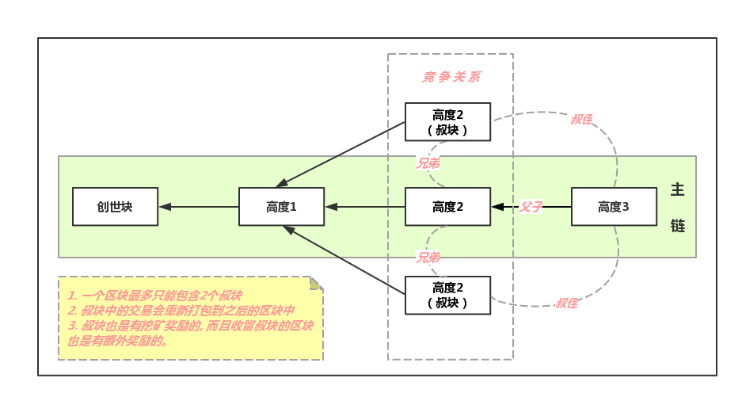

# 第四章 叔块(Uncle)

众所周知，在同一时刻可能存在多个矿工同时获得出块权，致使每个矿工在向其他挖矿节点同步区块时出现确认快慢的问题，最终就会存在多个区块并行于当前主链区块，那么这些个并行区块就可以理解为`叔块`，即 Uncle.

另外，叔块虽然称呼不同，但显然也是一个区块，所以叔块和区块是一样的数据结构。

**叔块是不合法区块吗？**
当然不是。每个叔块都是在矿工获得出块权利后产出的区块，只不过在广播确认阶段落后于主链区块而已。

**既然叔块不是主链区块，那矿工算是白挖了吗？**
当然也不是。平台为了保证平台公平，对于叔块也是有一定奖励的。

> 🐛在教程中如出现任何看不明白或需要更正的问题，欢迎加我微信提见议！
> Name: zhangliang | WeChat: rushking2009 | Mail: zhangliang@cldy.org