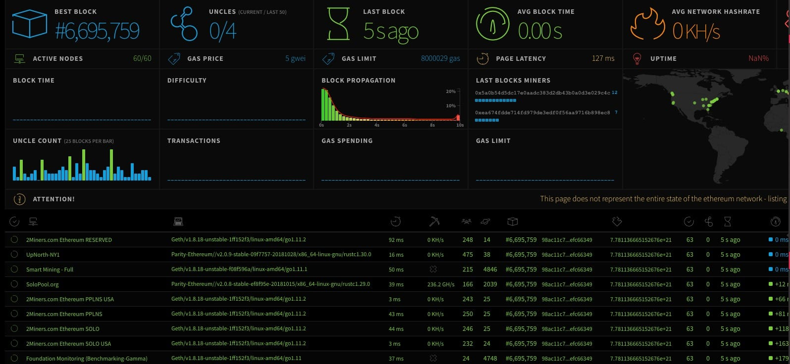

# 第十章 以太坊启动流程

本章节将通过对 geth 命令源码进行深入分析，了解如何通过 geth 命令进行整个客户端的初始化工作。

通过本文，你可以学习到

*   了解启动过程中的参数加载流程与优先级
*   了解以太坊客户端的架构设计
*   了解以太坊客户端注册服务组件及其作用
*   了解各个注册服务组件的内部启动流程

* * *

以太坊是如何启动一个网络节点的呢？

```go
geth --datadir ./data --rpc --rpcaddr "0.0.0.0" --rpcport 8545 --rpcapi "eth,web3,personal,net,miner,admin,debug,db" --unlock 127eb97163f790dd25c174429d85c3fa7c3cf116 --password .passwd --mine 
```

以上命令便是启动以太坊网络节点所需的具体命令及参数。用户可以根据不同的启动参数，选择成为正式网络、测试网或者私链网络中的一个节点。

既然 geth 是以太坊的启动命令，那么我们便从它的源码进行入手，分析它是如何进行加载配置、服务注册以及启动网络节点的。

`geth`位于`cmd/geth/main.go`文件中，入口命令如下

```go
func geth(ctx *cli.Context) error {
    if args := ctx.Args(); len(args) > 0 {
        return fmt.Errorf("invalid command: %q", args[0])
    }
    //1\. 加载配置及注册服务
    node := makeFullNode(ctx)

    //2\. 启动节点
    startNode(ctx, node)

    //3\. 守护当前进程
    node.Wait()
    return nil
}
//sourcepath: cmd/geth/main.go 
```

从上述源码，可以清楚看出主要分为三个步骤:

*   makeFullNode
    加载配置参数、注册服务组件；
*   startNode
    启动本地节点、启动服务组件；
*   node.Wait()
    守护当前进程，直到软件关闭或出现其它不可修复错误退出。

## 一、makeFullNode 内部实现

该方法内部实现大体思路为：
**首先**，就是对参数及配置文件进行参数初始化，根据参数优先级由低到高加载顺序为：加载缺省配置，加载自定义配置文件，加载命令窗口参数；
**然后**，就对注册以太坊核心服务。**注册以太坊服务**，根据启动参数同步模式，选择是注册以太坊客户端还是轻客户端；**注册看板服务**，监控当前客户端的运行指标。比如：内存、CPU 及磁盘读写情况等。**注册 Whisper 服务**，进行多节点间消息通讯；**注册以太坊状态服务**，用于向指定服务地址推送以太坊状态信息。

具体业务逻辑如下：

### 1\. 加载配置参数

`makeConfigNode`方法是进行参数配置的入口方法

**首先**， 加载系统缺省配置

```go
cfg := gethConfig{
        Eth:       eth.DefaultConfig,
        Shh:       whisper.DefaultConfig,
        Node:      defaultNodeConfig(),
        Dashboard: dashboard.DefaultConfig,
}
//sourcepath: cmd/geth/config.go:114 
```

**eth.DefaultConfig** : 以太坊节点的主要参数配置。主要包括: 同步模式(fast)、chainid、交易池配置、gasprice、挖矿配置等；
**whisper.DefaultConfig** : 主要用于配置网络间通讯的配置；
**defaultNodeConfig()** : 主要用于配置对外提供的 RPC 节点服务配置；
**dashboard.DefaultConfig** : 主要用于对外提供看板数据访问服务。

假如你启动客户端时，不配置参数也是可以正常启动的。只不过缺省参数下，你所启动的客户端其实是作为主网节点启动的。

**其次**， 加载自定义配置文件
该文件用于集中配置所有启动参数。

```go
//参数命令
configFileFlag = cli.StringFlag{
        Name:  "config",
        Usage: "TOML configuration file",
}
//sourcepath: cmd/geth/config.go:51

//加载自定义文件配置
if file := ctx.GlobalString(configFileFlag.Name); file != "" {
    if err := loadConfig(file, &cfg); err != nil {
        utils.Fatalf("%v", err)
    }
}
//sourcepath: cmd/geth/config.go:123 
```

此配置文件适合在私有链的正式环境中进行自定义配置。

**最后**，加载命令窗口参数
从 ctx 上下文环境中获取所有设定的命令参数，选择是否开启某项服务以及服务的具体参数设置。比如：初始化节点、以太坊网络、whisper 以及 dashboard 等模块配置。

```go
//本地节点配置
utils.SetNodeConfig(ctx, &cfg.Node)
//以太坊配置
utils.SetEthConfig(ctx, stack, &cfg.Eth)
//whisper 配置
utils.SetShhConfig(ctx, stack, &cfg.Shh)
//DashBoard 配置
utils.SetDashboardConfig(ctx, &cfg.Dashboard) 
```

窗口命令参数更适合调用本地开发调试阶段使用。

从代码的实现逻辑可以看出，参数是有启动优先级的，即：命令窗口参数 > 自定义配置文件 > 系统缺省参数。

### 2\. 服务注册

在服务注册过程中，主要注册四个服务：EthService、DashboardService、ShhService、EthStatsService，这四种服务类均扩展自 Service 接口。

```go
type Service interface {
    //p2p 网络通讯协议
    Protocols() []p2p.Protocol
    //当前实现类所能提供 rpc 服务列表
    APIs() []rpc.API
    //启动服务组件。
    Start(server *p2p.Server) error
    //停止当前服务。关闭资源连接、清理数据等
    Stop() error
} 
```

如果开发者想扩展一个新的功能或服务，也可以基于此接口进行扩展开发。

其中，EthService 根据同步模式的不同，会分为两种实现：

*   LightEthereum，支持 LightSync 模式
*   Ethereum，支持 FullSync、FastSync 模式

LightEthereum 作为轻客户端，与 Ethereum 区别在于，它只需要更新区块头。当需要查询区块体数据时，需要通过调用其他全节点的 les 服务进行查询；另外，轻客户端本身是不能进行挖矿的。

#### 2.1 注册以太坊服务

在实例化以太坊服务时，客户端会根据用户选择的同步模式来选择创建不同的实例对象。

```go
//同步模式：模式分为 full/fast/light
if cfg.SyncMode == downloader.LightSync {
        //注册 LightEthereum 服务
    err = stack.Register(func(ctx *node.ServiceContext) (node.Service, error) {
        return les.New(ctx, cfg)
    })
} else {
    err = stack.Register(func(ctx *node.ServiceContext) (node.Service, error) {
        //注册 Ethereum 服务
        fullNode, err := eth.New(ctx, cfg)

        if fullNode != nil && cfg.LightServ > 0 {
            //同时，在 Ethereum 中添加 LesServer
            ls, _ := les.NewLesServer(fullNode, cfg)
            fullNode.AddLesServer(ls)
        }
        return fullNode, err
    })
} 
```

**模式一**、选择同步模式为`LightSync`, 则实例化`LightEthereum`，即轻客户端。

```go
err = stack.Register(func(ctx *node.ServiceContext) (node.Service, error) {
    return les.New(ctx, cfg)
}) 
```

内部实例化流程如下：

1.  创建 LevelDB 数据库

    ```go
     chainDb, err := eth.CreateDB(ctx, config, "lightchaindata") 
    ```

2.  根据创世配置初始化链数据目录

    ```go
     core.SetupGenesisBlock(chainDb, config.Genesis) 
    ```

3.  初始化轻客户端

    *   3.1 实例化基础参数

        ```go
         leth := &LightEthereum{
              lesCommons: lesCommons{
                  chainDb: chainDb,
                  config:  config,
                  iConfig: light.DefaultClientIndexerConfig,
              },
              chainConfig:    chainConfig,
              eventMux:       ctx.EventMux,
              peers:          peers,
              reqDist:        newRequestDistributor(peers, quitSync),
              accountManager: ctx.AccountManager,
              engine:         eth.CreateConsensusEngine(ctx, chainConfig, &config.Ethash, nil, false, chainDb),
              shutdownChan:   make(chan bool),
              networkId:      config.NetworkId,
              bloomRequests:  make(chan chan *bloombits.Retrieval),
              bloomIndexer:   eth.NewBloomIndexer(chainDb, params.BloomBitsBlocksClient, params.HelperTrieConfirmations),
          } 
        ```

        比如: 本地链 id、共识引擎、注册 peer 节点、帐户管理器以及布隆过滤器的初始化。

    *   3.2 实例化请求回调服务

        ```go
         leth.relay = NewLesTxRelay(peers, leth.reqDist)
          //sourcepath: les/backend.go:117 
        ```

        因为轻客户端本身不存有所有区块数据，所以要通过请求其他节点服务来进行数据查询，这儿的 leth.relay 便是做此使用。

    *   3.2 实例化节点 Server 连接池

        ```go
         leth.serverPool = newServerPool(chainDb, quitSync, &leth.wg) 
        ```

        此连接池主要用于缓存所有 p2p server 信息。
    *   3.3 实例化远程服务请求管理器，供 LesOdr 实例请求服务调用

        ```go
         leth.retriever = newRetrieveManager(peers, leth.reqDist, leth.serverPool) 
        ```

        此方法主要用集中管理不同服务请求。
    *   3.4 实例化 LesOdr 服务。该服务支持六种服务请求: TrieRequest， 主要用于查询用户实体中的 storage 数据；CodeRequest， 主要用于查询合约编码；BlockRequest， 主要用于查询区块体；ReceiptsRequest， 主要用于查询区块体中的 Receipts 数据；ChtRequest(CHT: Canonical Hash Trie),主要用于根据 trieindexid 查询 StateObject 中的 storage trie 数据。 BloomRequest， 主要用于使用 bloom 过滤器查询 trie 结构数据

        ```go
         leth.odr = NewLesOdr(chainDb, light.DefaultClientIndexerConfig, leth.retriever) 
        ```

    *   3.5 实例化 ChtIndexer、BloomTrieIndexer　
        客户端内部属性包除了包含以上两个检索器外，还包括 BloomIndexer。这三个检索器本身其实都是 ChainIndexer 对象实例，只不过在实例化参数有所不同。后续会在介绍 ChainIndexer 实现时进行详细说明。

        ```go
         leth.chtIndexer = light.NewChtIndexer(chainDb, leth.odr, params.CHTFrequencyClient, params.HelperTrieConfirmations)
          leth.bloomTrieIndexer = light.NewBloomTrieIndexer(chainDb, leth.odr, params.BloomBitsBlocksClient, params.BloomTrieFrequency)
          leth.odr.SetIndexers(leth.chtIndexer, leth.bloomTrieIndexer, leth.bloomIndexer) 
        ```

    *   3.6 实例化 LightChain

        ```go
         leth.blockchain, err = light.NewLightChain(leth.odr, leth.chainConfig, leth.engine) 
        ```

    *   3.7 实例化交易池 NewTxPool

        ```go
         leth.txPool = light.NewTxPool(leth.chainConfig, leth.blockchain, leth.relay) 
        ```

    *   3.8 实例化对外 API 服务

        ```go
         leth.ApiBackend = &LesApiBackend{leth, nil} 
        ```

    *   3.9 实例化 GasPrice 预测服务

        ```go
         leth.ApiBackend.gpo = gasprice.NewOracle(leth.ApiBackend, gpoParams) 
        ```

**模式二** 、同步模式为`FullSync/Fast`, 则实例化`Ethereum`。与此同时，如果参数节点配置 LightServ 大于 0 时，还会在主节点中添加 LesServer。

```go
err = stack.Register(func(ctx *node.ServiceContext) (node.Service, error) {
        //注册 Ethereum 服务
        fullNode, err := eth.New(ctx, cfg)
        if fullNode != nil && cfg.LightServ > 0 {
            //同时，在 Ethereum 中添加 LesServer
            ls, _ := les.NewLesServer(fullNode, cfg)
            fullNode.AddLesServer(ls)
        }
        return fullNode, err
}) 
```

内部实例化流程如下：

1.  参数校验

    ```go
     //当前模式为 full/fast 模式，故不允许 LightSync 模式出现
     if config.SyncMode == downloader.LightSync {
         return nil, errors.New("can't run eth.Ethereum in light sync mode, use les.LightEthereum")
     }
     //是否合法同步模式, mode >= FullSync && mode <= LightSync
     if !config.SyncMode.IsValid() {
         return nil, fmt.Errorf("invalid sync mode %d", config.SyncMode)
     }
     //矿工 gas 单价设置
     if config.MinerGasPrice == nil || config.MinerGasPrice.Cmp(common.Big0) <= 0 {
         log.Warn("Sanitizing invalid miner gas price", "provided", config.MinerGasPrice, "updated", DefaultConfig.MinerGasPrice)
         config.MinerGasPrice = new(big.Int).Set(DefaultConfig.MinerGasPrice)
     } 
    ```

2.  创建 LevelDB 数据库

    ```go
     chainDb, err := CreateDB(ctx, config, "chaindata") 
    ```

3.  根据创世配置初始化链数据目录

    ```go
     chainConfig, genesisHash, genesisErr := core.SetupGenesisBlock(chainDb, config.Genesis) 
    ```

4.  实例化 Ethereum 对象

    ```go
     eth := &Ethereum{
         config:         config,
         chainDb:        chainDb,
         chainConfig:    chainConfig,
         eventMux:       ctx.EventMux,
         accountManager: ctx.AccountManager,
         engine:         CreateConsensusEngine(ctx, chainConfig, &config.Ethash, config.MinerNotify, config.MinerNoverify, chainDb),
         shutdownChan:   make(chan bool),
         networkID:      config.NetworkId,
         gasPrice:       config.MinerGasPrice,
         etherbase:      config.Etherbase,
         bloomRequests:  make(chan chan *bloombits.Retrieval),
         bloomIndexer:   NewBloomIndexer(chainDb, params.BloomBitsBlocks, params.BloomConfirms),
     } 
    ```

5.  创建 BlockChain 实例对象

    ```go
     eth.blockchain, err = core.NewBlockChain(chainDb, cacheConfig, eth.chainConfig, eth.engine, vmConfig, eth.shouldPreserve) 
    ```

6.  实例化交易池

    ```go
     eth.txPool = core.NewTxPool(config.TxPool, eth.chainConfig, eth.blockchain) 
    ```

7.  实例化协议管理器

    ```go
     eth.protocolManager, err = NewProtocolManager(eth.chainConfig, config.SyncMode, config.NetworkId, eth.eventMux, eth.txPool, eth.engine, eth.blockchain, chainDb) 
    ```

8.  实例化挖矿服务

    ```go
     eth.miner = miner.New(eth, eth.chainConfig, eth.EventMux(), eth.engine, config.MinerRecommit, config.MinerGasFloor, config.MinerGasCeil, eth.isLocalBlock)
     //标记当前 geth 运行版本信息
     eth.miner.SetExtra(makeExtraData(config.MinerExtraData)) 
    ```

9.  实例化对外 API 服务

    ```go
     eth.APIBackend = &EthAPIBackend{eth, nil} 
    ```

10.  实例化 GasPrice 预测服务

    ```go
    gpoParams := config.GPO
    if gpoParams.Default == nil {
        gpoParams.Default = config.MinerGasPrice
    }
    eth.APIBackend.gpo = gasprice.NewOracle(eth.APIBackend, gpoParams) 
    ```

#### 2.2 注册 Dashboard 服务

Dashboard 服务，主要用于监控当前节点运行指标。比如：内存、虚拟内存、Cpu 及磁盘读写等使用状况。

```go
func RegisterDashboardService(stack *node.Node, cfg *dashboard.Config, commit string) {
    stack.Register(func(ctx *node.ServiceContext) (node.Service, error) {
        return dashboard.New(cfg, commit, ctx.ResolvePath("logs")), nil
    })
}
//sourcepath: cmd/geth/config.go:166

func New(config *Config, commit string, logdir string) *Dashboard {
    now := time.Now()
    versionMeta := ""
    if len(params.VersionMeta) > 0 {
        versionMeta = fmt.Sprintf(" (%s)", params.VersionMeta)
    }
    return &Dashboard{
        conns:  make(map[uint32]*client),
        config: config,
        quit:   make(chan chan error),
        history: &Message{
            General: &GeneralMessage{
                Commit:  commit,
                Version: fmt.Sprintf("v%d.%d.%d%s", params.VersionMajor, params.VersionMinor, params.VersionPatch, versionMeta),
            },
            System: &SystemMessage{
                ActiveMemory:   emptyChartEntries(now, activeMemorySampleLimit, config.Refresh),
                VirtualMemory:  emptyChartEntries(now, virtualMemorySampleLimit, config.Refresh),
                NetworkIngress: emptyChartEntries(now, networkIngressSampleLimit, config.Refresh),
                NetworkEgress:  emptyChartEntries(now, networkEgressSampleLimit, config.Refresh),
                ProcessCPU:     emptyChartEntries(now, processCPUSampleLimit, config.Refresh),
                SystemCPU:      emptyChartEntries(now, systemCPUSampleLimit, config.Refresh),
                DiskRead:       emptyChartEntries(now, diskReadSampleLimit, config.Refresh),
                DiskWrite:      emptyChartEntries(now, diskWriteSampleLimit, config.Refresh),
            },
        },
        logdir: logdir,
    }
}
//sourcepath: dashboard/dashboard.go:83 
```

#### 2.3 注册 Whisper 服务

Whisper 服务，用于 p2p 网络间加密通信

```go
func RegisterShhService(stack *node.Node, cfg *whisper.Config) {
    if err := stack.Register(func(n *node.ServiceContext) (node.Service, error) {
        return whisper.New(cfg), nil
    }); err != nil {
        Fatalf("Failed to register the Whisper service: %v", err)
    }
}
//sourcepath: cmd/utils/flags.go:1299

func New(cfg *Config) *Whisper {
    if cfg == nil {
        cfg = &DefaultConfig
    }

    whisper := &Whisper{
        privateKeys:   make(map[string]*ecdsa.PrivateKey),
        symKeys:       make(map[string][]byte),
        envelopes:     make(map[common.Hash]*Envelope),
        expirations:   make(map[uint32]mapset.Set),
        peers:         make(map[*Peer]struct{}),
        messageQueue:  make(chan *Envelope, messageQueueLimit),
        p2pMsgQueue:   make(chan *Envelope, messageQueueLimit),
        quit:          make(chan struct{}),
        syncAllowance: DefaultSyncAllowance,
    }

    whisper.filters = NewFilters(whisper)

    whisper.settings.Store(minPowIdx, cfg.MinimumAcceptedPOW)
    whisper.settings.Store(maxMsgSizeIdx, cfg.MaxMessageSize)
    whisper.settings.Store(overflowIdx, false)
    whisper.settings.Store(restrictConnectionBetweenLightClientsIdx, cfg.RestrictConnectionBetweenLightClients)

    // p2p whisper sub protocol handler
    whisper.protocol = p2p.Protocol{
        Name:    ProtocolName,
        Version: uint(ProtocolVersion),
        Length:  NumberOfMessageCodes,
        Run:     whisper.HandlePeer,
        NodeInfo: func() interface{} {
            return map[string]interface{}{
                "version":        ProtocolVersionStr,
                "maxMessageSize": whisper.MaxMessageSize(),
                "minimumPoW":     whisper.MinPow(),
            }
        },
    }

    return whisper
}
//sourcepath: whisper/whisperv6/whisper.go:94 
```

#### 2.4 注册状态推送服务

用于将当前以太坊网络状态推送至指定 URL 地址，便于进行页面展现。
比如：[`ethstats.net/`](https://ethstats.net/)


```go
func RegisterEthStatsService(stack *node.Node, url string) {
    if err := stack.Register(func(ctx *node.ServiceContext) (node.Service, error) {
        // Retrieve both eth and les services
        var ethServ *eth.Ethereum
        ctx.Service(&ethServ)

        var lesServ *les.LightEthereum
        ctx.Service(&lesServ)

        return ethstats.New(url, ethServ, lesServ)
    }); err != nil {
        Fatalf("Failed to register the Ethereum Stats service: %v", err)
    }
}
//sourcepath: ethstats/ethstats.go:86

func New(url string, ethServ *eth.Ethereum, lesServ *les.LightEthereum) (*Service, error) {
    // Parse the netstats connection url
    re := regexp.MustCompile("([^:@]*)(:([^@]*))?@(.+)")
    parts := re.FindStringSubmatch(url)
    if len(parts) != 5 {
        return nil, fmt.Errorf("invalid netstats url: \"%s\", should be nodename:secret@host:port", url)
    }
    // Assemble and return the stats service
    var engine consensus.Engine
    if ethServ != nil {
        engine = ethServ.Engine()
    } else {
        engine = lesServ.Engine()
    }
    return &Service{
        eth:    ethServ,
        les:    lesServ,
        engine: engine,
        node:   parts[1],
        pass:   parts[3],
        host:   parts[4],
        pongCh: make(chan struct{}),
        histCh: make(chan []uint64, 1),
    }, nil
}
//sourcepath: ethstats/ethstats.go:86 
```

到此，以太坊所有依赖服务注册完毕。

### 二、启动节点

**`utils.StartNode`方法为启动本地节点以及启动所有注册服务的入口方法**
整个启动过程分为四步

#### 第一步、启动节点及注册服务

```go
utils.StartNode(stack)
//sourcepath: cmd/geth/main.go:286 
```

##### 1\. 实例化 p2p.Server 对象

```go
//1\. 实例化对象
n.serverConfig = n.config.P2P
n.serverConfig.PrivateKey = n.config.NodeKey()
n.serverConfig.Name = n.config.NodeName()
n.serverConfig.Logger = n.log
if n.serverConfig.StaticNodes == nil {
    n.serverConfig.StaticNodes = n.config.StaticNodes()
}
if n.serverConfig.TrustedNodes == nil {
    n.serverConfig.TrustedNodes = n.config.TrustedNodes()
}
if n.serverConfig.NodeDatabase == "" {
    n.serverConfig.NodeDatabase = n.config.NodeDB()
}
running := &p2p.Server{Config: n.serverConfig}
//sourcepath: 

//2\. Server 对象说明
type Server struct {
    // Config fields may not be modified while the server is running.
    Config

    // Hooks for testing. These are useful because we can inhibit
    // the whole protocol stack.
    newTransport func(net.Conn) transport
    newPeerHook  func(*Peer)

    lock    sync.Mutex // protects running
    running bool

    ntab         discoverTable
    listener     net.Listener
    ourHandshake *protoHandshake
    lastLookup   time.Time
    DiscV5       *discv5.Network

    // These are for Peers, PeerCount (and nothing else).
    peerOp     chan peerOpFunc
    peerOpDone chan struct{}

    quit          chan struct{}
    addstatic     chan *enode.Node
    removestatic  chan *enode.Node
    addtrusted    chan *enode.Node
    removetrusted chan *enode.Node
    posthandshake chan *conn
    addpeer       chan *conn
    delpeer       chan peerDrop
    loopWG        sync.WaitGroup // loop, listenLoop
    peerFeed      event.Feed
    log           log.Logger
}
//sourcepath: p2p/server.go:151 
```

##### 2\. 实例化服务组件

构建服务组件所依赖的上下文环境参数

```go
ctx := &ServiceContext{
        config:         n.config,
        services:       make(map[reflect.Type]Service),
        EventMux:       n.eventmux,
        AccountManager: n.accman,
} 
```

根据构造的 ServiceContext 实例化所有组件

```go
for _, constructor := range n.serviceFuncs {
    //......
    service, err := constructor(ctx)
    //......
} 
```

##### 3\. 统计所有组件服务定义的协议列表

```go
for _, service := range services {
    running.Protocols = append(running.Protocols, service.Protocols()...)
}

//Ethereum 扩展类
func (s *Ethereum) Protocols() []p2p.Protocol {
    if s.lesServer == nil {
        return s.protocolManager.SubProtocols
    }
    return append(s.protocolManager.SubProtocols, s.lesServer.Protocols()...)
}
//LightEthereum 扩展类
func (s *LightEthereum) Protocols() []p2p.Protocol {
    return s.makeProtocols(ClientProtocolVersions)
}
...... 
```

##### 4\. 启动 p2p 网络

在启动 p2p 网络过程中，会根据命令中的自动发现或者 bootnodes 等参数，决定是否自动侦测 udp 端口搜索附近 peer 节点或者手动添加自定义节点。

```go
if err := running.Start(); err != nil {
    return convertFileLockError(err)
} 
```

##### 5\. 启动服务组件

在服务组件启动源码实现中，利用了反射方式解耦了接口与实现间的硬编码调用。
该启动过程，会循环调用已注册的服务组件的启动方法。只要存在任何一个服务没启动成功，那么会终止其他已启动成功的服务。

```go
started := []reflect.Type{}
//services 中存储了所有组件服务
for kind, service := range services {
    // Start the next service, stopping all previous upon failure
    if err := service.Start(running); err != nil {
        for _, kind := range started {
            services[kind].Stop()
        }
        running.Stop()

        return err
    }
    // Mark the service started for potential cleanup
    started = append(started, kind)
} 
```

##### 6\. 启动 RPC 服务. 比如:http/ws/ipc

```go
n.startRPC(services)

func (n *Node) startRPC(services map[reflect.Type]Service) error {
    // Gather all the possible APIs to surface
    //1\. 整合所有服务组件的 api 列表
    apis := n.apis()
    for _, service := range services {
        apis = append(apis, service.APIs()...)
    }

    //2\. 启动对外服务访问
    // Start the various API endpoints, terminating all in case of errors
    if err := n.startInProc(apis); err != nil {    //进程间通讯
        return err
    }
    //2.1 进程访问方式，依赖于 InProc 服务
    if err := n.startIPC(apis); err != nil {
        n.stopInProc()
        return err
    }
    //2.2 http 服务访问方式
    if err := n.startHTTP(n.httpEndpoint, apis, n.config.HTTPModules, n.config.HTTPCors, n.config.HTTPVirtualHosts, n.config.HTTPTimeouts); err != nil {
        n.stopIPC()
        n.stopInProc()
        return err
    }
    //2.3　websocket 服务访问方式
    if err := n.startWS(n.wsEndpoint, apis, n.config.WSModules, n.config.WSOrigins, n.config.WSExposeAll); err != nil {
        n.stopHTTP()
        n.stopIPC()
        n.stopInProc()
        return err
    }
    // All API endpoints started successfully
    n.rpcAPIs = apis
    return nil
}
//sourcepath: node/node.go:263 
```

#### 第二步、解锁帐户

在 datadir/keystore 目录主要用于记录在当前节点创建的帐户 keystore 文件。如果你的 keystore 文件不在本地是无法进行解锁的。

```go
//解锁 datadir/keystore 目录中帐户
ks := stack.AccountManager().Backends(keystore.KeyStoreType)[0].(*keystore.KeyStore)

passwords := utils.MakePasswordList(ctx)
unlocks := strings.Split(ctx.GlobalString(utils.UnlockedAccountFlag.Name), ",")
for i, account := range unlocks {
    if trimmed := strings.TrimSpace(account); trimmed != "" {
        unlockAccount(ctx, ks, trimmed, i, passwords)
    }
}
//sourcepath: cmd/geth/main.go:290 
```

#### 第三步、订阅钱包监听事件

```go
//监听钱包事件
events := make(chan accounts.WalletEvent, 16)
stack.AccountManager().Subscribe(events)
//sourcepath: cmd/geth/main.go:300 
```

通过订阅钱包事件，可以根据钱包事件适配不同的事件。比如：当电脑检测到新的硬件钱包或者硬件钱包退出事件。

#### 第四步、启动异步线程

创建 RPCClient 客户端，并连接到本地节点；解锁本地钱包的同时，钱包管理器会根据之前订阅的事件自动执行相关操作。

```go
go func() {
    // Create a chain state reader for self-derivation
    rpcClient, err := stack.Attach()
    if err != nil {
        utils.Fatalf("Failed to attach to self: %v", err)
    }
    stateReader := ethclient.NewClient(rpcClient)

    // Open any wallets already attached
    for _, wallet := range stack.AccountManager().Wallets() {
        if err := wallet.Open(""); err != nil {
            log.Warn("Failed to open wallet", "url", wallet.URL(), "err", err)
        }
    }
    // Listen for wallet event till termination
    for event := range events {
        switch event.Kind {
        case accounts.WalletArrived:
            if err := event.Wallet.Open(""); err != nil {
                log.Warn("New wallet appeared, failed to open", "url", event.Wallet.URL(), "err", err)
            }
        case accounts.WalletOpened:
            status, _ := event.Wallet.Status()
            log.Info("New wallet appeared", "url", event.Wallet.URL(), "status", status)

            derivationPath := accounts.DefaultBaseDerivationPath
            if event.Wallet.URL().Scheme == "ledger" {
                derivationPath = accounts.DefaultLedgerBaseDerivationPath
            }
            event.Wallet.SelfDerive(derivationPath, stateReader)

        case accounts.WalletDropped:
            log.Info("Old wallet dropped", "url", event.Wallet.URL())
            event.Wallet.Close()
        }
    }
}() 
```

### 三、启动守护线程

通过 stop 通道阻塞当前线程，直到节点被停止。

```go
func (n *Node) Wait() {
    n.lock.RLock()
    if n.server == nil {
        n.lock.RUnlock()
        return
    }
    stop := n.stop
    n.lock.RUnlock()

    <-stop
} 
```

* * *

总结，通过本章我们了解到整个客户是如何进行启动的，服务注册机制以及节点内部实现流程等。

* * *

> 在教程中如出现不易理解或存在错误的问题🐛，欢迎加我微信指正！
> Name: zhangliang | WeChat: rushking2009 | Mail: zhangliang@cldy.org