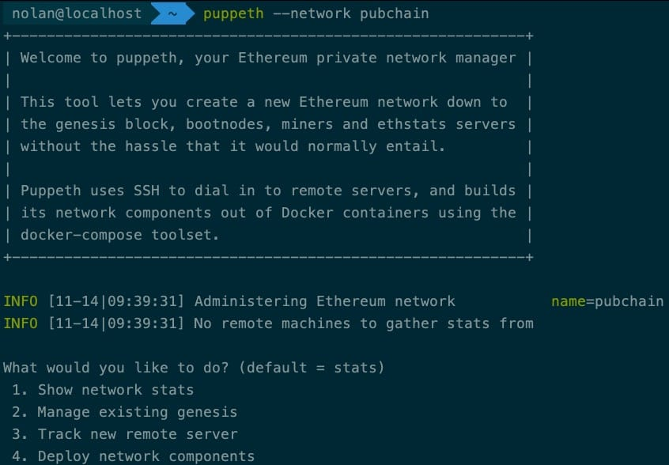

# 第十一章 初始化创世区块

本章节主要针对**如何根据创世区块配置进行链环境数据初始化**过程进行流程分析。首先会对创世配置的几种定义方式以及创世配置中的字段定义进行简单介绍，然后再具体介绍内部数据初始化过程。

* * *

在启动链环境之前，往往我们都需要对链数据进行初始化工作。而初始化所必须的条件便是创世配置。

在搭建链环境的时候往往我们需要做的第一步就是定制自己的创世配置。一般我们会通过下面两种方式进行配置:

*   puppeth
    该命令是由以太坊提供的快速部署环境工具，其主要以交互式的方式一步步设定相关参数。
    
*   自定义 toml 文件
    将创世配置参数按照 toml 的规范进行具体定义，集中化管理所有启动参数及创世配置。 这样在每次在启动客户端节点只需要指定 toml 文件即可。

两种方式不同之处在于： puppeth 生成的创世配置，需要在以太坊节点运行之前先进行初始化`geth init <创世配置.json>`；而自定义 toml 文件方式是在节点启动之时进行初始化,`geth --config custom.toml`.

但是两者调用的均是同一个方法，在前面章节`以太坊启动流程`介绍 LightEthereum 及 Ethereum 实例化过程中也有提到此方法

```go
chainConfig, genesisHash, genesisErr := core.SetupGenesisBlock(chainDb, config.Genesis) 
```

## 那么，我们下面将从`SetupGenesisBlock`方法深入拆解。

## 创世配置参数介绍

创世配置大致可以分为两部分：
**主链配置 ChainConfig**， 主要用于定义 chainid、共识配置以及当链软件版本发布或功能升级后所依赖的区块高度配置，比如：HomesteadBlock、DAOForkBlock、ByzantiumBlock；而**区块配置**主要用于定义创世区块的创建时间， 区块高度及 nonce 等。

### Genesis 配置定义

**Config**, 此参数是 ChainConfig 类型，主要记录区块链的 ChainId、EIP 版本升级、共识策略等。
**Nonce**, 在 POW 共识策略中，nonce 是指矿机所要运算的结果值
**Timestamp**，创建区块时间
**ExtraData**， 在 POA 共识中，用于记录 seal 节点的地址
**GasLimit**， 执行交易所需花费的 gas 最大限定值
**Difficulty**，在 POW 共识中，主要是指挖矿难度值。难度越大，则出块越慢。在以太坊中，会根据前一区块出块时间自动调整难度值
**Mixhash**，在 POW 共识中，由矿工进行填充；在 POA 中未使用此字段
**Coinbase**, 挖矿节点或 seal 节点
**Alloc**，预置帐户。具体定义参考`GenesisAccount 配置定义`说明
**Number**，区块高度，即区块链上第多少个区块
**GasUsed**, 执行区块交易实际花费的 gas 值
**ParentHash**，父区块哈希值。创世区块中该字段为`common.hash`缺省值

```go
type Genesis struct {
    Config     *params.ChainConfig `json:"config"`
    Nonce      uint64              `json:"nonce"`
    Timestamp  uint64              `json:"timestamp"`
    ExtraData  []byte              `json:"extraData"`
    GasLimit   uint64              `json:"gasLimit"   gencodec:"required"`
    Difficulty *big.Int            `json:"difficulty" gencodec:"required"`
    Mixhash    common.Hash         `json:"mixHash"`
    Coinbase   common.Address      `json:"coinbase"`
    Alloc      GenesisAlloc        `json:"alloc"      gencodec:"required"`

    // These fields are used for consensus tests. Please don't use them
    // in actual genesis blocks.
    Number     uint64      `json:"number"`
    GasUsed    uint64      `json:"gasUsed"`
    ParentHash common.Hash `json:"parentHash"`
}
//sourcepath: core/genesis.go:47

// 链创世配置
type ChainConfig struct {
    ChainID *big.Int `json:"chainId"` // chainId identifies the current chain and is used for replay protection
    //发布以太坊 Homestead 版本时的区块高度
    HomesteadBlock *big.Int `json:"homesteadBlock,omitempty"` // Homestead switch block (nil = no fork, 0 = already homestead)

    //TheDAO 事件时硬分叉区块高度
    DAOForkBlock   *big.Int `json:"daoForkBlock,omitempty"`   // TheDAO hard-fork switch block (nil = no fork)
    DAOForkSupport bool     `json:"daoForkSupport,omitempty"` // Whether the nodes supports or opposes the DAO hard-fork

    // EIP150 implements the Gas price changes (https://github.com/ethereum/EIPs/issues/150)
    // EIP 主要是一些版本更新操作，后面所跟数字即所要修复或新增功能的 issue 编号
    EIP150Block *big.Int    `json:"eip150Block,omitempty"` // EIP150 HF block (nil = no fork)
    EIP150Hash  common.Hash `json:"eip150Hash,omitempty"`  // EIP150 HF hash (needed for header only clients as only gas pricing changed)

    EIP155Block *big.Int `json:"eip155Block,omitempty"` // EIP155 HF block
    EIP158Block *big.Int `json:"eip158Block,omitempty"` // EIP158 HF block

    ByzantiumBlock      *big.Int `json:"byzantiumBlock,omitempty"`      // Byzantium switch block (nil = no fork, 0 = already on byzantium)
    ConstantinopleBlock *big.Int `json:"constantinopleBlock,omitempty"` // Constantinople switch block (nil = no fork, 0 = already activated)
    EWASMBlock          *big.Int `json:"ewasmBlock,omitempty"`          // EWASM switch block (nil = no fork, 0 = already activated)

    // Various consensus engines
    // 共识配置: POW 配置参数。比如：区块难度、矿工地址
    Ethash *EthashConfig `json:"ethash,omitempty"`
    // 共识配置：POA 配置参数  比如：seal 地址，预置资金帐户、出块时间
    Clique *CliqueConfig `json:"clique,omitempty"`
}
//sourcepath: params/config.go:145 
```

## 业务流程介绍

### 首先，对创世配置进行参数完整性检查

如果仅配置了创区区块的数据而未配置链数据，则直接返回缺少链配置错误。

```go
if genesis != nil && genesis.Config == nil {
        return params.AllEthashProtocolChanges, common.Hash{}, errGenesisNoConfig
} 
```

### 判断当前数据库是否存在创世区块

#### 1）数据库中不存在创世区块

如果启动参数有定义创世配置，则使用设置新的配置；如果没有定义创世配置则默认使用缺省配置，即主网配置。最后，根据创世配置在数据库中创建第一个区块，返回当前链环境的创世配置及区块高度等

在创世配置在往数据库中创建区块时，主要做了以下操作：

1.  使用`g.ToBlock(db)`方法生成 Block 对象，其实就是根据创世配置生成区块所依赖的区块体，而区块体主要包含创世配置中的高度高度，创建时间，nonce 值，gas 等信息。除此之外还会创建 Trie 树以及实例化`statedb`对象。Trie 树和 statedb 对象都是干什么的呢？我们将在后面章节进行详细介绍。
2.  往数据库写入区块难度
3.  往数据库入区块信息， 区块的写入过程分为两部分数据，即区块体和区块头。
4.  往数据库写入区块 hash 与区块高度映射关系
5.  往数据库写头部区块，即当前最新区块
6.  往数据库写头部区块头，即当前最新区块的 header

大家肯定关注到后五个步骤其实都是在集中往 kv 数据库写入数据，可能有同学担心那么把数据写乱吗？
不会的。因为每个业务在写入数据的时候，都是根据自己的数据类型追加不同的前缀做以区分的。

```go
// Data item prefixes (use single byte to avoid mixing data types, avoid `i`, used for indexes).
headerPrefix       = []byte("h") // headerPrefix + num (uint64 big endian) + hash -> header
headerTDSuffix     = []byte("t") // headerPrefix + num (uint64 big endian) + hash + headerTDSuffix -> td
headerHashSuffix   = []byte("n") // headerPrefix + num (uint64 big endian) + headerHashSuffix -> hash
headerNumberPrefix = []byte("H") // headerNumberPrefix + hash -> num (uint64 big endian)

blockBodyPrefix     = []byte("b") // blockBodyPrefix + num (uint64 big endian) + hash -> block body
blockReceiptsPrefix = []byte("r") // blockReceiptsPrefix + num (uint64 big endian) + hash -> block receipts 
```

#### 2）数据库中存在创世区块

根据数据库与启动参数的创世配置参数进行校验对比，一方面用于确认之前的创世配置是否在数据库中已经初始化成功；另一方面，也是对链环境在后期运行过程中存在配置改动进行合法校验。
除此之外，在区块高度为 0 的状况下是允许对数据库的链创世配置进行升级的。

## 总结

通过本章节我们熟悉了如何利用 puppeth 工具进行创世区块的配置，了解创世区块配置是是如何在本地数据库进行数据存储的以及了解整个初始化过程。

* * *

> 在教程中如出现不易理解或存在错误的问题🐛，欢迎加我微信指正！
> Name: zhangliang | WeChat: rushking2009 | Mail: zhangliang@cldy.org