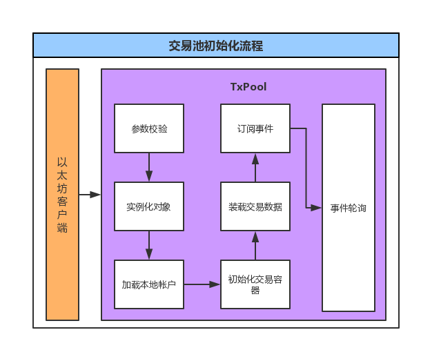
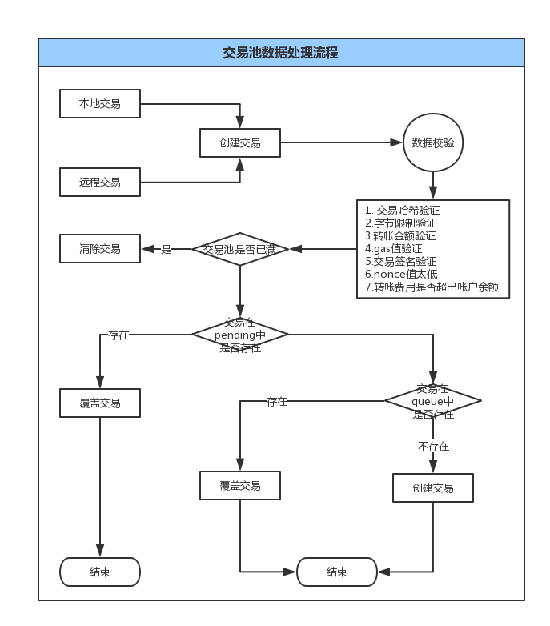

# 第十三章 交易池解析

本章节主要向大家介绍交易池的运转原理及流程、剖析 Ethereum 和 LightEthereum 客户端交易池的具体实现以及对比两者区别。

* * *

交易池，主要用于接收交易以及对交易被打包之前进行参数及业务合法性校验，比如：交易所需 gas、gasprice 太低，nonce 值太低或太高等，通过校验一方面可以将不合法交易快速失败，另一方面也可以将交易进行拆分，提高区块打包效率。

其中交易池的数据来源主要来自：

*   本地提交，也就是第三方应用通过调用本地以太坊节点的 RPC 服务所提交的交易；
*   远程同步，是指通过广播同步的形式，将其他以太坊节点的区块或交易数据同步至本地节点。

另外，在以太坊的架构设计中，其实是存在两种交易池的设计与实现，分别针对 Ethereum 和 LightEthereum 两种客户端的不同业务场景。

## 数据结构分析

**Transcation**

| 字段名 | 字段类型 | 说明 |
| --- | --- | --- |
| config | TxPoolConfig | 交易池配置。比如：最小 gasprice、每个帐户可执行 |
| chainConfig | *params.ChainConfig | Chain 配置。比如: 共识配置、DAO 分叉高度、Byzantium 区块高度 |
| chain | blockChain | 针对客户端不同，有二种实现: blockchain、lightchain |
| gasPrice | *big.Int | gas 单价 |
| txFeed | event.Feed |  |
| scope | event.SubscriptionScope |  |
| chainHeadCh | chan ChainHeadEvent | 设定通道大小，接收链上新区块消息。 |
| chainHeadSub | event.Subscription |  |
| signer | types.Signer | 签名对象 |
| mu | sync.RWMutex | 锁 |
| currentState | *state.StateDB |  |
| pendingState | *state.ManagedState | pending 中交易状态 |
| currentMaxGas | uint64 | 当前最大 gasLimit |
| locals | *accountSet | 本地帐户集合 |
| journal | *txJournal | 日志记录 |
| pending | mapcommon.Address*txList | 可执行交易列表 |
| queue | mapcommon.Address*txList | 暂不可执行交易列表 |
| beats | mapcommon.Addresstime.Time | 帐户最后心跳时间 |
| all | *txLookup | 所有可查询的交易列表 |
| priced | *txPricedList | 基于 gasprice 排序由高到低的交易列表 |
| wg | sync.WaitGroup | homestead | bool | 是否 homestead 版本 |

我们将重点介绍两个字段`pending`、`queue`，从字段说明可以知道这两个字段主要是以列表的形式存储可执行与非不可执行交易数据。

之所以使用列表，主要是因为在区块链系统中确保一条交易数据成功，并不像传统互联网系统架构可以通过事务的机制立即获取成功状态，而是需要全网一定节点的确认数才能保证这条交易大概率上是成功的，所以导致这个过程需要一定的时间周期。

正是因为这个问题，同时也是为了提高交易的处理效率及用户使用体验，保证一个交易可能并未成功的情况下，可以继续接收新的交易，所以使用列表数据结构来存储新交易数据，其实类似于常规架构中的消息队列机制。

其中，`pending`字段主要用于存储用户当下可执行的交易列表数据；`queue`字段主要用于存储用户暂不可执行的交易列表数据。

**那么，如何理解可执行与不可执行呢？**
可执行，可简单理解为线程的就绪状态，当获取到 Cpu 使用权后立即执行；非可执行力，理解为线程的阻塞状态，比如：Nonce 太大，只有等小于过大 Nonce-1 的交易执行完成后，才会将该交易转移至`pending`列表执行。

* * *

**接下来，我们继续介绍在客户端启动时，交易池是如何进行初始化的**



交易池的整个初始化过程，是在以太坊客户端(Ethereum/LightEthereum)的初始化过程中被调用执行的，NewTxPool 方法便是初始化交易池入口。

```go
eth.txPool = core.NewTxPool(config.TxPool, eth.chainConfig, eth.blockchain) 
```

1.  对启动参数进行参数校验及默认参数配置；

    ```go
    config = (&config).sanitize() 
    ```

    `sanitize`方法主要对`TxPoolConfig`中的 Rejournal、PriceLimit、PriceBump 三个字段进行校验，未通过校验则使用系统缺省参数进行重新设定。

2.  使用启动参数对 TxPool 进行对象实例化，主要是对一些集合变量和消息通道进行初始化，比如: pending、queue、beats 列表集合、chainHeadEvent 通道。

3.  加载本地帐户。我们在安装以太坊客户端往往可以指定一个数据存储目录，此目录便会存储着所有我们导入的或者通过本地客户端创建的帐户 keystore 文件。而这个加载过程便是从该目录加载帐户数据。

    ```go
     pool.locals = newAccountSet(pool.signer)
     for _, addr := range config.Locals {
         log.Info("Setting new local account", "address", addr)
         pool.locals.add(addr)
     } 
    ```

4.  初始化 TxPriceList 交易集合。`TxPricedList`集合主要用于将交易数据按照 GasPrice、Nonce 的业务规则进行排序处理。

    ```go
     pool.priced = newTxPricedList(pool.all) 
    ```

    为什么要这样做呢？
    因为 GasPrice 越高的交易确认速度越快，所以通过这种方式可以方便获取优先处理的交易数据。

5.  加载交易池数据。如果之前客户端已已运行一段时间，那么就需要从本地磁盘加载数据，恢复交易池状态。比如：从交易池中清除无效交易或已被打包的交易，更新处于 pending 状态交易的 nonce 值

    ```go
    pool.reset(nil, chain.CurrentBlock().Header()) 
    ```

6.  订阅链上事件消息。比如：矿工打包成功一个区块后，会通过通道推送 ChainHeadEvent 消息，进而触发消息订阅服务。

    ```go
     pool.chainHeadSub = pool.chain.SubscribeChainHeadEvent(pool.chainHeadCh) 
    ```

7.  启动新线程,轮询事件消息。

    ```go
     go pool.loop() 
    ```

    该轮询事件主要用于监听上一步通道中的 ChainHeadEvent 消息，然后调用`pool.reset`方法同步远程区块数据。

    ```go
     pool.reset(head.Header(), ev.Block.Header()) 
    ```

到此，交易池的整体加载过程就算结束了。

* * *

**那么从创建交易到被打包这个过程中，交易池的整个数据流程是怎么样的呢？**


**首先**，要搞明白交易的数据来源。而交易数据来自于两个入口：
1）客户端(Ethereum/LightEthereum)通过监听`TxMsg`消息调用 TxPool 实例的`AddRemotes`方法创建远程交易；

```go
pm.txpool.AddRemotes(txs) 
```

2）调用本地客户端 RPC 服务创建本地交易

```go
func (b *EthAPIBackend) SendTx(ctx context.Context, signedTx *types.Transaction) error {
    return b.eth.txPool.AddLocal(signedTx)
} 
```

**然后**，统一调用交易池的`addTx`方法，但是传入的参数有所不同。

```go
pool.addTx(tx, 是否本地) 
```

**接下来**，会对数据进行业务性校验：
1）本地客户端是否已存在当前交易 hash
2）交易数据大小是否超出字节限制
3）交易转帐金额是否小于 0
4）交易 gas 值是否超出当前交易池设定的 gaslimit
5）交易签名是否合法
6）交易 gasprice 判断。如果交易为远程交易，则需验证其 gasprice 是否小于交易池 gasprice 最小值
7）判断当前交易 nonce 值是否过低
8）判断交易所需花费的转帐手续费是否大于帐户余额
9）判断交易花费 gas 是否小于其预估花费 gas

**下一步**，如果交易池是否已满，则拒绝接受小于当前 gasprice 的交易以及清除一条不在本地存储的交易数据。

**再次**，判断当前交易在 pending 队列中是否存在 nonce 值相同的交易。存在则判断当前交易所设置的 gasprice 是否超过设置的 PriceBump 百分比，超过则替换覆盖已存在的交易，否则报错返回`替换交易 gasprice 过低`提示

**最后**，如果一条新的交易没有替换掉 pending 中交易，则该交易进入到 queue 队列。

```go
replace, err := pool.enqueueTx(hash, tx) 
```

同样，在 queue 队列中也会判断是否存在 nonce 值相同的交易。如果存在则会根据当前交易 gasprice 是否超出设置的 PriceBump 百分比，超过则替换 queue 中存在的交易，并清除旧的交易数据。

**注意：**pending 队列与 queue 队列都是对用户进行数据映射的集合列表。在上述所有判断队列中是否存在某项交易，其实就是对某个用户的交易列表进行判断的。

```go
pending map[common.Address]*txList
queue   map[common.Address]*txList 
```

到此，整个交易池的数据流程就算处理完毕，之后的处理逻辑便是矿工从 pending 集合中获取要执行的交易列表进行打包处理。

* * *

在介绍完 Ethereum 客户的交易池数据结构和流程后，我们再来对比一下轻客户端的交易池数据结构及其处理流程。

## 数据结构

对比 Ethereum 交易池数据结构，轻客户端交易池的不同之处在于它并没有提供 queue 交易列表属性，而是多了一个`mined`属性，其数据类型为`map[common.Hash][]*types.Transaction`

## 初始化流程

同样，TxPool 对象也是在客户端实例化时被调用执行的，只不过是在发生 LightEthereum 客户端中。

```go
leth.txPool = light.NewTxPool(leth.chainConfig, leth.blockchain, leth.relay) 
```

整个初始化过程，十分简单，总共分为三步:
第一步：根据启动参数实例化交易池。这一步主要就是对成员变量进行容器初始化操作；
第二步、订阅事件消息。这一步和 Ethereum 交易池实现是一样的，订阅的都是 ChainHeadEvent 事件消息，用以监听最新区块消息。
第三步、轮询事件消息。当监听到新的区块消息会触发`setNewHead`方法，对比本地客户端最新区块以及远程区块信息，当两者不相同时，比如本地客户端当前区块低于远程区块、远程区块低于本地客户端区块时，循环调用它们的父结点，直到找到共同父结点，并在此过程中统计`oldHashes`、`newHashes`区块列表。

```go
for oldh.Hash() != newh.Hash() {
    if oldh.Number.Uint64() >= newh.Number.Uint64() {
        oldHashes = append(oldHashes, oldh.Hash())
        oldh = pool.chain.GetHeader(oldh.ParentHash, oldh.Number.Uint64()-1)
    }
    if oldh.Number.Uint64() < newh.Number.Uint64() {
        newHashes = append(newHashes, newh.Hash())
        newh = pool.chain.GetHeader(newh.ParentHash, newh.Number.Uint64()-1)
        if newh == nil {
            // happens when CHT syncing, nothing to do
            newh = oldh
        }
    }
} 
```

然后，如果`oldHashes`列表中存在数据，则回滚本地区块数据；如果`newHashes`列表中存在数据，则根据`newHashes`区块中的交易数据更新本地 pending 交易数据为已打包数据。

## 数据处理流程

轻客端交易池的交易数据来源只有一个，那就是 RPC 服务请求入口

```go
func (b *LesApiBackend) SendTx(ctx context.Context, signedTx *types.Transaction) error {
    return b.eth.txPool.Add(ctx, signedTx)
} 
```

对比 ethereum, 它并没有`AddRemote`方法，主要因为轻客户端本身不支持挖矿功能，远程同步交易数据并没有什么意思。而本地交易是否被确认打包，也主要是根据区块事件来定时同步其 pending 交易状态。

所以它的整个处理流程，也并不复杂，主要分为两步：
1）本地交易创建，创建交易过程中，首先也会进行参数校验，比如当前 hash 是否已存在、 交易签名是否合法、交易 nonce 是否过低、gaslimit 是否超过限制等，大致和 ethereum 交易池的验证逻辑相仿；然后，将创建的交易存入 pending 交易列表，更新其 nonce；同时发送`NewTxsEvent`事件消息。
2）发送 LesTxRelay 消息至注册到本地客户端的 peer 节点

* * *

总结，通过本小节文章的学习，我们了解了以太坊的两种交易池数据结构，交易池的初始化流程，发起交易到交易打包整个阶段过程中交易池处理流程中的验证逻辑以及存储逻辑等。

* * *

> 在教程中如出现不易理解或存在错误的问题🐛，欢迎加我微信指正！
> Name: zhangliang | WeChat: rushking2009 | Mail: zhangliang@cldy.org