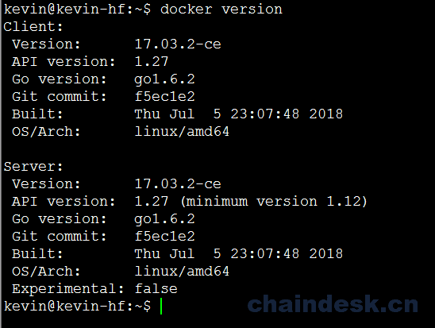

# 第一章 从零到壹构建基于 Fabric-SDK-Go 的 Web 应用-搭建 Fabric 网络环境

## 引言

### a. 说明

我们不会在本教程中详细解释 Hyperledger Fabric 的工作原理。在学习本教程之前，您应该通过 Hyperledger Fabric [官网](https://hyperledger-fabric.readthedocs.io/en/release-1.2/whatis.html) 或其它渠道学习 Hyperledger Fabric 的一些知识，以具备 Hyperledger Fabric 操作基础。

本应用实现是在基于 **Ubuntu 16.04（推荐）** 上完成的，但 Hyperledger Fabric 与 Mac OS X、Windows 和其他 Linux 发行版相兼容。

Hyperledger Fabric 简介

> Hyperledger Fabric 是一个区块链框架实现，是分布式账本解决方案的平台，采用模块化架构，提供高度机密性，弹性，灵活性和可扩展性。它旨在支持不同组件的可插拔实现，以适应整个经济生态系统中存在的复杂性。

详细请参阅官方文档中的完整说明中的介绍部分：[Hyperledger Fabric Blockchain](https://hyperledger-fabric.readthedocs.io/en/latest/blockchain.html)

### b. 所需环境及工具

*   **Ubuntu 16.04**
*   **vim、git**
*   **docker 17.03.0-ce+**
*   **docker-compose 1.8**+
*   **Golang 1.10.x+**

## 1\. 先决条件

### 1.1\. 安装 vim、git

```go
$ sudo apt install vim
$ sudo apt install git 
```

### 1.2\. 安装 docker

**需要 Docker 版本 17.03.0-ce 或更高版本。**

```go
$ docker version 
$ sudo apt install docker.io 
```

安装完成后执行版本查询命令

```go
$ sudo docker version 
```



### 1.3\. 安装 docker-compose

**docker-compose 1.8 或更高版本是必需的。**

我们目前无法一次性轻松管理多个容器。 为了解决这个问题，需要**docker-compose** 。

```go
$ docker-compose version 
$ sudo apt install docker-compose 
```

安装完成后查询：

```go
$ docker-compose version 
```


将当前用户添加到 docker 组

```go
$ sudo usermod -aG docker kevin 
```

添加成功后**必须注销/退出并重新登录**(退出终端重新连接即可)

> 如果没有将当前用户添加到 docker 组中，在后期执行 make 命令时会造成错误: `ERROR: Couldn't connect to Docker daemon at http+docker://localunixsocket - is it running?`

### 1.4\. 安装 Golang

**需要版本 1.10.x 或更高。**如果您使用的是 Hyperledger Fabric 1.1.x 版本，那么 Golang 版本在 1.9.x 以上

```go
 $ go version 
 $ wget https://dl.google.com/go/go1.10.3.linux-amd64.tar.gz 
```

> 下载受网络环境影响，如果您本地有相应的 tar 包，则直接解压到指定的路径下即可。

使用 tar 命令将下载后的压缩包文件解压到指定的 /usr/local/ 路径下

```go
$ sudo tar -zxvf go1.10.3.linux-amd64.tar.gz -C /usr/local/ 
```

设置 GOPATH & GOROOT 环境变量, 通过 `go env` 查看 GOPATH 路径

```go
$ sudo vim /etc/profile 
```

> 如果只想让当前登录用户使用 Golang， 其它用户不能使用， 则编辑当前用户$HOME 目录下的 .bashrc 或 .profile 文件， 在该文件中添加相应的环境变量即可。

在 profile 文件最后添加如下内容:

```go
export GOPATH=$HOME/go
export GOROOT=/usr/local/go
export PATH=$GOROOT/bin:$PATH 
```

使用 source 命令，使刚刚添加的配置信息生效：

```go
$ source /etc/profile 
```

通过 go version 命令验证是否成功：

```go
$ go version 
```


## 2\. 网络环境

### 2.1\. 网络环境准备

Hyperledger Fabric 处理交易时需要大量的证书来确保在整个端到端流程（TSL，身份验证，签名块......）期间进行加密。 为了直接了解问题的核心，我们已经在 github 上为您的网络环境准备了所有相关的内容， 不在此教程中讲解。

*   Crypto 材料已使用 Hyperledger Fabric 中的 **cryptogen** 工具生成，并保存在 hf-fixtures/crypto-config 目录中。有关 **cryptogen** 工具的更多详细信息，请 [点击此处](https://hyperledger-fabric.readthedocs.io/en/latest/commands/cryptogen.html)。
*   初始区块（genesis.block）和通道配置事务（channel.tx）已使用 Hyperledger Fabric 中 的 **configtxgen** 工具生成，并保存在 hf-fixtures/artifacts 目录中。有关 **configtxgen** 工具的更多详细信息，请 [点击此处](https://hyperledger-fabric.readthedocs.io/en/latest/commands/configtxgen.html)。

在`GOPATH`的`src`文件夹中新建一个目录如下：

```go
$ mkdir -p $GOPATH/src/github.com/kongyixueyuan.com/kongyixueyuan 
$ cd $GOPATH/src/github.com/kongyixueyuan.com/kongyixueyuan 
```

使用 `git` 命令克隆 hf-fixtures 目录当前路径

```go
$ git clone https://github.com/kevin-hf/hf-fixtures.git 
```

将 hf-fixtures 文件夹重命名为 fixtures

```go
$ mv hf-fixtures/ fixtures 
```

修改`fixtures` 文件夹的所属关系为当前用户

```go
$ sudo chown -R kevin:kevin ./fixtures 
```

> 提示： kevin 为安装 Ubuntu 16.04 系统时创建的用户

进入 `fixtures` 目录

```go
$ cd fixtures 
```

为了构建区块链网络，使用 `docker` 构建处理不同角色的虚拟计算机。 在这里我们将尽可能保持简单。如果确定您的系统中已经存在相关的所需容器，或可以使用其它方式获取，则无需执行如下命令。否则请将 `fixtures` 目录下的 `pull_images.sh` 文件添加可执行权限后直接执行。

```go
$ chmod 777 ./pull_images.sh
$ ./pull_images.sh 
```

> 提示：`pull_images.sh` 文件是下载 Fabric 环境所需容器的一个可执行脚本，下载过程需要一段时间（视网速情况而定），请耐心等待。另：请确定您的系统支持虚拟技术。

### 2.2\. 配置 docker-compose.yml 文件

在 `fixtures` 目录下创建一个 `docker-compose.yml` 文件并编辑

```go
$ vim docker-compose.yml 
```

1.  将 `network 下的 basic` 修改为 `default`

    ```go
    version: '2'

    networks:
      default:

    services: 
    ```

2.  编辑 orderer 部分

    ```go
     orderer.kevin.kongyixueyuan.com:
        image: hyperledger/fabric-orderer
        container_name: orderer.kevin.kongyixueyuan.com
        environment:
          - ORDERER_GENERAL_LOGLEVEL=debug
          - ORDERER_GENERAL_LISTENADDRESS=0.0.0.0
          - ORDERER_GENERAL_LISTENPORT=7050
          - ORDERER_GENERAL_GENESISPROFILE=kongyixueyuan
          - ORDERER_GENERAL_GENESISMETHOD=file
          - ORDERER_GENERAL_GENESISFILE=/var/hyperledger/orderer/genesis.block
          - ORDERER_GENERAL_LOCALMSPID=kevin.kongyixueyuan.com
          - ORDERER_GENERAL_LOCALMSPDIR=/var/hyperledger/orderer/msp
          - ORDERER_GENERAL_TLS_ENABLED=true
          - ORDERER_GENERAL_TLS_PRIVATEKEY=/var/hyperledger/orderer/tls/server.key
          - ORDERER_GENERAL_TLS_CERTIFICATE=/var/hyperledger/orderer/tls/server.crt
          - ORDERER_GENERAL_TLS_ROOTCAS=[/var/hyperledger/orderer/tls/ca.crt]
        working_dir: /opt/gopath/src/github.com/hyperledger/fabric
        command: orderer
        volumes:
          - ./artifacts/genesis.block:/var/hyperledger/orderer/genesis.block
          - ./crypto-config/ordererOrganizations/kevin.kongyixueyuan.com/orderers/orderer.kevin.kongyixueyuan.com/msp:/var/hyperledger/orderer/msp
          - ./crypto-config/ordererOrganizations/kevin.kongyixueyuan.com/orderers/orderer.kevin.kongyixueyuan.com/tls:/var/hyperledger/orderer/tls
        ports:
          - 7050:7050
        networks:
          default:
            aliases:
              - orderer.kevin.kongyixueyuan.com 
    ```

3.  编辑 ca 部分

    ```go
     ca.org1.kevin.kongyixueyuan.com:
        image: hyperledger/fabric-ca
        container_name: ca.org1.kevin.kongyixueyuan.com
        environment:
          - FABRIC_CA_HOME=/etc/hyperledger/fabric-ca-server
          - FABRIC_CA_SERVER_CA_NAME=ca.org1.kevin.kongyixueyuan.com
          - FABRIC_CA_SERVER_CA_CERTFILE=/etc/hyperledger/fabric-ca-server-config/ca.org1.kevin.kongyixueyuan.com-cert.pem
          - FABRIC_CA_SERVER_CA_KEYFILE=/etc/hyperledger/fabric-ca-server-config/727e69ed4a01a204cd53bf4a97c2c1cb947419504f82851f6ae563c3c96dea3a_sk
          - FABRIC_CA_SERVER_TLS_ENABLED=true
          - FABRIC_CA_SERVER_TLS_CERTFILE=/etc/hyperledger/fabric-ca-server-config/ca.org1.kevin.kongyixueyuan.com-cert.pem
          - FABRIC_CA_SERVER_TLS_KEYFILE=/etc/hyperledger/fabric-ca-server-config/727e69ed4a01a204cd53bf4a97c2c1cb947419504f82851f6ae563c3c96dea3a_sk
        ports:
          - 7054:7054
        command: sh -c 'fabric-ca-server start -b admin:adminpw -d'
        volumes:
          - ./crypto-config/peerOrganizations/org1.kevin.kongyixueyuan.com/ca/:/etc/hyperledger/fabric-ca-server-config
        networks:
          default:
            aliases:
              - ca.org1.kevin.kongyixueyuan.com 
    ```

4.  编辑 Peer 部分

    1.  `peer0.org1.example.com` 内容如下

        ```go
         peer0.org1.kevin.kongyixueyuan.com:
            image: hyperledger/fabric-peer
            container_name: peer0.org1.kevin.kongyixueyuan.com
            environment:
              - CORE_VM_ENDPOINT=unix:///host/var/run/docker.sock
              - CORE_VM_DOCKER_ATTACHSTDOUT=true
              - CORE_LOGGING_LEVEL=DEBUG
              - CORE_PEER_NETWORKID=kongyixueyuan
              - CORE_PEER_PROFILE_ENABLED=true
              - CORE_PEER_TLS_ENABLED=true
              - CORE_PEER_TLS_CERT_FILE=/var/hyperledger/tls/server.crt
              - CORE_PEER_TLS_KEY_FILE=/var/hyperledger/tls/server.key
              - CORE_PEER_TLS_ROOTCERT_FILE=/var/hyperledger/tls/ca.crt
              - CORE_PEER_ID=peer0.org1.kevin.kongyixueyuan.com
              - CORE_PEER_ADDRESSAUTODETECT=true
              - CORE_PEER_ADDRESS=peer0.org1.kevin.kongyixueyuan.com:7051
              - CORE_PEER_GOSSIP_EXTERNALENDPOINT=peer0.org1.kevin.kongyixueyuan.com:7051
              - CORE_PEER_GOSSIP_USELEADERELECTION=true
              - CORE_PEER_GOSSIP_ORGLEADER=false
              - CORE_PEER_GOSSIP_SKIPHANDSHAKE=true
              - CORE_PEER_LOCALMSPID=org1.kevin.kongyixueyuan.com
              - CORE_PEER_MSPCONFIGPATH=/var/hyperledger/msp
              - CORE_PEER_TLS_SERVERHOSTOVERRIDE=peer0.org1.kevin.kongyixueyuan.com
            working_dir: /opt/gopath/src/github.com/hyperledger/fabric/peer
            command: peer node start
            volumes:
              - /var/run/:/host/var/run/
              - ./crypto-config/peerOrganizations/org1.kevin.kongyixueyuan.com/peers/peer0.org1.kevin.kongyixueyuan.com/msp:/var/hyperledger/msp
              - ./crypto-config/peerOrganizations/org1.kevin.kongyixueyuan.com/peers/peer0.org1.kevin.kongyixueyuan.com/tls:/var/hyperledger/tls
            ports:
              - 7051:7051
              - 7053:7053
            depends_on:
              - orderer.kevin.kongyixueyuan.com
            networks:
              default:
                aliases:
                  - peer0.org1.kevin.kongyixueyuan.com 
        ```

    2.  peer1.org1.example.com 内容如下

        ```go
         peer1.org1.kevin.kongyixueyuan.com:
            image: hyperledger/fabric-peer
            container_name: peer1.org1.kevin.kongyixueyuan.com
            environment:
              - CORE_VM_ENDPOINT=unix:///host/var/run/docker.sock
              - CORE_VM_DOCKER_ATTACHSTDOUT=true
              - CORE_LOGGING_LEVEL=DEBUG
              - CORE_PEER_NETWORKID=kongyixueyuan
              - CORE_PEER_PROFILE_ENABLED=true
              - CORE_PEER_TLS_ENABLED=true
              - CORE_PEER_TLS_CERT_FILE=/var/hyperledger/tls/server.crt
              - CORE_PEER_TLS_KEY_FILE=/var/hyperledger/tls/server.key
              - CORE_PEER_TLS_ROOTCERT_FILE=/var/hyperledger/tls/ca.crt
              - CORE_PEER_ID=peer1.org1.kevin.kongyixueyuan.com
              - CORE_PEER_ADDRESSAUTODETECT=true
              - CORE_PEER_ADDRESS=peer1.org1.kevin.kongyixueyuan.com:7051
              - CORE_PEER_GOSSIP_EXTERNALENDPOINT=peer1.org1.kevin.kongyixueyuan.com:7051
              - CORE_PEER_GOSSIP_USELEADERELECTION=true
              - CORE_PEER_GOSSIP_ORGLEADER=false
              - CORE_PEER_GOSSIP_SKIPHANDSHAKE=true
              - CORE_PEER_LOCALMSPID=org1.kevin.kongyixueyuan.com
              - CORE_PEER_MSPCONFIGPATH=/var/hyperledger/msp
              - CORE_PEER_TLS_SERVERHOSTOVERRIDE=peer1.org1.kevin.kongyixueyuan.com
            working_dir: /opt/gopath/src/github.com/hyperledger/fabric/peer
            command: peer node start
            volumes:
              - /var/run/:/host/var/run/
              - ./crypto-config/peerOrganizations/org1.kevin.kongyixueyuan.com/peers/peer1.org1.kevin.kongyixueyuan.com/msp:/var/hyperledger/msp
              - ./crypto-config/peerOrganizations/org1.kevin.kongyixueyuan.com/peers/peer1.org1.kevin.kongyixueyuan.com/tls:/var/hyperledger/tls
            ports:
              - 7151:7051
              - 7153:7053
            depends_on:
              - orderer.kevin.kongyixueyuan.com
            networks:
              default:
                aliases:
                  - peer1.org1.kevin.kongyixueyuan.com 
        ```

5.  其余可根据实际情况进行添加

### 2.3\. 测试网络环境

为了检查网络是否正常工作，使用`docker-compose`同时启动或停止所有容器。 进入`fixtures`文件夹，运行：

```go
$ cd $GOPATH/src/github.com/kongyixueyuan.com/kongyixueyuan/fixtures
$ docker-compose up 
```

命令执行成功后，控制台会输出很多不同颜色的日志（红色不等于错误）


打开一个新终端并运行：

```go
 $ docker ps 
```


将看到：两个 peer，一个 orderer 和一个 CA 容器。 代表已成功创建了一个新的网络，可以随 SDK 一起使用。 要停止网络，请返回到上一个终端，按`Ctrl+C`并等待所有容器都停止。

> **提示** ：当网络成功启动后，所有处于活动中的容器都可以访问。 也可以查看指定容器的详细日志内容。 如果想删除这些容器，需要使用`docker rm $(docker ps -aq)`将其删除 ，但在删除容器之前需要确定其在网络环境中已不再使用。
> 
> 如果在网络环境启动过程中不想看到大量的日志信息，请在该启动命令中添加参数 `-d` ，如下所示： `docker-compose up -d` 。 如果要停止网络，请务必在 `docker-compose.yaml` 所在的文件夹中运行命令： `docker-compose stop` （或 使用`docker-compose down` 进行清理停止所有容器）。

最后在终端 2 中执行如下命令关闭网络：

```go
$ cd $GOPATH/src/github.com/kongyixueyuan.com/kongyixueyuan/fixtures
$ docker-compose down 
```


终端 1 窗口中输出如下：


## 3\. 参考资料

*   [Hyperledger 官网](https://www.hyperledger.org/)
*   [Hyperledger Fabric 在线文档](https://hyperledger-fabric.readthedocs.io/en/latest//)