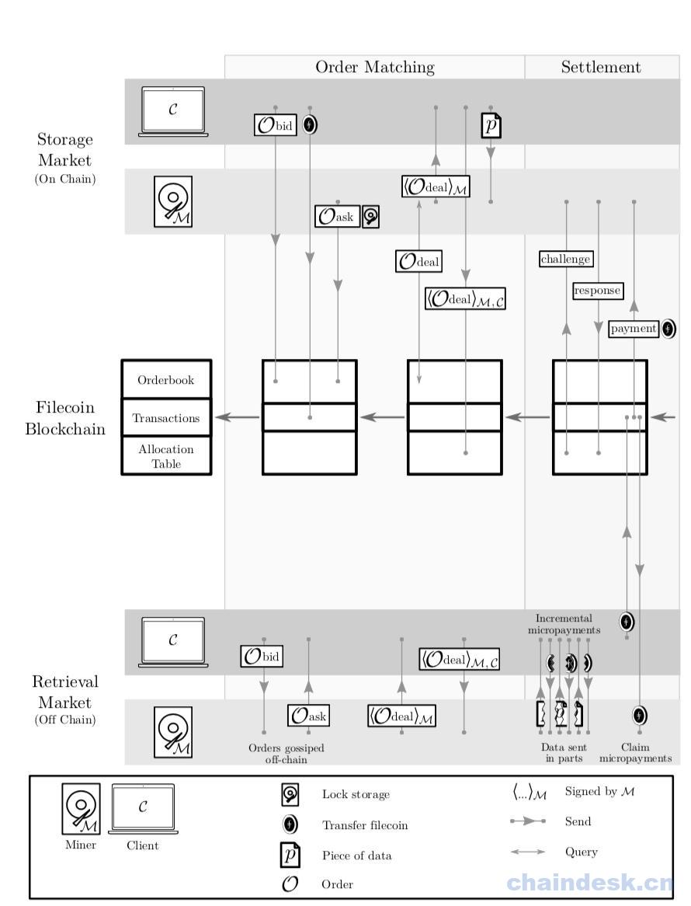

# 2.3 论文组织

本文的其余部分安排如下：我们在第二节中介绍了对一个理论上的 DNS 方案的定义和需求。在第三节中我们定义和介绍我们的“复制证明”和“时空证明”协议，以及 Filecoin 将其用于加密地验证数据按照订单的要求被持续不断的存储。第四节描述了 Filecoin DSN 的具体实例，描述了数据结构，协议，以及参与者之间的交互。第 5 节定义和描述可验证市场的概念，还有存储市场和检索市场的实施。第 6 节描述了使用“时空证明”协议进行演示，并且评估矿工对网络的贡献，这对扩展区块链块和区块奖励是必要的。第 7 节简要介绍了 Filecoin 中的智能合约。在第 8 节中讨论了未来的工作作为结束。

Figure 1: Sketch of the Filecoin Protocol Filecoin 协议的框架：

*   网络 在账本 L 中，每个时期 t 时:

    1.  对每个新区块: (a) 检查区块的结构是否有效； (b) 检查所有的交易是否有效； (c) 检查所有的订单是否有效； (d) 检查所有的证明是否有效； (e) 检查所有的抵押是否有效； (f) 如果以上条件任意一个不满足，那么丢弃该区块。
    2.  在 t 时间内，对每一个订单 O： (a) 添加订单 O 到存储市场的订单簿； (b) 如果 O 是 bid（出价订单）：lock O.funds（上锁该订单的资金）； (c) 如果 O 是 ask（询价订单）：lock O.space（上锁订单上提供的存储空间）； (d) 如果 O 是 deal（成交订单）：run Put.AssignOrders（买卖双方对 deal 进行签字）
    3.  存储市场中订单簿的每一个订单: (a) 检查订单是否过期 (或者被取消): 1） 将该订单从订单簿中移除； 2） 返还订单中的上锁资金； 3） 从分配表中释放上锁的存储空间。 (b) 如果 O 是 deal，通过运行 Manage.RepairOrders 检查是否有想要的证明存在: 1） 如果，证明丢失一个，那么会罚没存储矿工抵押品的一部分； 2） 如果证明超过∆fault 个，那么取消该订单，并将其重新引入到市场； 3） 如果数据碎片不能被检索和重新组合，那么取消该订单并返还用户抵扣的资金；
*   客户 任意时间:

    1.  通过 Put.AddOrders 提交新的存储订单： (a) 通过 Put.MatchOrders 寻找匹配的询价订单； (b) M 将要保存的文件发送给已匹配成功的矿工；
    2.  通过 Get.AddOrders 提交一个新的检索订单： (a) 通过 Get.MatchOrders 查找到与之匹配的订单； (b) 创建一个支付矿工 M 的支付通道。

客户一旦收到来自存储矿工 M 的成交订单时： 1） 对成交订单进行签名； 2） 通过 Put.AddOrders 将签名过的成交订单提交到区块链中。

客户一旦收到来自检索矿工 M 的数据碎片: 1） 确认碎片是否有效，以及是不是自己需求的； 2） 发送一个小型支付给矿工 M。

*   存储矿工 任意时间:
    1.  通过 Manage.PledgeSector 重新构建一个过期的抵押；
    2.  通过 Manage.PledgeSector 抵押新的存储；
    3.  通过 Put.AddOrder 提交一个新的询价订单。

在每段时间 t:

1.  对订单簿中每一个询价订单 Oask: (a) 通过 Put.MatchOrders 查找匹配的订单； (b) 与匹配的客户建立联系，并创建一个新的成交订单。
2.  对每一个抵押的扇区: (a) 通过 Manage.ProveSector 生成一个存储的证明； (b) 如果发布证明的时间一到 (每隔∆proof 时间), 将证明提交到区块链。

一旦从客户那里获取到数据碎片 p:

1.  检查碎片的大小是否与客户出价订单里描述的一致；
2.  创建一个成交订单，签名，并发送给客户；
3.  将碎片存储到扇区中；
4.  如果扇区存储已满，将运行 Manage.SealSector

*   检索矿工 任意时刻:
    1.  在网络中四处广播询价订单；
    2.  在网络中监听出价订单。

一旦检索矿工接收到客户的请求:

1.  开启一个与客户 C 的支付通道；
2.  将检索到的数据分成多份；
3.  当收到支付以后，才发送数据，一份一份的方式发送。

Figure 2: 凭借对 Filecoin 协议的直觉，我们脑海中有了客户和矿工交互的概览。存储和检索市场分别显示在图 2 的上方和下方，时间从左边的订单匹配阶段推进到右边的结算阶段。 注解：在执行检索服务的小型支付之前，客户必须对要支付的资金上锁。