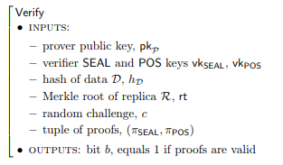

# 四、.4 PoRep 和 PoSt 实际应用

我们感兴趣的是 PoRep 和 PoSt 的应用构建，可以应用于现存系统而不是依赖于可信任的第三方或者硬件。我们给出了 PoRep 的一个构建（请参见基于密封的复制证明[5]),它在 Setup 过程中需要一个非常慢的顺序计算密封的执行来生成副本。PoRep 和 PoSt 的协议草图在图 4 给出，Post 的底层体系的证明步骤在图 3 中。

#### 4.4.1 构建加密区块

1.防碰撞散列： 我们使用一个防碰撞的散列函数：CRH : {0, 1}^* → {0, 1}^O(λ) 。我们还使用了一个防碰撞散列函数 MerkleCRH，它将字符串分割成多个碎片，构造出二叉树并递归应用 CRH，然后输出树根。

2.zk-SNARKs（零知识证明）： 我们的 PoRep 和 PoSt 的实际实现依赖于零知识证明（zk-SNARKs)[6,7,8]。因为 zk-SNARKs 是简洁的，所以证明信息简短并且很容易验证。更正式地，定义 L 为 NP 语言，C 为 L 的决策回路。一个可信任的参与方执行一次 setup 时会产生两个公共密钥：证明密钥 pk 和验证密钥 vk。证明密钥 pk 使任何（不可信）的证明者都能产生证明π，对于她选择的实例 x，x∈L。非交互式证明π是零知识和知识证明。任何人都可以使用验证密钥 vk 验证证明π。特别是 zk-SNARK 的证明可公开验证：任何人都可以验证π，而不与产生π的证明者进行交互。证明π具有恒定的大小，并且可以被及时验证，即验证π在|x|中是线性的。

一个 zk-SNARKs 要满足 C 的多项式时间算法的元组是： (KeyGen, Prove, Verify)

*   KeyGen(1λ,C)→ (pk, vk)，输入安全参数λ和 C，KeyGen 产生概率样本 pk 和 vk。这两个密钥作为公共参数发布，可在 L[c] 上用于证明/验证。

*   Prove(pk, x, w) → π 在输入 pk、x 和 NP 声明见证 w 下，证明人执行 Prove 产生一个非交互的证明π，用来证明 x ∈ L[c] 这句话。

*   Verify(vk, x, π) → {0, 1} 当输入 vk，输入 x 和证明 π，如果满足 x ∈ L[c] ，则验证者执行 Verify 输出 1。

我们建议感兴趣的读者参看[6，7，8]对 zk-SNARK 系统的正式介绍和实现。

通常而言这些系统要求 KeyGen 是由可信任参与方来运行。关于可扩展的计算完整性和私密性(SCIP)系统的新工作[9]显示了避免这个初始步骤的有希望的方向，因此才做出上面的信任假设。

#### 4.4.2 封装操作（Seal）

封装操作的作用是（1）通过要求证明者存储其公钥唯一的 D 的伪随机置换，来强制副本是物理上独立的副本，从而执行存储 n 个副本时，n 个独立副本将被存储于磁盘空间中（因此是副本存储大小的 n 倍）和（2）在执行 PoRep.Setup 的时候，强制生成副本的时间要大大的长于预计响应挑战的预期时间。有关密封操作的更正式定义，请参见[5]。上述的操作可以用 Seal^τ [τAES−256] 来实现，并且τ使得 Seal^τ [τAES−256] 需要花费比诚实的“挑战-证明-验证”顺序多 10-100 倍的时间。请注意，对τ的选择是重要的，这使得运行 Seal^τ [τAES−256] 比证明人随机访问 R 花费更多时间显得更加明显。

#### 4.4.3 PoRep 构建实践

本节描述 PoRep 协议的构建，并总结了一个已在图 4 包括了的简单协议草图。实现和优化的细节略过了。

1.创建副本 Setup 算法通过封装 Seal 算法生成一个副本并提供证明。证明人生成副本并将输出（不包括副本 R)发送给验证者。

2.证明存储 Prove 算法生成副本的存储证明。证明人收到来自验证者的随机挑战 c，c 指定了一个在根哈希为 rt 的默克树 R 中的叶子数据 R[c] 。证明人生成关于从树根 rt 到叶子 Rc 的路径的知识证明。 

3.验证证明 Verify 算法检查所给的源数据的哈希和副本的 Merkle 树根的存储证明的有效性。证明是公开可验证的：分布式系统的节点维护账本和对特定数据感兴趣的可以验证这些证明。

#### 4.4.4 PoSt 构建实践

本节描述 PoSt 协议的构建并已在图 4 中包含了一个简单协议草图。实现和优化的细节略过了。

Setup 和 Verify 算法和上面的 PoRep 构建是一样的。所以我们这里值描述 Prove。

1.空间和时间的证明 Prove 算法为副本生成“时空证明”。证明人接收到来自于验证者的随机挑战，并顺序生成”复制证明“，然后使用证明的输出作为另一个输入做指定 t 次迭代（见图 3）。

Figure 3: 演示 PoSt.Prove 的底层机制，展示用于演示随时间变化的存储的迭代证明.