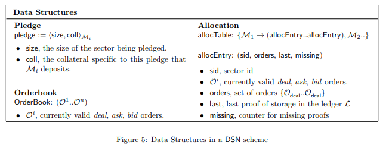

# 五、.2 数据结构

*   碎片 碎片是客户在 DSN 所存储数据的一部分。例如，数据是可以任意划分为许多片，并且每片都可以有不同集合的存储矿工来存储。
*   扇区 扇区是存储矿工向网络提供的一些磁盘空间。矿工将客户数据的碎片存储到扇区，并通过他们的服务来赚取令牌。为了存储碎片，矿工们必须向网络抵押他们的扇区。
*   分配表 分配表是一种数据结构，可以跟踪碎片和其分配的扇区。分配表在账本的每个区块都会更新，Merkle 根存储在最新的区块中。在实践中，该表用来保持 DSN 的状态，它使得在证明验证的过程中可以快速查找。更详细的信息，请参看图 5。
*   订单 订单式请求或提供服务的意向声明。客户向市场提交投标订单来请求服务（存储数据的存储市场和检索数据的检索市场），矿工们提交报价订单来提供服务。订单数据结构如图 10 所示。市场协议将在第 5 节详细介绍。
*   订单簿 订单簿是订单的集合。请查看第 5.2.2 节的存储市场订单簿和第 5.3.3 节的检索市场订单簿。
*   抵押 抵押是向网络提供存储（特别是扇区）的承诺。存储矿工必须将抵押提交给账本，以便能在存储市场接受订单。抵押包括了抵押扇区的大小和存储矿工已存入的抵押品。

