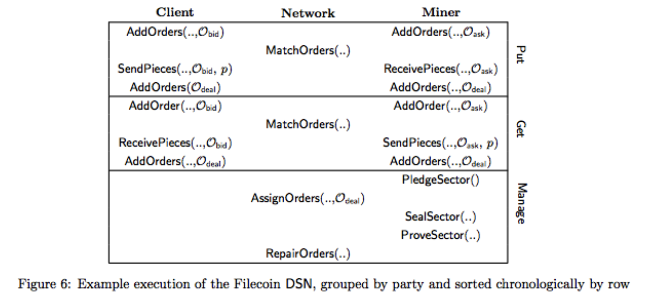

# 五、.3 协议

在本节中，我们通过描述客户端、矿工和网络执行的操作来概述 Filecoin DSN。我们在图 7 中介绍了 Get 和 Put 协议的方法，和在图 8 中的管理协议。一个协议执行的示例如图 6 所示。图 1 是 Filecoin 协议概览。

#### 5.3.1 客户生命周期

我们给出客户生命周期的概览：在第 5 节接下来的协议会做深度的解析。

1.Put：客户将数据存储于 Filecoin

客户可以通过向 Filecoin 中的矿工支付令牌来存储他们的数据。第 5.2 节详细介绍了 Put 协议。

客户通过向存储市场订单薄递交一个订单（bid order）来发起 Put 协议。当发现一个匹配的矿工询价订单（ask order）时，客户会将要存储的数据碎片发送给该矿工。双方都会在成交单（deal order）上签字，并将该 deal 递交到存储市场的订单博中。

客户应该能够通过提交多个订单来决定他们文件碎片物理副本的数量（或者指定订单中的副本复制因子）。更高的文件冗余程度会保证更高的存储容错程度。

2.Get：客户从 Filecoin 检索数据。 客户可以通过使用 Filecoin 令牌向检索矿工付费来检索任何数据。Get 协议在第 5.3 节有详细描述。客户端通过执行 Get 协议向检索市场订单簿提交投标订单（bid order）。当找到匹配的矿工报价订单后，客户会收到来自矿工的碎片。当收到的时候，双方对成交订单（deal order）进行签名并提交到区块链来确认交易成功。

#### 5.3.2 挖矿过程(针对存储矿工)

我们给出一个非正式的挖矿周期概述。

1.抵押：存储矿工向网络抵押存储。

存储矿工通过存入抵押品（通过区块链中的抵押交易存入的，方法是 Manage.PledgeSector）来将自己的存储抵押到网络中的。这个抵押品是准备要给网络提供服务时存入的，并且如果矿工生成了它提交存储的文件的存储证明，抵押品是被返还的。但如果生成的一些存储证明是有问题的，那么一定比例的抵押品将会被扣除。

一旦抵押交易在区块链中出现，矿工就能在存储市场中提供他们的存储服务：设定自己的报价，并在市场的订单簿添加自己的 ask 询价订单。

```go
Manage.PledgeSector

- inputs:

 - current allocation table allocTable

 - pledge request pledge

- outputs: allocTable' 
```

2.接收订单：存储矿工从存储市场获取存储请求。 一旦抵押交易出现在区块链中(AllocTable 列表中)，矿工就能在存储市场中提供他们的存储服务：设定自己的报价，并在市场的订单簿添加自己的 ask 询价订单，通过方法 Put.AddOrders 实现。

```go
Put.AddOrders

- inputs: list of orders O1..On 

- outputs: bit b, equals 1 if successful 
```

通过 Put.MatchOrders 来检查是否和客户的报价订单匹配一致。

```go
Put.MatchOrders

- inputs:

 - the current Storage Market OrderBook – query order to match Oq

- outputs: matching orders O1..On 
```

一定订单匹配，客户会将他们的数据发给存储矿工。存储矿工接收到数据的时候，运行 Put.ReceivePiece 。数据被接收完之后，矿工和客户对成交订单上签字，并将其提交到区块链。

```go
Put.ReceivePiece

- inputs: – signing key for Mj

 - current orderbook OrderBook

 - ask order Oask

 - bid order Obid

 - piece p

- outputs: deal order Odeal signed by Ci and Mj 
```

3.封装：存储矿工为未来的证明准备碎片。

存储矿工的存储切分为扇区，每个扇区包括了分配给矿工的碎片。网络通过分配表来跟踪每个存储矿工的扇区。当存储矿工的扇区填满了，这个扇区就被密封起来。密封是一种缓慢的顺序操作。将扇区中的数据转换成为副本，然后将数据的唯一物理副本与存储矿工的公钥相关联。在“复制证明”期间密封操作是个必要的操作。如下所述在第 3.4 节。

```go
Manage.SealSector 

- inputs:

 - miner public/private key pair M

 - sector index j

 - allocation table allocTable

- outputs: a proof πSEAL, a root hash rt 
```

4.证明：存储矿工证明他们正在存储所承诺的碎片（数据）。

当存储矿工被分配数据时，他们必须重复地生成复制证明以保证他们正在存储数据（有关更多详细信息，请参看第 3 节）。证明发布在区块链中，并由网络来验证。

```go
Manage.ProveSector

- inputs:

 - miner public/private key pair M

 - sector index j

 - challenge c

- outputs: a proof πPOS 
```

#### 5.3.3 挖矿周期（针对检索矿工）

我们给出一个非正式的挖矿周期概述。

1.收到订单：检索矿工从检索市场得到获取数据的请求。

检索矿工在网络中通过 gossip 协议广播他们的 ask 询价报单来宣布他们的碎片：他们设置报价，并将询价报单添加到市场的订单簿中。

```go
Get.AddOrders

- inputs: list of orders O1..On

- outputs: none 
```

然后检索矿工检查是否与客户的报价订单匹配一致。

```go
Get.MatchOrders

- inputs:

 - the current Retrieval Market OrderBook

 - query order to match Oq

- outputs: matching orders O1..On 
```

2.发送：检索矿工向客户发送数据碎片。

一旦订单匹配，检索矿工就将数据发送给客户（第 5.3 节有详细描述）。当数据碎片被接收以后，矿工和客户双方都在完成的成交订单上签字，并将其提交到区块链上。

```go
 Put.SendPieces

- inputs: – an ask order Oask

 - a bid order Obid

 - a piece p

- outputs: a deal order Odeal signed by Mi 
```

#### 5.3.4 网络周期

我们给出一个非正式的网络操作概述。

1.分配：网络将客户的碎片分配给存储矿工的扇区。

客户通过向存储市场提交报价订单来启动 Put 协议。（存储订单通过区块链提交，详见 5 部分）。 当询价订单和报价订单匹配的时候，参与的各方共同履行交易并向市场提交成交的订单。此时，网络将数据分配给矿工，并将其记录到分配表中。

```go
Manage.AssignOrders

- inputs:

 - deal orders O1deal..Ondeal

 - allocation table allocTable

- outputs: updated allocation table allocTable' 
```

2.修复：网络发现故障并试图进行修复

所有的存储分配对于网络中的每个参与者都是公开的。对于每个块，网络会检查每个需要的证明都存在，检查它们是否有效，因此采取行动：

1)如果有任何证明丢失或无效，网络会通过扣除部分抵押品的方式来惩罚存储矿工。 2)如果大量证明丢失或无效（由系统参数Δfault 定义），网络会认定存储矿工存在故障，将订单设定为失败，并将同样的数据引入到新订单进入市场。 3)如果所有存储该数据的存储矿工都有故障，则该数据丢失，客户获得退款。

```go
Manage.RepairOrders

- inputs:

 - current time t

 - current ledger L

 - table of storage allocations allocTable

- outputs: orders to repair O1deal..Ondeal, updated allocation table allocTable 
```

