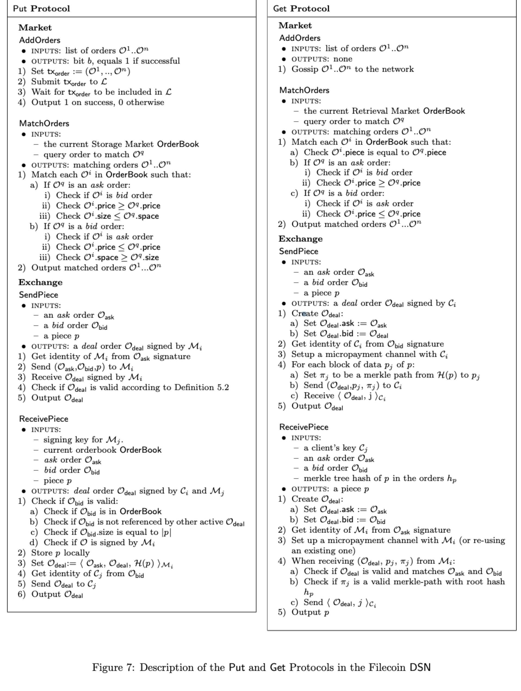
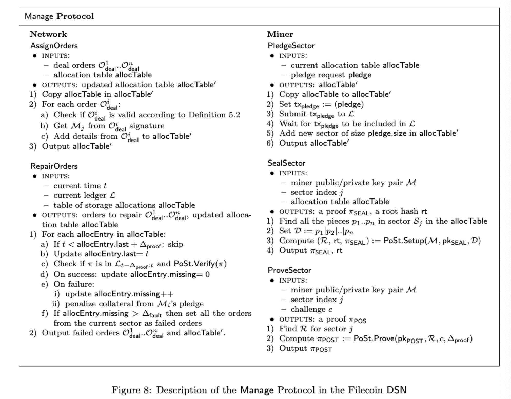

# 五、.4 担保和要求

以下是 Filecoin DSN 如何实现完整性、可检索性，公开可验证性和激励兼容性的总结。

*   实现完整性 数据碎片以加密哈希命名。一个 Put 请求后，客户只需要存储哈希即可通过 Get 操作来检索数据，并可以验证收到的数据的完整性。

*   实现可恢复性 在 Put 请求中，客户指定副本因子和渴望的纠删码技术类型。假设给定的 m 个存储矿工存储数据，可以容忍最多 f 个故障，则该方式是(f, m)-tolerant 存储。通过在不同的存储提供者存储数据，客户端可以增加恢复的机会，以防存储矿工下线或者消失。

*   实现公开可验证和可审核性 存储矿工需要提交其存储 (πSEAL, πPOST)的证明到区块链。网络中的任意用户都可以在不访问外包数据的情况下验证这些证明的有效性。另外由于这些证明都是存储在区块链上的，所以操作痕迹可以随时审核。

*   实现激励兼容性 不正式的说，矿工通过提供存储而获得奖励。当矿工承诺存储一些数据的时候，它们需要生成证明。如果矿工忽略了证明就会被惩罚（通过损失部分抵押品），并且不会收到存储的奖励。

*   实现保密性 如果客户希望他们的数据被隐私存储，那客户必须在数据提交到网络之前先进行加密。

