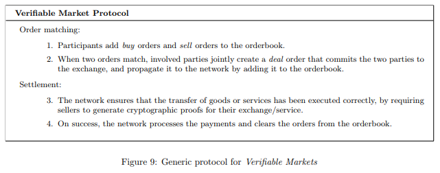

# 六、.1 可验证市场（Verifiable Markets）

交易市场（Exchange Markets）是促进特定商品和服务交换的协议。它们使得买家和买家促成交易。为达成我们的目的，我们要求交易是可验证的：参与者的去中心化网络必须能够验证买家和卖家之间的交易。

我们提出验证市场的概念。它没有单一的实体来管理交易，交易是透明的，任何人都可以匿名参与。可验证市场协议通过去中心化的方式操作商品/服务的交易：订单簿和订单结算的一致性，服务的正确执行由参与者独立的进行验证-在 FileCoin 案例中，是矿工和全节点进行验证。我们简化可验证市场来进行以下构建：

定义 5.1

可验证市场是一个有两个阶段的协议：订单匹配和结算。订单是购买意向或者出售商品或服务的声明，订单簿就是所有可用订单的列表。

 可验证市场协议：

*   订单匹配：

    *   1.  参与者们在订单簿中添加购买订单和出售订单；
    *   2.  当这两个订单匹配时，双方会共同地创建一个成交订单（deal order），该订单使买卖双方达成交易。双方还会通过将成交订单添加到订单簿中，来实现广播成交订单到网络中。
*   结算：

    *   网络要确保商品或服务的传输已经被正确执行，要求卖家对他们的交易和服务生成加密的证明。
    *   一旦成功，网络将会执行支付，并在订单簿中清除这些完成的订单。