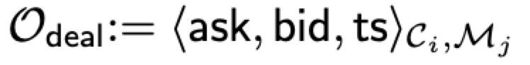
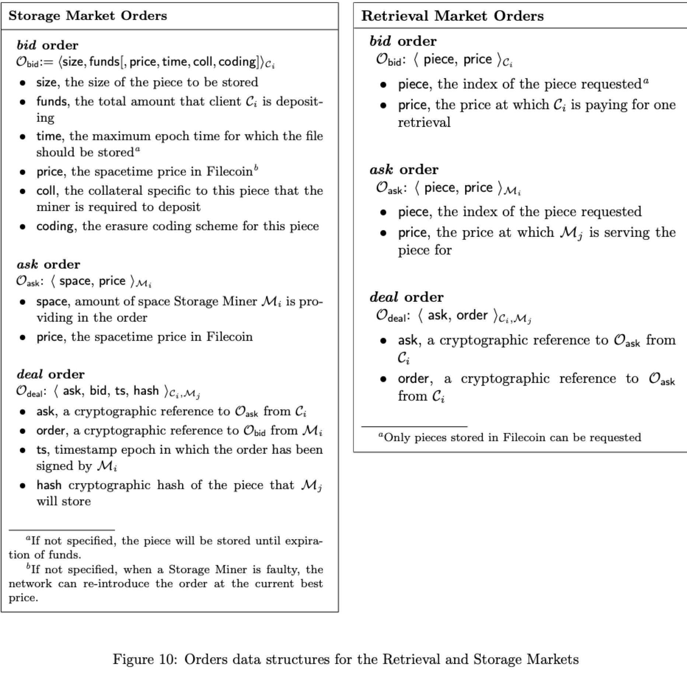
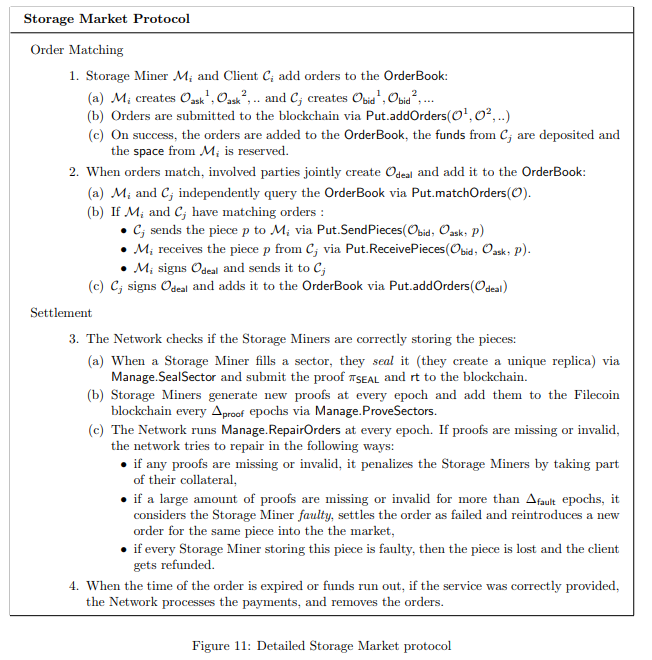

# 六、.2 存储市场

存储市场是可验证的市场，它允许客户（即买家）请求存储他们数据，而存储矿工（即卖家）将会提供他们的存储空间。

#### 6.2.1 需求

我们根据以下需求来设计存储市场协议：

*   链上订单簿（In-chain orderbook） 重要的是（1）存储矿工的订单是公开的，所以最低价格的订单总是网络可知的，客户可以对订单做出明智的决定（2）客户订单必须始终提交给订单簿，即使当他们接受了最低的价格，这样市场就可以对新的报价做出反应。因此我们要求订单添加到 Filecoin 区块链，为的是能被加入订单簿。

*   参与者投入资源：我们要求参与双方将他们的资源做出承诺，以此来避免损害：避免存储矿工不提供服务和避免客户没有可用的资金。为了能参与存储市场，存储矿工必须要进行抵押，在 DSN 网路中存入一些抵押品，抵押品的数量根据他们已存储数据的量对应的比例而定（更多详细信息请参看第 4.3.3 节）。通过这种方式，网络可以惩罚那些承诺存储数据但又不提供存储证明的存储矿工。同样的，客户必须向订单充入特定数量的资金，以这种方式保证在结算期间的资金可用性。

*   故障自管理： 只有在存储矿工反复证明他们已经在约定的时间内存储了数据的情况下，订单才会结算给矿工。网络必须能够验证这些证明的存在性和正确性并且根据 4.3.4 部分提到的修复规则运行自修复处理。

#### 6.2.2 数据结构

*   Put 订单 有三种类型的订单：出价订单，询价订单和成交订单。存储矿工创建询价订单添加存储，客户创建出价订单请求存储，当双方对价格达成一致时，他们共同创建成交订单。订单的数据结构和订单参数的明确定义如图 10 所示。

*   Put 订单簿 存储市场的订单簿是目前有效和开放的询价，出价和成交订单的集合。用户可以通过 Put 协议中定义的方法与订单簿进行交互：AddOrders,MatchOrders 如图 7 所示。

订单簿是公开的，并且每个诚实的用户都有同样的订单簿视图。在每个周期，如果新的订单交易出现在新的区块中，那么该订单将被添加到订单簿中。如果订单被取消，失效或者结算，则会被清除。如果订单是有效的，他们将被添加到区块链中，也就是在订单簿中：

定义 5.2 我们定义出价，询价，成交订单的有效性：

（有效的出价订单）：出价订单来自客户 C[i]；订单表达为 ，要让它有效，需要满足以下条件：

*   C[i]在他们的账户里，要有至少满足交易的资金；
*   设置的时间不能是过去时间；
*   订单必须保证存储时间至少要满足 amount（系统设定的参数）次的挑战轮数。

（有效的询价订单）：一个来自存储矿工 M[i]的询价订单， ，要让它有效，需要满足以下条件：

*   M[i]已经完成抵押成为矿工，并且抵押还没有失效；
*   空间 space 必须小于 M[i]的可用存储空间：M[i]矿工抵押的存储减去订单中提交的存储（在询价和成交订单中）；

（有效的成交订单）：成交订单 ，要让它有效，需要满足以下条件：

*   ask 指的是订单 O[ask]，该订单是在存储市场的订单簿中，并且没有其他的成交订单与它相关，而且客户也对该订单进行签字；
*   bid 指的是 O[bid]，该订单是在存储市场的订单簿中，并且没有其他的成交订单与它相关，而且存储矿工也对该订单进行签字；
*   ts 不能设置在未来时间，也不能离现在太远的时间

注释：如果作恶客户端从存储矿工处收到了签名的交易，但从来没有将其添加到订单簿，那么存储矿工就无法重新使用订单中提交的存储。这个字段 ts 就可以防止这种攻击，因为，在超过 ts 之后，订单变得无效，将无法在订单簿中提交。

#### 6.2.3 存储市场协议

简而言之，存储市场协议分为两个阶段：订单匹配和结算：

*   订单匹配：客户端和存储矿工通过提交交易到区块链来将订单提交到订单簿（步骤 1）。当订单匹配时，客户端发送数据碎片给存储矿工，双方签署成交订单并提交到订单簿（步骤 2）。

*   结算：存储矿工封装扇区（步骤 3a），生成扇区所包含的碎片的存储证明，并将其定期提交到区块链（步骤 3b)；同时，其余的网络必须验证矿工生成的证明并修复可能的故障（步骤 3c）。

*   存储市场协议在图 11 中详细描述。

