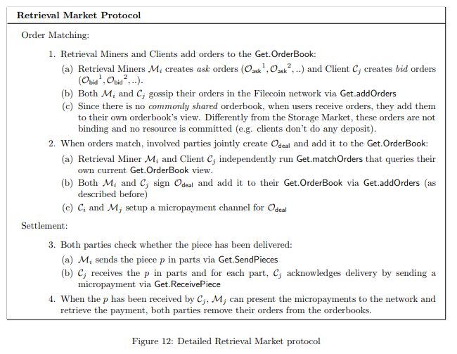

# 6.3 检索市场

检索市场允许客户端请求检索特定的数据，由检索矿工提供这个服务。与存储矿工不同，检索矿工不要求在特定时间周期内存储数据或者生成存储证明。在网络中的任何用户都可以成为检索矿工，通过提供检索服务来赚取 Filecoin 令牌。检索矿工可以直接从客户端或者检索市场那里获取碎片，也可以存储它们成为存储矿工来提供碎片。

#### 6.3.1 需求

我们根据以下的需求来设计检索市场协议：

*   链下订单簿 客户必须能够找到提供所需要数据碎片的检索矿工，并且在定价之后直接交易获得数据碎片。这意味着订单簿不能通过区块链来运行-因为这将成为快速检索请求的瓶颈。相反的，参与者只能看到订单簿的部分视图。我们要求双方传播自己的订单。

*   无信任方检索 公平交换的不可能性[10]提醒我们双方不可能在没有信任方的支持下进行交易。在存储市场中，区块链网络作为去中心化信任方来验证存储矿工提供的存储。在检索市场，检索矿工和客户在没有网络见证所交换文件的情况下来交换数据。我们通过要求检索矿工将数据分割成多个碎片并将每个碎片发送给客户来达到这个目的，矿工们将收到付款。在这种方式中，如果客户停止付款，或者矿工停止发送数据，任何一方都可以终止这个交易。注意的是，我们必须总是假设总是有一个诚实的检索矿工。

*   支付通道 客户当提交付款的时候可以立即进行检索感兴趣的碎片。检索矿工只有在确认收到付款的时候才会提供数据碎片。通过公共账本来确认交易可能会成为检索请求的瓶颈，所以，我们必须依靠有效的链下支付。Filecoin 区块链必须支持快速的支付通道，实现快速和圆满的交易。仅在出现纠纷的情况下才使用区块链进行支付。通过这种方式，检索矿工和客户端可以快速发送 Filecoin 协议所要求的小额支付。未来的工作里包含了创建一个如[11,12]所述的支付通道网络。

#### 6.3.2 数据结构

*   获取订单 检索市场中包含有三种类型的订单：客户创建的出价单 Obid，检索矿工创建的询价单 Oask，和存储矿工和客户达成的成交订单 Odeal。订单的数据结构如图 10 所示。

*   获取订单簿 检索市场的订单簿是有效的和公开出价订单、询价订单和成交订单组成的集合。与存储市场不同，每个用户有不同的订单簿视图，因为订单是在网络中传播的，每个矿工和客户只会跟踪他们所感兴趣的订单。

#### 6.3.3 检索市场协议

简而言之，检索市场协议分为两个阶段：订单匹配和结算：

订单匹配 客户端和检索矿工通过广播将订单提交给订单簿（步骤 1）。当订单匹配的时候，客户端和检索矿工建立小额支付通道（步骤 2）。

结算 检索矿工发送小部分的碎片给到客户端，然后对每个碎片客户端会向矿工发送收妥的收据 receipt（步骤 3）。检索矿工向区块链出示收据从而获得奖励（步骤 4）。

该协议在图 12 中详细解释。

