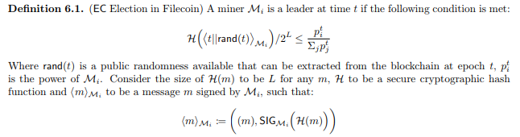
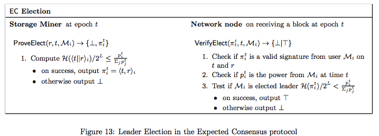

# 7.2 Filecoin 共识

我们提出一个有效工作的一致性协议，选举产生一个矿工去产生新的区块，被选举出来的概率和它当前在网络中已经存储的数据（正在被应用中的数据）占全网数据存储的比例有很大关系。我们设计 Filecoin 协议，使矿工更愿意投资存储而不是算力，从而达到并行化挖矿计算。矿工提供存储和重新使用计算来证明数据被存储以参与共识。

#### 7.2.1 模型化挖矿能力（power 在计算难题的共识中译为算力，此处因为不依靠计算，译为能力）

能力容错 在我们的技术报告[13]中，我们提出了能力容错，这是对在参与者对协议结果的影响方面重新构建拜占庭故障的抽象。每个参与者控制了网络总能力 n 中的一部分能力，其中 f 是故障节点或作恶节点所控制的能力占比。

Filecoin 能力 在 Filecoin 中，在时刻 t，矿工 Mi 的能力 P^t [i]是 Mi 总和的存储任务。Mi 的 I^t [i]是网络中 Mi 总能力的影响因子。

在 Filecoin 中，功率有以下属性：

*   公开：网络中当前正在使用的存储总量是公开的。通过读取区块链，任何人都可以计算每个矿工的存储任务-因此任何人都可以计算出在任意时间点的每个矿工的能力值和网络总能力值。

*   可公开验证的：对于每个存储任务，矿工都需要生成”时空证明“，证明持续提供服务。通过读取区块链，任何人都可以验证矿工的能力声明是否是正确的。

*   可变的： 在任何时候，矿工通过用一个新扇区作为抵押并对该扇区进行数据填充的方式，可以添加一个新的存储到网络中。通过这种方式，矿工们可以通过时间改变他们的存储总量。

### 7.2.2 用时空证明计算能力值

每个∆proof 区块（∆proof 是系统参数），矿工们都必须向网络提交“时空证明”，如果网络中大多数算力认为它们是有效的，才会被成功添加到区块链中。在每个区块中，每个全节点会更新分配表（AllocTable），添加新的存储分配、删除过期的和标记缺少证明的记录。可以通过对分配表的记录来对矿工 Mi 的能力进行计算和验证。这些可以通过两种方式来完成：

*   全节点验证：如果节点拥有完整的区块链记录，则可以从创始块开始运行网络协议直到当前区块，并读取矿工 Mi 的 AllocTable。这个过程中验证了每一个 Mi 存储的“时空证明”。

*   简单存储验证：假设轻客户端可以访问广播最新区块的信任源。轻客户端可以从网络中的节点请求：（1）Mi 在当前分配表中的记录 （2）该记录被包含在最新区块的状态树中的 Merkle 路径（3）从创世块到当前区块的区块头。这样轻客户端就可以将“时空证明”的验证委托给网络。

能力计算的安全性来自于“时空证明”的安全性。在这个设置里面，Post 保证了矿工无法对他们所分配的存储数量说谎。事实上，他们不能声称能够存储超过他们的存储空间的数据，因为这会花费时间来运行 PoSt.Setup，另外 PoSt.Prove 是串行的计算，并不能并行化的快速生成证明。

### 7.2.3 使用能力达成共识

我们通过扩展现有的（以及未来的）权益证明一致性协议，预料实现 Filecoin 协议会有多重的策略，其中股权会被已完成的存储代替。我们预计了权益证明协议的改进，同时也提出了一个基于我们称为预期共识的前期工作的构建[14]。我们的策略是在每一轮选举出一个（或多个）矿工，如此这样矿工赢得选举的概率与他们分配的存储成比例。

预期共识（Expected Consensus） 预期共识的基本直觉是确定性的、不可预测的。并在每个周期内秘密选举一个小的 Leader 集合。预期的期望是每个周期内当选的 Leader 是 1 个，但一些周期内可能有 0 个或者许多个 Leader。Leader 们通过创建新区块并广播来扩展区块链网络。在每个周期，每个区块链被延伸一个或多个区块。在某个无 Leader 的周期内，空区块被添加到区块链中。虽然链中的区块可以被线性排序，但其数据结构是有向无环图。EC 是一个概率共识，每个周期都使得比前面的区块更加确定，最终达到了足够的确定性，且出现不同的历史块链的可能性是足够小的。如果大多数的参与者都通过签署区块链来扩展区块链，加大这个区块所属链的权重，那么这个区块就被确认了。

选举矿工 在每个周期，每个矿工检查他们是否被选为 Leader，这类似于完成前面的协议:CoA[15],Snow White[16]，和 Algorand[17]。

在图 13 中，我们描述了矿工（ProveElect）和网络节点（VerifyElect）之间的协议。这种选举方案提供了三个属性：公平，保密和公开的可验证性。

*   公平 每个参与者每次选举只有一次试验，因为签名是确定性的，而且 t 和 rand(t)是固定的。假设 H 是安全的加密散列函数，则 H(Mi)/2L 必须是从（0，1）均匀选择的实数，因此，可能使得方程等式为 true 必须是 Pti/Σjptj，这等于矿工在在网络中的能力占的比重。因为这个概率在能力上是线性的，这种可能性在分裂或者汇集能力情况下被保留。注意随机值 rand(t)在时刻 t 之前是未知的。

*   保密 由于有能力的攻击者不拥有 Mi 用来计算签名的秘钥，考虑到数字签名的假设，这个是可以忽略不计的。

*   公开可验证： 当选 Leader i ∈ Lt 可以通过给出 t，rand(t)，H(i)/2L，来说服一个有效的验证者。鉴于前面的观点，在没有密钥的情况下，没有敌手能够生成一个证明。

