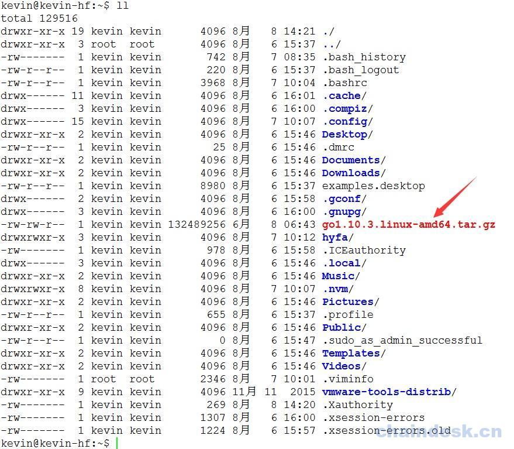
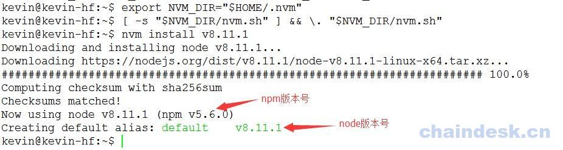

# 1.2 迈出第一步：做好提前准备

## 目标

1.  **检查操作系统**
2.  **检查并安装所需工具**
3.  **可选安装 Node 及 npm**

## 任务实现

### 1.2.1 操作系统

> 学习，必须要有一个好的场地，我们耗费精力给你挑选好了一个安全又方便的场地。但是该场地有一些硬性条件，请一定要注意。

推荐使用的操作系统为 64 位的 **Ubuntu 16.04 LTS**，系统内核为 GNU/Linux 4.13.0-36-generic x86_64。

硬件资源要求：内存最低为 2GB，最好 3G 以上； 磁盘空间为 30GB 或更高。

如果计算机默认为 Windows 操作系统， 可以在 Windows 系统中安装一个 VMware 虚拟机应用程序， 然后在 VMWare 虚拟机中安装 Ubuntu 16.04 系统， 最后在 Window 操作系统中再安装一个远程连接工具（如 XShell 或 SecureCRT），以方便连接并操作 Ubuntu 系统。

> 如果你使用的是 Mac 本本，同样建议安装使用虚拟机的方式来学习。

### 1.2.2 安装所需工具

> 选好学习场地之后，挑选一些趁手的武器放在场地中，将来就不会再去费尽心血去考虑什么情况下使用什么武器解决的事情了。

#### 1.2.2.1 安装 git

首先，我们来安装 git 工具，git 是一个非常优秀的免费、开源的版本管理控制工具， 我们可以使用 git 工具方便地下载官方（Golang、Hyperledger Fabric 等等）在 Github 网站上发布的相关源代码或其它内容。

安装 git 工具使用如下命令：

```go
$ sudo apt update
$ sudo apt install git 
```

> MAC OS 系统中默认已安装。如未安装，可以在 git 官方网站：[`git-scm.com/downloads`](https://git-scm.com/downloads) 页面中选择相应系统的安装包下载并安装

#### 1.2.2.2 安装 cURL

使用如下命令安装 cURL:

```go
$ sudo apt install curl 
```

> 各系统的 cURL 安装包可以在 [`curl.haxx.se/download.html`](https://curl.haxx.se/download.html) 页面中选择下载并安装

#### 1.2.2.3 安装 Docker

> 欲练神功，挥刀自宫，噢，停下停下，说错了。要学的这门神功，必须先有一副金刚不坏之躯，而不是自残，所以先服下这颗神丹。达到金刚不坏、万毒不侵之躯。

查看系统中是否已经安装 Docker：

```go
$ docker --version 
```

使用如下命令安装 Docker 的最新版本：

```go
$ sudo apt update
$ sudo apt install docker.io 
```

**查看 Docker 版本信息**

```go
$ docker --version 
```

输出: `Docker version 17.03.2-ce, build f5ec1e2`

#### 1.2.2.4 安装 Docker-compose

确定系统中是否已安装 docker－compose 工具

```go
$ docker-compose --version 
```

如系统提示未安装，则使用如下命令安装 docker-compose 工具：

```go
$ sudo apt install docker-compose 
```

安装成功后，查看 Docker－Compose 版本信息

```go
$ docker-compose --version 
```

输出: `docker-compose version 1.8.0, build unknown`

#### 1.2.2.5 安装 Golang

> Fabric1.0.0 版本要求 Go 语言 1.7 以上版本，Fabric1.1.0 版本要求 Go1.9 以上版本，Fabric1.2.0 版本要求 Go1.10 以上版本， 我们使用 Fabric1.2.0 版本， 所以从官方下载最新版本的 Golang。

##### 1.2.2.5.1 下载 Golang

使用 wget 工具下载 Golang 的最新版本压缩包文件 go1.10.3.linux-amd64.tar.gz

```go
$ wget https://dl.google.com/go/go1.10.3.linux-amd64.tar.gz 
```

> **下载 Golang 压缩包文件，需要操作系统能够保证正常访问 Golang 官方网站**。
> 
> 下载过程可能耗时较长（取决于具体网络情况），请耐心等待。
> 
> 其它系统可以在 Golang 官方： [`golang.org/dl/`](https://golang.org/dl/) 下载页面中查找相应的安装包下载安装。

下载完成后，文件会保存在当前目录下。可以使用 `ll` 命令查看



##### 1.2.2.5.2 解压文件

使用 tar 命令将下载后的压缩包文件解压到指定的 /usr/local/ 路径下

```go
$ sudo tar -zxvf go1.10.3.linux-amd64.tar.gz -C /usr/local/ 
```

* * *

如果在解压过程中出现如下错误：

```go
gzip: stdin: unexpected end of file
tar: Unexpected EOF in archive
tar: Unexpected EOF in archive
tar: Error is not recoverable: exiting now
或
gzip: stdin: unexpected end of file
tar: 归档文件中异常的 EOF
tar: 归档文件中异常的 EOF
tar: Error is not recoverable: exiting now 
```

说明下载的 tar 压缩包文件有问题， 如没有下载完整或压缩包数据损坏。请删除后重新下载并解压至指定的目录中。

* * *

##### 1.2.2.5.3 配置环境变量

解压后，Golang 可以让系统的所有用户正常使用， 所以我们使用 vim 文件编辑工具打开系统的 profile 文件进行编辑：

```go
$ sudo vim /etc/profile 
```

> 如果只想让当前登录用户使用 Golang， 其它用户不能使用， 则编辑当前用户$HOME 目录下的 .bashrc 或 .profile 文件， 在该文件中添加相应的环境变量即可。

在 profile 文件最后添加如下内容:

```go
export GOPATH=$HOME/go
export GOROOT=/usr/local/go
export PATH=$GOROOT/bin:$PATH 
```

使用 source 命令，使刚刚添加的配置信息生效：

```go
$ source /etc/profile 
```

通过 go version 命令验证是否成功：

```go
$ go version 
```

输出: `go version go1.10.3 linux/amd64`

> 如果系统中有旧版本的 golang,则使用如下命令卸载旧版本的 golang,然后再重新安装并配置
> 
> ```go
> $ su -
> # apt-get remove golang-go --purge && apt-get autoremove --purge && apt-get clean 
> ```

### 1.2.3 安装 Node 及 npm

#### 1.2.3.1 安装 nvm

nvm：Node Version Manager，Node.js 的版本管理软件， 可以根据不同的需求场景方便地随时在 Node.js 的各个版本之间进行切换。

由于 Node.js 版本更新较快，且各版本之间差异较大；直接从 Node 官网安装可能需要很长时间，而且中间可能会因为网络访问及数据传输原因造成下载中断或失败等问题。为了方便安装及后期管理 Node.js 的版本，我们首先需要在系统中安装 nvm 管理工具。

使用如下命令安装 nvm：

```go
$ sudo apt update
$ curl -o- https://raw.githubusercontent.com/creationix/nvm/v0.33.10/install.sh | bash

$ export NVM_DIR="$HOME/.nvm"
$ [ -s "$NVM_DIR/nvm.sh" ] && \. "$NVM_DIR/nvm.sh" 
```

#### 1.2.3.2 安装 Node

nvm 工具安装并配置成功后， 可以直接使用 nvm 命令安装 Node；且 Node 安装成功后，nvm 会自动将 npm 工具进行安装。

使用如下命令安装 Node：

```go
$ nvm install v8.11.1 
```

> 安装 Node 时须注意：安装版本为 8.9.x 或以上的 Node.js，**Fabric 目前不支持 9.x 系列的 Node.js 版本.**

安装成功输出如下内容：



#### 1.2.3.3 检查 Node 及 npm 版本

```go
$ node -v && npm -v 
```

输出内容如下:

```go
v8.11.1
5.6.0 
```

## FAQ

1.  **Fabric 只支持 Ubuntu 系统吗？**

    Hyperledger Fabric 支持常见的 Linux 相关系统（如：Debian、CentOS 等）和 MacOS。

    由于不同操作系统或各系统的不同版本可能会造成一些问题， 所以在此推荐使用的操作系统为 64 位的 Ubuntu 16.04 LTS。

2.  **cURL 是什么，有什么作用？**

    cURL 是一个可以终端命令行下使用 URL 语法执行的开源文件传输工具。cURL 支持 SSL 证书，HTTP POST，HTTP PUT，FTP 上传，基于 HTTP 表单的上传，代理，HTTP / 2，cookie，用户+密码认证（Basic，Plain，Digest，CRAM-MD5，NTLM，Negotiate 和 Kerberos），文件转移简历，代理隧道等。

3.  **为什么要安装 Docker 及 Docker-compose?**

    Docker 是一个开源的应用容器引擎， 可以为应用创建一个轻量级的、可移植的容器。

    Fabric 环境依赖于 Docker 提供的容器服务，所以必须安装 Docker 环境；推荐使用 1.13 或更高版本。

    Compose 是一个用于定义和运行多个容器的 Docker 应用程序的工具， 可以使用 YAML 文件配置相关的指定服务，运行该服务时，只需要一个简单的命令即可。

4.  **能否不使用 Golang 而换作其它语言环境？**

    Hyperledger Fabric 中的很多组件使用 Golang 实现，并且我们会使用 Golang 来编写链式代码的应用程序， 所以需要在我们的系统中安装并设置 Golang 环境。

5.  **一定要安装 Node 与 npm 吗？**

    Node 与 npm 工具为可选安装工具。如果后期使用 Node.js 的 Hyperledger Fabric SDK 开发 Hyperledger Fabric 的应用程序，则需要安装；否则无需安装。