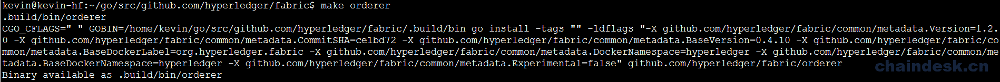
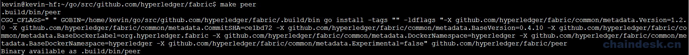
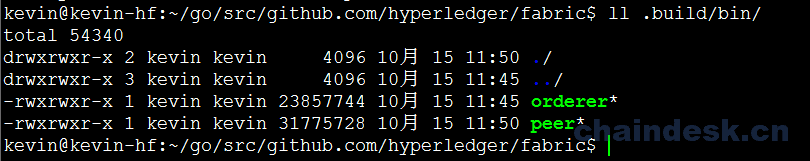
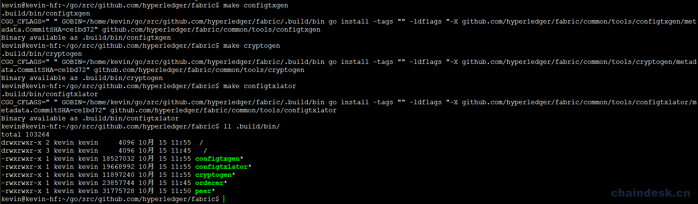
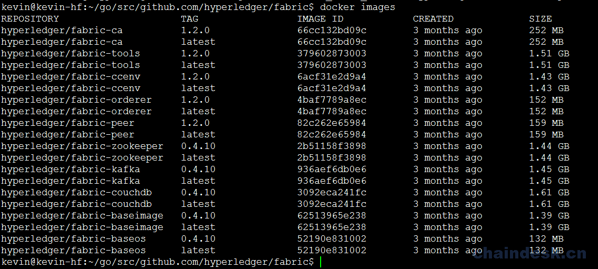
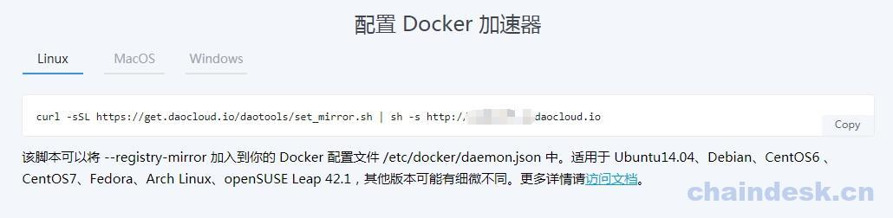

# 1.3 工欲善其事，必先利其器：安装 Fabric

## 目标

1.  顺利下载 Hyperledger Fabric
2.  明确 bootstrap.sh 脚本做了哪些事

## 任务实现

> 年青人，关键时刻到了，这门神功必须要有大毅力且拥有常人所不具备的耐性的人才能练成，所以这一步就是为了考验你的毅力及耐性而设置的。
> 
> 要想学好神功，必须先有相应的利器，而这把利器就只能由自己根据那些妖孽留下的线索来锻造。

### 1.3.1 下载 Fabric-samples 与二进制文件

为了方便后期管理，在当前登录用户的 HOME 目录下创建一个空目录并进入该目录

```go
$ mkdir hyfa && cd hyfa
```

**新建文件 bootstrap.sh 并添加内容**

```go
$ vim bootstrap.sh
```

将 `https://github.com/hyperledger/fabric/blob/master/scripts/bootstrap.sh` 中的内容拷贝保存退出。

该 `bootstrap.sh` 可执行脚本文件的作用：

1.  如果在当前目录中没有 `hyperledger/fabric-samples`，则从 `github.com` 克隆 `hyperledger/fabric-samples` 存储库
2.  使用 `checkout` 签出对应指定的版本标签
3.  将指定版本的 Hyperledger Fabric 平台特定的二进制文件和配置文件安装到 `fabric-samples` 存储库的根目录中
4.  下载指定版本的 `Hyperledger Fabric docker` 镜像文件
5.  将下载的 docker 镜像文件标记为 "latest"

**赋予 bootstrap.sh 可执行权限并运行**

```go
$ chmod +x bootstrap.sh
```

**执行`bootstrap.sh`**

```go
$ sudo ./bootstrap.sh 1.2.0
```

> 确定网络稳定，否则会导致各种问题，例如下载到一半时网络超时，下载失败等等；由于 Docker 的各种镜像文件下载时间较长，所以请耐心等待。

下载完成后，查看相关输出内容；如果下载有失败的镜像, 可再次执行 `$ sudo ./bootstrap.sh 1.2.0` 命令重新下载。

> 重新执行脚本命令对于已下载的 Docker 镜像文件不会再次重新下载。

安装完成后终端自动输出：

```go
===> List out hyperledger docker images
hyperledger/fabric-ca          1.2.0       66cc132bd09c    4 weeks ago     252 MB
hyperledger/fabric-ca          latest      66cc132bd09c    4 weeks ago     252 MB
hyperledger/fabric-tools       1.2.0       379602873003    4 weeks ago     1.51 GB
hyperledger/fabric-tools       latest      379602873003    4 weeks ago     1.51 GB
hyperledger/fabric-ccenv       1.2.0       6acf31e2d9a4    4 weeks ago     1.43 GB
hyperledger/fabric-ccenv       latest      6acf31e2d9a4    4 weeks ago     1.43 GB
hyperledger/fabric-orderer     1.2.0       4baf7789a8ec    4 weeks ago     152 MB
hyperledger/fabric-orderer     latest      4baf7789a8ec    4 weeks ago     152 MB
hyperledger/fabric-peer        1.2.0       82c262e65984    4 weeks ago     159 MB
hyperledger/fabric-peer        latest      82c262e65984    4 weeks ago     159 MB
hyperledger/fabric-zookeeper   0.4.10      2b51158f3898    5 weeks ago     1.44 GB
hyperledger/fabric-zookeeper   latest      2b51158f3898    5 weeks ago     1.44 GB
hyperledger/fabric-kafka       0.4.10      936aef6db0e6    5 weeks ago     1.45 GB
hyperledger/fabric-kafka       latest      936aef6db0e6    5 weeks ago     1.45 GB
hyperledger/fabric-couchdb     0.4.10      3092eca241fc    5 weeks ago     1.61 GB
hyperledger/fabric-couchdb     latest      3092eca241fc    5 weeks ago     1.61 GB
```

**添加环境变量（可选执行命令）**

```go
$ export PATH=<path to download location>/bin:$PATH
```

> <path to="" download="" location="">表示 `fabric-samples` 文件目录所在路径</path>

```go
例:  $ export PATH=$HOME/hyfa/fabric-samples/bin:$PATH
```

### 1.3.2 Fabric 源码方式编译

上一小节中，我们以提供脚本的方式，可以下载并安装 samples 和二进制文件到操作系统中，大大简化的安装过程。

Hyperledger Fabric 还有另外的一种安装方式，就是以源代码的方式进行本地编译安装，此方式相较上一小节的方式，略微复杂，需要手动编译生成相应的工具，我们在此给大家逐一介绍

#### 下载源码

首先，使用 `mkdir` 命令创建相应的目录，然后使用 `git clone` 命令将 `Hyperledger Fabric` 源代码克隆至该目录中：

```go
$ mkdir -p $GOPATH/src/github.com/hyperledger/
$ cd $GOPATH/src/github.com/hyperledger/
$ git clone https://github.com/hyperledger/fabric.git
```

> 提示：也可以使用 `go get` 命令下载源码，需要手动创建相应的目录：
> 
> ```go
> $ go get github.com/hyperledger/fabric
> ```
> 
> 注：下载时间可能需要几分钟，也可能需要十几分钟，取决于当前的网络环境，请耐心等待。

然后使用 `git checkout` 命令切换至指定的分支：

```go
$ cd $GOPATH/src/github.com/hyperledger/fabric/
$ git checkout -b v1.2.0 
```

源码下载完成之后，并不能直接使用，我们需要对其进行编译，生成所需要的各种节点及相应的工具。我们直接使用源码中提供的 `Makefile` 来进行编译，首先对 `Makefile` 文件进行编辑，指定相应的版本：

```go
$ vim Makefile 
```

将文件中 `BASE_VERSION、PREV_VERSION、CHAINTOOL_RELEASE、BASEIMAGE_RELEASE` 的值进行修改，修改之后的内容为：

```go
BASE_VERSION = 1.2.1
PREV_VERSION = 1.2.0
CHAINTOOL_RELEASE=1.1.1
BASEIMAGE_RELEASE=0.4.10
```

#### 编译 Orderer

```go
$ cd $GOPATH/src/github.com/hyperledger/fabric/
$ make orderer
```

命令执行后终端输出如下：



#### 编译 Peer

```go
$ make peer
```



查看 `.build/bin` 目录

```go
$ ll .build/bin/
```



### 编译生成相关工具

`Hyperledger Fabric` 除了 `Orderer` 和 `Peer` 之外，还为我们提供了在搭建网络环境时所需要的一系列辅助工具：

*   **configtxgen：**生成初始区块及通道交易配置文件的工具
*   **cryptogen：**生成组织结构及相应的的身份文件的工具
*   **configtxlator：**将指定的文件在二进制格式与 JSON 格式之间进行转换

编译生成这些工具同样使用 `make` 即可：

```go
$ make configtxgen 
$ make cryptogen 
$ make configtxlator 
```



#### 编译生成 docker 镜像

将当前用户添加到 docker 组

```go
$ sudo usermod -aG docker kevin
```

添加成功后注销或重启系统。

安装依赖的 `libltdl-dev` 库：

```go
$ sudo apt-get install libltdl-dev
```

**获取镜像方式一：**

编译生成 docker 镜像需要使用到 Go 的工具，所以我们需要通过 `git clone` 命令从 `github.com` 克隆至当前系统中：

```go
$ mkdir -p $GOPATH/src/golang.org/x
$ cd $GOPATH/src/golang.org/x
$ git clone https://github.com/golang/tools.git
```

执行命令后将指定的环境变量设置到用户的环境文件中(.bashrc)中

```go
$ vim ~/.bashrc

export PATH=$PATH:$GOPATH/bin
```

执行 `source` 命令：

```go
$ source ~/.bashrc
```

Fabric 代码由 Golang 构建，所以需要安装 Go 相关的工具，以方便开发和调试：

```go
$ mkdir -p $GOPATH/src/golang.org/x
$ cd $GOPATH/src/golang.org/x
$ git clone https://github.com/golang/net.git
$ git clone https://github.com/golang/tools.git

$ cd $GOPATH
$ go get github.com/kardianos/govendor
$ go get github.com/onsi/ginkgo/ginkgo
$ go get github.com/golang/protobuf/protoc-gen-go
$ go get -u github.com/axw/gocov/...
$ go get -u github.com/AlekSi/gocov-xml
$ go get -u github.com/client9/misspell/cmd/misspell
$ go get -u golang.org/x/tools/cmd/goimports
$ go get -u github.com/golang/lint/golint
```

将之前安装的 Go 工具复制到 Fabric 目录：

```go
$ cd $GOPATH/src/github.com/hyperledger/fabric/
$ mkdir -p .build/docker/gotools/bin
$ cp ~/go/bin/* .build/docker/gotools/bin
```

使用 `make docker` 编译生成相关的 `docker` 镜像：

```go
$ cd $GOPATH/src/github.com/hyperledger/fabric/
$ make docker
```

**获取镜像方式二：**

可以直接从 Dockerhub 拉取镜像，使用 `docker pull` 命令拉取指定的 docker 镜像

```go
$ export FABRIC_TAG=1.2.0
$ export CA_TAG=1.2.0
$ export THIRDPARTY_IMAGE_VERSION=0.4.10

$ docker pull hyperledger/fabric-peer:$FABRIC_TAG \
&& docker pull hyperledger/fabric-orderer:$FABRIC_TAG \
&& docker pull hyperledger/fabric-ca:$CA_TAG \
&& docker pull hyperledger/fabric-tools:$FABRIC_TAG \
&& docker pull hyperledger/fabric-ccenv:$FABRIC_TAG \
&& docker pull hyperledger/fabric-baseimage:$THIRDPARTY_IMAGE_VERSION \
&& docker pull hyperledger/fabric-baseos:$THIRDPARTY_IMAGE_VERSION \
&& docker pull hyperledger/fabric-couchdb:$THIRDPARTY_IMAGE_VERSION \
&& docker pull hyperledger/fabric-kafka:$THIRDPARTY_IMAGE_VERSION \
&& docker pull hyperledger/fabric-zookeeper:$THIRDPARTY_IMAGE_VERSION
```

将已下载的镜像标记为最新

```go
$ docker tag hyperledger/fabric-peer:$FABRIC_TAG hyperledger/fabric-peer \
&& docker tag hyperledger/fabric-orderer:$FABRIC_TAG hyperledger/fabric-orderer \
&& docker tag hyperledger/fabric-ca:$CA_TAG hyperledger/fabric-ca \
&& docker tag hyperledger/fabric-tools:$FABRIC_TAG hyperledger/fabric-tools \
&& docker tag hyperledger/fabric-ccenv:$FABRIC_TAG hyperledger/fabric-ccenv \
&& docker tag hyperledger/fabric-baseimage:$THIRDPARTY_IMAGE_VERSION hyperledger/fabric-baseimage \
&& docker tag hyperledger/fabric-baseos:$THIRDPARTY_IMAGE_VERSION hyperledger/fabric-baseos \
&& docker tag hyperledger/fabric-couchdb:$THIRDPARTY_IMAGE_VERSION hyperledger/fabric-couchdb \
&& docker tag hyperledger/fabric-kafka:$THIRDPARTY_IMAGE_VERSION hyperledger/fabric-kafka \
&& docker tag hyperledger/fabric-zookeeper:$THIRDPARTY_IMAGE_VERSION hyperledger/fabric-zookeeper
```

之后使用 `docker images` 命令查看相关的镜像信息：

```go
$ docker images
```



> Hyperledger Fabric 可以有两种方式进行编译安装，第一种方式（bootstrap.sh 脚本方式）进行环境的安装，优点是简单、方便，能够快速上手；第二种方式以 Fabric 源码方式进行编译，适合动手能力较强的人员，优点是可以对 Hyperledger Fabric 相关组件有深入的理解，但缺点是容易出现各种错误且修正比较麻烦。
> 
> 注：本书的 Hyperledger Fabric 环境为方便起见，所以采用第一种方式（bootstrap.sh 脚本方式）进行的安装构建。

## FAQ

1.  **bootstrap.sh 脚本中的内容是干什么用的？**

    脚本执行后将下载并提取设置网络所需的所有特定于平台的二进制文件，并保存在本地仓库中，

    然后将 Docker Hub 中的 Hyperledger Fabric docker 镜像下载到本地 Docker 注册表中，并将其标记为”最新”。

2.  **下载 Docker 镜像文件速度特别慢，有什么好的解决方式？**

    可在 `https://www.daocloud.io/` 网站中注册一个账号, 注册成功后， 可以点击加速器图标（如下图所示）以获取 Docker 加速器。

    

    **配置 Docker 加速器**

    在命令提示符中输入如下图所示的 daocloud.io 分配的加速器脚本命令（将输入框中的脚本命令复制到命令提示符窗口中执行即可）， 执行完脚本之后， 不要忘记重启 Docker 服务

    

    **重启 Docker 服务**

    执行完该命令后，必须重启 Docker 服务以生效

    ```go
    $ sudo systemctl restart docker.service
    ```

3.  **下载完成后，添加的环境变量有什么意义？**

    执行该命令后，意义为在系统中任何路径下使用 Fabric 相关的命令都可以让系统能够找到该命令并且顺利执行。后期我们会进入到 Fabric 目录中执行相应的命令，所以该环境变量也可以不添加。