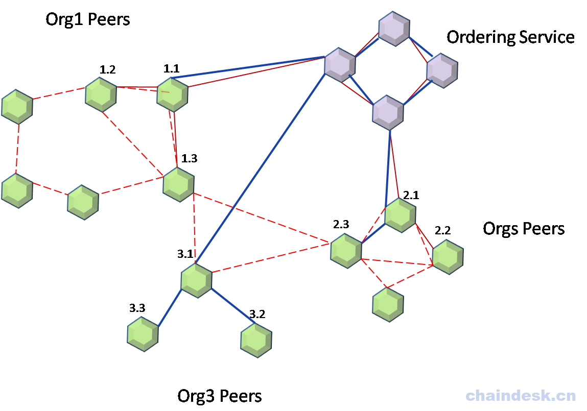
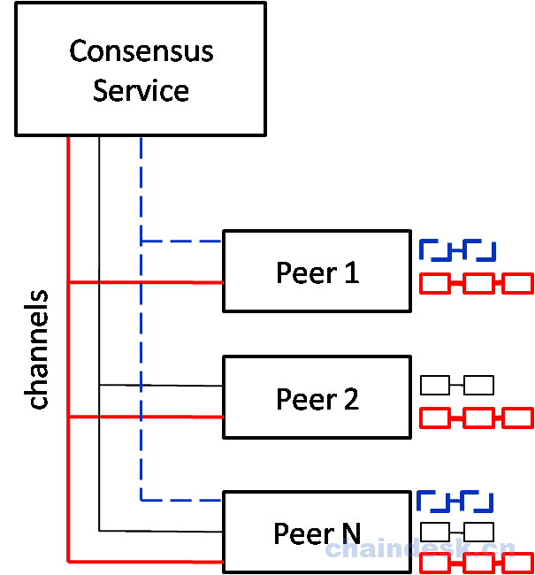

# 7.3 多链及多通道实现

## 目标

1.  Hyperledger Fabric 多链&多通道
2.  多链&&多通道的实现

## 任务实现

### 7.3.1 多链及多通道

在 Hyperledger Fabric 0.6 版本中，所有节点都属于同一个链中，由此产生了数据处理、存储及访问安全的问题。在后期的 Hyperledger Fabric 1.0 版本中，新增加了对多链实现。

**链**是由一个通道 + 一个共享账本 + N 个 peer 节点组成；不同的链将参与者和数据（包含 chaincode）进行隔离；在由多个 Peer 节点组成的网络中，不同的 Peer 节点加入到不同的应用通道中，便产生了多个不同的链。真正实现了对数据的隔离。

加入到同一个应用通道中的 Peer 节点共同维护相同的区块数据，与加入其它应用通道的 Peer 节点相互隔离，也就意味着不能访问其它应用通道中 Peer 节点的数据，有效保护了隐私数据，并且提高了对数据的并行处理效率及对数据存储空间的利用。

#### 7.3.1.1 多链环境

现在假设我们有一个 Hyperledger Fabric 网络环境，该网络中包含由 4 个 Orderer 节点组成的一个 Ordering Service 集群，三个 Org 组织；其中 Org1 Peers 中包含 6 个 Peer 节点；Org2 组织中包含 4 个 Peer 节点；Org3 组织中包含 3 个 Peer 节点。



如上面的多链示意图所示：

Chain1：由 Org1、Org2 两个组织中的 1.1，1.2，2.1，2.2 四个 Peer 节点组成。

Chain2：同 Org1、Org2 、Org3 三个组织中的 1.1，1.3，2.1，2.3，3.1，3.2，3.3 七个 Peer 节点组成。

Anchors：由 1.3，2.3，3.1 三个不同组织的 Peer 节点代表。

Leaders：由 1.1，2.1，3.1 三个不同组织的 Peer 节点代表 。

#### 7.3.1.2 多通道环境



如上图所示：网络中有三个通道，分别由红色、蓝色、黑色三种颜色代表；多个 Peer 节点加入不同的应用通道中形成多个账本。

*   Peer 1，Peer 2 和 Peer N 加入到红色通道，并共同维护红色账本;
*   Peer 1 和 Peer N 加入到蓝色通道，并共同维护蓝色账本;
*   Peer 2 和 Peer N 加入到黑色通道上并共同维护黑色账本。

### 7.3.2 应用多通道

如果当前网络开发测试模式，请先关闭：

```go
$ cd ~/hyfa/fabric-samples/chaincode-docker-devmode

$ sudo docker-compose -f docker-compose-simple.yaml down 
```

然后进入 `fabric-samples/first-network` 目录中：

```go
$ cd ../first-network 
```

#### 7.3.2.1 创建一个应用通道的配置交易

由在要对一个网络进行分割，所以为了区分不同的“子网”，我们需要给不同的“子网”指定一个标识名称，所以请务必设置$CHANNEL_NAME 环境变量为一个与之前通道名称完全不相同的值（代表新创建的另外一个应用通道名称）。

```go
$ export CHANNEL_NAME=mychannel2 
```

指定使用 `configtx.yaml` 配置文件中的 `TwoOrgsChannel` 模板, 来生成新建通道的配置交易文件,

```go
$ sudo ../bin/configtxgen -profile TwoOrgsChannel -outputCreateChannelTx ./channel-artifacts/channel2.tx -channelID $CHANNEL_NAME 
```

输出如下

```go
[common/tools/configtxgen] main -> INFO 001 Loading configuration
[common/tools/configtxgen] doOutputChannelCreateTx -> INFO 002 Generating new channel configtx
[common/tools/configtxgen/encoder] NewApplicationGroup -> WARN 003 Default policy emission is deprecated, please include policy specificiations for the application group in configtx.yaml
[msp] getMspConfig -> INFO 004 Loading NodeOUs
[common/tools/configtxgen/encoder] NewApplicationOrgGroup -> WARN 005 Default policy emission is deprecated, please include policy specificiations for the application org group Org1MSP in configtx.yaml
[msp] getMspConfig -> INFO 006 Loading NodeOUs
[common/tools/configtxgen/encoder] NewApplicationOrgGroup -> WARN 007 Default policy emission is deprecated, please include policy specificiations for the application org group Org2MSP in configtx.yaml
[common/tools/configtxgen] doOutputChannelCreateTx -> INFO 008 Writing new channel tx 
```

#### 7.3.2.2 生成锚节点配置更新文件

锚节点配置更新文件用来对组织的锚节点进行配置

同样基于 `configtx.yaml` 配置文件生成新建通道文件, 每个组织都需要分别生成且注意指定对应的组织名称

```go
$ sudo ../bin/configtxgen -profile TwoOrgsChannel -outputAnchorPeersUpdate ./channel-artifacts/Org1MSPanchors2.tx -channelID $CHANNEL_NAME -asOrg Org1MSP

$ sudo ../bin/configtxgen -profile TwoOrgsChannel -outputAnchorPeersUpdate ./channel-artifacts/Org2MSPanchors2.tx -channelID $CHANNEL_NAME -asOrg Org2MSP 
```

执行完毕后查看 `channel-artifacts` 目录内容：

```go
total 48
drwxr-xr-x 2 root root  4096 8 月  28 16:29 ./
drwxr-xr-x 7 root root  4096 8 月  28 10:41 ../
-rw-r--r-- 1 root root   348 8 月  28 16:27 channel2.tx
-rw-r--r-- 1 root root   346 8 月  28 10:41 channel.tx
-rw-r--r-- 1 root root 12639 8 月  28 10:41 genesis.block
-rw-r--r-- 1 root root     0 8 月   7 10:12 .gitkeep
-rw-r--r-- 1 root root   286 8 月  28 16:28 Org1MSPanchors2.tx
-rw-r--r-- 1 root root   284 8 月  28 10:41 Org1MSPanchors.tx
-rw-r--r-- 1 root root   286 8 月  28 16:29 Org2MSPanchors2.tx
-rw-r--r-- 1 root root   284 8 月  28 10:41 Org2MSPanchors.tx 
```

如上输出内容所示，在 `channel-artifacts` 目录中新增了 `channel2.tx、Org1MSPanchors2.tx、Org2MSPanchors2.tx` 三个配置文件。

#### 7.3.2.3 启动网络

```go
$ sudo docker-compose -f docker-compose-cli.yaml up -d 
```

命令执行后输出如下：

```go
Creating network "net_byfn" with the default driver
Creating orderer.example.com
Creating peer1.org2.example.com
Creating peer0.org2.example.com
Creating peer1.org1.example.com
Creating peer0.org1.example.com
Creating cli 
```

#### 7.3.2.4 创建通道

**进入 Docker 容器**

```go
$ sudo docker exec -it cli bash 
```

检查环境变量是否正确设置

```go
# echo $CHANNEL_NAME 
```

**设置环境变量**

```go
# export CHANNEL_NAME=mychannel2 
```

> 注意：此处设置的应用通道名称环境变量必须与创建应用通道时指定的环境变量名称一致。

**创建通道**

```go
# peer channel create -o orderer.example.com:7050 -c $CHANNEL_NAME -f ./channel-artifacts/channel2.tx --tls --cafile /opt/gopath/src/github.com/hyperledger/fabric/peer/crypto/ordererOrganizations/example.com/orderers/orderer.example.com/msp/tlscacerts/tlsca.example.com-cert.pem 
```

命令执行后输出如下：

```go
[channelCmd] InitCmdFactory -> INFO 001 Endorser and orderer connections initialized
[cli/common] readBlock -> INFO 002 Received block: 0 
```

#### 7.3.2.5 加入通道

应用通道所包含组织的成员节点可以加入通道中

```go
# peer channel join -b mychannel2.block -o orderer:7050 
```

命令执行后输出如下：

```go
[channelCmd] InitCmdFactory -> INFO 001 Endorser and orderer connections initialized
[channelCmd] executeJoin -> INFO 002 Successfully submitted proposal to join channel 
```

#### 7.3.2.6 更新锚点

使用 Org1 的管理员身份更新锚节点配置

```go
# peer channel update -o orderer.example.com:7050 -c $CHANNEL_NAME -f ./channel-artifacts/Org1MSPanchors2.tx --tls --cafile /opt/gopath/src/github.com/hyperledger/fabric/peer/crypto/ordererOrganizations/example.com/orderers/orderer.example.com/msp/tlscacerts/tlsca.example.com-cert.pem 
```

使用 Org2 的管理员身份更新锚节点配置

```go
# CORE_PEER_MSPCONFIGPATH=/opt/gopath/src/github.com/hyperledger/fabric/peer/crypto/peerOrganizations/org2.example.com/users/Admin@org2.example.com/msp 
# CORE_PEER_ADDRESS=peer0.org2.example.com:7051 
# CORE_PEER_LOCALMSPID="Org2MSP" 
# CORE_PEER_TLS_ROOTCERT_FILE=/opt/gopath/src/github.com/hyperledger/fabric/peer/crypto/peerOrganizations/org2.example.com/peers/peer0.org2.example.com/tls/ca.crt 
# peer channel update -o orderer.example.com:7050 -c $CHANNEL_NAME -f ./channel-artifacts/Org2MSPanchors2.tx --tls --cafile /opt/gopath/src/github.com/hyperledger/fabric/peer/crypto/ordererOrganizations/example.com/orderers/orderer.example.com/msp/tlscacerts/tlsca.example.com-cert.pem 
```

#### 7.3.2.7 列出所加入的通道

```go
# peer channel list 
```

list 命令会列出指定的 Peer 节点已经加入的所有应用通道的列表.

输出当前节点已加入的应用通道信息如下：

```go
[channelCmd] InitCmdFactory -> INFO 001 Endorser and orderer connections initialized
Channels peers has joined: 
mychannel
mychannel2 
```

从如上终端输出中可以看到，当前 peer 节点加入了两个不同的应用通道，分别为 `mychannel、mychannel2`。从而实现当前 peer 节点会维护两个账本。

## FAQ

1.  是一个通道对应一个账本吗？

    对，一个通道中所包含的所有 Peer 节点共同维护同一个账本。

2.  多个不同的链码会对应一个账本吗？

    简单的说，一个链码也同样对应一个账本。

3.  多通道一般应用在什么场景之下？

    考虑多个不同行业、不同组织、数据隐私的不同访问策略等等的情况下应用多通道及多链。

4.  一个 Peer 节点对应一个账本吗？

    不一定，这需要考虑此 Peer 节点加入了几个应用通道，部署了几个链码等等这些情况。