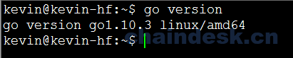

# 10.1 项目引言

## 目标

1.  明确项目的所需环境及实现目的
2.  构建基于 Fabric-SDK-Go 项目的所需环境

## 任务实现

## 10.1.1 引言

此项目是一个使用 `Hyperledger Fabric` 平台作为网络环境底层，在业务层利用 fabric-sdk-go 相关 API 实现对链码的调用，并且使用 GoWeb 实现的一个 Web 应用示例程序。为了提高应用程序的可扩展性及可维护性，我们使用了基于 `MVC` 的架构模式，对项目进行分层设计。

此应用示例是为了帮助读者能够快速掌握基于 `fabric-sdk-go` 的开发方式与技巧，所以我们的链码业务只是简单的实现了对分类账本状态的读写操作。

### 10.1.1.1 说明

在之前的内容中，我们详细的介绍了 `Hyperledger Fabric` 的系统架构及相关的组件。包括 Fabric 网络环境搭建，链码开发及测试及分布式账本数据的存储方式。所以我们不会在此项目详细解释 Hyperledger Fabric 的工作原理。在学习本项目之前，您应该通过要本书的前几章或通过 Hyperledger Fabric [官网](https://hyperledger-fabric.readthedocs.io/en/release-1.2/whatis.html) 或其它渠道学习并掌握 Hyperledger Fabric 的一些知识，以具备 Hyperledger Fabric 操作基础。

本应用实现是在基于 **Ubuntu 16.04（推荐）** 系统的基础上完成的，但 Hyperledger Fabric 与 Mac OS X、Windows 和其他 Linux 发行版相兼容。

### 10.1.1.2 所需环境及工具

现在我们重新安装一个干净的 **Ubuntu 16.04** 操作系统（如果之前有备份，直接恢复为系统刚安装时的状态即可），实现从零到壹的 Hyperledger Fabric 网络环境搭建、SDK-Go 的应用、链码开发及最后的 Web 应用体验。

*   **Ubuntu 16.04**
*   **vim、git**
*   **docker 17.03.0-ce+**
*   **docker-compose 1.8**+
*   **Golang 1.10.x+**

## 10.1.2 先决条件

如下环境及工具如果在系统没有安装，请按照步骤进行安装，如果系统中已成功安装且符合相应的版本要求，则无须重复执行。如果已安装版本低于指定要求的版本，请报载之后重新安装符合要求的版本。

### 10.1.2.1 安装 vim、git

```go
$ sudo apt install vim
$ sudo apt install git 
```

### 10.1.2.2 安装 docker

**需要 Docker 版本 17.03.0-ce 或更高版本。**

```go
$ docker version 
$ sudo apt install docker.io 
```

安装完成后执行版本查询命令

```go
$ sudo docker version 
```


### 10.1.2.3 安装 docker-compose

**docker-compose 1.8 或更高版本是必需的。**

我们目前无法一次性轻松管理多个容器。 为了解决这个问题，需要**docker-compose** 。

```go
$ docker-compose version 
$ sudo apt install docker-compose 
```

安装完成后查询：

```go
$ docker-compose version 
```


将当前用户添加到 docker 组

```go
$ sudo usermod -aG docker kevin 
```

添加成功后**必须注销/退出并重新登录**(退出终端重新连接即可)

> 如果没有将当前用户添加到 docker 组中，在后期执行 make 命令时会造成错误: `ERROR: Couldn't connect to Docker daemon at http+docker://localunixsocket - is it running?`

### 10.1.2.4 安装 Golang

**需要版本 1.10.x 或更高。**如果您使用的是 Hyperledger Fabric 1.1.x 版本，那么 Golang 版本在 1.9.x 以上

```go
 $ go version 
 $ wget https://dl.google.com/go/go1.10.3.linux-amd64.tar.gz 
```

> 下载受网络环境影响，如果您本地有相应的 tar 包，则直接解压到指定的路径下即可。

使用 tar 命令将下载后的压缩包文件解压到指定的 /usr/local/ 路径下

```go
$ sudo tar -zxvf go1.10.3.linux-amd64.tar.gz -C /usr/local/ 
```

设置 GOPATH & GOROOT 环境变量, 通过 `go env` 查看 GOPATH 路径

```go
$ sudo vim /etc/profile 
```

> 如果只想让当前登录用户使用 Golang， 其它用户不能使用， 则编辑当前用户$HOME 目录下的 .bashrc 或 .profile 文件， 在该文件中添加相应的环境变量即可。

在 profile 文件最后添加如下内容:

```go
export GOPATH=$HOME/go
export GOROOT=/usr/local/go
export PATH=$GOROOT/bin:$PATH 
```

使用 source 命令，使刚刚添加的配置信息生效：

```go
$ source /etc/profile 
```

通过 go version 命令验证是否成功：

```go
$ go version 
```

