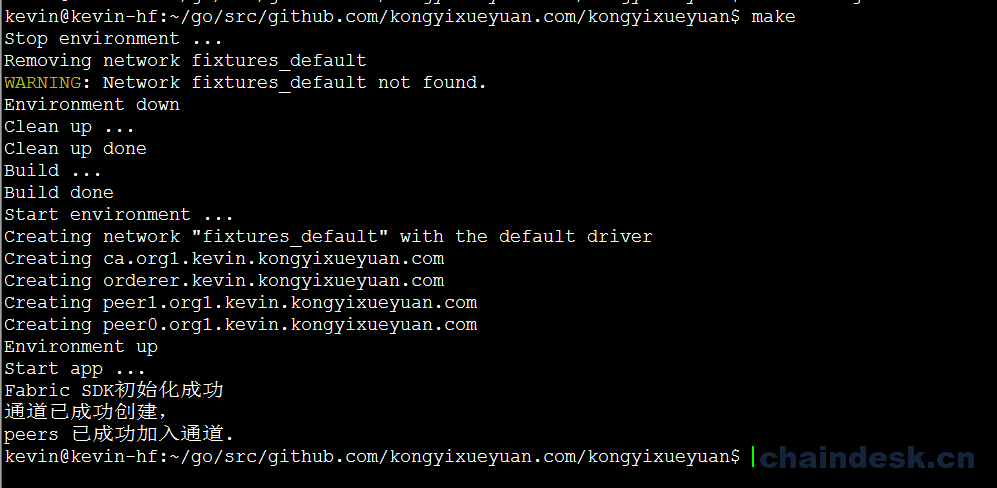

# 十一、.2 满足依赖

## 目标

1.  根据项目要求满足所需依赖
2.  使用 Makefiel 简化项目测试

## 任务实现

### 11.2.1 安装 dep 工具

在运行应用程序之前，需要将 Go 源代码时行编译，但在开始编译之前，我们需要使用一个 `vendor` 目录来包含应用中所需的所有的依赖关系。 在我们的 GOPATH 中，我们有 Fabric SDK Go 和其他项目。 在尝试编译应用程序时，Golang 会在 GOPATH 中搜索依赖项，但首先会检查项目中是否存在`vendor` 文件夹。 如果项目中包含一个叫 vendor 的目录，Golang 将会从这个目录搜索依赖的包，就不会去检查 GOPATH 或 GOROOT。

Golang 官方最初只提供了包管理的 `go get` 工具，它将下载的第三方包放到 GOPATH 的 src 目录下。但是项目一般由许多来源不同的第三包构成，所以在 Golang1.5 版本增加了一个新的发现包的方法，通过使用像[`dep`](https://translate.googleusercontent.com/translate_c?depth=1&hl=zh-CN&rurl=translate.google.com&sl=en&sp=nmt4&tl=zh-CN&u=https://github.com/golang/dep&xid=25657,15700002,15700019,15700124,15700149,15700168,15700186,15700201&usg=ALkJrhgelyRl7D3pIJRpuA8cynagkWYHXg)这样的工具在`vendor`目录中来处理这些依赖关系。

将如下环境变量设置到用户的环境文件中(.bashrc)中

```go
$ vim ~/.bashrc

export PATH=$PATH:$GOPATH/bin 
```

执行 `source` 命令

```go
$ source ~/.bashrc 
```

在 Golang 的新版本中没有自动加入 `dep` 工具，所以需要开发人员自行安装该工具。

安装 dep 工具

```go
$ go get -u github.com/golang/dep/cmd/dep 
```

### 11.2.2 下载所需依赖

`dep` 工具安装好之后我们来安装应用所需要的依赖

使用 `dep` 命令需要一个名为 `Gopkg.toml` 的配置文件指定依赖信息

创建一个名为`Gopkg.toml`的文件并编辑：

```go
$ vim Gopkg.toml 
```

`Gopkg.toml`文件中添加如下内容：

```go
ignored = ["github.com/kongyixueyuan.com/kongyixueyuan/chaincode"]

[[constraint]]
  # Release v1.0.0-alpha4
  name = "github.com/hyperledger/fabric-sdk-go"
  revision = "a906355f73d060d7bf95874a9e90dc17589edbb3" 
```

使用`dep`限制在 vendor 中指定希望 SDK 的特定版本。

保存该文件，然后执行 `dep ensure` 命令，该命令会自动将项目所需的依赖下载至当前的 `vendor` 目录中（下载依赖可能需要一段时间）：

```go
$ dep ensure 
```

> 提醒：`dep ensure` 命令执行由于时间比较长，所以执行一次后即可，在后面的 Makefile 中可注释`@dep ensure`命令。

### 11.2.3 测试 Fabric-SDK

所在依赖下载安装完成后，我们就可以进行测试

首先启动网络：

```go
$ cd fixtures
$ docker-compose up -d 
```

然后编译并运行：

```go
$ cd ..
$ go build
$ ./kongyixueyuan 
```

命令执行后输出结果如下图所示：



如果出现上图的输出结果，则说明执行成功，否则需要根据出现的错误提示进行相应的处理。

### 11.2.4 关闭网络并清理环境

测试成功之后即可以关闭 Hypledger Fabric 网络，但是我们在 Fabric-SDK 的配置文件 config.yaml 中指定了生成的密钥、证书的存储路径，关闭网络之后需要将其进行清理。

1）首先关闭处于启动状态的网络环境：

```go
$ cd $GOPATH/src/github.com/kongyixueyuan.com/kongyixueyuan/fixtures 
$ docker-compose down 
```

2）然后删除证书存储（由 config.yaml 配置文件中的 client.credentialStore 定义）：

```go
$ rm -rf /tmp/kongyixueyuan-* 
```

3）最后删除一些不是由 docker-compose 命令生成的 docker 容器和 docker 镜像：

```go
$ docker rm -f -v `docker ps -a --no-trunc | grep "kongyixueyuan" | cut -d ' ' -f 1` 2>/dev/null
$ docker rmi `docker images --no-trunc | grep "kongyixueyuan" | cut -d ' ' -f 1` 2>/dev/null 
```

### 11.2.5 利用 Makefile 简化步骤

由上面的步骤大家可以看出，启动网络及关闭并清理环境需要执行很多的命令（如进入目录、启动网络、构建、关闭网络、清理环境等等），为了方便测试，用一种方式来简化每次操作时的步骤，我们可以使用一个名为 make 的工具来实现，该工具的命令可以在一个步骤中自动完成所有的操作执行任务。具体实现方式如下：

创建一个 Makefile 文件。 首先，确保你的系统中已经安装了 make 工具。使用如下命令检测是否已安装 make 工具：

```go
$ make --version 
```

> 如果没有 `make` 工具（Ubuntu），则需要先安装 `make` ：
> 
> ```go
> $ sudo apt install make 
> ```

然后进入到项目的根目录下并创建一个名为 `Makefile` 的文件进行编辑：

```go
$ cd $GOPATH/src/github.com/kongyixueyuan.com/kongyixueyuan
$ vim Makefile 
```

在创建的 `Makefile` 文件中添加如下内容：

```go
.PHONY: all dev clean build env-up env-down run

all: clean build env-up run

dev: build run

##### BUILD
build:
    @echo "Build ..."
    @dep ensure
    @go build
    @echo "Build done"

##### ENV
env-up:
    @echo "Start environment ..."
    @cd fixtures && docker-compose up --force-recreate -d
    @echo "Environment up"

env-down:
    @echo "Stop environment ..."
    @cd fixtures && docker-compose down
    @echo "Environment down"

##### RUN
run:
    @echo "Start app ..."
    @./kongyixueyuan

##### CLEAN
clean: env-down
    @echo "Clean up ..."
    @rm -rf /tmp/kongyixueyuan-* kongyixueyuan
    @docker rm -f -v `docker ps -a --no-trunc | grep "kongyixueyuan" | cut -d ' ' -f 1` 2>/dev/null || true
    @docker rmi `docker images --no-trunc | grep "kongyixueyuan" | cut -d ' ' -f 1` 2>/dev/null || true
    @echo "Clean up done" 
```

定义的 Makefile 文件可以执行完成如下步骤的任务：

1）使用 make clean 命令将关闭并清理 Hyperledger Fabric 整个网络环境；

2）使用 make build 命令将编译 Golang 应用程序；

3）使用 make env-up 命令将启动 Hyperledger Fabric 网络环境；

4）使用 make clean 命令将启动应用程序并运行。

如果想直接启动项目，则可以使用 make 命令。该 make 命令执行顺序如上面的步骤所示。

## FAQ

1.  Gopkg.toml 到底是一个什么文件？

    Gopkg.toml 文件是 dep 工具的文件，它包含了 dep 的几种类型限制规则，详情请参见：

    [`github.com/golang/dep/blob/master/docs/Gopkg.toml.md`](https://github.com/golang/dep/blob/master/docs/Gopkg.toml.md)

2.  Makefile 文件起什么作用？

    有的项目/系统在编写好源代码之后，编译、启动之前需要做大量的前期工作，而这些工作如果使用手动方式来实现，效率非常低下，这时就可以考虑使用 Linux 操作系统中的 make 命令来实现，只需要将其内容写在一个名为 Mackfile 的文件中，就可以实现自动化操作，提高开发及测试效率。Makefile 可以看作是一个 Shell 脚本，主要用于指定整个项目的编译、启动规则（顺序），在编译之前先做什么事情，编译之后启动之前做什么。