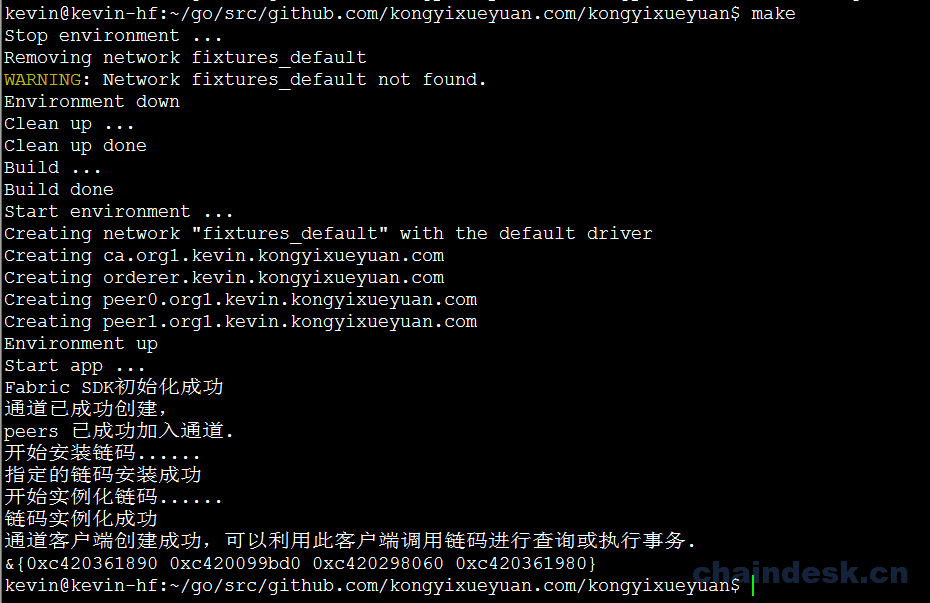

# 十一、.4 使用 Fabric－SDK 实现链码的自动部署

## 目标

1.  使用 SDK 相关的 API 实现对链码的安装及实例化
2.  通过测试

## 任务实现

## 11.4 链码安装及实例化

### 11.4.1 编辑结构体

新建一个结构体，声明在 `sdkInit/fabricInitInfo.go` 文件中

```go
$ vim sdkInit/fabricInitInfo.go 
```

`fabricInitInfo.go` 文件完整内容如下：

```go
/**
  author: hanxiaodong
  QQ 群（专业 Fabric 交流群）：862733552
 */
package sdkInit

import (
    "github.com/hyperledger/fabric-sdk-go/pkg/client/resmgmt"
)

type InitInfo struct {
    ChannelID     string
    ChannelConfig string
    OrgAdmin      string
    OrgName       string
    OrdererOrgName    string
    OrgResMgmt *resmgmt.Client

    ChaincodeID    string
    ChaincodeGoPath    string
    ChaincodePath    string
    UserName    string
} 
```

可以从上面的源代码中看到，在这个结构体中，我们新增加了与链码相关的如下成员：

*   **ChaincodeID：**链码 ID（即链码名称）
*   **ChaincodeGoPath：**系统 GOPATH 路径
*   **ChaincodePath：**链 码源代码所在路径
*   **UserName：**组织用户名称

### 11.4.2 使用 Fabric-SDK 安装及实例化链码

编辑 `sdkInit/start.go` 文件，利用 Fabric-SDK 提供的接口，对链码进行安装及实例化

```go
$ vim sdkInit/start.go 
```

在 `start.go` 文件中声明一个 `InstallAndInstantiateCC` 函数，该函数的主要功能有三项：

1.  **安装链码**
2.  **实例化链码**
3.  **创建客户端实例**

在 `start.go` 文件中添加如下`InstallAndInstantiateCC` 函数内容并导入相应的 package：

```go
import (
    [......]

    "github.com/hyperledger/fabric-sdk-go/pkg/fab/ccpackager/gopackager"
    "github.com/hyperledger/fabric-sdk-go/third_party/github.com/hyperledger/fabric/common/cauthdsl"
    "github.com/hyperledger/fabric-sdk-go/pkg/client/channel"
)

// hanxiaodong
// QQ 群（专业 Fabric 交流群）：862733552
func InstallAndInstantiateCC(sdk *fabsdk.FabricSDK, info *InitInfo) (*channel.Client, error) {
    fmt.Println("开始安装链码......")
    // creates new go lang chaincode package
    ccPkg, err := gopackager.NewCCPackage(info.ChaincodePath, info.ChaincodeGoPath)
    if err != nil {
        return nil, fmt.Errorf("创建链码包失败: %v", err)
    }

    // contains install chaincode request parameters
    installCCReq := resmgmt.InstallCCRequest{Name: info.ChaincodeID, Path: info.ChaincodePath, Version: ChaincodeVersion, Package: ccPkg}
    // allows administrators to install chaincode onto the filesystem of a peer
    _, err = info.OrgResMgmt.InstallCC(installCCReq, resmgmt.WithRetry(retry.DefaultResMgmtOpts))
    if err != nil {
        return nil, fmt.Errorf("安装链码失败: %v", err)
    }

    fmt.Println("指定的链码安装成功")
    fmt.Println("开始实例化链码......")

    //  returns a policy that requires one valid
    ccPolicy := cauthdsl.SignedByAnyMember([]string{"org1.kevin.kongyixueyuan.com"})

    instantiateCCReq := resmgmt.InstantiateCCRequest{Name: info.ChaincodeID, Path: info.ChaincodePath, Version: ChaincodeVersion, Args: [][]byte{[]byte("init")}, Policy: ccPolicy}
    // instantiates chaincode with optional custom options (specific peers, filtered peers, timeout). If peer(s) are not specified
    _, err = info.OrgResMgmt.InstantiateCC(info.ChannelID, instantiateCCReq, resmgmt.WithRetry(retry.DefaultResMgmtOpts))
    if err != nil {
        return nil, fmt.Errorf("实例化链码失败: %v", err)
    }

    fmt.Println("链码实例化成功")

    clientChannelContext := sdk.ChannelContext(info.ChannelID, fabsdk.WithUser(info.UserName), fabsdk.WithOrg(info.OrgName))
    // returns a Client instance. Channel client can query chaincode, execute chaincode and register/unregister for chaincode events on specific channel.
    channelClient, err := channel.New(clientChannelContext)
    if err != nil {
        return nil, fmt.Errorf("创建应用通道客户端失败: %v", err)
    }

    fmt.Println("通道客户端创建成功，可以利用此客户端调用链码进行查询或执行事务.")

    return channelClient, nil
} 
```

### 11.4.3 在 main 中调用

编辑 `main.go` 文件

```go
$ vim main.go 
```

`main.go` 完整内容如下：

```go
/**
  author: hanxiaodong
  QQ 群（专业 Fabric 交流群）：862733552
 */
package main

import (
    "os"
    "fmt"
    "github.com/kongyixueyuan.com/kongyixueyuan/sdkInit"
)

const (
    configFile = "config.yaml"
    initialized = false
    SimpleCC = "simplecc"
)

func main() {

    initInfo := &sdkInit.InitInfo{

        ChannelID: "kevinkongyixueyuan",
        ChannelConfig: os.Getenv("GOPATH") + "/src/github.com/kongyixueyuan.com/kongyixueyuan/fixtures/artifacts/channel.tx",

        OrgAdmin:"Admin",
        OrgName:"Org1",
        OrdererOrgName: "orderer.kevin.kongyixueyuan.com",

        ChaincodeID: SimpleCC,
        ChaincodeGoPath: os.Getenv("GOPATH"),
        ChaincodePath: "github.com/kongyixueyuan.com/kongyixueyuan/chaincode/",
        UserName:"User1",
    }

    sdk, err := sdkInit.SetupSDK(configFile, initialized)
    if err != nil {
        fmt.Printf(err.Error())
        return
    }

    defer sdk.Close()

    err = sdkInit.CreateChannel(sdk, initInfo)
    if err != nil {
        fmt.Println(err.Error())
        return
    }

    channelClient, err := sdkInit.InstallAndInstantiateCC(sdk, initInfo)
    if err != nil {
        fmt.Println(err.Error())
        return
    }
    fmt.Println(channelClient)

} 
```

### 11.4.4 测试

执行 `make` 命令

```go
$ make 
```

输出如下：



在此，我们已经成功搭建了 Hyperledger Fabric 的网络环境，并通过 `fabric-sdk-go` 创建了应用通道，将 peers 加入通道，并在 peer 上安装、实例化了链码。那么如何在真正的应用程序中实现链码的调用，对分类账本中的状态进行操作，具体实现请参见下一章的内容。

## FAQ

1.  创建应用通道客户端有什么作用？

    应用通道客户端其实就是一个客户端实例。通过该实例，可以使用 fabric-sdk-go 相应的 API 查询链码，执行链码，对特定通道上的链码事件进行注册/注销。