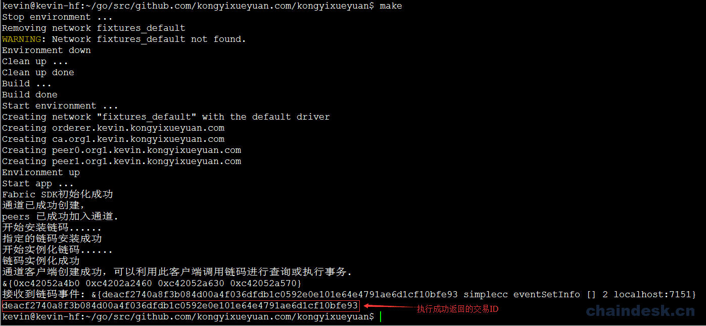
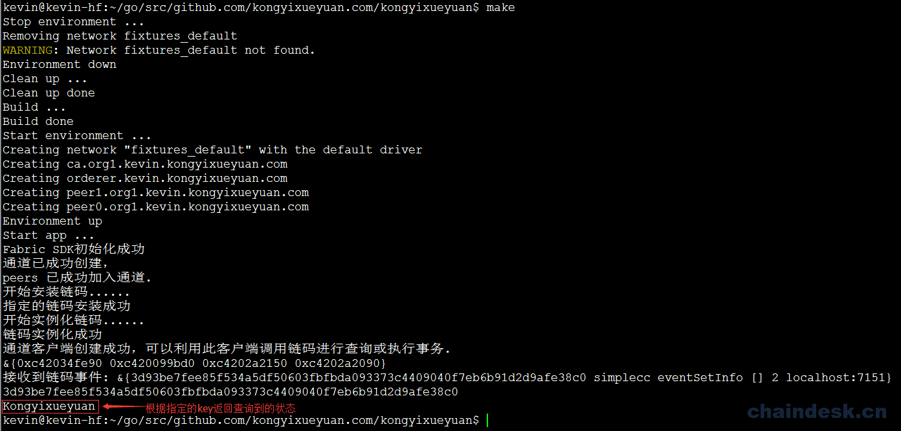

# 12.2 调用链码－设计业务层

## 目标

1.  实现应用业务层
2.  掌握 SDK 调用链码的相关 API

## 任务实现

`fabric-sdk` 不仅提供了相应的强大功能，而且还给开发人员设计提供了相应的 API 接口，以方便开发人员随时调用。做为开发设计人员，我们不仅要考虑用户操作的方便性及可交互性，还需要考虑应用程序后期的可扩展性及维护性，为此我们将为应用增加一个业务层，所有的客户请求都由业务层发送给链码，通过对链码的调用，进而实现对分类账本状态的操作。

### 12.2.1 事件处理

在项目根目录下创建一个 `service` 目录作为业务层，在业务层中，我们使用 `Fabric-SDK-Go` 提供的接口对象调用相应的 API 以实现对链码的访问，最终实现对分类账本中的状态进行操作。

```go
$ cd $GOPATH/src/github.com/kongyixueyuan.com/kongyixueyuan
$ mkdir service 
```

在 `service` 目录下创建 `domain.go` 文件并进行编辑， 声明一个结构体及对事件相关而封装的源代码

```go
$ vim service/domain.go 
```

`domain.go` 文件完整内容如下：

```go
/**
  author: hanxiaodong
  QQ 群（专业 Fabric 交流群）：862733552
 */

package service

import (
    "github.com/hyperledger/fabric-sdk-go/pkg/client/channel"
    "fmt"
    "time"
    "github.com/hyperledger/fabric-sdk-go/pkg/common/providers/fab"
)

type ServiceSetup struct {
    ChaincodeID    string
    Client    *channel.Client
}

func regitserEvent(client *channel.Client, chaincodeID, eventID string) (fab.Registration, <-chan *fab.CCEvent) {

    reg, notifier, err := client.RegisterChaincodeEvent(chaincodeID, eventID)
    if err != nil {
        fmt.Println("注册链码事件失败: %s", err)
    }
    return reg, notifier
}

func eventResult(notifier <-chan *fab.CCEvent, eventID string) error {
    select {
    case ccEvent := <-notifier:
        fmt.Printf("接收到链码事件: %v\n", ccEvent)
    case <-time.After(time.Second * 20):
        return fmt.Errorf("不能根据指定的事件 ID 接收到相应的链码事件(%s)", eventID)
    }
    return nil
} 
```

### 12.2.2 调用链码添加状态

在 `service` 目录下创建 `SimpleService.go` 文件

```go
$ vim service/SimpleService.go 
```

在 `SimpleService.go` 文件中编写内容如下，通过一个 `SetInfo` 函数实现链码的调用，向分类账本中添加状态的功能：

```go
/**
  author: hanxiaodong
  QQ 群（专业 Fabric 交流群）：862733552
 */
package service

import (
    "github.com/hyperledger/fabric-sdk-go/pkg/client/channel"
)

func (t *ServiceSetup) SetInfo(name, num string) (string, error) {

    eventID := "eventSetInfo"
    reg, notifier := regitserEvent(t.Client, t.ChaincodeID, eventID)
    defer t.Client.UnregisterChaincodeEvent(reg)

    req := channel.Request{ChaincodeID: t.ChaincodeID, Fcn: "set", Args: [][]byte{[]byte(name), []byte(num), []byte(eventID)}}
    respone, err := t.Client.Execute(req)
    if err != nil {
        return "", err
    }

    err = eventResult(notifier, eventID)
    if err != nil {
        return "", err
    }

    return string(respone.TransactionID), nil
} 
```

**测试添加状态**

编辑 `main.go` 文件

```go
$ vim main.go 
```

`main.go` 中创建一个对象，并调用 `SetInfo` 函数，内容如下：

```go
/**
  author: hanxiaodong
 */

package main

import (
    [......]
    "github.com/kongyixueyuan.com/kongyixueyuan/service"
)

[......]
    //===========================================//

    serviceSetup := service.ServiceSetup{
        ChaincodeID:SimpleCC,
        Client:channelClient,
    }

    msg, err := serviceSetup.SetInfo("hanxiaodong", "kongyixueyuan")
    if err != nil {
        fmt.Println(err)
    } else {
        fmt.Println(msg)
    }

    //===========================================//

} 
```

执行 `make` 命令运行应用程序

```go
$ make 
```

执行后如下图所示：



### 12.2.3 调用链码查询状态

通过上面的 `setInfo(name, num string)` 函数，实现了向分类账本中添加状态，那么我们还需要实现从该分类账本中根据指定的 key 查询出相应的状态，编辑 `service/SimpleService.go` 文件，向该文件中添加实现查询状态的相应代码。

```go
$ vim service/SimpleService.go 
```

定义一个 `GetInfo` 函数，接收一个字符串类型的参数，该函数实现通过调用链码而查询状态的功能，该函数完整代码如下：

```go
[......]

func (t *ServiceSetup) GetInfo(name string) (string, error){

    req := channel.Request{ChaincodeID: t.ChaincodeID, Fcn: "get", Args: [][]byte{[]byte(name)}}
    respone, err := t.Client.Query(req)
    if err != nil {
        return "", err
    }

    return string(respone.Payload), nil
} 
```

**测试查询状态**

编辑 `main.go` 文件

```go
$ vim main.go 
```

在 `main.go` 文件中添加调用代码如下内容：

```go
[......]

    msg, err = serviceSetup.GetInfo("hanxiaodong")
    if err != nil {
        fmt.Println(err)
    } else {
        fmt.Println(msg)
    }

    //===========================================//

} 
```

执行 `make` 命令运行应用程序

```go
$ make 
```

执行后如下图所示：

