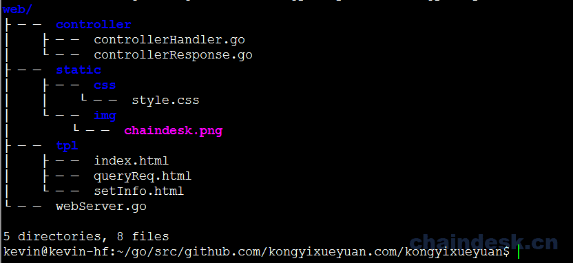
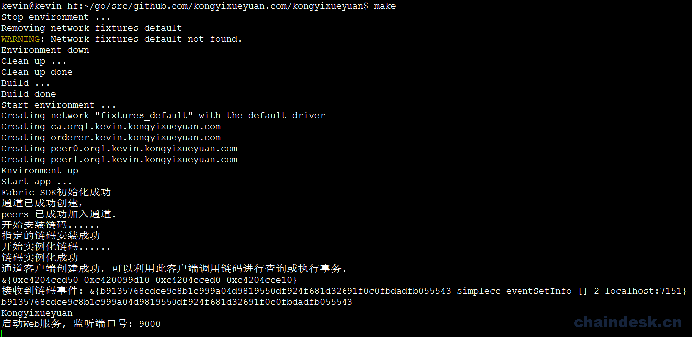
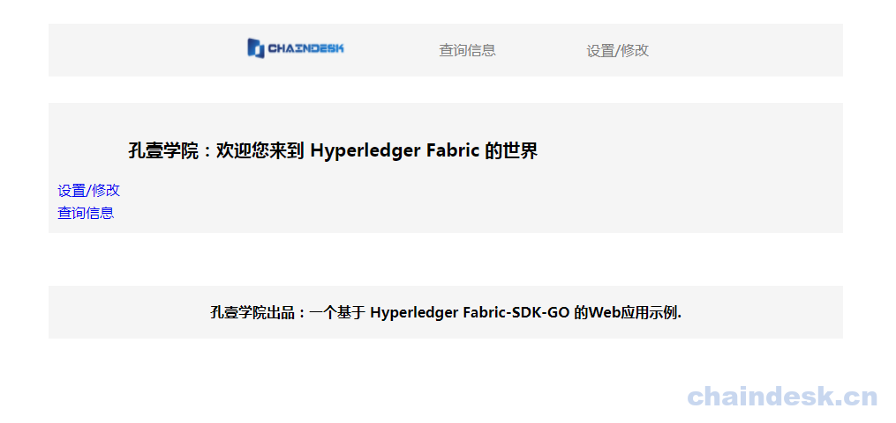
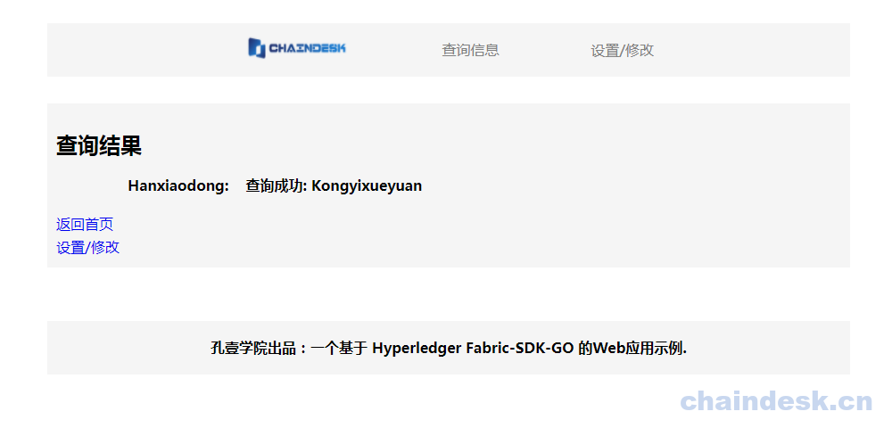
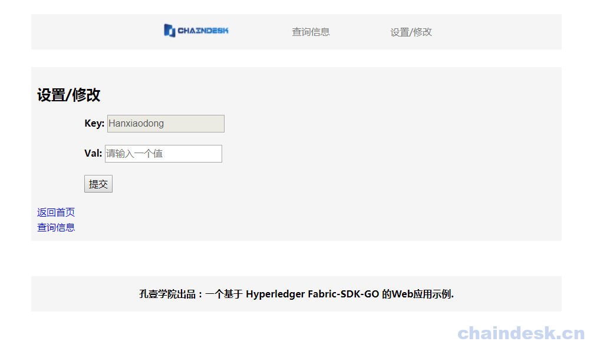
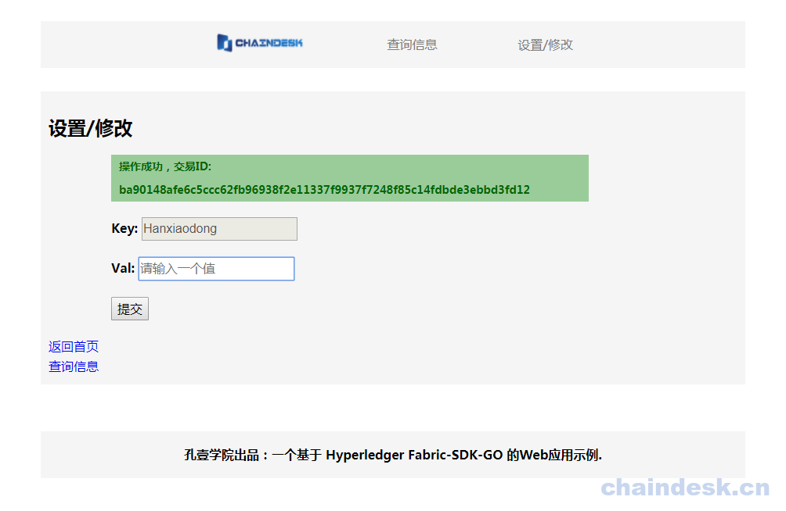
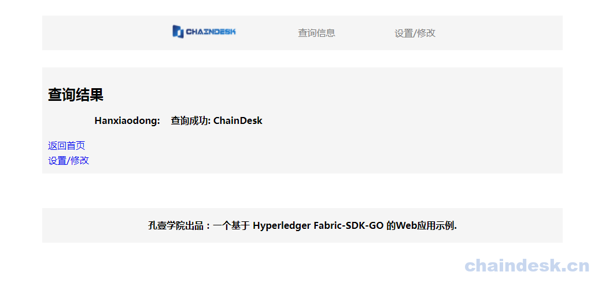

# 十二、.3 MVC 架构应用实现

## 目标

1.  完成 Web 应用
2.  理解 Goweb 应用开发重点

## 任务实现

### 12.3.1 目录结构

通过业务层已经实现了利用 `fabric-sdk-go` 调用链码查询或操作分类账本状态，但是开发人员的工作不可能就此而止，需要考虑用户该如何使用此应用程序，一般情况下，交给用户使用的应用程序有以下两种方式：

1.  桌面应用：传统实现方式，将应用程序打包成为一个可执行的安装程序之后，由用户安装在本地然后运行（可能需要特定的环境），进而进行相关操作。
2.  Web 浏览器应用：此方式相对于用户而言，非常方便，用户只需要在本地的浏览器中就可以使用应用程序的相关功能。

为了方便用户的操作使用，我们使用第二种方式来实现。以便于让用户通过浏览器就可以实现对分类账的操作。同样我们需要考虑应用程序后期的可扩展性及维护性，为此我们将应用程序进行了分层管理，设计增加了控制层及视图层。

视图层提供用户的可视界面与交互，控制层接收用户的请求，由控制层访问业务层，进而调用链码对分类账进行操作，之后将操作结果响应给客户端浏览器。

Go 语言本身提供了一个 Web 服务器来处理 HTTP 请求，并为 HTML 页面提供模板。下面我们来实现 Web 应用程序。

新建 web 目录，包含三个其他目录的目录。将使用 MVC（Model（模型）－View（视图） - Controller（控制器））模式使其更具可读性及扩展性、维护性。模型将是区块链部分，视图是模板，控制器由`controllers`目录中的功能提供。

*   `web/tpl`：包含所有的 HTML 页面
*   `web/static`：包含所有静态 CSS，Javascript，图片等文件
*   `web/controllers` ：包含将呈现模板的所有函数

```go
$ cd $GOPATH/src/github.com/kongyixueyuan.com/kongyixueyuan 
```

创建相应的目录：

```go
$ mkdir -p web/controller
$ mkdir -p web/static/css
$ mkdir -p web/static/img
$ mkdir -p web/tpl 
```

> 提示：可以直接使用 `git clone https://github.com/kevin-hf/hfsdkgoweb.git` 命令克隆完整的内容到项目的根目录中，然后将文件夹重命名： `mv hfsdkgoweb/ web` ，重新命名后直接跳至 8.6 步骤执行。

**`web/controller` 目录**

`controller/controllerHandler.go` ： 用于接收并处理各种客户端请求的源代码文件

`controller/controllerResponse`：用于编写响应客户端请求的源代码文件

**`web/static`目录下包括三个子目录，分别为：**

`web/static/css` ：用于存放页面布局及显示样式所需的 `CSS` 文件

`web/static/js` ：用于存放编写的与用户交互的 `JavaScript` 源码文件

`web/static/img`：用户存放页面显示所需的所有图片文件

**`web/tpl` 目录下包括三个静态 HTML 页面文件，分别为：**

`web/tpl/index.html`： 用户访问的首页面

`web/tpl/queryReq.html`： 用于显示显示查询结果的页面

`web/tpl/setInfo.html`： 用户设置/修改状态的页面

**`web/webServer.go`**：用于指定启动 Web 服务及相应的路由信息

具体目录结构如下图所示：



### 12.3.2 指定响应处理文件

在 `web/controller` 目录下创建 `controllerResponse.go` 文件，用于响应客户端的请求

```go
$ vim web/controller/controllerResponse.go 
```

`controllerResponse.go` 内容参见：

*   [web/controller/controllerResponse.go](https://github.com/kevin-hf/hfsdkgoweb/blob/master/controller/controllerResponse.go)

### 12.3.3 请求处理控制器

在 `web/controller` 目录下添加 `controllerHandler.go` 文件，用于接收客户端请求并做出相应的处理

```go
$ vim web/controller/controllerHandler.go 
```

`controllerHandler.go` 文件中添加内容参见：

*   [web/controller/controllerHandler.go](https://github.com/kevin-hf/hfsdkgoweb/blob/master/controller/controllerHandler.go)

### 12.3.4 编写页面

页面详细内容参见：

*   [web/tpl/index.html](https://github.com/kevin-hf/hfsdkgoweb/blob/master/tpl/index.html)
*   [web/tpl/queryReq.html](https://github.com/kevin-hf/hfsdkgoweb/blob/master/tpl/queryReq.html)
*   [web/tpl/setInfo.html](https://github.com/kevin-hf/hfsdkgoweb/blob/master/tpl/setInfo.html)

### 12.3.5 添加路由信息

在 `web` 目录中添加 `webServer.go` 文件

```go
$ vim web/webServer.go 
```

编辑 `webServer.go` 文件，内容参见：

*   [web/webServer.go](https://github.com/kevin-hf/hfsdkgoweb/blob/master/webServer.go)

### 12.3.6 启动 Web 服务

最后编辑 `main.go` ，以便启动 Web 界面实现 Web 应用程序

```go
$ vim main.go 
```

添加如下内容:

```go
import(
    [......]
    "github.com/kongyixueyuan.com/kongyixueyuan/web"
    "github.com/kongyixueyuan.com/kongyixueyuan/web/controller"
)

func main(){}
    [......]

    app := controller.Application{
        Fabric: &serviceSetup,
    }
    web.WebStart(&app)
} 
```

执行 `make` 命令启动 Web 应用：



### 12.3.7 页面访问

打开浏览器访问: [htt://localhost:9000/](http://localhost:9000/)

因为我们这是一个简单的 Web 应用示例，所以页面不会要求达到多么美观的地步，只是能够实现相应的功能即可。根据访问的地址，首先进入 `index.html` 页面，该 `index.html` 页面提供了两个链接（也可以通过页面顶部的菜单中访问），用于实现在在分类账本中进行状态查询或对分类账本中的状态进行修改的操作（在此不实现添加状态的操作）。



因为我们在业务层中测试过一次，通过调用业务层向分类账中添加了一条状态， 所以现在分类帐中有一个 `key 为 Hanxiaodong`，`value 为 Kongyixueyuan` 的键值对数据，可以点击 `查询信息` 的链接实现查询



点击页面中的 `设置/修改` 链接后进入一个表单页面，该页面提供了一个更改状态的表单，表单中的 key 为固定值，用户需要输入对应的 Val，之后点击提交按钮发送请求。



在 Val 输入框中输入一个值，如 `ChainDesk` 后点击提交按钮，表单被提交到服务器，服务器处理完毕将返回操作成功的交易 ID 并将其显示在页面中。



我们可以通过点击页面中的 `查询信息` 链接来查看状态是否更改成功



## FAQ

1.  为什么要将客户端请求与响应的代码分开写在不同的文件中？

    一个文件中的编写的代码不宜过多，如果合理设计，分开写在不同的文件中有利于提高代码的可读性还可以提高应用程序的可维护性与可扩展性。

2.  路由指的是什么意思？

    路由其实就是设定客户端不同的请求访问地址。