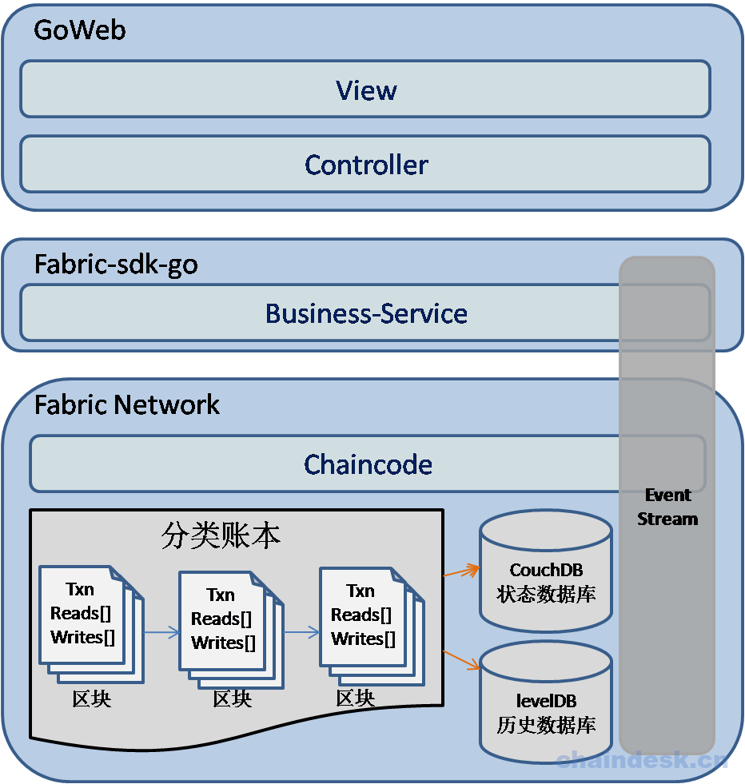
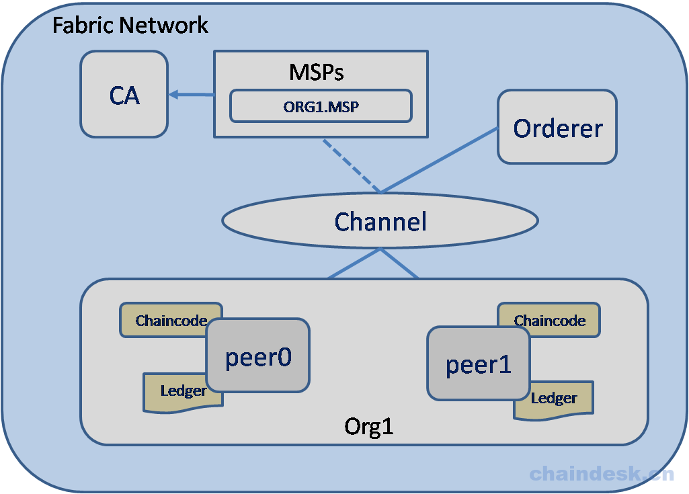
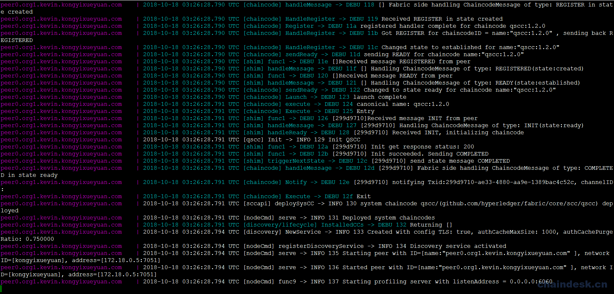
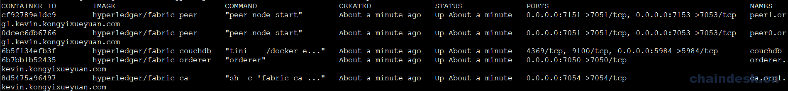
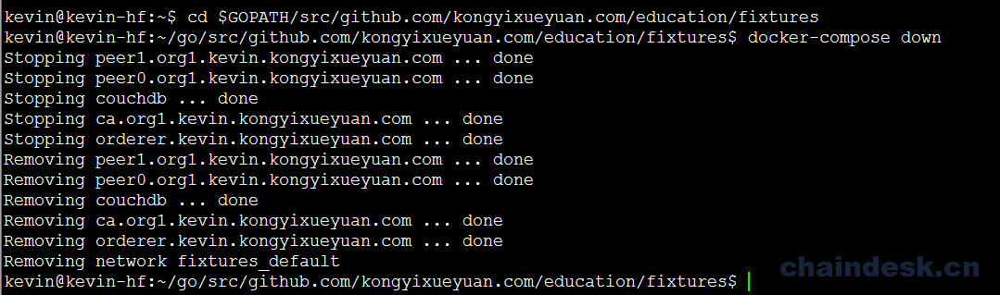
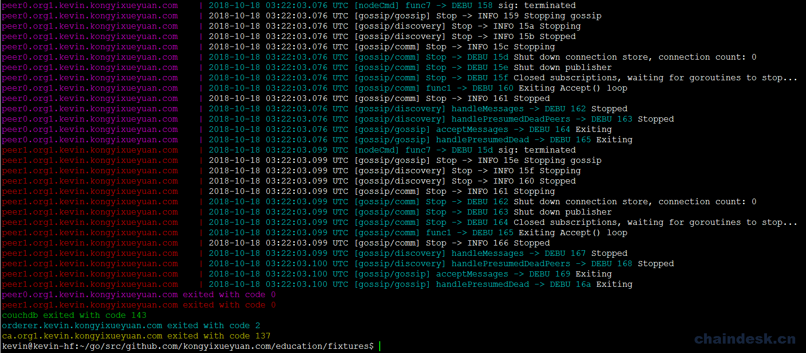

# 十三、.1 需求分析

### 13.1.1 需求分析

现在是一个信息化的高科技时代，许许多多的企业必须紧跟时代步伐，不断创新，才能发展壮大；而企业的发展必然离不开人才队伍的建设，也可以说创新是企业发展的动力，而人才却是企业发展的根本，所以现在各企业对于人才队伍建设十分看重，而对于人才的素质及受教育情况的要求更是重中之重。

对学历信息的查询，要么成本较高，要么比较麻烦，甚至还有一些假冒网站让人防不胜防；传统应用是将数据保存在数据库中来实现，但是现在出现的数据库由于故障或者被删、被黑造成的数据丢失的情况更是屡见不鲜，所以传统数据库并不能真正意义上确保数据的完整性及安全性。

基于这些情况，我们设计并开发了一个 `基于区块链技术的实现的学历信息征信系统`，实现了在线对学历信息的查询功能，由于区块链技术本身的特点，无须考虑数据被破坏的问题，而且杜绝了对于信息造假的情况，保证了学历信息的真实性。由于篇幅原因，我们对学历信息征信系统的应用场景进行修改及简化，实现的业务逻辑包括添加信息、修改信息、查询信息、查询详情信息等操作，实际情况下的的业务逻辑需要根据实际需求场景做出相应的调整。

由于系统需要保证人才受教育情况真实性，所以对于系统的用户而言，不可能由用户自己添加相应的学历信息，而是由具有一定权限的用户来完成添加或修改的功能。但普通用户可以通过系统溯源功能来确定信息的真伪。所以我们将系统用户的使用角色分为两种：

1.  普通用户
2.  管理员用户

普通用户具有对数据的查询功能 ，但实现查询之前必须经过登录认证：

*   用户登录：系统只针对合法用户进行授权使用，所以用户必须先进行登录才能完成相应的功能。
*   查询实现：查询分为两种方式实现
    *   根据证书编号与姓名查询：根据用户输入的证书编号与姓名进行查询。
    *   根据身份证号码查询：根据用户输入指定的身份证号码进行查询，此功能可以实现溯源。

管理员用户除具有普通用户的功能之外，额外添加了两个功能：

*   添加信息：可以向系统中添加新的学历信息。
*   修改信息：针对已存在的学历信息进行修改。

### 13.1.2 架构设计

我们在本书的第十、十一、十二章中已经完成了一个完整的基于 `fabric-sdk-go` 的应用示例，所以我们现在使用之前的应用架构，不同的是在此应用中需要编写实现完整的链码并通过业务层调用链码中的各个函数，以实现对数据状态的操作。界面为了方便用户操作使用，仍然使用 Web 浏览器的方式实现。而且在此应用中我们将 `Hyperledger Fabric` 默认的状态数据库由 `LevelDB` 替换为 `CouchDB` 来实现



对于 `Fabric Network`结构如下图所示：



### 13.1.3 数据模型设计

由于需要向分类账本中保存数据，所以必须设计相关的结构体用于声明要保存的数据结构，用于方便的在应用中处理数据。

`Education` 结构体设计如下表所示：

| 名称 | 数据类型 | 说明 |
| --- | --- | --- |
| ObjectType | string |  |
| Name | string | 姓名 |
| Gender | string | 性别 |
| Nation | string | 民族 |
| EntityID | string | 身份证号（记录的 Key） |
| Place | string | 籍贯 |
| BirthDay | string | 出生日期 |
| Photo | string | 照片 |
| EnrollDate | string | 入学日期 |
| GraduationDate | string | 毕（结）业日期 |
| SchoolName | string | 所读学校名称 |
| Major | string | 所读专业 |
| QuaType | string | 学历类别（普通、成考等） |
| Length | string | 学制（两年、三年、四年、五年） |
| Mode | string | 学习形式（普通全日制） |
| Level | string | 层次（专科、本科、研究生、博士） |
| Graduation | string | 毕（结）业（毕业、结业） |
| CertNo | string | 证书编号 |
| Historys | []HistoryItem | 当前 edu 的详细历史记录 |

为了能够从当前的分类状态中查询出详细的历史操作记录，我们在 `Education` 中设计了一个类型为`HistoryItem` 数组的 `Historys` 成员，表示当前状态的历史记录集。

`HistoryItem` 结构体设计如下表所示：

| 名称 | 数据类型 | 说明 |
| --- | --- | --- |
| TxId | string | 交易编号 |
| Education | Education | 本次历史记录的详细信息 |

### 13.1.4 网络环境

#### 13.1.4.1 设置环境

我们在第十章中说明了如何构建 fabric 网络环境，现在我们要重新完成一个新的应用，所以网络环境可以使用之前的内容，但是因为**状态数据库使用 `CouchDB` 来实现**，所以需要做出部分修改，新增与 `CouchDB` 相关的内容。为了方便读者起见，我们重新搭建一个应用所需的网络环境。

在`GOPATH`的`src`文件夹中新建一个目录如下：

```go
$ mkdir -p $GOPATH/src/github.com/kongyixueyuan.com/education 
$ cd $GOPATH/src/github.com/kongyixueyuan.com/education 
```

使用 `git` 命令克隆 hf-fixtures 目录当前路径

```go
$ git clone https://github.com/kevin-hf/hf-fixtures.git 
```

将 hf-fixtures 文件夹重命名为 fixtures

```go
$ mv hf-fixtures/fixtures 
```

修改`fixtures` 文件夹的所属关系为当前用户

```go
$ sudo chown -R kevin:kevin ./fixtures 
```

> 提示： kevin 为安装 Ubuntu 16.04 系统时创建的用户

进入 `fixtures` 目录

```go
$ cd fixtures 
```

为了构建区块链网络，使用 `docker` 构建处理不同角色的虚拟计算机。 在这里我们将尽可能保持简单。如果确定您的系统中已经存在相关的所需容器，或可以使用其它方式获取，则无需执行如下命令。否则请将 `fixtures` 目录下的 `pull_images.sh` 文件添加可执行权限后直接执行。

```go
$ chmod 777 ./pull_images.sh
$ ./pull_images.sh 
```

> 提示：`pull_images.sh` 文件是下载 Fabric 环境所需容器的一个可执行脚本，下载过程需要一段时间（视网速情况而定），请耐心等待。另：请确定您的系统支持虚拟技术。

#### 13.1.4.2 配置 docker-compose.yml 文件

在 `fixtures` 目录下创建一个 `docker-compose.yml` 文件并编辑

```go
$ vim docker-compose.yml 
```

1.  将 `network 下的 basic` 修改为 `default`

    ```go
    version: '2'

    networks:
      default:

    services: 
    ```

2.  编辑 orderer 部分

    ```go
     orderer.kevin.kongyixueyuan.com:
        image: hyperledger/fabric-orderer
        container_name: orderer.kevin.kongyixueyuan.com
        environment:
          - ORDERER_GENERAL_LOGLEVEL=debug
          - ORDERER_GENERAL_LISTENADDRESS=0.0.0.0
          - ORDERER_GENERAL_LISTENPORT=7050
          - ORDERER_GENERAL_GENESISPROFILE=kongyixueyuan
          - ORDERER_GENERAL_GENESISMETHOD=file
          - ORDERER_GENERAL_GENESISFILE=/var/hyperledger/orderer/genesis.block
          - ORDERER_GENERAL_LOCALMSPID=kevin.kongyixueyuan.com
          - ORDERER_GENERAL_LOCALMSPDIR=/var/hyperledger/orderer/msp
          - ORDERER_GENERAL_TLS_ENABLED=true
          - ORDERER_GENERAL_TLS_PRIVATEKEY=/var/hyperledger/orderer/tls/server.key
          - ORDERER_GENERAL_TLS_CERTIFICATE=/var/hyperledger/orderer/tls/server.crt
          - ORDERER_GENERAL_TLS_ROOTCAS=[/var/hyperledger/orderer/tls/ca.crt]
        working_dir: /opt/gopath/src/github.com/hyperledger/fabric
        command: orderer
        volumes:
          - ./artifacts/genesis.block:/var/hyperledger/orderer/genesis.block
          - ./crypto-config/ordererOrganizations/kevin.kongyixueyuan.com/orderers/orderer.kevin.kongyixueyuan.com/msp:/var/hyperledger/orderer/msp
          - ./crypto-config/ordererOrganizations/kevin.kongyixueyuan.com/orderers/orderer.kevin.kongyixueyuan.com/tls:/var/hyperledger/orderer/tls
        ports:
          - 7050:7050
        networks:
          default:
            aliases:
              - orderer.kevin.kongyixueyuan.com 
    ```

3.  编辑 ca 部分

    ```go
     ca.org1.kevin.kongyixueyuan.com:
        image: hyperledger/fabric-ca
        container_name: ca.org1.kevin.kongyixueyuan.com
        environment:
          - FABRIC_CA_HOME=/etc/hyperledger/fabric-ca-server
          - FABRIC_CA_SERVER_CA_NAME=ca.org1.kevin.kongyixueyuan.com
          - FABRIC_CA_SERVER_CA_CERTFILE=/etc/hyperledger/fabric-ca-server-config/ca.org1.kevin.kongyixueyuan.com-cert.pem
          - FABRIC_CA_SERVER_CA_KEYFILE=/etc/hyperledger/fabric-ca-server-config/727e69ed4a01a204cd53bf4a97c2c1cb947419504f82851f6ae563c3c96dea3a_sk
          - FABRIC_CA_SERVER_TLS_ENABLED=true
          - FABRIC_CA_SERVER_TLS_CERTFILE=/etc/hyperledger/fabric-ca-server-config/ca.org1.kevin.kongyixueyuan.com-cert.pem
          - FABRIC_CA_SERVER_TLS_KEYFILE=/etc/hyperledger/fabric-ca-server-config/727e69ed4a01a204cd53bf4a97c2c1cb947419504f82851f6ae563c3c96dea3a_sk
        ports:
          - 7054:7054
        command: sh -c 'fabric-ca-server start -b admin:adminpw -d'
        volumes:
          - ./crypto-config/peerOrganizations/org1.kevin.kongyixueyuan.com/ca/:/etc/hyperledger/fabric-ca-server-config
        networks:
          default:
            aliases:
              - ca.org1.kevin.kongyixueyuan.com 
    ```

4.  声明 CouchDB 部分：

    ```go
     couchdb:
        container_name: couchdb
        image: hyperledger/fabric-couchdb
        # Populate the COUCHDB_USER and COUCHDB_PASSWORD to set an admin user and password
        # for CouchDB.  This will prevent CouchDB from operating in an "Admin Party" mode.
        environment:
          - COUCHDB_USER=
          - COUCHDB_PASSWORD=
        # Comment/Uncomment the port mapping if you want to hide/expose the CouchDB service,
        # for example map it to utilize Fauxton User Interface in dev environments.
        ports:
          - "5984:5984" 
    ```

5.  编辑 Peer 部分

    1.  `peer0.org1.example.com` 内容如下

        ```go
         peer0.org1.kevin.kongyixueyuan.com:
            image: hyperledger/fabric-peer
            container_name: peer0.org1.kevin.kongyixueyuan.com
            environment:
              - CORE_VM_ENDPOINT=unix:///host/var/run/docker.sock
              - CORE_VM_DOCKER_ATTACHSTDOUT=true
              - CORE_LOGGING_LEVEL=DEBUG
              - CORE_PEER_NETWORKID=kongyixueyuan
              - CORE_PEER_PROFILE_ENABLED=true
              - CORE_PEER_TLS_ENABLED=true
              - CORE_PEER_TLS_CERT_FILE=/var/hyperledger/tls/server.crt
              - CORE_PEER_TLS_KEY_FILE=/var/hyperledger/tls/server.key
              - CORE_PEER_TLS_ROOTCERT_FILE=/var/hyperledger/tls/ca.crt
              - CORE_PEER_ID=peer0.org1.kevin.kongyixueyuan.com
              - CORE_PEER_ADDRESSAUTODETECT=true
              - CORE_PEER_ADDRESS=peer0.org1.kevin.kongyixueyuan.com:7051
              - CORE_PEER_GOSSIP_EXTERNALENDPOINT=peer0.org1.kevin.kongyixueyuan.com:7051
              - CORE_PEER_GOSSIP_USELEADERELECTION=true
              - CORE_PEER_GOSSIP_ORGLEADER=false
              - CORE_PEER_GOSSIP_SKIPHANDSHAKE=true
              - CORE_PEER_LOCALMSPID=org1.kevin.kongyixueyuan.com
              - CORE_PEER_MSPCONFIGPATH=/var/hyperledger/msp
              - CORE_PEER_TLS_SERVERHOSTOVERRIDE=peer0.org1.kevin.kongyixueyuan.com
              - CORE_LEDGER_STATE_STATEDATABASE=CouchDB
              - CORE_LEDGER_STATE_COUCHDBCONFIG_COUCHDBADDRESS=couchdb:5984
              - CORE_LEDGER_STATE_COUCHDBCONFIG_USERNAME=
              - CORE_LEDGER_STATE_COUCHDBCONFIG_PASSWORD=
            working_dir: /opt/gopath/src/github.com/hyperledger/fabric/peer
            command: peer node start
            volumes:
              - /var/run/:/host/var/run/
              - ./crypto-config/peerOrganizations/org1.kevin.kongyixueyuan.com/peers/peer0.org1.kevin.kongyixueyuan.com/msp:/var/hyperledger/msp
              - ./crypto-config/peerOrganizations/org1.kevin.kongyixueyuan.com/peers/peer0.org1.kevin.kongyixueyuan.com/tls:/var/hyperledger/tls
            ports:
              - 7051:7051
              - 7053:7053
            depends_on:
              - orderer.kevin.kongyixueyuan.com
              - couchdb
            networks:
              default:
                aliases:
                  - peer0.org1.kevin.kongyixueyuan.com 
        ```

    2.  peer1.org1.example.com 内容如下

        ```go
         peer1.org1.kevin.kongyixueyuan.com:
            image: hyperledger/fabric-peer
            container_name: peer1.org1.kevin.kongyixueyuan.com
            environment:
              - CORE_VM_ENDPOINT=unix:///host/var/run/docker.sock
              - CORE_VM_DOCKER_ATTACHSTDOUT=true
              - CORE_LOGGING_LEVEL=DEBUG
              - CORE_PEER_NETWORKID=kongyixueyuan
              - CORE_PEER_PROFILE_ENABLED=true
              - CORE_PEER_TLS_ENABLED=true
              - CORE_PEER_TLS_CERT_FILE=/var/hyperledger/tls/server.crt
              - CORE_PEER_TLS_KEY_FILE=/var/hyperledger/tls/server.key
              - CORE_PEER_TLS_ROOTCERT_FILE=/var/hyperledger/tls/ca.crt
              - CORE_PEER_ID=peer1.org1.kevin.kongyixueyuan.com
              - CORE_PEER_ADDRESSAUTODETECT=true
              - CORE_PEER_ADDRESS=peer1.org1.kevin.kongyixueyuan.com:7051
              - CORE_PEER_GOSSIP_EXTERNALENDPOINT=peer1.org1.kevin.kongyixueyuan.com:7051
              - CORE_PEER_GOSSIP_USELEADERELECTION=true
              - CORE_PEER_GOSSIP_ORGLEADER=false
              - CORE_PEER_GOSSIP_SKIPHANDSHAKE=true
              - CORE_PEER_LOCALMSPID=org1.kevin.kongyixueyuan.com
              - CORE_PEER_MSPCONFIGPATH=/var/hyperledger/msp
              - CORE_PEER_TLS_SERVERHOSTOVERRIDE=peer1.org1.kevin.kongyixueyuan.com
              - CORE_LEDGER_STATE_STATEDATABASE=CouchDB
              - CORE_LEDGER_STATE_COUCHDBCONFIG_COUCHDBADDRESS=couchdb:5984
              - CORE_LEDGER_STATE_COUCHDBCONFIG_USERNAME=
              - CORE_LEDGER_STATE_COUCHDBCONFIG_PASSWORD=
            working_dir: /opt/gopath/src/github.com/hyperledger/fabric/peer
            command: peer node start
            volumes:
              - /var/run/:/host/var/run/
              - ./crypto-config/peerOrganizations/org1.kevin.kongyixueyuan.com/peers/peer1.org1.kevin.kongyixueyuan.com/msp:/var/hyperledger/msp
              - ./crypto-config/peerOrganizations/org1.kevin.kongyixueyuan.com/peers/peer1.org1.kevin.kongyixueyuan.com/tls:/var/hyperledger/tls
            ports:
              - 7151:7051
              - 7153:7053
            depends_on:
              - orderer.kevin.kongyixueyuan.com
              - couchdb
            networks:
              default:
                aliases:
                  - peer1.org1.kevin.kongyixueyuan.com 
        ```

### 13.1.5 测试网络环境

为了检查网络是否正常工作，使用`docker-compose`同时启动或停止所有容器。 进入`fixtures`文件夹，运行：

```go
$ cd $GOPATH/src/github.com/kongyixueyuan.com/education/fixtures
$ docker-compose up 
```

如果在您的系统中没有相关的容器，那么会自动下载 docker 镜像。下载完毕后自动启动，控制台会输出很多不同颜色的日志（红色不等于错误）



打开一个新终端并运行：

```go
 $ docker ps 
```



将看到：两个 peer，一个 orderer 和一个 CA 容器，还有一个 CouchDB 容器。 代表已成功创建了一个新的网络，可以随 SDK 一起使用。 要停止网络，请返回到上一个终端，按`Ctrl+C`并等待所有容器都停止。

> **提示** ：当网络成功启动后，所有处于活动中的容器都可以访问。 也可以查看指定容器的详细日志内容。 如果想删除这些容器，需要使用`docker rm $(docker ps -aq)`将其删除 ，但在删除容器之前需要确定其在网络环境中已不再使用。
> 
> 如果在网络环境启动过程中不想看到大量的日志信息，请在该启动命令中添加参数 `-d` ，如下所示： `docker-compose up -d` 。 如果要停止网络，请务必在 `docker-compose.yaml` 所在的文件夹中运行命令： `docker-compose stop` （或 使用`docker-compose down` 进行清理停止所有容器）。

最后在终端 2 中执行如下命令关闭网络：

```go
$ cd $GOPATH/src/github.com/kongyixueyuan.com/education/fixtures
$ docker-compose down 
```



终端 1 窗口中输出如下：

