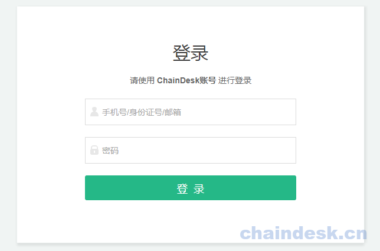
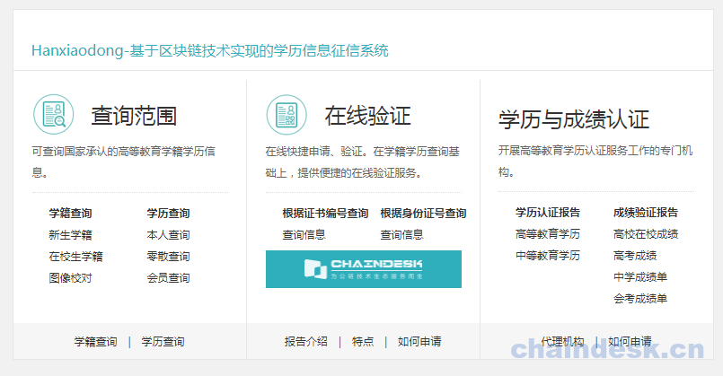
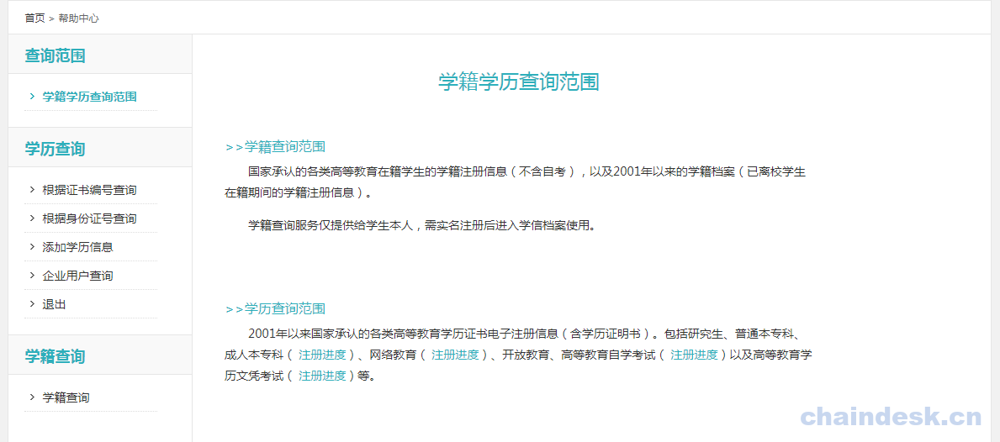
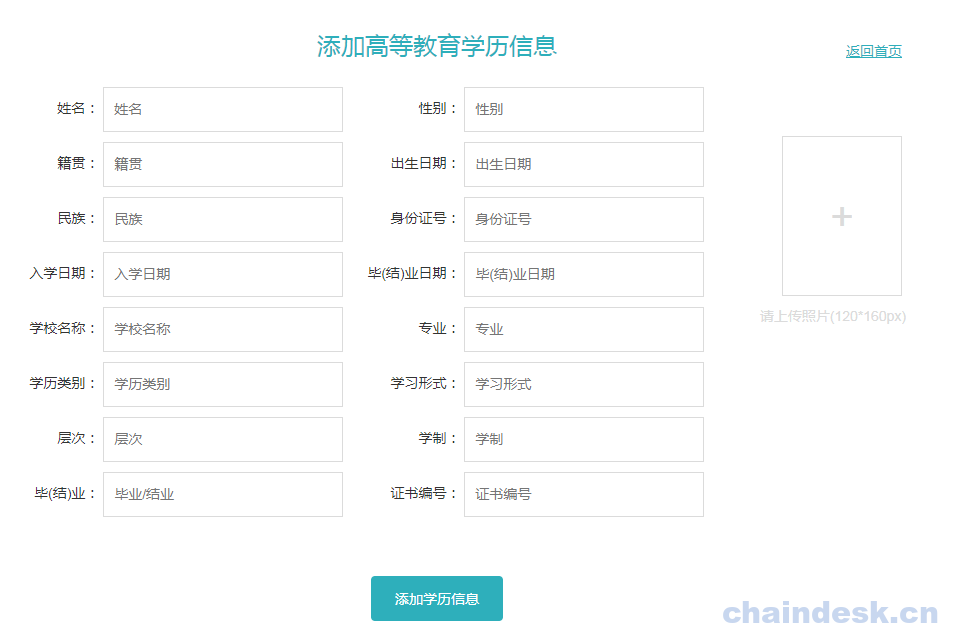
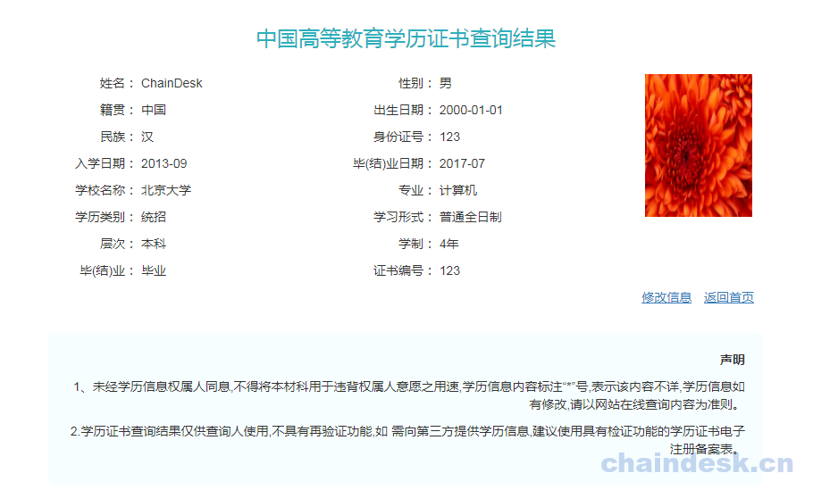
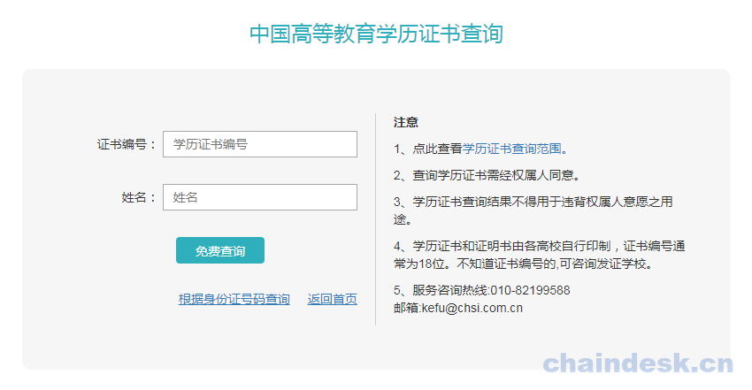
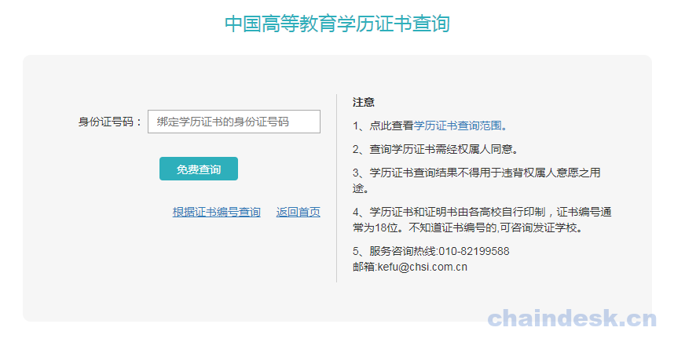
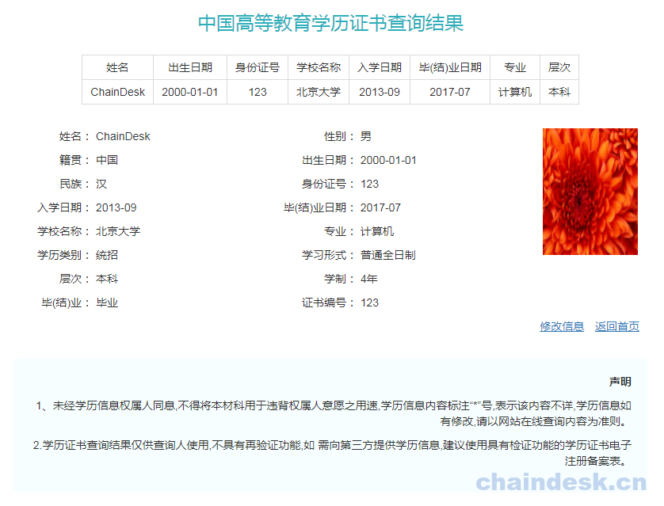
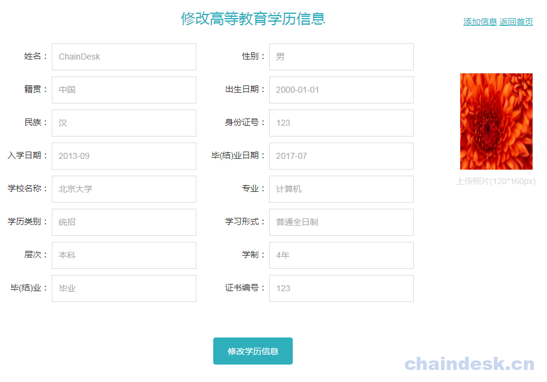
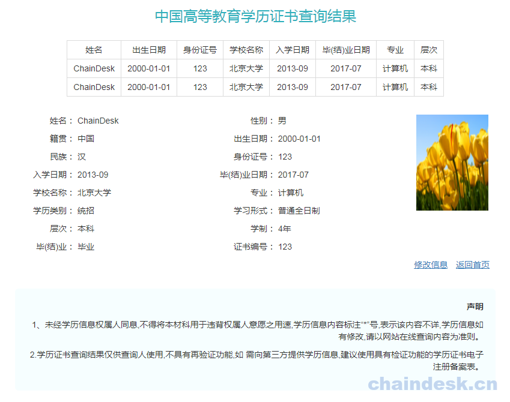

# 十三、.6 项目交互演示

### 13.6.1 启动 Web 服务

最后编辑 `main.go` ，以便启动 Web 界面实现 Web 应用程序

```go
$ vim main.go 
```

添加如下内容:

```go
import(
    [......]
    "github.com/kongyixueyuan.com/education/web/controller"
    "github.com/kongyixueyuan.com/education/web"
)

func main(){}
    [......]

    app := controller.Application{
        Setup: &serviceSetup,
    }
    web.WebStart(app)
} 
```

应用项目开发完成后，可以直接启动用来查看效果。在命令提示符中输入 `make` 命令：

```go
$ make 
```

### 13.6.2 访问页面

项目启动成功之后，打开浏览器访问: [htt://localhost:9000/](http://localhost:9000/)

根据访问的 URL 地址系统自动响应登录页面



输入管理员账号及密码登录验证成功，则进入系统首页面



在首页面中点击 `查询范围`链接，进入 `help`页面，



点击添加学历信息链接进入，添加学历信息页面



根据学历证书编号与姓名查询页面



根据学历证书编号与姓名查询结果页面



根据身份证号码查询页面



根据身份证号码查询页面查询结果页面



编辑页面



编辑成功自动跳转到根据身份证号码查询结果页面



项目完整源代码，请 [点击此处](https://github.com/kevin-hf/education)