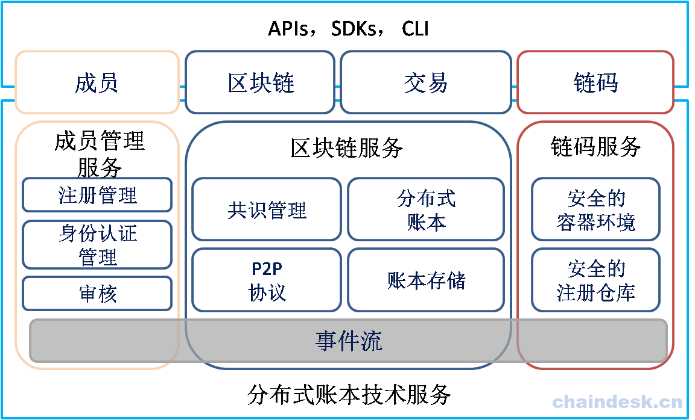

# 第一章 Hyperledger Fabric 源码深度解析(V1.2)－准备工作

## Hyperledger Fabric 源码深度解析(V1.2)－准备工作

> 本教程不会涉及对 Hyperledger Fabric 的基础操作相关知识，如果之前没有学习过任何的 Hyperledger Fabric 的知识，请先学习， 学习教程链接如下：
> 
> 1.  [从 0 到 1：Hyperledger Fabric 开发精要](https://www.chaindesk.cn/witbook/11)
> 2.  [Fabric 官方学习文档](https://hyperledger-fabric.readthedocs.io/en/latest/prereqs.html)

### 环境准备

工欲善其事，必先利其器，要学习 Hyperledger Fabric 源码，最好在本地系统中拥有相应的环境及对应的源码，所以我们学习的第一步就是获取 Fabric 源码。因为 Hyperledger Fabric 是使用 Golan 开发的，所以我们需要在系统中安装并配置 Golang 环境。

#### 操作系统要求

建议使用 Ubuntu16.04，MacOS 或 Windows 也支持，本教程在 Ubuntu16.04 中完成。

#### 安装 Git Client

获取 Hyperledger Fabric 源码推荐从 Github 仓库中获取，所以需要先在系统中安装一个 Git Client 工具

```go
$ cd ~
$ sudo apt install git 
```

#### 安装 Golang

**需要版本 1.10.x 或更高。**如果您使用的是 Hyperledger Fabric 1.1.x 版本，那么 Golang 版本在 1.9.x 以上

```go
 $ go version 
 $ wget https://dl.google.com/go/go1.10.3.linux-amd64.tar.gz 
```

> 下载受网络环境影响，如果您本地有相应的 tar.gz 包，则使用下面的命令直接解压到指定的路径下即可。

使用 tar 命令将下载后的压缩包文件解压到指定的 /usr/local/ 路径下

```go
$ sudo tar -zxvf go1.10.3.linux-amd64.tar.gz -C /usr/local/ 
```

设置 GOPATH & GOROOT 环境变量, 通过 `go env` 查看 GOPATH 路径

```go
$ sudo vim /etc/profile 
```

> 如果只想让当前登录用户使用 Golang， 其它用户不能使用， 则编辑当前用户$HOME 目录下的 .bashrc 或 .profile 文件， 在该文件中添加相应的环境变量即可。

在 profile 文件最后添加如下内容:

```go
export GOPATH=$HOME/go
export GOROOT=/usr/local/go
export PATH=$GOROOT/bin:$PATH 
```

使用 source 命令，使刚刚添加的配置信息生效：

```go
$ source /etc/profile 
```

通过 go version 命令验证是否成功：

```go
$ go version 
```


> 为了方便源码的查看，建议大家在安装配置完成 Golang 之后，再安装一个相应的 IDE（如：GoLand/IntelliJ/LiteIDE）。关于相关 IDE 的安装，请大家自行查阅官方文档的相关资料。

#### 源码下载

```go
$ mkdir -p go/src/github.com/hyperledger
$ cd go/src/github.com/hyperledger/ 
```

使用 git 工具下载

```go
$ git clone https://github.com/hyperledger/fabric.git 
```

列出所有分支

```go
$ cd fabric
$ git branch -a 
```

切换分支

```go
$ git checkout -b cae2ad4456914adffcb07b1ca873e9624ce8f8b3 
```

### 源码目录结构

使用 `tree` 命令查看 Hyperledger Fabric 源代码的目录结构

```go
$ cd $GOPATH/src/github.com/hyperledger
$ tree -L 1 fabric 
```

终端输出如下类似内容：

```go
fabric
├── bccsp
├── CHANGELOG.md
├── ci.properties
├── cmd
├── CODE_OF_CONDUCT.md
├── common
├── CONTRIBUTING.md
├── core
├── devenv
├── discovery
├── docker-env.mk
├── docs
├── events
├── examples
├── Gopkg.lock
├── Gopkg.toml
├── gossip
├── gotools.mk
├── idemix
├── images
├── integration
├── LICENSE
├── Makefile
├── msp
├── orderer
├── peer
├── protos
├── README.md
├── release
├── release_notes
├── sampleconfig
├── scripts
├── settings.gradle
├── tox.ini
├── unit-test
└── vendor 
```

### 目录结构说明：

bccsp：提供加密服务相关的功能

common：全局公用代码所在目录

core：fabric 核心功能代码目录

discovery：动态发现网络服务模块

docs：说明文档所在目录

events：事件相关的代码所在目录

examples：fabric 提供的示例所在目录

gossip：最终一致的算法实现

integration：集成测试目录

msp：提供会员服务相关的功能的代码所在目录

orderer：消息订阅与分发实现功能的代码所在目录

peer：peer 目录，提供对链码的操作、通道、节点等

protos：原型目录，定义各种原型和生成的对应的 XXX.pb.go 源码

release_notes：各种版本信息说明所在的目录

sampleconfig：示例配置文件的所在目录

scripts：各种脚本文件所在的目录

vendor：各种第三方依赖包所在目录

> 如果没有安装 `tree` 工具，请使用 `$ sudo apt install tree` 命令安装。
> 
> 或者直接在 fabric 目录下使用 `ll` 命令查看。

### 源码解析思路

回顾一下 Hyperledger Fabric 架构，如下图所示：



从 Hyperledger Fabric 的架构图中看出其有四大核心组件：MSP（成员管理服务）、Blockchain Services（区块链服务）、Chaincode Services（链码服务） 、Event（事件流），学习源码应该从哪开始入手比较好，是无法从架构图中找出最好的入口点。所以我们可以回想一下学习 Hyperledger Fabric 基础操作，下载好 fabric-samples、Docker 镜像文件、相应的二进制工具之后，在使用 Hyperledger Fabric 时，我们需要按照正确的步骤来执行：

1.  使用 cryptogen 工具创建相应的 Network Artifacts

2.  之后使用 configtxgen 工具依次创建初始区块配置文件、通道配置事务文件、锚节点配置文件

3.  准备工作完成之后，使用指定的配置文件启动网络

4.  进入一个节点容器中，创建通道，将节点加入到创建的通道中

5.  安装、实例化链码，调用链码执行事务或查询

从上面的步骤中，可以看出我们应该先从 cryptogen 这个工具入手来一步一步的实现对 Hyperledger Fabric 源代码的解析。在解析 cryptogen 之前，我们先看下 MSP 理论知识与 BCCSP 的源码内容。然后正式进入 cryptogen。

> 建议大家在本地系统中下载相应的 Hyperledger Fabric 源码，以便于结合文档进行源码解析的学习。